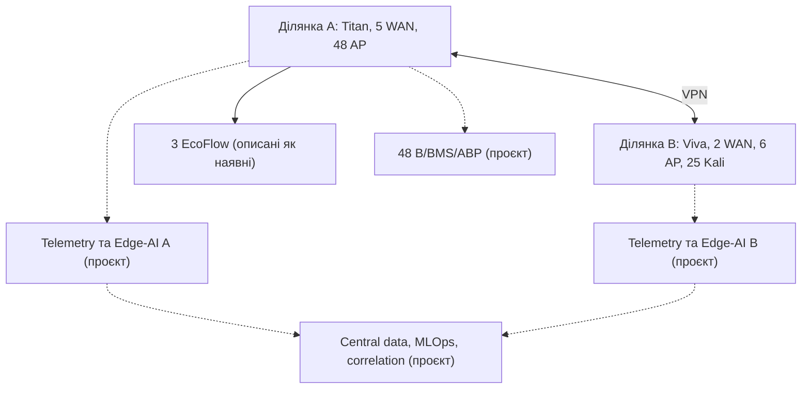
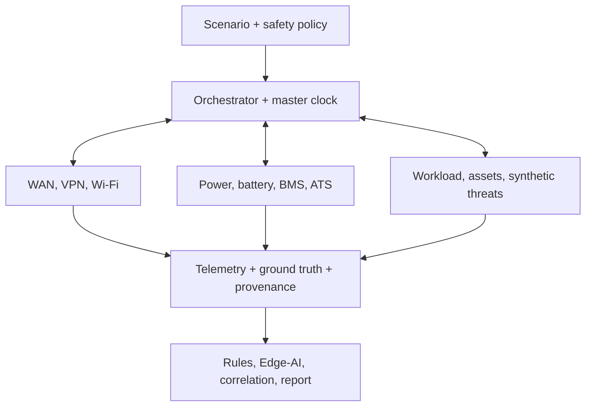
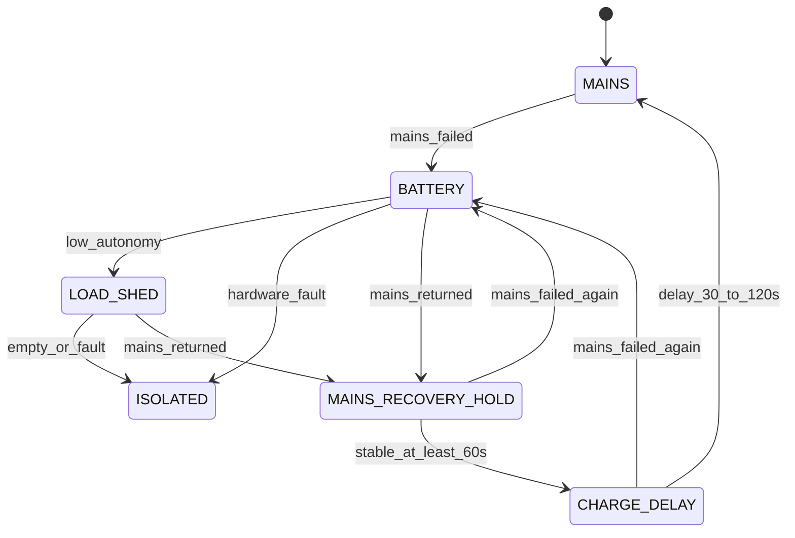
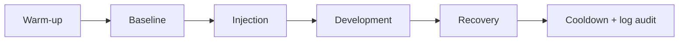

# Програмний цифровий двійник кіберполігону УМСФ

## Розширена технічна специфікація та виконуваний еталонний прототип

**Призначення:** попередня перевірка сценаріїв, схем даних, метрик, статистичного плану, безпеки та відтворюваності до перенесення експерименту на фізичний кіберполігон Університету митної справи та фінансів.

> **Межа доказовості.** До калібрування за реальною телеметрією цей артефакт є програмним прототипом цифрового двійника та імітаційною моделлю кіберполігону. Синтетичні результати характеризують поведінку програмної моделі за заданих припущень. Вони не є вимірюваннями реальної мережі, не підтверджують фактичний час перемикання WAN/VPN/АВР, реальне Wi-Fi-покриття, автономність EcoFlow або 48-В батареї та не доводять польову точність AI-детекторів.

## Анотація

У документі визначено програмну архітектуру гібридного цифрового двійника двох територіально рознесених ділянок кіберполігону УМСФ. Модель охоплює багатоканальний WAN, міжсайтовий VPN, 54 точки доступу, 25 керованих Kali Linux-вузлів, телеметрійний контур, три джерела EcoFlow, проєктну 48-В підсистему 13S×P із BMS та АВР, а також модулі виявлення і міжсайтової кореляції подій.

Документ визначає цільову архітектуру майбутнього гібридного цифрового двійника. Наразі виконуваним компонентом є спрощений чисто програмний поведінковий MVP; `EMU`, `REPLAY`, `HIL`, окремі моделі трьох EcoFlow, packet/RF backend, AI-модулі та повний CLI наведено як проєктні вимоги й ще не верифіковано.

Запропоновано чотири режими виконання — програмне моделювання `SIM`, мережева емуляція `EMU`, відтворення записаної телеметрії `REPLAY` та подальший hardware-in-the-loop `HIL`. Цільова архітектура передбачає використання єдиної конфігурації топології, сценаріїв і джерел параметрів. Документ містить моделі WAN, VPN, Wi-Fi, трафіку, кіберподій, живлення, телеметрійних дефектів та AI-оцінювання; схеми вихідних даних; план Design of Experiments; Monte Carlo і rare-event аналіз; протокол калібрування та незалежної sim-to-real валідації; data-quality і safety gates; runbook фізичного експерименту; структуру повного програмного проєкту; а також протестований zero-dependency Python MVP.

Основний принцип: наближення до реального полігону забезпечується не кількістю вигаданих деталей, а явним походженням кожного параметра, збереженням причинності, моделюванням корельованих відмов і дефектів телеметрії, калібруванням за пілотними вимірюваннями та чесним розмежуванням `synthetic`, `emulated`, `HIL` і `measured` даних.

---

# 1. Як використовувати цей документ

Документ одночасно виконує п'ять функцій:

1. **Технічна специфікація** повного цифрового двійника.
2. **Паспорт припущень** із відокремленням фактів від проєктних і синтетичних параметрів.
3. **Протокол синтетичних експериментів** для перевірки сценаріїв до фізичного запуску.
4. **План sim-to-real калібрування та валідації** на незалежній реальній вибірці.
5. **Виконуваний MVP** для негайної перевірки конвеєра даних, ground truth, seed-політики та артефактів запуску.

Рекомендована послідовність:

1. Заповнити реєстр інвентаризації у розділі 3.
2. Запустити MVP з демонстраційною конфігурацією.
3. Перевірити структуру `telemetry.csv`, `ground_truth.csv`, `summary.json` і `manifest.json`.
4. Замінити демонстраційні числа на виміряні або інтервальні параметри.
5. Виконати серії `SIM`, потім `EMU`, replay і лише після цього `HIL`.
6. Зафіксувати протокол, пороги, seed і первинні метрики до відкриття незалежного реального test set.
7. Перенести лише сценарії, що пройшли всі readiness gates, на фізичний полігон.

> **Оновлення версії 2.0.** Розділи 1-27 і додатки A-G описують специфікацію та вихідний монолітний MVP без змін. Додатки H-N, додані у цій версії, містять повну модульну програмну реалізацію, у якій кожний елемент полігону представлено окремим модулем, а також процедуру відтворення експериментів, матрицю трасування та перевірені результати прогонів. Для відтворення експериментів слід використовувати саме модульну реалізацію (додаток H); додатки B-D збережено як історичний MVP і базу порівняння.

---

# 2. Науковий статус і рівні зрілості

## 2.1. Коректна назва на різних етапах

| Рівень | Назва | Що вже підтверджено | Що ще не підтверджено |
|---|---|---|---|
| M0 | Концептуальна модель | Логічний опис двох ділянок і залежностей | Виконуваність та реалістичність |
| M1 | Програмний прототип цифрового двійника | Виконувана топологія, сценарії, synthetic ground truth, інваріанти | Відповідність розподілам реальної телеметрії |
| M2 | Калібрована імітаційна модель | Параметри оцінено на `Real-Cal`, перевірено на `Real-Val` | Незалежна польова точність |
| M3 | HIL-верифікований двійник | Перевірено інтерфейси з окремими фізичними компонентами | Поведінка всієї системи в реальній серії |
| M4 | Незалежно валідований експериментальний twin | Пройдено blind `Real-Test`, sim-to-real gap кількісно оцінено | Тривала синхронізована робота й узагальнення за межі перевіреної області |
| M5 | Shadow-mode twin | Підтверджено тривалу роботу, alert burden і drift | Безпечність автономного реагування |

Термін **operational digital twin** допускається лише після підтвердження тривалої синхронізації та shadow validation на рівні M5. До того у статті рекомендовано використовувати формулювання **software prototype of a cyber-range digital twin** або **simulation-based pre-experimental digital model**.

## 2.2. Рівні доказів

| Код | Джерело | Допустимі твердження |
|---|---|---|
| S0 | Unit/property/integration tests | Реалізована програмна логіка та інваріанти |
| S1 | Software-in-the-Loop | Поведінка моделі за визначених параметрів; sensitivity; очікувані діапазони |
| S2 | Replay реальної телеметрії | Сумісність формату, часу, ETL і детекторів із записаними даними |
| S3 | HIL | Робота інтерфейсів і переходів у перевірених апаратних режимах |
| S4 | Контрольований фізичний експеримент | Польові метрики за конкретної конфігурації |
| S5 | Проспективний shadow mode | Реальне навантаження тривогами, drift і стабільність у часі |

**Поточний статус:** `M1 / S0-smoke`. Виконуваним є спрощений aggregate-SIM MVP із фіксованим кроком 1 с. Validator додатково обмежує зміну SoC величиною не більш як 0,1 процентного пункту за крок; більші кроки або енергетично грубі конфігурації потребують майбутнього adaptive sub-step solver. Confirmatory SIL-серії, replay реальної телеметрії, EMU, HIL, фізична валідація та shadow mode ще не виконані.

## 2.3. Матриця дозволених тверджень

| За синтетичними серіями можна стверджувати | Без фізичного експерименту не можна стверджувати |
|---|---|
| Модель відтворює задекларовану логічну топологію | Фактичну пропускну здатність реальної мережі |
| Сценарний рушій створює задані переходи й ground truth | Реальний час WAN/VPN/АВР-перемикання |
| Після реалізації й окремих тестів конвеєр може обробляти пропуски, дублікати та out-of-order записи; поточний MVP перевіряє лише gap marker із порожніми вимірювальними полями | Реальну повноту й точність усіх сенсорів |
| За заданих припущень режим A перевищив режим B | Узагальнюваність переваги на реальних користувачів і провайдерів |
| Оцінено sensitivity, uncertainty та потрібний масштаб фізичної серії | Реальну accuracy, F1, AUPRC або false-alert rate |
| Безпечно перевірено батарейні fault-сигнали у SIL/HIL | Безпечність чи ресурс фактичної батареї |
| Сформовано прогнозні інтервали для bridge experiment | Причинний польовий ефект без незалежної валідації |

---

# 3. Паспорт фізичного кіберполігону

## 3.1. Документована у вихідному DOCX конфігурація, що потребує фізичної інвентаризації

| Компонент | Ділянка A — головний корпус | Ділянка B — філія | `deployment_status` | `evidence_status` / вид значення |
|---|---|---|---|---|
| Граничний маршрутизатор | Keenetic Titan | Keenetic Viva | `reported_existing` | `documented` |
| WAN | 3 × 1 Гбіт/с + 2 × 100 Мбіт/с | 2 × 1 Гбіт/с | `reported_existing` | `documented`; `nominal` |
| Wi-Fi controller | UniFi CloudKey Gen2 | UniFi CloudKey Gen1 | `reported_existing` | `documented` |
| Точки доступу | 48 AP | 6 AP | `reported_existing` | `documented`; `count` |
| Дротовий uplink AP | 12 × 1 Гбіт/с; 36 невідомо | 6 × 100 Мбіт/с | `reported_existing` | змішаний: `documented` + `unknown` |
| Керовані експериментальні вузли | не уточнено | 25 Kali Linux | `reported_existing` для філії | `documented`; `count` |
| Міжсайтовий зв'язок | Захищений VPN до ділянки B | Захищений VPN до ділянки A | `reported_existing` | `documented`; параметри `unknown` |
| EcoFlow | 3 одиниці | не заявлено | `reported_existing` для ділянки A | `documented`; `count`; моделі `unknown` |
| 48-В контур | проєкт 13S×P/BMS/АВР/зарядний пристрій до 10 А | аналогічний модуль лише можливий | `proposed` | `documented`; фізичні параметри `unknown` |

Сукупний заявлений масштаб: **54 точки доступу, 7 логічних WAN-каналів і 25 Kali Linux-станцій**.

> CloudKey моделюється як площина керування і джерело журналів, а не як транзитний вузол користувацького трафіку. Keenetic Titan/Viva моделюються поведінковими surrogate-профілями, якщо немає офіційного віртуального образу та підтвердженого збігу внутрішньої логіки.

## 3.2. Проєктна 48-В підсистема

Вихідний документ описує проєктну, а не доведену діючу конфігурацію:

- батарея класу 48 В із позначенням `13S×P`, де `P` невідоме;
- зарядний пристрій зі струмом **до 10 А**;
- BMS, CHG/DSG FET або контактор;
- DC-UPS/power-path/ideal-diode та АВР;
- ручний bypass, запобіжник, аварійний роз'єднувач;
- сертифіковані DC/DC або PoE-перетворювачі;
- Ethernet як основний канал телеметрії, Wi-Fi як резервний;
- локальна автоматика, що не залежить від мережевого зв'язку;
- навантаження пріоритетів I, II і III.

Струм 10 А не є місткістю батареї та не означає автоматичної допустимості заряджання струмом 10 А. Напруга класу 48 В не подається безпосередньо на Ethernet-порти. Усі електричні межі повинні походити з datasheet фактичних cells, BMS, FET, кабелів, запобіжника й зарядного пристрою.

Для демонстраційного профілю проєктної 48-В підсистеми прийнято `series_groups_assumed = 13`; це не підтверджена конфігурація фактичної батареї. Фізичні `S`, `P`, хімія та допустимі межі залишаються `unknown` до інвентаризації.

## 3.3. Невідомі параметри, які не можна вигадувати

1. Апаратні ревізії Keenetic Titan/Viva і версії KeeneticOS.
2. Точні моделі CloudKey та версії UniFi Network Application.
3. Моделі AP, стандарти Wi-Fi, діапазони, канали, ширина смуги й тип PoE.
4. Uplink решти 36 AP головного корпусу.
5. Комутатори, фізична комутація, VLAN/VRF, ACL, NAT і маршрути.
6. VPN-протокол, криптографічний профіль, MTU, rekey і reconnect policy.
7. Фізична незалежність провайдерських каналів і common-cause ризики.
8. Моделі, енергія, ККД, час переходу й автономність EcoFlow.
9. Хімія, `P`, паспортна ємність, допустимі струми та BMS 48-В батареї.
10. Реальне споживання, пускові струми та boot time критичних вузлів.
11. Координати AP, план приміщень, матеріали стін і RF-перешкоди.
12. Реальні профілі клієнтів, трафіку, RTT, jitter, loss і auth events.
13. Точність синхронізації часу й характеристики сенсорів.
14. Фактична конфігурація серверів телеметрії, AI, сховища й MLOps.

## 3.4. Два незалежні статуси кожного параметра

`deployment_status` описує наявність компонента:

- `reported_existing` — описаний у вихідному DOCX як наявний, але ще не перевірений фізично;
- `verified_existing` — наявність підтверджена фізичною інвентаризацією;
- `proposed` — запланована надбудова;
- `illustrative` — лише рисунок або демонстраційний шаблон;
- `unknown` — статус не встановлено.

`evidence_status` описує походження числа:

- `measured` — отримано вимірюванням із вказаною невизначеністю;
- `datasheet` — взято з паспорта конкретної моделі/ревізії;
- `documented` — заявлено у вихідному описі;
- `calibrated` — оцінено на `Real-Cal`;
- `inferred` — оцінено непрямо, метод наведено;
- `assumed_range` — апріорний інтервал для sensitivity/Monte Carlo;
- `synthetic` — число створено сценарієм;
- `unknown` — значення відсутнє.

## 3.5. Мінімальний реєстр параметрів

| Поле | Опис |
|---|---|
| `parameter_id` | Стабільний ідентифікатор |
| `entity_id` | Актив або підсистема |
| `name` | Назва параметра |
| `value` | Точкове значення, якщо допустиме |
| `unit` | Одиниця SI/узгоджена одиниця |
| `distribution` | Розподіл для невизначеного параметра |
| `lower_bound`, `upper_bound` | Межі |
| `deployment_status` | Статус компонента |
| `evidence_status` | Походження значення |
| `source_reference` | Документ, datasheet або measurement run |
| `measurement_time_utc` | Час вимірювання |
| `uncertainty` | Похибка або credible interval |
| `calibration_id` | Версія калібрування |
| `responsible_person` | Власник перевірки |

Приклад документованого й невідомого параметрів:

```yaml
site_a:
  wan_1:
    capacity:
      value: 1000
      unit: Mbps
      evidence_status: documented
      source_reference: Kiberpolihon_UMSF_rezerv_48V_Elsevier(8).docx

  ap_group_unknown_uplink:
    count: 36
    uplink_capacity:
      value: null
      unit: Mbps
      evidence_status: unknown
      prior:
        distribution: categorical
        values: [100, 1000]
        probabilities: [0.7, 0.3]
        status: assumed_range
        note: "Тільки для sensitivity analysis; замінити інвентаризацією"
```

---

# 4. Мета, дослідницькі питання та критерії успіху

## 4.1. Основна мета

Створити fit-for-purpose виконувану модель, яка до фізичного експерименту дає змогу:

- перевірити сценарну причинність і безпечні межі впливів;
- оцінити достатність джерел телеметрії;
- перевірити часову синхронізацію і join logic;
- сформувати синтетичний ground truth;
- оцінити очікувані обсяги даних і навантаження колекторів;
- виявити confounding між кібератакою, WAN/VPN/Wi-Fi деградацією і живленням;
- порівняти правила, Edge-AI та Edge-AI з міжсайтовою кореляцією;
- визначити інформативні bridge scenarios для HIL і фізичного полігону;
- підготувати пререгістрований статистичний план і реальний runbook.

## 4.2. Дослідницькі питання

- **RQ1:** Чи відтворює модель задекларовану топологію і причинні переходи без порушення інваріантів?
- **RQ2:** Які фактори WAN, VPN, Wi-Fi та навантаження найбільше впливають на availability, session loss і detection latency?
- **RQ3:** Чи можна розділити ознаки кібератаки, мережевої відмови, втрати телеметрії та енергетичного переходу?
- **RQ4:** Чи дає міжсайтова кореляція практично значуще покращення порівняно з правилами та локальним Edge-AI?
- **RQ5:** Які synthetic-to-real розбіжності залишаються після калібрування і чи вкладаються вони в наперед визначені допуски?
- **RQ6:** Яка кількість незалежних фізичних прогонів потрібна для заданої точності первинної метрики?

## 4.3. Первинні кінцеві точки

Для одного confirmatory експерименту слід вибрати одну мережеву й одну безпекову первинну метрику, наприклад:

- WAN failover: `service_interruption_ms` або `session_survival_rate`;
- detection: `incident_recall_at_fixed_false_alert_rate`;
- power: у `SIM` — `critical_node_restart_count` і `predicted_autonomy_min`; `measured_autonomy_min` дозволене лише для HIL/фізичного випробування;
- sim-to-real: нормована Wasserstein-відстань для заздалегідь визначеного KPI.

Решта показників є вторинними або діагностичними. Це зменшує ризик вибіркового звітування.

---

# 5. Функціональні та нефункціональні вимоги

## 5.1. Функціональні вимоги

1. Відтворення двох ділянок і залежностей між мережею, живленням та телеметрією.
2. Підтримка режимів `SIM`, `EMU`, `REPLAY` і `HIL` з єдиним сценарним контрактом.
3. Детермінований сценарний рушій і окремі RNG-простори компонентів.
4. Моделювання штатного фону, керованих відмов, кіберподій і комбінованих сценаріїв.
5. Окреме збереження ground truth, недоступного feature pipeline.
6. Створення UTC-часу події, часу спостереження і часу надходження.
7. Моделювання missingness, duplicates, clock drift і out-of-order delivery.
8. Версіонування топології, параметрів, сценарію, моделі та схеми даних.
9. Автоматичні quality, safety, leakage і readiness gates.
10. Формування run manifest, checksums, summary і runbook фізичної серії.

## 5.2. Нефункціональні вимоги

- **Відтворюваність:** однакова конфігурація, версія й seed дають однаковий event schedule і ground truth.
- **Трасованість:** кожна таблиця/рисунок пов'язані з run ID, data hash і analysis code hash.
- **Безпека:** режим за замовчуванням не створює зовнішнього трафіку і не містить exploit-коду.
- **Ізоляція:** default deny, відсутність production routes, allowlist лише тестових asset ID.
- **Масштабованість:** швидкий aggregate SIM і точніший пакетний/RF backend для фінальних сценаріїв.
- **Спостережуваність:** health, lag, dropped samples, resource use і stale co-simulation state.
- **Відновлюваність:** checkpoint/reset та чистий snapshot між незалежними прогонами.

## 5.3. Незмінні інваріанти

- `site_a.ap_count == 48`, `site_b.ap_count == 6`;
- `site_a.wan_count == 5`, `site_b.wan_count == 2`;
- `site_b.kali_count == 25`;
- для демонстраційного `DEMO_ONLY_13SxP` профілю `series_groups_assumed == 13`, а фактичні `S`, `P` і хімія залишаються невідомими до інвентаризації;
- у production-контракті канонічні `loss_rate`, `soc_fraction`, `soh_fraction` лежать у `[0,1]`; у скороченому MVP поля із суфіксом `_pct` лежать у `[0,100]`;
- якщо шлях недоступний, `availability == 0`, `loss_rate == 1` (`packet_loss_pct == 100` у MVP), а RTT/jitter/VPN RTT є `null/NA`, не великим числом;
- `RTT >= 0`, `jitter >= 0`, `throughput >= 0`, SoC/SoH у відповідному канонічному діапазоні, енергія не виникає без джерела;
- втрата Ethernet/Wi-Fi не вимикає локальну BMS/АВР;
- AI не скасовує COV/CUV/OCP/OTP/SCD та інші апаратні захисти;
- ground-truth поля не входять до ознак;
- жодна синтетична подія не має зовнішньої або виробничої цілі;
- усі непідтверджені значення мають статус `assumed_range`, `synthetic` або `unknown`.

---

# 6. Архітектура цифрового двійника

## 6.1. Режими виконання

| Режим | Час | Реальні стеки | Основна мета |
|---|---|---|---|
| `SIM` | логічний, швидше/повільніше real time | ні | Monte Carlo, DOE, sensitivity, rare events |
| `EMU` | реальний | Linux namespaces/containers, FRR, `tc/netem` | перевірка сервісів, сенсорів, VPN і AI-контейнерів |
| `REPLAY` | початковий або прискорений | записана телеметрія | перевірка ETL, feature pipeline і детекторів |
| `HIL` | реальний | вибрані реальні BMS/AP/router/gateway | перевірка інтерфейсів і безпечних переходів |

Перехід до `HIL` дозволяється лише після успішного `SIM`, `EMU`, safety test і затвердження окремого протоколу.

## 6.2. Логічна топологія



Суцільні зв'язки позначають описані у вихідному DOCX компоненти; пунктирні — запропоновані надбудови. Навіть суцільні елементи потребують фізичної інвентаризації.

### 6.2.1. Цільові логічні зони з вихідного DOCX

Усі сім зон нижче мають `deployment_status: proposed`; документ не підтверджує, що вони вже розгорнуті.

| Зона | Призначення | Мінімальна політика |
|---|---|---|
| Керування | маршрутизатори, controllers, BMS/АВР gateway | MFA/RBAC, allowlist, окремий VLAN, audit |
| Освітня | навчальні користувачі й сервіси | сегментація від керування та цілей |
| Атакувальна | 25 керованих Kali та генератори | egress deny, rate caps, disposable snapshots |
| Цільова | спеціально підготовлені test assets | лише дозволені сценарні зв'язки |
| Телеметрія/AI | collectors, features, inference | append-only logs, schema і time controls |
| Карантин | ізольовані підозрілі assets | default deny, контрольований forensic access |
| Гостьова Wi-Fi | некеровані клієнти | повна ізоляція від experiment/control planes |

### 6.2.2. Рекомендовані AI-компоненти з вихідного DOCX

| Елемент | Цільова роль | Поточний статус |
|---|---|---|
| Telemetry/features | узгодження network, Wi-Fi, host і power ознак | `proposed`; MVP має скорочені aggregate features |
| Edge-AI | локальне виявлення при втраті VPN | `proposed`; не реалізовано в MVP |
| Central data/MLOps | навчання, registry, provenance, monitoring | `proposed`; не реалізовано в MVP |
| Intersite correlation | причинне зіставлення подій A/B | `proposed`; не реалізовано в MVP |
| XAI/response/drift | пояснення, human approval, drift control | `proposed`; не реалізовано в MVP |

## 6.3. Федеративна програмна архітектура



## 6.4. Федерати й контракти

У повній реалізації кожний модуль має реалізувати `initialize`, `next_time`, `apply_event`, `advance`, `observe`, `checkpoint`, `reset` і `health`.

| Федерат | Відповідальність |
|---|---|
| Network | Multi-WAN, черги, маршрути, NAT, VPN, link state |
| Wi-Fi | AP, клієнти, RSSI/SNR, channel utilization, roaming, retries, uplink bottleneck |
| Power | EcoFlow black-box, 48-В gray-box, BMS, АВР, DC/DC, load shedding |
| Asset | `OFF`, `BOOTING`, `READY`, `DEGRADED`, `SHUTTING_DOWN`, `FAILED` |
| Workload | benign DNS/DHCP/web/file/update/control flows і сезонність |
| Synthetic Threat | feature-level або bounded in-lab події без зовнішніх цілей |
| Telemetry | sampling, noise, quality defects, buffering, schema |
| Detection | правила, статистика, Edge-AI, central correlation |
| Response | рекомендації, human approval, затримка й rollback |
| Ground Truth | фактичні для симуляції onset/end, cause, target, stage, intensity |

## 6.5. Єдиний логічний час

У промисловій реалізації час зберігається цілим числом мікро- або наносекунд. Для однакової часової мітки використовується стабільний порядок:

| Пріоритет | Фаза |
|---:|---|
| 0 | Інтегрування безперервних рівнянь до `T` |
| 1 | Сценарна подія або fault injection |
| 2 | Апаратний захист BMS/АВР |
| 3 | Зміна живлення й життєвого циклу asset |
| 4 | Зміна топології, маршруту, VPN або AP |
| 5 | Пакетні/агреговані потоки |
| 6 | Sampling і доставка телеметрії |
| 7 | Feature pipeline та inference |
| 8 | Відкладена рекомендація/реакція |

Стабільний ключ сортування:

```text
(simulation_time, phase, source_id, source_sequence, event_id)
```

Реакція, сформована після inference у момент `T`, набуває чинності не раніше `T + delta_min`, щоб не змінювати минуле того самого такту.

## 6.6. Причинні залежності

| Причина | Безпосередній стан | Наступні спостережувані ефекти |
|---|---|---|
| Mains loss | АВР/power-path transition | battery current, можливий packet loss, VPN reconnect, telemetry gap |
| WAN degradation | link `DEGRADED` | RTT/jitter/loss, session drops, central detection latency |
| Wi-Fi congestion | airtime saturation | retries, association delay, throughput reduction без атаки |
| Telemetry link loss | `TELEMETRY_DEGRADED` | missing/out-of-order/buffered records; BMS продовжує локальну роботу |
| Low SoC/RUL | warning/load shedding | спочатку III, потім II; критичний I зберігається до safety limit |
| Synthetic attack stage | feature/event transition | detector score, graph edge, alert; не пряме зовнішнє сканування |

---

# 7. Рекомендований технологічний стек

## 7.1. Повна реалізація

| Рівень | Рекомендований засіб | Роль |
|---|---|---|
| Co-simulation | HELICS | Master clock, causal time grants, обмін між федератами |
| Пакетна мережа/RF | ns-3 | WAN, черги, loss, Wi-Fi, roaming, інтерференція |
| Мережева емуляція | Containernet або Containerlab, FRRouting, nftables, `tc/netem` | Реальні протокольні стеки в ізоляції |
| Енергетика | OpenModelica + FMI/FMU, FMPy | EcoFlow/battery/BMS/АВР/load models |
| Battery extension | PyBaMM, опційно | Поглиблена електрохімічна/теплова калібрація |
| Оркестратор | Python 3.12, Pydantic v2, Typer | Config validation, scenario compile, run control |
| Події | Protobuf + HELICS values/messages | Детермінований causal bus |
| Операційна телеметрія | NATS JetStream або Redpanda; MQTT/mTLS для BMS | Потоковий конвеєр, але не master clock |
| Сенсори | Zeek, Suricata, IPFIX/NetFlow, syslog, OpenTelemetry | Ознаки, що відповідатимуть фізичному полігону |
| Дані | Parquet, MinIO, TimescaleDB/ClickHouse | Raw, normalized, time-series, ground truth |
| Спостережуваність | Prometheus, Grafana | Health, lag, resources, quality |
| MLOps/provenance | MLflow, DVC/lakeFS, OCI digests, RO-Crate | Версії моделей, даних і прогонів |

## 7.2. Швидкий MVP

Додатки B-D містять zero-dependency реалізацію на стандартній бібліотеці Python. Вона:

- перевіряє документовані інваріанти 48+6 AP, 5+2 WAN, 25 Kali й окремо — припущення 13S демонстраційного проєктного профілю;
- генерує детерміновані часові ряди для обох ділянок;
- моделює WAN failover, VPN degradation, Wi-Fi/auth/recon/lateral/C2 події;
- моделює mains loss, SoC, умовну pack voltage curve, constant-power relation `P = U_terminal × I`, synthetic electrical feasibility/isolation latch, temperature, cell imbalance, 60-секундний recovery hold, 30-секундну charge delay й ATS marker;
- маркує кожний крок як `[timestamp_utc, interval_end_utc)`, а силовий стан — як `power_state_start`/`power_state_end`, тому часткове вичерпання енергії не змішується з миттєвим станом;
- матеріалізує event defaults до hash/execution/truth, зберігає interval ground truth окремо від feature telemetry та замінює недоступні вимірювання на порожні значення у `telemetry_gap_marker`;
- формує checksummed run manifest із config/engine/runtime hash, 100000-row memory guard, staging publish та забороною непомітного overwrite;
- не відкриває сокетів і не генерує реального атакувального трафіку.

Це поведінковий surrogate для перевірки конвеєра, а не packet-level, RF або electrochemical safety simulator.

MVP використовує file-level маркер `evidence_class: synthetic_demo`; усі непідтверджені числа в його JSON є демонстраційними. Він **не** реалізує окремі моделі трьох EcoFlow, packet/RF backend, реальну буферизацію/duplicates/out-of-order delivery, повний asset-level load shedding, ML/AI або EMU/HIL. Повна реалізація повинна перейти до per-parameter wrapper із `value`, `unit`, `evidence_status`, `source` та `uncertainty`.

> Усе перелічене в цьому абзаці, окрім packet/RF backend та режимів `EMU`/`HIL`, реалізовано у модульному пакеті `umsf_twin` (додаток H): окремі моделі трьох EcoFlow, дефекти й буферизація телеметрії, asset-level load shedding за групами I/II/III, Edge-AI з міжсайтовою кореляцією та per-parameter wrapper `Parameter` зі статусом доказовості. Межі, що лишаються, зведено в додатку N.

---

# 8. Структура повного програмного проєкту

```text
umsf-cyberrange-twin/
├── README.md
├── ARCHITECTURE.md
├── ASSUMPTIONS.md
├── SECURITY.md
├── CITATION.cff
├── LICENSE
├── pyproject.toml
├── uv.lock
├── Dockerfile
├── docker-compose.yml
├── Makefile
├── config/
│   ├── inventory/
│   │   ├── site-a.yaml
│   │   ├── site-b.yaml
│   │   ├── vpn.yaml
│   │   └── power.yaml
│   ├── profiles/
│   │   ├── wan/
│   │   ├── wifi/
│   │   ├── device-surrogates/
│   │   └── telemetry/
│   └── policies/
│       ├── safety.yaml
│       ├── egress.yaml
│       └── retention.yaml
├── schemas/
│   ├── inventory.schema.json
│   ├── scenario.schema.json
│   ├── event.proto
│   ├── telemetry.proto
│   └── ground-truth.proto
├── scenarios/
│   ├── baseline/
│   ├── wan/
│   ├── vpn/
│   ├── wifi/
│   ├── cyber/
│   ├── power/
│   ├── telemetry/
│   └── compound/
├── src/umsf_twin/
│   ├── cli.py
│   ├── orchestrator/
│   ├── scheduler/
│   ├── scenario_compiler/
│   ├── parameter_registry/
│   ├── safety/
│   ├── provenance/
│   ├── seeds/
│   ├── metrics/
│   └── reporting/
├── federates/
│   ├── network_ns3/
│   ├── network_emulation/
│   ├── wifi_ns3/
│   ├── power_fmu/
│   ├── assets/
│   ├── workload/
│   ├── synthetic_threats/
│   ├── telemetry/
│   ├── detection/
│   ├── response/
│   └── ground_truth/
├── adapters/
│   ├── unifi/
│   ├── keenetic/
│   ├── bms/
│   ├── mqtt/
│   └── otel/
├── pipelines/
│   ├── collection/
│   ├── normalization/
│   ├── features/
│   ├── labeling/
│   ├── validation/
│   └── export/
├── tests/
│   ├── unit/
│   ├── property/
│   ├── contract/
│   ├── integration/
│   ├── determinism/
│   ├── safety/
│   ├── calibration/
│   └── performance/
├── notebooks/
│   ├── calibration/
│   ├── sensitivity/
│   └── result-analysis/
└── runs/
```

Raw PCAP, реальні секрети, ідентифікатори користувачів і великі результати не зберігаються безпосередньо в Git.

---

# 9. Математичні й поведінкові моделі

## 9.1. Модель черги та пропускної здатності

Для швидкого SIM використовується флюїдна модель. За крок `Delta t`:

$$
A_t = \frac{R_t\Delta t}{8}, \qquad
S_t = \frac{C_t\Delta t}{8},
$$

$$
Q_{t+1}=\max(0,Q_t+A_t-S_t),
$$

де $R_t$ — запропонована швидкість, $C_t$ — ефективна пропускна здатність, $Q_t$ — backlog. Чергова затримка:

$$
D_q=\frac{8Q_{t+1}}{C_t}.
$$

Повна затримка шляху:

$$
D_{path}=\sum_l(D_{base,l}+D_{q,l}+D_{jitter,l})+D_{VPN}.
$$

Для пакетних втрат використовується Gilbert-Elliott або trace-driven модель. Незалежна стала ймовірність втрати допускається лише в MVP і маркується як спрощення.

## 9.2. Multi-WAN

Кожний WAN має стани `UP`, `DEGRADED`, `DOWN`, `RECOVERING`. Поведінкова модель включає:

- health probes і число послідовних невдалих/успішних перевірок;
- hold-down для захисту від flapping;
- `primary_backup`, session balancing або policy routing;
- оновлення маршруту, NAT-state і зміну зовнішньої адреси;
- імовірність збереження/обриву сесій;
- common-cause variable для каналів зі спільним upstream, трасою чи живленням;
- hysteresis повернення на пріоритетний канал.

Номінальні 3 × 1 Гбіт/с + 2 × 100 Мбіт/с не трактуються як гарантовані 3,2 Гбіт/с для одного потоку.

## 9.3. VPN

Стани: `UP`, `DEGRADED`, `REKEYING`, `DOWN`, `RECONNECTING`.

Параметри після інвентаризації:

- протокол і криптографічний профіль;
- MTU, MSS і фрагментація;
- processing overhead;
- RTT, jitter, independent/burst loss;
- reconnect/rekey time;
- routing asymmetry;
- local buffering телеметрії;
- burst delivery та out-of-order записи після відновлення.

До інвентаризації VPN є конфігурованим surrogate-тунелем, а не vendor-exact implementation.

## 9.4. Wi-Fi

Ефективна пропускна здатність AP:

$$
C_{effective}=\min\left(
C_{radio}f_{RSSI}(1-overhead_{airtime}),
C_{uplink}
\right).
$$

Повна RF-модель потребує координат AP, плану приміщень, матеріалів стін, Tx power, band/channel/width, стандарту Wi-Fi, client capabilities і mobility traces. До отримання цих даних модель Wi-Fi є агрегованою та не робить тверджень про фактичне покриття.

Модель формує:

- client count на AP/ділянку;
- RSSI, SNR, MCS та channel utilization;
- retry rate і packet error rate;
- association, reassociation і roaming;
- auth failures;
- saturation 100-Мбіт/с або 1-Гбіт/с uplink;
- AP/controller visibility;
- втрату AP через network/power dependency.

Для 36 AP із невідомим uplink кожний залежний запис отримує `ASSUMED_PARAMETER` або `UNKNOWN_UPLINK`.

## 9.5. Штатне навантаження

Фонові процеси не генеруються як незалежний білий шум. Кандидатні моделі:

| Процес | Модель | Залежності |
|---|---|---|
| Flows/events per window | Negative Binomial, MMPP або Hawkes | час, site, load phase |
| Inter-arrival | Weibull/lognormal/empirical | service class, burst state |
| Bytes/duration | lognormal/Weibull, GPD для хвоста | protocol/service/client group |
| RTT residual | shifted lognormal/gamma + AR | utilization, active WAN, loss |
| Wi-Fi clients | Negative Binomial із сезонністю | AP, site, time block |
| RSSI | Gaussian mixture + random effects | AP, client group, location class |
| Auth failures | zero-inflated Negative Binomial | baseline/attack, service |
| Power load | state-space/ARX | active assets, traffic, source state |

До калібрування всі розподіли є кандидатними. Вибір виконується за predictive likelihood, AIC/BIC, Q-Q/P-P діаграмами, tail diagnostics і posterior predictive checks.

## 9.6. Синтетичні кіберподії

MVP змінює ознаки й подієвий граф без реальних пакетів. У `EMU` дозволені лише bounded сценарії всередині egress-denied середовища.

| Профіль | Синтетичний ефект | Заборонене тлумачення |
|---|---|---|
| `recon_burst` | зростання connection/port counters | фактичне сканування зовнішньої мережі |
| `wifi_auth_burst` | тестові `AUTH_FAILURE` | підбір реальних облікових даних |
| `rogue_ap_signal` | вигаданий BSSID і association events | реальна rogue AP поза полігоном |
| `lateral_sequence` | логічний шлях asset-to-asset | експлуатація виробничих вузлів |
| `low_rate_c2` | періодичні flow records без payload | реальний malware/C2 |
| `traffic_burst` | обмежене `offered_load` | неконтрольований DDoS |
| `telemetry_loss` | у повній моделі missing/stale/out-of-order; у MVP лише gap marker із порожніми measurement fields | фізичне вимкнення safety layer |
| `model_drift` | зміна розподілу ознак | доказ реального drift |

Стадії багатокрокової події моделюються semi-Markov або dynamic Bayesian network, щоб порядок подій був причинним.

## 9.7. EcoFlow

У цільовій архітектурі після інвентаризації кожна з трьох станцій повинна мати окрему black-box модель з параметрами:

- usable energy curve;
- load-dependent efficiency;
- transition time;
- minimum usable SoC;
- output behavior during transition;
- recharge/recovery time;
- protected asset group.

Не можна називати EcoFlow джерелом із нульовим часом перемикання без вимірювання.

Поточний MVP окремих EcoFlow-моделей не містить і не генерує висновків про їхню автономність чи переходи.

## 9.8. 48-В батарея 13S×P

Позначення `13S×P` у цьому розділі є **проєктним профілем**, а не результатом фізичної ідентифікації батареї. `P` і хімія невідомі. Число `48.1 V = 13 × 3.70 V` та лінійна крива cell voltage у MVP є лише умовними `synthetic_demo_conditional` припущеннями; переносити їх у HIL до отримання datasheet заборонено.

Стан gray-box моделі:

```text
x = [SoC, SoH, Qeff, R0, T, U1..U13, balance_mask, BMS_faults]
```

Енергетичний баланс:

$$
E_{t+\Delta t}=\operatorname{clip}\left(
E_t-\frac{P_{load}\Delta t}{3600\eta_{path}}
+\frac{P_{charge}\eta_{charge}\Delta t}{3600},
0,E_{usable}
\right),
$$

$$
SoC_t=\frac{E_t}{E_{usable}}.
$$

Спрощена напруга:

$$
U_{pack}=\sum_{i=1}^{13}OCV_i(SoC_i,T)-IR_{internal}.
$$

У battery-discharge кроці MVP розв'язує узгоджене рівняння постійної потужності:

$$
P_{bat}=\frac{P_{load}}{\eta}=I(U_{OCV}-IR),
\qquad
I=\frac{2P_{bat}}{U_{OCV}+\sqrt{U_{OCV}^{2}-4RP_{bat}}}.
$$

Якщо дискримінант від'ємний або synthetic current/terminal/cell-voltage envelope порушено, модель не видає неможливі `0 V` із працюючими assets, а формує `protection_trip` і latch-стан `ISOLATED`. Для charge використовується відповідний корінь `P=I(U_OCV+IR)`: запитана потужність обмежується charger power ceiling, доступною ємністю та величиною $I_{lim}(U_{OCV}+I_{lim}R)$, після чого SoC перераховується з фактично прийнятої потужності. Перевищення synthetic cell-voltage ceiling дає `charge_inhibited`; саме струмове обмеження працює як current-limit, а не як повна заборона заряджання. Ці envelopes мають статус `SYNTHETIC_DEMO_ONLY_UNVERIFIED` і не замінюють datasheet або електричний розрахунок.

У виході MVP `pack_ocv_v` та `cell_ocv_min_v/max_v` позначають synthetic open-circuit values, тоді як `pack_voltage_v` і `cell_min_v/max_v` — terminal values під навантаженням або зарядом. За прийнятого рівномірного розподілу внутрішнього опору виконується $U_{terminal}=U_{OCV}-IR$ для signed current, тому pack voltage лежить між $13V_{cell,min}$ і $13V_{cell,max}$. Це числова узгодженість surrogate, а не електрохімічна валідація.

Теплова RC-модель:

$$
T_{t+\Delta t}=T_t+\Delta t\left[
\frac{I^2R}{C_{th}}-
\frac{T_t-T_{ambient}}{R_{th}C_{th}}
\right].
$$

Автономність, узгоджена з вихідним документом:

$$
t_{res}=\frac{E_{usable}(T,SoH,P_{crit})\eta}{P_{crit}}.
$$

Додаткові величини:

$$
Q_{Ah}=\frac{1}{3600}\int I(t)dt,
\qquad
E_{Wh}=\frac{1}{3600}\int U(t)I(t)dt,
$$

$$
\Delta V_{cell}=V_{max}-V_{min},
\qquad
R_{DCIR}\approx\frac{\Delta V}{\Delta I}.
$$

Обмеження струму:

$$
I_{chg}\leq\min(10A,\;P I_{cell},\;I_{BMS},\;I_{FET},\;I_{cable},\;I_{fuse}).
$$

Фізичні COV/CUV/OCP/OTP/SCD межі не калібруються бажаним результатом симуляції — вони надходять із datasheet і затвердженої електричної документації.

У MVP `charger_nameplate_max_a = 10 A` є лише верхньою паспортною межею запропонованого charger, а `synthetic_charge_current_limit_a = 4 A` — демонстраційною програмною межею без safety-статусу. Через невідомі `P`, cell/BMS/FET/cable/fuse limits жоден струм MVP не є дозволом для HIL. Заряд у MVP — спрощена current-/power-limited behavioral approximation без повного CC/CV taper і termination.

## 9.9. Power state machine



`TELEMETRY_DEGRADED` моделюється як ортогональний стан спостереження, а не як силовий стан. Втрата Ethernet/Wi-Fi змінює доставку телеметрії, але не BMS/АВР.

| Стан із DOCX | Повна модель | Поточний MVP |
|---|---|---|
| `CHARGE` | `CHARGE` | агреговано в `MAINS` після `CHARGE_DELAY` |
| `STANDBY` | `STANDBY` | агреговано в `MAINS` |
| `DISCHARGE` | `DISCHARGE` | `BATTERY` |
| `WARNING` | окремий substate/flag | лише окремі flags; повний стан не реалізовано |
| `LOAD SHED` | asset-level `LOAD_SHED` | `LOAD_SHED` як один scalar factor |
| `ISOLATED` | `ISOLATED` | реалізовано для вичерпаної synthetic energy |
| `TELEMETRY DEGRADED` | ортогональний observation state | лише `telemetry_gap_marker` |

Групи навантаження з вихідного DOCX:

- I — маршрутизатор, VPN, основний комутатор і monitoring gateway;
- II — CloudKey, сервер журналювання та вибрані AP;
- III — навчальні станції й допоміжні AP; не резервуються або відключаються першими.

Цільова модель відключає III перед II, зберігаючи I до safety limit. Поточний MVP використовує лише `load_shed_factor = 0.72`, тому це scalar approximation, а не asset-level перевірка послідовності.

Після повернення мережі:

- джерело вважається стабільним після щонайменше 60 с;
- заряджання відновлюється із затримкою 30-120 с;
- навантаження повертаються у контрольованій послідовності;
- у повній моделі всі таймери й похідні переходи фіксуються в ground truth.

MVP реалізує recovery/charge timers у state telemetry, але його `ground_truth.csv` містить лише наперед задані injection intervals; окремий transition-truth log є вимогою наступної версії.

## 9.10. Початкові операційні пороги

Це початкові сценарні уставки з вихідного опису, а не паспортні межі:

| Параметр | Warning | Action | Статус у twin |
|---|---:|---:|---|
| SoC | <=30% | <=20%: load shedding III, потім II | `initial_synthetic_default` |
| Прогноз автономності | <=30 хв | <=15 хв: critical warning/shutdown | `initial_synthetic_default` |
| SoH/ємність | <80% номіналу або вимоги | заміна після capacity/autonomy test | `service_hypothesis` |
| DCIR | >30% від temperature-normalized baseline | повторний тест | `service_hypothesis` |
| Cell imbalance | >50 мВ протягом 10 хв | >100 мВ: critical diagnosis | `experimental_default` |
| Напруга групи | warning біля паспортної межі | COV/CUV і charger CV строго за datasheet | `unknown_until_inventory` |
| Струм заряджання | програмна ціль нижче апаратної | `I_chg <= min(10 A, P×I_cell, I_BMS, I_FET, I_cable, I_fuse)` | `unknown_until_inventory` |
| Температура | warning до паспортної межі | заборона charge/discharge поза межами виробника | `unknown_until_inventory` |
| BMS trips | >=2 за 30 діб або будь-яка тяжка COV/OTP/SCD | негайне або позапланове обстеження | `service_rule` |
| Ethernet loss | 5-10 с | failover на Wi-Fi | `operational_default` |
| Ethernet + Wi-Fi loss | local logging | BMS/АВР працюють автономно | `fail_safe_requirement` |

## 9.11. Sensor і telemetry model

Цифровий двійник розрізняє:

- `event_time` — коли подія сталася у моделі;
- `observed_time` — коли її зафіксував сенсор;
- `ingest_time` — коли запис отримав центральний конвеєр.

Цільова повна реалізація повинна моделювати:

- measurement noise і quantization;
- clock offset, linear drift і random walk;
- missing samples за MCAR, MAR і MNAR;
- duplicates і sequence gaps;
- out-of-order delivery;
- frozen/stale values;
- локальна буферизація під час VPN loss;
- пакетна доставка після відновлення;
- schema mismatch і версії feature pipeline.

Поточний MVP реалізує лише `telemetry_gap_marker`: для заданого інтервалу він залишає ідентифікатори часу/site та quality metadata, але робить вимірювальні поля порожніми й не обчислює detector score. Він не моделює buffering, delayed/out-of-order delivery, duplicates, `observed_time` або `ingest_time`; твердження про них можливі лише після окремої реалізації й тестів.

## 9.12. Detection і response

Порівнюються три основні режими:

1. правила/сигнатури;
2. локальний Edge-AI;
3. Edge-AI + міжсайтова кореляція.

Окремо може використовуватися transparent rule baseline, включений у MVP. Його метрики є smoke-test конвеєра, а не доказом якості AI.

На фізичному полігоні початковий режим — лише `shadow`. Реагування формує рекомендацію, confidence, explanation, rollback plan і audit record. Автоматичне блокування виробничих користувачів вимкнене.

---

# 10. Контракти даних

## 10.1. Універсальний конверт події

```text
event_id
schema_version
experiment_id
run_id
replication_id
scenario_id
scenario_phase
event_time_utc
observed_time_utc
ingest_time_utc
site_id
entity_id
sensor_id
source_sequence
event_type
cause_id
correlation_id
severity
quality_flags
parameter_evidence
model_version
payload
```

У скороченому MVP один рядок описує напіввідкритий інтервал `[timestamp_utc, interval_end_utc)`. Потужність і струм є середніми за цей інтервал; `power_state_start` та `power_state_end` фіксують boundary transition. Це особливо важливо, коли залишкова енергія вичерпується всередині кроку.

## 10.2. Мережева телеметрія

```text
timestamp_start_utc, timestamp_end_utc, site_id, sensor_id,
src_token, dst_token, protocol_class, packets, bytes, duration_ms,
rtt_ms, jitter_ms, loss_rate, availability, retransmissions, wan_id,
wan_links_down_count, vpn_state,
scenario_phase, quality_flags
```

## 10.3. Wi-Fi телеметрія

```text
timestamp_utc, site_id, ap_id, controller_id, uplink_mbps,
connection_type, switch_id, switch_port_id, client_group_id_or_token,
band, channel, client_count, rssi_median_dbm, snr_median_db,
airtime_utilization, retry_rate, auth_failures, roam_in, roam_out,
ap_state, quality_flags
```

Для 36 неінвентаризованих uplink та невідомої комутації застосовується явне значення `UNINVENTORIED`, а не підстановка чи мовчазне вилучення поля.

## 10.4. BMS/АВР телеметрія

```text
timestamp_utc, pack_id, configuration,
cell_group_v_01 ... cell_group_v_13,
pack_voltage_v, signed_current_a, load_power_w,
temperature_c_01 ..., soc, soh, v_min, v_max, delta_v,
dcir_ohm, cycle_count, balance_mask, bms_fault_bitmap, chg_state, dsg_state,
mains_present, power_state_start, power_state_end, source_state, ats_state,
ethernet_state, wifi_state, vpn_state,
predicted_autonomy_min, quality_flags, calibration_id, model_version
```

Знак струму: `signed_current_a > 0` — discharge, `< 0` — charge. Відображення є однозначним: `U1…U13 -> cell_group_v_01…cell_group_v_13`.

Звичайний health logging: 1-10 samples/s. Швидкі переходи АВР у реальному експерименті реєструються окремим DAQ/осцилографом із задокументованою смугою пропускання.

MVP видає скорочену aggregate schema і не реалізує всі 13 окремих напруг, DCIR, cycle count, BMS faults, `ats_state` та повний контракт цього розділу. Для аудиту surrogate він окремо експортує `pack_ocv_v`, `pack_voltage_v`, `cell_ocv_min_v`, `cell_ocv_max_v`, terminal `cell_min_v`, terminal `cell_max_v`, `power_protection_trip` і `charge_inhibited`.

## 10.5. Ground truth

Ground truth зберігається окремо:

```text
run_id, replication_run_id, replicate_id, scenario_id, event_id, cause_id,
event_type, stage, target_asset_id, event_start_s, event_end_s,
event_start_utc, event_end_utc, intensity_json, label_quality
```

`scenario_id`, `event_id`, `attack/tool name`, адреса генератора або службові markers не допускаються до feature table.

У MVP це один інтервальний запис на `event × target × replicate`; time-step оцінювання виконує окремий внутрішній join лише після inference. `ground_truth.csv` ніколи не подається до feature pipeline.

## 10.6. Quality flags

```text
ASSUMED_PARAMETER
UNKNOWN_UPLINK
CLOCK_SKEW
MISSING_SAMPLE
DUPLICATE
OUT_OF_ORDER
BUFFERED
IMPUTED
SENSOR_OFFLINE
VPN_UNAVAILABLE
TELEMETRY_GAP
COSIM_STALE
SCHEMA_MISMATCH
BACKUP_POWER
WAN_FAILOVER
```

## 10.7. Артефакти одного запуску

```text
runs/<run_id>/
├── manifest.json
├── scenario.resolved.yaml
├── inventory.snapshot.yaml
├── parameters.parquet
├── seeds.json
├── topology.graphml
├── topology.json
├── events.parquet
├── telemetry/
│   ├── flows/
│   ├── wifi/
│   ├── vpn/
│   ├── hosts/
│   └── power/
├── ground-truth/
├── detection/
├── metrics/
├── logs/
├── plots/
├── dataset-card.md
├── software-bom.json
├── provenance.json
└── checksums.sha256
```

## 10.8. Run manifest

Обов'язкові поля:

```text
run_id, experiment_id, data_origin, fidelity_level,
twin_version, scenario_id, topology_version, parameter_set_id,
master_seed, component_seeds, start_utc, end_utc,
config_hash, topology_hash, input_hashes, output_hashes,
git_commit, container_digest, dependency_lock_hash, fmu_hash,
schema_version, feature_pipeline_hash, model_version,
calibration_id, host_profile, quality_gate_status, known_deviations
```

У MVP `source_inventory` з JSON переноситься як `user_supplied_source_inventory` разом із `source_inventory_status: unverified_text_from_config`; це не authoritative inventory evidence. `calibration_id` для `synthetic_demo` заборонено. Назви router/controller фіксовані за вихідним DOCX, а VPN protocol/MTU залишаються `UNINVENTORIED`.

---

# 11. Каталог сценаріїв

## 11.1. Фази прогону



Одиниця незалежного повтору — повний прогін, а не пакет, flow або рядок журналу.

## 11.2. Базові сценарії twin: джерельні та розширені

Це рекомендований каталог, а не твердження про вже виконані експерименти.

| ID | Сценарій | Керований вплив | Первинні спостереження | Перенесення на реальний полігон | `origin` |
|---|---|---|---|---|---|
| E00 | Normal baseline | без fault/attack | distributions, ACF, missingness | пасивний збір | джерельна структура baseline; не окремий рядок Table 7 |
| E01 | WAN failover | `DOWN/DEGRADED` одного каналу | failover time, sessions, availability | контрольоване відключення після approval | Source Table 7 |
| E02 | VPN impairment | latency/jitter/loss/reconnect/MTU | VPN state, buffering, detection latency | `tc/netem`/тестовий тунель | Source Table 7; MTU — розширення twin |
| E03 | Wi-Fi anomaly | auth burst/rogue signal/roaming load | RSSI, retries, auth, localization | ізольована тестова SSID/AP | Source Table 7 |
| E04 | Recon + lateral sequence | synthetic counters/event graph | incident recall, chain completeness | лише підготовлені test targets | Source Table 7 |
| E05 | Low-and-slow C2 pattern | periodic flow records без payload | sensitivity, false alerts | контрольований test service | Source Table 7 |
| E06 | Rate-limited load | bounded offered-load increase | queue, loss, CPU, service resilience | закритий segment, hard cap | Source Table 7 |
| E07 | Mains loss/backup | power source transition | ATS time, node restart, SoC, logs | кваліфікована процедура | Source Table 7 |
| E08 | Telemetry degradation | Ethernet/Wi-Fi/VPN gaps | completeness, buffering, local safety | без зміни BMS protection | виділено з power/fail-safe і Source Table 4 |
| E09 | Cell imbalance/fault | simulated/HIL signal | detection, warning, state transitions | cell simulator, не реальна аварія | Source Table 4 / Figure 6 |
| E10 | Drift/OOD | distribution/schema/firmware proxy | AUPRC/ECE/coverage drift | shadow observation | Source Table 7 |
| E11 | Compound cascade | WAN + power + telemetry/attack | causal disambiguation | лише після окремих сценаріїв | `twin_extension` |

## 11.3. Контрфактичні парні прогони

Кожний attack/fault treatment має парний контроль із тим самим:

- topology/configuration;
- фоновим workload seed;
- WAN/Wi-Fi/power RNG;
- часовим профілем;
- початковими станами;
- версіями сенсорів і моделей.

Відрізняється лише `scenario` RNG або ввімкнення впливу. Common random numbers зменшують дисперсію парної різниці.

Для непарного дизайну незалежною одиницею є `run`/`day`/cluster. Для CRN-порівняння незалежною одиницею є seed-defined baseline–treatment pair або блок; bootstrap/permutation виконується шляхом ресемплінгу цілих пар/блоків, а не окремих рядків чи двох плечей пари.

## 11.4. Сценарний контракт

```yaml
event_id: evt-wan-a1-down
type: wan_down
target_asset: site_a.wan.01
start_s: 120
duration_s: 90
parameters:
  link_id: A-WAN-1
precondition:
  - isolation_verified
  - baseline_stable
expected_effect:
  - active_wan_changes
  - temporary_session_loss_possible
rollback:
  - restore_link
  - verify_routes
safety_class: synthetic_or_bounded_lab
abort_if:
  - unexpected_egress
  - production_route_detected
  - watchdog_lost
```

Перед запуском усі поведінкові defaults — включно з event params/targets, WAN priority, AR/noise, recovery timers і power defaults — матеріалізуються у resolved/effective config; UTC та порядок подій канонізуються. Саме цей об'єкт хешується й потрапляє до `intensity_json` ground truth. Неявний і еквівалентний явний default повинні давати той самий run specification hash. Strict-JSON validator відхиляє `NaN/Infinity`, структурні no-op injections, несумісні target/link, saturation cases та continuous-injections нижче заявленої роздільної здатності моделі/CSV. Через стохастичний шум, clamp, compound scenarios або навмисний `telemetry_loss` окрема реалізація все одно може не дати видимого response; ground truth означає виконану інтервенцію, а не гарантовану детектованість кожного рядка.

## 11.5. Комбіновані challenge cases

- WAN degradation під час роботи від батареї;
- mains loss із одночасною втратою Ethernet-шлюзу;
- low-and-slow pattern на тлі пікового легітимного навантаження;
- rogue AP signal під час інтенсивного roaming;
- clock drift або missing labels під час lateral sequence;
- низький SoC + load burst + cell imbalance;
- енергетичний перезапуск, схожий на кібератаку;
- firmware/topology proxy change після навчання моделі.

---

# 12. Design of Experiments і Monte Carlo

## 12.1. Групи факторів

| Група | Приклади факторів |
|---|---|
| Топологія | site, AP-uplink class, active route, affected asset group |
| WAN | capacity, RTT, jitter, loss, burst length, failover duration, common cause |
| VPN | MTU, overhead, loss, reconnect, rekey, asymmetry |
| Wi-Fi | clients, RSSI, utilization, roaming, retries, auth failures |
| Workload | service mix, intensity, burstiness, active Kali count |
| Cyber event | type, stage, duration, sources, intensity, low-rate period |
| Power | SoC, SoH, temperature, load, efficiency, imbalance, ATS time |
| Telemetry | sampling, missingness, skew, drift, duplicates, reordering |
| Analytics | method, threshold, window, abstention, edge/central mode |

## 12.2. Області факторів

- **Operational region:** емпіричні $Q_{0.01}$-$Q_{0.99}$ `Real-Cal`.
- **Stress region:** розширена область, але лише в паспортних і затверджених межах.
- **OOD challenge:** комбінації, зарезервовані для перевірки узагальнення.
- **Prior-predictive region:** широкі апріорні інтервали до реальних вимірювань; результати не називаються calibrated.

## 12.3. Багатоступеневий план

1. **Screening:** fractional factorial, D-optimal або Morris для визначення впливових факторів.
2. **Response surface:** Latin Hypercube/Sobol sequence для впливових безперервних параметрів.
3. **Confirmatory paired comparison:** правила, Edge-AI, Edge-AI + correlation на однакових realizations.
4. **Boundary/rare-event tests:** крайові й комбіновані стани.
5. **Bridge design:** D-optimal підмножина сценаріїв для HIL і фізичного полігону.

## 12.4. Рандомізація та блокування

Блоки: site, AP-uplink class, firmware/config version, workload profile, source state, day/time profile. Порядок усередині блоку рандомізується.

Для батарейних факторів, що повільно змінюються, використовується split-plot design: SoC/SoH/T — whole-plot; мережеві/програмні впливи — subplot.

Між прогонами виконується reset/washout: TCP sessions, ARP/DNS cache, VPN state, queues, test credentials, local buffers і thermal state не переносяться неявно.

## 12.5. Вкладена невизначеність

$$
y_{mn}=g(x,\theta_m,z_{mn}),
$$

де $x$ — керовані фактори, $\theta_m\sim p(\theta|D_{cal})$ — parameter uncertainty, $z_{mn}$ — aleatory realization, $y_{mn}$ — KPI.

Зовнішній цикл семплює невідомі параметри, внутрішній — трафік, втрати, roaming і event noise.

## 12.6. Rare-event sampling

Для importance sampling:

$$
\hat p=\frac{1}{N}\sum_{i=1}^{N}I_iw_i,
\qquad
w_i=\frac{p(x_i)}{q(x_i)},
$$

$$
ESS=\frac{(\sum_iw_i)^2}{\sum_iw_i^2}.
$$

Challenge set із завищеною prevalence придатний для conditional sensitivity, але не для прямої оцінки production PPV. Для цільової prevalence $\pi$:

$$
PPV_{\pi}=\frac{TPR\pi}{TPR\pi+FPR(1-\pi)}.
$$

## 12.7. Критерії зупинки Monte Carlo

Основний confirmatory варіант — **фіксований, наперед розрахований бюджет** незалежних runs/CRN pairs із єдиним фінальним CI; проміжні перегляди не використовуються для зупинки. До freeze визначаються primary KPI, practically relevant absolute/relative margin, variance з pilot, `N`, exclusions і один метод CI.

Якщо потрібен адаптивний бюджет, до запуску задаються sequentially valid confidence sequence або alpha-spending rule, максимальний `N`, checkpoints і stopping boundary. Повторне застосування звичайного 95% CI після кожного batch неприпустиме через optional-stopping bias.

- для KPI далеко від нуля можна задати відносну margin, наприклад 5%;
- для KPI біля нуля задається абсолютна MCSE/CI margin у фізичних одиницях;
- для rare-event probability наперед задається допустима абсолютна межа; при нульових подіях подається exact one-sided bound/rule-of-three, а не оцінка нульового ризику;
- для importance sampling додатково вимагається `ESS >= 200`, перевірка стабільності ваг і tail diagnostics.

План можна змінити лише до freeze. Після відкриття `Real-Test` або перегляду confirmatory outcome зміни позначають аналіз як exploratory.

---

# 13. Калібрування та sim-to-real валідація

## 13.1. Рівні калібрування

1. **Структурне:** топологія, кількість вузлів, WAN/AP classes, VLAN, power dependencies.
2. **Метрологічне:** time sources, BMS U/I/T, reference DMM/shunt, impairment verification.
3. **Динамічне:** RTT, loss, jitter, failover, reconnect, roaming, queues, boot time.
4. **Стохастичне:** distributions, tails, ACF, cross-correlation, state transitions.
5. **Task-based:** zero-shot/adapted transfer AI-моделі.
6. **Probability calibration:** Platt, isotonic або temperature scaling на дозволеній calibration subset.

## 13.2. Розділення реальної телеметрії

Початковий варіант для пілота:

- 60% хронологічних блоків — `Real-Cal`;
- 20% — `Real-Val`;
- останні 20% окремих блоків — заморожений `Real-Test`.

Розбиття виконується за цілими днями/серіями, AP/WAN-шляхами й інцидентами. `Real-Test` відкривається один раз після freeze моделі, threshold, метрик і коду аналізу.

Якщо `Real-Test` вплинув на параметри, threshold, модель або analysis code, він вважається витраченим; після доопрацювання збирається новий незалежний `Real-Test-2`.

## 13.3. Розділення синтетичних даних

- 60% seed/scenario groups — `Synthetic-Train`;
- 20% — `Synthetic-Val`;
- 20% — `Synthetic-Test`;
- окремий OOD test — невидані комбінації factors/sites/uplinks.

Заборонено випадково ділити сусідні перекривні вікна одного прогону між train і test.

## 13.4. Zero-shot та adapted transfer

**Zero-shot:** навчання/threshold лише на synthetic train/val; оцінка на реальному test без адаптації.

**Adapted:** pretraining на synthetic; fine-tuning на `Real-Adapt` із `Real-Cal`; threshold/calibration на `Real-Val`; фінальна оцінка на untouched `Real-Test`.

Результати цих двох протоколів звітуються окремо.

## 13.5. Цільова функція калібрування

$$
J(\theta)=\sum_{j=1}^{K}w_jd_j\left[
T_j(D_{sim}(\theta)),T_j(D_{real,cal})
\right]+\lambda R(\theta).
$$

До $T_j$ включаються:

- median, IQR, p90, p95, p99;
- normalized Wasserstein distance;
- ACF/PACF і cross-correlation;
- frequency/duration of states;
- transition matrix;
- loss-burst length;
- spectral characteristics;
- graph statistics міжсайтових подій.

Калібрування лише за середнім заборонено. Якщо кілька наборів параметрів однаково пояснюють дані, зберігається posterior/ensemble, а не один зручний набір.

## 13.6. Model discrepancy

$$
y_{real}(x)=\rho y_{sim}(x,\theta)+\delta(x)+\varepsilon.
$$

$\delta(x)$ — структурна невідповідність моделі. Її не можна маскувати підкручуванням параметрів на фінальному test set.

## 13.7. Метрики fidelity

Нормована Wasserstein-відстань:

$$
nW_1=\frac{W_1(F_{sim},F_{real})}
{Q_{0.95}^{real}-Q_{0.05}^{real}+\varepsilon}.
$$

Додатково:

- Jensen-Shannon divergence;
- Maximum Mean Discrepancy;
- error of median/tail quantiles;
- ACF/cross-correlation RMSE;
- transition-probability error;
- state-duration error;
- two-sample discriminator AUC;
- prediction-interval coverage;
- topology/state invariant violation rate.

KS p-value не використовується як єдиний критерій: за великих вибірок практично незначні відмінності легко стають статистично значущими.

## 13.8. Початкові sim-to-real gates

Пороги нижче є **проєктними стартовими допусками**. Їх треба затвердити до відкриття `Real-Test` і скоригувати за pilot variance та практичною значущістю.

| Категорія | Початковий gate |
|---|---|
| Інваріанти | 0 фізично/логічно неможливих станів |
| Provenance | 100% прогонів мають config/topology/code/data hashes |
| Primary distributions | `nW1 <= 0.10` |
| Quantiles | median error <=10%; p95 error <=15% |
| Correlations | mean absolute Spearman gap <=0.10; critical pairs <=0.15 |
| Temporal structure | ACF RMSE <=0.10 на заданих lag |
| State transitions | absolute probability error <=0.05 |
| Two-sample classifier | `AUC_sep = max(AUC, 1-AUC)` із grouped cross-validation; estimate <=0.65 і upper 95% CI <=0.70 |
| Predictive coverage | 90% PI має coverage 85-95% |
| Network gap | median у +/-10%, p95 у +/-15% |
| SoC | MAE <=5 percentage points |
| Autonomy forecast | MdAPE <=10%; 90% PI coverage 85-95% |

Еквівалентність оцінюється TOST: весь 90% CI різниці повинен лежати всередині наперед визначених меж. Відсутність статистично значущої різниці сама по собі не доводить еквівалентність.

---

# 14. Статистичний аналіз

## 14.1. Одиниця аналізу

Для непарного дизайну незалежна одиниця — `run`, `day` або інший заздалегідь визначений кластер. Для CRN-дизайну незалежна одиниця — повна seed-defined baseline–treatment pair/блок. Мільйони пакетів одного прогону і два плеча однієї пари не створюють окремих незалежних реплік.

Для $m$ подій у кластері з intraclass correlation $\rho$:

$$
DE=1+(m-1)\rho,
\qquad
n_{effective}=\frac{n}{DE}.
$$

## 14.2. Мережеві й операційні метрики

- availability і interruption duration;
- WAN failover/recovery time;
- RTT, jitter, loss, throughput;
- session survival/drop rate;
- VPN reconnect/rekey time;
- queue occupancy;
- Wi-Fi association/roaming time;
- retry/auth failure rate;
- sensor delivery latency, missing/out-of-order rate;
- CPU, RAM, storage й inference throughput.

Для heavy-tailed latency подаються median, IQR, p95/p99 і bootstrap CI, а не лише mean.

## 14.3. Кібербезпекові й AI-метрики

Поля MVP `time_step_any_injected_event_precision/recall/f1` є лише site-by-time-step smoke diagnostics для **будь-якої** введеної події, включно з network, power, drift і telemetry faults. Вони не є attack- або incident-level метриками й не використовуються як результат статті. Наукове оцінювання потребує one-to-one incident matching у наперед визначеному detection window, окремих звітів для cyber/network/power/telemetry, обчислення показників спочатку для кожного незалежного run/pair і лише потім CI між runs/pairs.

Якщо немає evaluable rows або знаменник метрики дорівнює нулю, MVP повертає JSON `null` і `diagnostic_metrics_defined: false`, а не числовий нуль. Аналогічно quantiles для повністю відсутньої модальності є `null`.

- event- та incident-based precision, recall, F1;
- AUROC і особливо AUPRC;
- AUPRC lift відносно prevalence;
- recall при fixed false-alert rate;
- false alerts/hour і false alerts/1000 events;
- median/p95 time-to-detect;
- attack-chain completeness;
- localization accuracy;
- Brier score і ECE;
- abstention rate та risk-coverage curve;
- performance degradation при drift/OOD.

Початкові confirmatory gates, які мають бути адаптовані до ризику:

| Метрика | Приклад попереднього gate |
|---|---|
| High-severity incident recall | >=0.90; lower 95% CI >=0.85 |
| False alerts | <=0.10/год на natural-prevalence real holdout |
| Event F1 | >=0.85 на real holdout |
| AUPRC | >=10% relative improvement над найкращим baseline або predeclared non-inferiority |
| ECE | <=0.05 |
| Inference p95 | <=20% тривалості feature window |
| Resource p95 | <80% затвердженого CPU/RAM budget |

## 14.4. Енергетичні метрики

- U/I/P, Ah, Wh;
- SoC/SoH/DCIR/Delta V;
- MAE SoC у percentage points;
- MAE або MdAPE автономності;
- prediction-interval coverage;
- ATS transition time;
- critical-node restart count;
- load-shedding sequence correctness;
- BMS/fault recall і false alarms;
- log completeness під час втрати Ethernet/Wi-Fi.

MAPE не використовується біля нуля.

## 14.5. Power analysis

Для парної безперервної метрики:

$$
n\approx\left[
\frac{(z_{1-\alpha/2}+z_{1-\beta})\sigma_d}{\Delta}
\right]^2,
$$

де $\sigma_d$ — SD парної різниці з pilot runs, $\Delta$ — мінімально важливий ефект.

Базово: $\alpha=0.05$, power >=0.80; для safety-critical endpoint — >=0.90. Для сімей гіпотез застосовується Holm correction.

Для sensitivity приблизно 0.90 з 95% напівшириною 0.05 орієнтовно потрібно 139 **незалежних позитивних інцидентів**, а не рядків телеметрії.

Якщо за $H$ годин не було жодної хибної тривоги, приблизна верхня 95% межа FAR дорівнює $3/H$. Тому для твердження `FAR < 0.1/hour` потрібно щонайменше близько 30 незалежних годин без false alert, а за часової залежності — більше.

Десять успішних АВР-переходів є функціональним acceptance check, але не доводять високу надійність: rule-of-three дає верхню 95% межу failure probability близько 30%.

## 14.6. Порівняння методів

- paired bootstrap/permutation на рівні run;
- McNemar для парних incident outcomes;
- survival analysis для censored time-to-detect;
- block bootstrap/batch means для autocorrelation;
- effect size + 95% CI обов'язково поряд із p-value;
- ablation, leave-one-scenario-out, leave-one-site-out і leave-one-load-profile-out.

---

# 15. Data Quality Gates

| Gate | Перевірка | Початковий критерій | Дія при невідповідності |
|---|---|---|---|
| G0 Safety | VLAN/ACL/NAT/egress/kill switch | 100% passed | запуск заборонено |
| G1 Schema | типи, одиниці, ranges, required fields | 100% validation | quarantine |
| G2 Provenance | hashes code/config/image/data/model | 100% runs | не включати в аналіз |
| G3 Time | UTC, monotonicity, offset/drift | network/security p95 <=100 ms; BMS/Wi-Fi <= sample interval; ATS окремий DAQ | resync/exclude |
| G4 Completeness | critical/noncritical fields | critical >=99.9%; noncritical >=99%; scenario markers 100% | quarantine |
| G5 Integrity | duplicates, order, sequence gaps | duplicates <=0.01%; unaccounted critical gaps = 0 | repair/exclude |
| G6S Synthetic labels | scenario onset/end/target/phase | scenario-engine truth + незалежний state-transition audit; 0 unresolved structural conflicts | виправити сценарій/рушій |
| G6R HIL/real labels | onset/end/actor/target/phase | щонайменше два незалежні інструментальні/людські джерела або adjudication; unresolved <=2%; kappa >=0.80 лише коли є два порівнювані annotators | adjudication |
| G7 Physical/logical | energy, SoC, packet accounting, states | 0 impossible states; numerical energy residual <=1% | model defect |
| G8 Leakage | group/hash overlap і marker features | 0 overlaps; 0 label-encoding features | resplit |
| G9 Fidelity | distributions/correlations/states/coverage | approved thresholds passed | recalibrate |
| G10 Statistics | power, CI width, ESS | stop criteria reached | more runs |
| G11 Blind test | model/threshold freeze | no tuning on Real-Test | exploratory only |
| G12 Release | KPI/resources/rollback/audit | all primary gates passed | deployment blocked |

Імпутація не приховує несправність сенсора. Зберігаються raw value, imputed value і missingness flag. Невдалий прогін залишається в аудитному реєстрі, але не входить до confirmatory analysis.

---

# 16. Контроль витоку даних

Нульовий перетин потрібен для:

- одного інциденту та його перекривних вікон;
- replay одного PCAP/trace;
- hash-дублікатів;
- фіксованих IP/MAC/hostname, що кодують клас;
- scenario ID, event ID, attack tool name або службового marker;
- модальностей одного інциденту;
- seed і шаблонів генерації між train/test.

Обов'язковий negative-control test: проста модель не повинна класифікувати клас лише за timestamp, generator address, run naming або технічним marker.

---

# 17. Drift і керування версіями

Відстежуються:

1. input drift;
2. label/prevalence drift;
3. concept drift;
4. sensor/pipeline drift;
5. twin drift — розбіжність між прогнозом twin і фізичним полігоном.

Методи: Wasserstein/PSI, MMD/energy distance, classifier two-sample test, ADWIN/Page-Hinkley, AUPRC/recall/FAR/ECE, PI coverage і change-point detection.

Data-quality incident відокремлюється від behavioral drift. Після drift автоматичне retraining заборонене: потрібні root-cause review, expert labels, нова calibration subset, challenge test, shadow/canary і контрольоване оновлення.

Історичні результати версії `vN` не перезаписуються версією `vN+1`.

---

# 18. Протокол підготовки реального експерименту

## Етап A — інвентаризація

- зафіксувати model/revision/firmware;
- інвентаризувати uplink усіх AP;
- зберегти topology, VLAN, ACL, NAT, VPN, MTU;
- визначити EcoFlow, battery chemistry, 13S×P, BMS і АВР;
- виміряти power draw і boot time;
- створити configuration/topology hashes.

## Етап B — пасивний baseline

Зібрати репрезентативний операційний цикл, що охоплює робочі й неробочі періоди. Початковий орієнтир — 14 днів, але збір продовжується, якщо ключові quantiles, ACF і cross-correlations ще нестабільні.

## Етап C — калібрування й holdout

- створити `Real-Cal`, `Real-Val`, untouched `Real-Test`;
- перевірити часові джерела;
- оцінити distributions/posteriors;
- задокументувати measurement uncertainty;
- заморозити real holdout.

## Етап D — freeze

До confirmatory run зафіксувати:

- twin/version/container image;
- inventory snapshot;
- DOE і primary endpoints;
- acceptance/equivalence margins;
- power calculation;
- seed list;
- exclusion rules;
- analysis script hash.

## Етап E — SIL/Monte Carlo

- screening;
- response surface;
- domain randomization;
- rare-event challenge;
- sensitivity/uncertainty;
- вибір bridge scenarios.

## Етап F — EMU, replay і HIL

- replay real NetFlow/syslog/BMS;
- isolated network emulator для latency/loss/jitter;
- BMS/cell simulator;
- bounded ATS test;
- Ethernet/Wi-Fi loss без зміни safety logic;
- перевірка clock, buffering, reset і rollback.

## Етап G — фізичний bridge experiment

На фізичному полігоні відтворюється невелика D-optimal підмножина сценаріїв. Для кожного реального прогону twin формує posterior predictive distribution з кількох synthetic replicates. Реальне значення порівнюється з інтервалом, а не з одним числом.

## Етап H — blind Real-Test

Модель і thresholds застосовуються один раз. Оцінюються KPI, sim-to-real gap, TOST equivalence, alert burden, calibration, ресурси й uncertainty.

## Етап I — shadow mode

Рекомендації журналюються, але не виконуються автоматично. Контролюються drift, FAR, пояснюваність, stability і rollback.

## 18.1. Картка одного фізичного прогону

```yaml
experiment_id:
run_id:
data_origin: real
scenario_id:
site_scope:
operator:
observer:
start_utc:
baseline_interval:
injection_interval:
recovery_interval:
topology_hash:
configuration_hash:
firmware_versions:
sensor_versions:
time_source:
clock_check_result:
primary_endpoint:
abort_conditions:
rollback_steps:
safety_checklist_hash:
known_deviations:
quality_gate_status:
```

## 18.2. Stop/abort criteria

Прогін негайно припиняється, якщо:

- виявлено route/egress до недозволеної мережі;
- втрачено watchdog або kill switch;
- активний вплив вийшов за allowlist, time, PPS або bandwidth cap;
- постраждав production asset;
- telemetry/ground-truth clock не дозволяє встановити causality;
- фактична електрична величина наблизилася до незатвердженої межі;
- BMS/АВР перейшли в unexpected state;
- оператор втратив можливість rollback;
- виникла ознака нагріву, пошкодження, запаху, витоку або іншої фізичної небезпеки.

## 18.3. Планова матриця приймальних випробувань 48-В підсистеми

Матриця відтворює категорії Source Table 4. Усі рядки мають статус `planned`, а не `passed`; детальні процедури, межі й відповідальні особи затверджуються лише після фізичної ідентифікації компонентів.

| № | Категорія | Мінімальний доказ | Статус |
|---:|---|---|---|
| 1 | Ідентифікація | фото/nameplate, модель/ревізія, wiring і component list | `planned` |
| 2 | Калібрування U/I/T | traceable reference, похибка й calibration record | `planned` |
| 3 | CC/CV заряд | профіль, taper, termination і межі фактичної хімії | `planned` |
| 4 | Ємність та автономність | контрольований discharge, Wh/Ah і uncertainty | `planned` |
| 5 | DCIR і балансування | temperature-normalized DCIR, delta V, persistence | `planned` |
| 6 | АВР/power-path | щонайменше 10 контрольованих переходів, DAQ waveform, restart audit | `planned` |
| 7 | Ethernet failover | 5–10-секундний detector/failover path і delivery audit | `planned` |
| 8 | Повна мережева ізоляція | Ethernet+Wi-Fi loss; локальні BMS/АВР і logging зберігаються | `planned` |
| 9 | Fault injection | тільки simulator або формально затверджений, електрично обмежений HIL | `planned` |
| 10 | Cognitive anomaly replay | записані безпечні ознаки, detector/XAI audit, без live attack | `planned` |
| 11 | Cybercontrol | invalid credentials/unauthorized command, MFA/RBAC/audit, no state change | `planned` |

---

# 19. Безпека, етика та dual-use обмеження

## 19.1. Мережева безпека

- окремі VLAN/VRF або namespaces;
- default deny між experimental і production;
- egress deny та DNS sinkhole;
- allowlist логічних test asset ID;
- test credentials і disposable snapshots;
- hard PPS/bandwidth/duration/concurrency limits;
- watchdog і незалежний kill switch;
- аудит NAT/ACL/DNS до й після прогону;
- одноразові attack containers;
- жодних чинних production secrets.

Цільові safeguards power gateway, які не слід трактувати як уже розгорнуті: окремий VLAN і default deny/allowlist; відсутність прямої Internet-публікації; mTLS/TLS 1.3 або SNMPv3 `authPriv`; індивідуальні сертифікати та ротація; MFA/RBAC/audit/SIEM; WPA3- або WPA2-Enterprise для резервного Wi-Fi; signed updates/secure boot; sequence number, anti-replay і rate limiting; локальний read-only режим та фізичний аварійний роз'єднувач.

## 19.2. Енергетична безпека

- жодного навмисного thermal runaway, short circuit або overvoltage на робочій батареї;
- fault injection лише у SIL, cell/BMS simulator або формально затвердженому, електрично обмеженому HIL із каліброваними вимірювальними засобами;
- кваліфікований електротехнічний персонал для монтажу і фізичних тестів;
- BMS не є єдиним захистом;
- AI/remote operator не обходять hardware protection;
- physical emergency disconnect і manual procedure;
- `safety below intelligence` як незмінний принцип.

## 19.3. Дані й приватність

- data minimization;
- pseudonymization MAC/IP/account identifiers; псевдонімізовані ідентифікатори залишаються потенційно персональними даними й не вважаються анонімними;
- payload content не входить до відкритого датасету;
- secrets вилучаються до збереження;
- raw/normalized/public рівні доступу;
- retention policy і role-based access;
- real baseline/pilot допускається лише після визначення законної підстави, інституційного погодження, notice/consent там, де це потрібно, строку зберігання та матриці доступу;
- якщо досліджується поведінка або час реакції операторів/студентів, потрібен окремий human-participant protocol;
- реальні журнали з ризиком re-identification не публікуються відкрито.

---

# 20. Відтворюваність і FAIR

Мінімальний пакет релізу:

- source code і dependency lock;
- `README`, `ARCHITECTURE`, `ASSUMPTIONS`, `SECURITY`;
- versioned topology/inventory/config schemas;
- scenarios, seed lists і run manifests;
- commit hash і OCI image digest;
- SBOM;
- data dictionary, units, UTC semantics, quality flags;
- raw synthetic, normalized і separate ground truth;
- scripts для кожної таблиці/рисунка;
- unit/property/integration/safety/golden tests;
- checksums;
- dataset card і model cards;
- `CITATION.cff`, CodeMeta/RO-Crate;
- calibration report і changelog;
- ліцензія коду й даних.

Для публікації код, конфігурації, synthetic data й агреговані безпечні дані можуть отримати DOI. Доступ до чутливої real telemetry залишається restricted.

---

# 21. Ризики валідності

| Загроза | Прояв | Пом'якшення | Залишковий ризик |
|---|---|---|---|
| Construct | спрощена RF, proprietary controller behavior | ns-3/EMU + calibration | точний vendor behavior невідомий |
| Internal | attack і load confounding, clock error | paired controls, synchronized truth | невиміряний common cause |
| External | одна університетська топологія | domain randomization, OOD/leave-site-out | інші середовища відрізняються |
| Statistical | мало незалежних runs, pseudoreplication | power analysis, cluster bootstrap | дорогі physical repetitions |
| Ecological | SIM-to-reality gap | bridge/HIL/blind real holdout | людська поведінка й RF мінливі |
| Model-form | неправильний candidate distribution | posterior predictive checks, ensemble | equifinality |
| Leakage | markers/overlapping windows | group split, negative-control tests | приховані proxy identifiers |
| Measurement | sensor bias/missingness | calibration, quality flags, redundancy | невідомі MNAR mechanisms |

---

# 22. Критерії готовності сценарію до фізичного полігону

Сценарій може перейти на фізичний полігон, якщо одночасно:

- [ ] визначено research question і primary endpoint;
- [ ] topology/configuration inventory підтверджено;
- [ ] усі safety-critical параметри battery/BMS/charger/fuse/cable/DC breaker/ATS фізично ідентифіковані та перевірені за datasheet/вимірюванням;
- [ ] performance/nuisance unknown parameters виміряні або включені до sensitivity analysis; sensitivity не замінює підтвердження меж безпеки;
- [ ] однаковий seed відтворює event schedule і ground truth;
- [ ] 0 topology/state/energy invariants порушено;
- [ ] ground truth не потрапляє до features;
- [ ] paired counterfactual run існує;
- [ ] ETL обробляє missing/duplicate/skew/out-of-order;
- [ ] data volume і collector throughput розраховані;
- [ ] SIM/EMU/HIL gates пройдено;
- [ ] safety policy, allowlist, egress deny, kill switch і rollback перевірено;
- [ ] attack/power scenario має owner і observer;
- [ ] preconditions і abort criteria зафіксовано;
- [ ] model/threshold/analysis plan заморожено;
- [ ] synthetic, emulated, HIL і real outputs маркуються окремо;
- [ ] сформовано domain-gap report і фізичний runbook.

---

# 23. План реалізації

## Етап 1 — MVP і data contracts

- zero-dependency engine;
- source inventory invariants;
- JSON config, component/site namespaced RNG і deterministic seed;
- CSV/JSON outputs;
- smoke/unit tests.

## Етап 2 — Production Python core

- Pydantic schemas;
- потоковий writer і масштабні run-budget guards;
- Parquet/Arrow;
- event scheduler;
- parameter provenance;
- property/safety tests.

## Етап 3 — Network/Wi-Fi fidelity

- ns-3 federate;
- Multi-WAN state machine;
- VPN and buffering;
- Wi-Fi propagation/uplink models;
- trace-driven calibration.

## Етап 4 — Energy fidelity

- OpenModelica/FMU;
- EcoFlow black-box profiles;
- 13S×P gray-box model;
- BMS/cell simulator;
- adapter для формально затвердженого, електрично обмеженого HIL.

## Етап 5 — Telemetry/AI/MLOps

- Zeek/Suricata/IPFIX/syslog adapters;
- Edge/central inference;
- graph correlation;
- MLflow/DVC/RO-Crate;
- drift and XAI.

## Етап 6 — Real bridge validation

- baseline collection;
- calibration/holdout;
- D-optimal bridge scenarios;
- blind test;
- shadow mode.

---

# 24. Проєктований CLI-інтерфейс, не реалізований у поточному MVP

Наведені нижче команди є цільовим контрактом майбутнього production CLI. Поточний Appendix-B MVP підтримує лише `python3 cybertwin_mvp.py CONFIG --output ROOT --replicates N`.

```bash
umsf-twin validate-config --config configs/umsf_documented.yaml
umsf-twin inventory-report --config configs/umsf_documented.yaml
umsf-twin plan --config configs/demo_synthetic.yaml
umsf-twin run --config configs/demo_synthetic.yaml --output outputs/
umsf-twin batch --config configs/demo_synthetic.yaml --repetitions 30
umsf-twin replay --run outputs/UMSF-DT-DEMO-001/run-0001
umsf-twin evaluate --run outputs/UMSF-DT-DEMO-001/run-0001
umsf-twin compare --baseline run-baseline --treatment run-treatment
umsf-twin calibrate --pilot-data pilot/ --output configs/calibration.yaml
umsf-twin export-runbook --scenario configs/scenarios/wan_degradation.yaml
umsf-twin doctor
```

---

# 25. Проєктований мінімальний профіль ізоляції

Цей Compose-фрагмент є вимогою до майбутньої контейнеризованої реалізації; його не було зібрано або верифіковано в межах поточного smoke test.

```yaml
services:
  twin:
    build:
      context: .
    command:
      - umsf-twin
      - run
      - --config
      - /app/configs/demo_synthetic.yaml
      - --output
      - /app/outputs
    environment:
      PYTHONHASHSEED: "0"
      OMP_NUM_THREADS: "1"
      OPENBLAS_NUM_THREADS: "1"
    network_mode: "none"
    read_only: true
    tmpfs:
      - /tmp:size=256m
    volumes:
      - ./configs:/app/configs:ro
      - ./outputs:/app/outputs:rw
    security_opt:
      - no-new-privileges:true
    cap_drop:
      - ALL
```

Для co-simulation/MQTT створюється окрема Docker-мережа `internal: true` без default route назовні. Панелі прив'язуються лише до `127.0.0.1`. Production images фіксуються digest-ами.

---

# 26. Формулювання для наукової публікації

> **Редакційне застереження:** використовувати минулий час лише після фактичного виконання та архівування відповідних прогонів. Поточний доказ обмежено software smoke/unit tests.

## Methods

> This document defines a protocol and a software-tested behavioral proof-of-concept for a planned simulation-based pre-experimental evaluation. We developed and software-tested a behavioral proof-of-concept model for pre-experimental planning. The present results are limited to synthetic smoke tests; EMU, HIL, calibration, and real-world validation have not yet been performed.

## Claim boundary

> Unless explicitly stated otherwise, all results in this section originate from synthetic runs. They characterize the behavior of the software model under the declared assumptions and do not constitute measurements of the operational cyber range, its actual WAN/VPN failover, Wi-Fi performance, battery autonomy, or field detection accuracy.

## Statistics

> Confirmatory configurations will be evaluated using pre-specified independent runs or seed-defined pairs, with effect sizes and confidence intervals reported at the run/pair level. Model selection, thresholds, exclusions, and analysis code will be frozen before access to the final real-world holdout set.

## Safety

> The current MVP generated synthetic feature and event records and opened no network connections. Any future active cyber or HIL activity will be conducted only after approval under an isolated, egress-denied and electrically bounded protocol.

## Limitations

> The principal limitation is the simulation-to-reality gap, particularly for radio propagation, proprietary controller behavior, provider routing, and battery electrothermal dynamics. These components require calibration and external validation against an untouched real-world dataset before field-performance or deployment-readiness claims can be made.

## Рекомендовані таблиці статті

1. Physical components, deployment status and fidelity level.
2. Parameter registry: value/distribution, unit, source, uncertainty and hash.
3. Scenario matrix: factors, levels, controls, replicates, abort conditions and truth.
4. Seed/run plan.
5. Calibration and validation results.
6. Synthetic results with effect size and CI.
7. Synthetic-to-real gap and pass/fail gates.
8. Claims-evidence matrix and limitations.

## Рекомендовані рисунки

1. Physical/emulated/proposed topology with distinct notation.
2. Baseline-injection-development-recovery timeline.
3. Telemetry and provenance pipeline.
4. ECDF/QQ comparison of synthetic and `Real-Test` data.
5. Uncertainty envelope and sensitivity indices.
6. PR curve and calibration plot.
7. Sim-to-real gap plot.
8. Provenance graph: input -> run -> dataset -> table/figure.

---

# 27. Швидкий запуск еталонного MVP

1. Скопіювати код із Додатка B у `cybertwin_mvp.py`.
2. Скопіювати конфігурацію з Додатка C у `demo_config.json`.
3. Скопіювати тест із Додатка D у `test_cybertwin.py`.
4. Виконати:

```bash
python3 -m unittest -v test_cybertwin.py
python3 cybertwin_mvp.py demo_config.json --output runs --replicates 3
```

Очікувані файли:

```text
runs/<run_id>/
├── effective_config.json
├── telemetry.csv
├── ground_truth.csv
├── summary.json
└── manifest.json
```

## 27.1. Перевірка еталонної реалізації

Поточну версію коду в цьому документі перевірено локальним smoke-run:

- 10 unit/smoke tests — `OK`;
- 3 реплікації;
- 5400 telemetry rows;
- 36 interval ground-truth rows (`event × target × replicate`);
- 105 telemetry-gap marker rows із порожніми measurement fields;
- відтворюваний byte-identical `telemetry.csv` для однакового seed і середовища.

Діагностичні метрики transparent rule baseline у цьому smoke-run не є науковим результатом і не повинні переноситися до рукопису як польова точність.

---

# Додаток A. Короткий чекліст інвентаризації

| Категорія | Поле | Значення | Джерело | Статус | Перевірив | Дата |
|---|---|---|---|---|---|---|
| Router A | model/revision/KeeneticOS | | | | | |
| Router B | model/revision/KeeneticOS | | | | | |
| WAN A1-A5 | provider/path/capacity/RTT/loss | | | | | |
| WAN B1-B2 | provider/path/capacity/RTT/loss | | | | | |
| VPN | protocol/crypto/MTU/rekey/reconnect | | | | | |
| CloudKey A/B | model/app version | | | | | |
| AP 01-54 | model/location/band/channel/PoE/uplink | | | | | |
| Switches | model/ports/VLAN/ACL/uplink | | | | | |
| Kali 01-25 | image/tool versions/role | | | | | |
| EcoFlow 01-03 | model/energy/transition/load group | | | | | |
| Battery | chemistry/13S×P/Q/limits | | | | | |
| BMS/charger | model/revision/profile/limits | | | | | |
| ATS/power path | topology/transition/logic | | | | | |
| Loads | W/inrush/boot time/priority | | | | | |
| Time | source/offset/drift | | | | | |
| Sensors | schema/rate/error/calibration | | | | | |

---

# Додаток B. Повний zero-dependency Python MVP

Нижче наведено перевірений код. Він не відкриває мережевих з'єднань і генерує лише синтетичні записи.

```python
#!/usr/bin/env python3
"""Zero-dependency reference engine for the UMSF cyber-range digital twin.

This is a behavioral surrogate intended for synthetic experiment planning.
It is not a hardware-accurate model and must not be used for safety control.
"""

from __future__ import annotations

import argparse
from bisect import bisect_right
import csv
import hashlib
import json
import math
import platform
import random
import re
import tempfile
from dataclasses import dataclass
from datetime import datetime, timedelta, timezone
from pathlib import Path
from typing import Any, Iterable


ALLOWED_EVENT_TYPES = {
    "wan_down",
    "wan_degrade",
    "vpn_degrade",
    "wifi_auth_burst",
    "rogue_ap_signal",
    "recon_burst",
    "lateral_sequence",
    "low_rate_c2",
    "traffic_burst",
    "mains_loss",
    "telemetry_loss",
    "cell_imbalance",
    "model_drift",
}

EVENT_PARAM_DEFAULTS: dict[str, dict[str, Any]] = {
    "wan_down": {"link_id": None},
    "wan_degrade": {
        "link_id": None,
        "capacity_factor": 0.5,
        "latency_add_ms": 20.0,
        "loss_add_pct": 1.0,
    },
    "vpn_degrade": {"latency_add_ms": 0.0, "loss_add_pct": 0.0},
    "wifi_auth_burst": {"add_failures_per_step": 25},
    "rogue_ap_signal": {"rogue_count": 1},
    "recon_burst": {"scan_rate_pps": 20.0},
    "lateral_sequence": {"events_per_step": 1},
    "low_rate_c2": {"period_s": 30},
    "traffic_burst": {"add_mbps": 0.0, "compute_add_w": 0.0},
    "mains_loss": {},
    "telemetry_loss": {},
    "cell_imbalance": {"cell_index": 6, "delta_mv": 0.0},
    "model_drift": {"load_factor": 1.25, "rssi_shift_db": -4.0},
}

MAX_DURATION_S = 7 * 24 * 3600
MAX_REPLICATES = 1000
MAX_IN_MEMORY_ROWS = 100_000
MAX_EVENTS = 1000
MAX_EVENT_LOAD_MBPS = 10_000.0
MAX_EVENT_COMPUTE_W = 2_000.0
MAX_EVENT_RATE = 1_000_000.0
MAX_EVENT_LATENCY_MS = 60_000.0
MIN_CAPACITY_FACTOR = 0.01
MAX_SYNTHETIC_QUEUE_DELAY_MS = 60_000.0
MAX_SOC_DELTA_PER_STEP_PCT = 0.1
# Smallest continuous injections that survive the MVP's CSV precision and,
# where state smoothing applies, its first-step attenuation.
MIN_EVENT_LATENCY_MS = 0.00011
MIN_EVENT_LOSS_PCT = 0.000011
MIN_EVENT_CAPACITY_FACTOR_DELTA = 0.0000011
MIN_EVENT_LOAD_MBPS = 0.011
MIN_EVENT_COMPUTE_W = 0.0011
MIN_EVENT_RATE = 0.00011
MIN_EVENT_CELL_DELTA_MV = 0.11
MIN_EVENT_LOAD_FACTOR_DELTA = 0.0001
MIN_EVENT_RSSI_SHIFT_DB = 0.0022
MIN_EXPORTED_FOUR_DECIMAL_DELTA = 0.00011


@dataclass(frozen=True)
class Event:
    event_id: str
    event_type: str
    start_s: int
    end_s: int
    targets: tuple[str, ...]
    params: dict[str, Any]

    def active(self, t_s: int, target: str | None = None) -> bool:
        in_time = self.start_s <= t_s < self.end_s
        in_target = target is None or "all" in self.targets or target in self.targets
        return in_time and in_target


def canonical_hash(value: Any) -> str:
    payload = json.dumps(
        value,
        sort_keys=True,
        separators=(",", ":"),
        allow_nan=False,
    ).encode("utf-8")
    return hashlib.sha256(payload).hexdigest()


def derived_seed(root_seed: int, replicate_id: int, namespace: str) -> int:
    payload = f"{root_seed}:{replicate_id}:{namespace}".encode("utf-8")
    return int.from_bytes(hashlib.blake2b(payload, digest_size=16).digest(), "big")


def file_sha256(path: Path) -> str:
    digest = hashlib.sha256()
    with path.open("rb") as handle:
        for block in iter(lambda: handle.read(1024 * 1024), b""):
            digest.update(block)
    return digest.hexdigest()


def clamp(value: float, low: float, high: float) -> float:
    return max(low, min(high, value))


def sigmoid(value: float) -> float:
    if value >= 0:
        z = math.exp(-value)
        return 1.0 / (1.0 + z)
    z = math.exp(value)
    return z / (1.0 + z)


def percentile(values: list[float], q: float) -> float | None:
    if not values:
        return None
    ordered = sorted(values)
    position = (len(ordered) - 1) * q
    lower = math.floor(position)
    upper = math.ceil(position)
    if lower == upper:
        return ordered[lower]
    weight = position - lower
    return ordered[lower] * (1.0 - weight) + ordered[upper] * weight


def round_optional(value: float | None, digits: int = 6) -> float | None:
    return None if value is None else round(value, digits)


def finite_in_range(value: Any, low: float, high: float, label: str) -> float:
    if isinstance(value, bool) or not isinstance(value, (int, float)):
        raise ValueError(f"{label} must be a JSON number")
    number = float(value)
    if not math.isfinite(number) or not low <= number <= high:
        raise ValueError(f"{label} must be finite and within [{low}, {high}]")
    return number


def validate_strict_json(value: Any, path: str = "$") -> None:
    """Reject values that Python accepts but RFC-style JSON artifacts cannot represent."""
    if value is None or isinstance(value, (str, bool, int)):
        return
    if isinstance(value, float):
        if not math.isfinite(value):
            raise ValueError(f"{path} must not contain NaN or Infinity")
        return
    if isinstance(value, list):
        for index, item in enumerate(value):
            validate_strict_json(item, f"{path}[{index}]")
        return
    if isinstance(value, dict):
        for key, item in value.items():
            if not isinstance(key, str):
                raise ValueError(f"{path} contains a non-string JSON object key")
            validate_strict_json(item, f"{path}.{key}")
        return
    raise ValueError(f"{path} contains a non-JSON value of type {type(value).__name__}")


def reject_subresolution_delta(
    value: Any,
    neutral: float,
    minimum_delta: float,
    label: str,
) -> float:
    """Reject a non-zero injection that cannot survive the exported precision."""
    number = float(value)
    delta = abs(number - neutral)
    if 0.0 < delta < minimum_delta:
        raise ValueError(
            f"{label} differs from its neutral value by less than the modeled "
            f"resolution {minimum_delta}"
        )
    return number


def strict_int(value: Any, label: str, low: int | None = None, high: int | None = None) -> int:
    if isinstance(value, bool) or not isinstance(value, int):
        raise ValueError(f"{label} must be a JSON integer")
    if low is not None and value < low:
        raise ValueError(f"{label} must be >= {low}")
    if high is not None and value > high:
        raise ValueError(f"{label} must be <= {high}")
    return value


def safe_identifier(value: Any, label: str) -> str:
    if not isinstance(value, str):
        raise ValueError(f"{label} must be a string")
    identifier = value
    if not re.fullmatch(r"[A-Za-z0-9][A-Za-z0-9._-]{0,63}", identifier):
        raise ValueError(f"{label} must be a safe 1-64 character identifier")
    return identifier


def poisson_sample(rng: random.Random, mean: float) -> int:
    """Small zero-dependency Poisson sampler for synthetic observable counts."""
    if mean <= 0:
        return 0
    if mean > 30:
        return max(0, int(round(rng.gauss(mean, math.sqrt(mean)))))
    limit = math.exp(-mean)
    product = 1.0
    count = 0
    while product > limit:
        count += 1
        product *= rng.random()
    # exp(-mean) rounds to 1.0 for sufficiently small positive means.  In
    # that case the loop executes zero times; a count-valued observable must
    # still remain non-negative.
    return max(0, count - 1)


def parse_events(raw_events: Iterable[dict[str, Any]], duration_s: int) -> list[Event]:
    events: list[Event] = []
    seen: set[str] = set()
    for raw in raw_events:
        event_id = safe_identifier(raw["event_id"], "event_id")
        if event_id in seen:
            raise ValueError(f"Duplicate event_id: {event_id}")
        seen.add(event_id)
        event_type = str(raw["type"])
        if event_type not in ALLOWED_EVENT_TYPES:
            raise ValueError(f"Unsupported event type: {event_type}")
        start_s = strict_int(raw["start_s"], f"{event_id}.start_s", 0)
        end_s = strict_int(raw["end_s"], f"{event_id}.end_s", 1)
        if not (0 <= start_s < end_s <= duration_s):
            raise ValueError(f"Invalid time window for {event_id}")
        raw_targets = raw.get("targets", ["all"])
        if not isinstance(raw_targets, list) or not raw_targets:
            raise ValueError(f"{event_id}.targets must be a non-empty JSON array")
        targets = tuple(str(item) for item in raw_targets)
        if len(targets) != len(set(targets)):
            raise ValueError(f"{event_id}.targets contains duplicates")
        raw_params = raw.get("params", {})
        if not isinstance(raw_params, dict):
            raise ValueError(f"{event_id}.params must be a JSON object")
        events.append(
            Event(
                event_id=event_id,
                event_type=event_type,
                start_s=start_s,
                end_s=end_s,
                targets=targets,
                params=dict(raw_params),
            )
        )
    return sorted(events, key=lambda event: (event.start_s, event.event_id))


def validate_config(config: dict[str, Any]) -> None:
    validate_strict_json(config)
    if config.get("schema_version") != "1.0.0":
        raise ValueError("The MVP supports only schema_version=1.0.0")
    if config.get("evidence_class") != "synthetic_demo":
        raise ValueError("The MVP accepts only evidence_class=synthetic_demo")
    if config.get("calibration_id") not in {None, ""}:
        raise ValueError("synthetic_demo cannot claim a calibration_id")
    safe_identifier(config.get("experiment_id"), "experiment_id")
    strict_int(config.get("seed"), "seed", 0, 2**63 - 1)
    if not isinstance(config.get("source_inventory", {}), dict):
        raise ValueError("source_inventory must be a JSON object and is treated as unverified text")
    duration_s = strict_int(config["duration_s"], "duration_s", 1, MAX_DURATION_S)
    dt_s = strict_int(config["dt_s"], "dt_s", 1, duration_s)
    if duration_s <= 0 or dt_s <= 0 or duration_s % dt_s:
        raise ValueError("duration_s must be a positive multiple of dt_s")
    if dt_s != 1:
        raise ValueError(
            "The aggregate smoke MVP supports only dt_s=1; larger steps require the future sub-step power solver"
        )
    try:
        parsed_start = datetime.fromisoformat(str(config["start_utc"]).replace("Z", "+00:00"))
    except (KeyError, ValueError) as exc:
        raise ValueError("start_utc must be a valid ISO-8601 timestamp") from exc
    if parsed_start.tzinfo is None:
        raise ValueError("start_utc must include an explicit UTC offset")
    try:
        parsed_start.astimezone(timezone.utc) + timedelta(seconds=duration_s)
    except (OverflowError, ValueError) as exc:
        raise ValueError("start_utc + duration_s is outside the supported datetime range") from exc
    sites = config.get("sites", {})
    if set(sites) != {"site_a", "site_b"}:
        raise ValueError("sites must contain exactly site_a and site_b")
    expected_ap_counts = {"site_a": 48, "site_b": 6}
    expected_routers = {"site_a": "Keenetic Titan", "site_b": "Keenetic Viva"}
    expected_controllers = {
        "site_a": "UniFi CloudKey Gen2",
        "site_b": "UniFi CloudKey Gen1",
    }
    expected_wan_capacities = {
        "site_a": [100, 100, 1000, 1000, 1000],
        "site_b": [1000, 1000],
    }
    expected_uplinks = {
        "site_a": {"1000_mbps": 12, "unknown": 36},
        "site_b": {"100_mbps": 6},
    }
    for site_id, site in sites.items():
        if site.get("router") != expected_routers[site_id]:
            raise ValueError(f"{site_id} router must match the documented inventory")
        if site.get("controller") != expected_controllers[site_id]:
            raise ValueError(f"{site_id} controller must match the documented inventory")
        if strict_int(site["ap_count"], f"{site_id}.ap_count") != expected_ap_counts[site_id]:
            raise ValueError(f"{site_id} AP count must match the source inventory")
        if site.get("known_ap_uplinks") != expected_uplinks[site_id]:
            raise ValueError(f"{site_id} AP uplink inventory must preserve documented unknowns")
        if site_id == "site_b" and strict_int(site.get("kali_workstations"), "site_b.kali_workstations") != 25:
            raise ValueError("site_b must contain the documented 25 Kali workstations")
        links = site.get("wan_links", [])
        capacities = sorted(float(link["capacity_mbps"]) for link in links)
        if capacities != expected_wan_capacities[site_id]:
            raise ValueError(f"{site_id} WAN inventory does not match the source document")
        link_ids = [str(link["id"]) for link in links]
        if len(link_ids) != len(set(link_ids)):
            raise ValueError(f"{site_id} has duplicate WAN link ids")
        for link in links:
            safe_identifier(link["id"], f"{site_id}.wan_link_id")
            finite_in_range(link["capacity_mbps"], 1e-9, MAX_EVENT_LOAD_MBPS, f"{site_id} WAN capacity")
            finite_in_range(link["base_rtt_ms"], 0.0, MAX_EVENT_LATENCY_MS, f"{site_id} WAN RTT")
            finite_in_range(link["base_loss_pct"], 0.0, 100.0, f"{site_id} WAN loss")
            strict_int(link.get("priority", 100), f"{site_id}.{link['id']}.priority", 0, 10_000)
        strict_int(site.get("failover_delay_s"), f"{site_id}.failover_delay_s", 0, 3600)
        baseline = site["baseline"]
        finite_in_range(baseline["offered_load_mbps"], 0.0, MAX_EVENT_LOAD_MBPS, f"{site_id}.offered_load_mbps")
        finite_in_range(baseline.get("load_noise_sd", 0.0), 0.0, MAX_EVENT_LOAD_MBPS, f"{site_id}.load_noise_sd")
        finite_in_range(baseline.get("ar_coefficient", 0.92), 0.0, 0.99, f"{site_id}.ar_coefficient")
        finite_in_range(baseline["normal_rtt_ms"], 0.0, MAX_EVENT_LATENCY_MS, f"{site_id}.normal_rtt_ms")
        finite_in_range(baseline["clients_mean"], 0.0, 1_000_000.0, f"{site_id}.clients_mean")
        finite_in_range(baseline["mean_rssi_dbm"], -150.0, 0.0, f"{site_id}.mean_rssi_dbm")
        finite_in_range(baseline["retry_pct"], 0.0, 100.0, f"{site_id}.retry_pct")
        finite_in_range(baseline["auth_failures_mean"], 0.0, MAX_EVENT_RATE, f"{site_id}.auth_failures_mean")
    battery = config["power"]["site_a"]
    if battery.get("model_class") != "DEMO_ONLY_13SxP_BEHAVIORAL_SURROGATE":
        raise ValueError("Only the explicit demo-only power surrogate is supported")
    if strict_int(battery["series_groups_assumed"], "series_groups_assumed") != 13:
        raise ValueError("The demo project profile assumes 13 serial groups")
    if battery.get("parallel_count") != "UNINVENTORIED":
        raise ValueError("parallel_count must remain UNINVENTORIED in this demo profile")
    if battery.get("chemistry") != "UNINVENTORIED":
        raise ValueError("chemistry must remain UNINVENTORIED until physical inventory")
    if battery.get("voltage_curve_status") != "synthetic_demo_conditional":
        raise ValueError("The conditional synthetic voltage curve must be identified explicitly")
    finite_in_range(battery["usable_energy_wh"], 1e-9, 1_000_000.0, "usable_energy_wh")
    finite_in_range(battery["critical_load_w"], 1e-9, MAX_EVENT_COMPUTE_W, "critical_load_w")
    finite_in_range(battery["path_efficiency"], 0.5, 1.0, "path_efficiency")
    finite_in_range(battery["initial_soc_pct"], 0.0, 100.0, "initial_soc_pct")
    finite_in_range(battery["soh_pct"], 1e-9, 100.0, "soh_pct")
    finite_in_range(battery["critical_soc_pct"], 0.0, 100.0, "critical_soc_pct")
    nominal_pack_v = finite_in_range(battery["nominal_pack_v"], 40.0, 60.0, "nominal_pack_v")
    assumed_cell_nominal_v = finite_in_range(battery["assumed_cell_nominal_v"], 3.0, 4.5, "assumed_cell_nominal_v")
    if abs(nominal_pack_v - 13.0 * assumed_cell_nominal_v) > 0.5:
        raise ValueError("nominal_pack_v must be coherent with the conditional 13S cell assumption")
    charger_nameplate_max_a = finite_in_range(
        battery["charger_nameplate_max_a"], 1e-9, 10.0, "charger_nameplate_max_a"
    )
    finite_in_range(battery["load_shed_factor"], 1e-9, 1.0, "load_shed_factor")
    finite_in_range(battery["charger_power_limit_w"], 1e-9, MAX_EVENT_COMPUTE_W, "charger_power_limit_w")
    finite_in_range(battery["pack_resistance_ohm"], 0.0, 0.5, "pack_resistance_ohm")
    finite_in_range(battery["ambient_c"], -100.0, 200.0, "ambient_c")
    finite_in_range(battery["thermal_gain_c_per_w"], 0.0, 0.5, "thermal_gain_c_per_w")
    finite_in_range(battery["thermal_tau_s"], 1e-9, 10_000_000.0, "thermal_tau_s")
    finite_in_range(battery["ats_transition_ms"], 0.0, MAX_EVENT_LATENCY_MS, "ats_transition_ms")
    synthetic_charge_limit = finite_in_range(
        battery["synthetic_charge_current_limit_a"],
        1e-9,
        charger_nameplate_max_a,
        "synthetic_charge_current_limit_a",
    )
    if synthetic_charge_limit > charger_nameplate_max_a:
        raise ValueError("synthetic_charge_current_limit_a must be within (0, charger_nameplate_max_a]")
    if battery.get("charge_limit_status") != "SYNTHETIC_DEMO_ONLY_UNVERIFIED":
        raise ValueError("The synthetic charge limit must be marked unverified")
    finite_in_range(
        battery["synthetic_discharge_current_limit_a"],
        1e-9,
        100.0,
        "synthetic_discharge_current_limit_a",
    )
    synthetic_min_terminal_v = finite_in_range(
        battery["synthetic_min_terminal_v"], 20.0, nominal_pack_v, "synthetic_min_terminal_v"
    )
    synthetic_min_cell_v = finite_in_range(
        battery["synthetic_min_cell_v"], 1.0, assumed_cell_nominal_v, "synthetic_min_cell_v"
    )
    synthetic_max_cell_v = finite_in_range(
        battery["synthetic_max_cell_v"], assumed_cell_nominal_v, 5.0, "synthetic_max_cell_v"
    )
    if synthetic_min_terminal_v / 13.0 < synthetic_min_cell_v - 0.5:
        raise ValueError("Synthetic pack and cell voltage limits are incoherent")
    if synthetic_min_cell_v >= synthetic_max_cell_v:
        raise ValueError("synthetic_min_cell_v must be below synthetic_max_cell_v")
    if battery.get("synthetic_electrical_limits_status") != "SYNTHETIC_DEMO_ONLY_UNVERIFIED":
        raise ValueError("Synthetic electrical limits must be marked unverified")
    stable_s = strict_int(battery.get("mains_stable_before_return_s", 60), "mains_stable_before_return_s")
    if stable_s < 60:
        raise ValueError("mains_stable_before_return_s must be at least 60 seconds")
    recharge_s = strict_int(battery.get("recharge_delay_s", 30), "recharge_delay_s")
    if not 30 <= recharge_s <= 120:
        raise ValueError("recharge_delay_s must be within the project range [30, 120]")
    if stable_s % dt_s or recharge_s % dt_s:
        raise ValueError("Power recovery timers must be exact multiples of dt_s in the MVP")
    finite_in_range(config["vpn"]["base_overhead_ms"], 0.0, MAX_EVENT_LATENCY_MS, "vpn.base_overhead_ms")
    if config["vpn"].get("protocol") != "UNINVENTORIED" or config["vpn"].get("mtu") != "UNINVENTORIED":
        raise ValueError("VPN protocol and MTU must remain UNINVENTORIED in synthetic_demo")
    threshold = finite_in_range(config["detector"]["threshold"], 0.0, 1.0, "detector threshold")
    if config["detector"].get("type") != "transparent_rule_baseline":
        raise ValueError("The MVP implements only detector.type=transparent_rule_baseline")

    raw_events = config.get("events", [])
    if not isinstance(raw_events, list) or len(raw_events) > MAX_EVENTS:
        raise ValueError(f"events must be a JSON array with at most {MAX_EVENTS} entries")
    events = parse_events(raw_events, duration_s)
    allowed_targets = {"all", "site_a", "site_b"}
    link_ids = {
        site_id: {str(link["id"]) for link in site["wan_links"]}
        for site_id, site in sites.items()
    }
    for event in events:
        if event.start_s % dt_s or event.end_s % dt_s:
            raise ValueError(f"{event.event_id}: event boundaries must align to dt_s")
        if not event.targets or any(target not in allowed_targets for target in event.targets):
            raise ValueError(f"Invalid targets for {event.event_id}")
        if "all" in event.targets and len(event.targets) > 1:
            raise ValueError(f"{event.event_id}: all cannot be combined with another target")
        if event.event_type in {"mains_loss", "cell_imbalance"} and event.targets != ("site_a",):
            raise ValueError(f"{event.event_id}: {event.event_type} is modeled only for site_a")
        if event.event_type in {"wan_down", "wan_degrade"}:
            target_sites = ("site_a", "site_b") if "all" in event.targets else event.targets
            requested_link = event.params.get("link_id")
            if requested_link is not None:
                safe_identifier(requested_link, f"{event.event_id}.link_id")
            if requested_link is not None and any(requested_link not in link_ids[site] for site in target_sites):
                raise ValueError(f"{event.event_id}: link_id does not belong to every target site")
            if event.event_type == "wan_degrade" and requested_link is not None:
                primary_links = {
                    site_id: str(
                        min(
                            sites[site_id]["wan_links"],
                            key=lambda link: int(link.get("priority", 100)),
                        )["id"]
                    )
                    for site_id in target_sites
                }
                if any(requested_link != primary for primary in primary_links.values()):
                    raise ValueError(
                        f"{event.event_id}: the aggregate MVP can degrade only the primary/active WAN; "
                        "standby-link health is not modeled"
                    )
        if event.event_type == "wan_degrade":
            finite_in_range(event.params.get("capacity_factor", 0.5), MIN_CAPACITY_FACTOR, 1.0, f"{event.event_id}.capacity_factor")
            finite_in_range(event.params.get("latency_add_ms", 0.0), 0.0, MAX_EVENT_LATENCY_MS, f"{event.event_id}.latency_add_ms")
            finite_in_range(event.params.get("loss_add_pct", 0.0), 0.0, 100.0, f"{event.event_id}.loss_add_pct")
        if event.event_type == "cell_imbalance":
            if not 0 <= strict_int(event.params.get("cell_index", 6), f"{event.event_id}.cell_index") < 13:
                raise ValueError(f"{event.event_id}: cell_index must be within [0, 12]")
            finite_in_range(event.params.get("delta_mv", 0.0), 0.0, 1000.0, f"{event.event_id}.delta_mv")

        schemas: dict[str, dict[str, tuple[float, float]]] = {
            "vpn_degrade": {"latency_add_ms": (0.0, MAX_EVENT_LATENCY_MS), "loss_add_pct": (0.0, 100.0)},
            "wifi_auth_burst": {"add_failures_per_step": (0.0, MAX_EVENT_RATE)},
            "rogue_ap_signal": {"rogue_count": (0.0, 1000.0)},
            "recon_burst": {"scan_rate_pps": (0.0, MAX_EVENT_RATE)},
            "lateral_sequence": {"events_per_step": (0.0, MAX_EVENT_RATE)},
            "low_rate_c2": {"period_s": (1.0, float(duration_s))},
            "traffic_burst": {"add_mbps": (0.0, MAX_EVENT_LOAD_MBPS), "compute_add_w": (0.0, MAX_EVENT_COMPUTE_W)},
            "model_drift": {"load_factor": (1e-9, 10.0), "rssi_shift_db": (-50.0, 50.0)},
        }
        allowed_keys = {
            "wan_down": {"link_id"},
            "wan_degrade": {"link_id", "capacity_factor", "latency_add_ms", "loss_add_pct"},
            "vpn_degrade": {"latency_add_ms", "loss_add_pct"},
            "wifi_auth_burst": {"add_failures_per_step"},
            "rogue_ap_signal": {"rogue_count"},
            "recon_burst": {"scan_rate_pps"},
            "lateral_sequence": {"events_per_step"},
            "low_rate_c2": {"period_s"},
            "traffic_burst": {"add_mbps", "compute_add_w"},
            "mains_loss": set(),
            "telemetry_loss": set(),
            "cell_imbalance": {"cell_index", "delta_mv"},
            "model_drift": {"load_factor", "rssi_shift_db"},
        }[event.event_type]
        unexpected = set(event.params) - allowed_keys
        if unexpected:
            raise ValueError(f"{event.event_id}: unsupported params {sorted(unexpected)}")
        for key, (low, high) in schemas.get(event.event_type, {}).items():
            if key in event.params:
                finite_in_range(event.params[key], low, high, f"{event.event_id}.{key}")
        for key in ("add_failures_per_step", "rogue_count", "events_per_step", "period_s"):
            if key in event.params:
                strict_int(event.params[key], f"{event.event_id}.{key}", 0)

        # Ground-truth intervals must not describe floating-point injections
        # that are erased by the model dynamics or by CSV rounding.
        if event.event_type == "wan_degrade":
            reject_subresolution_delta(
                event.params.get("capacity_factor", 0.5),
                1.0,
                MIN_EVENT_CAPACITY_FACTOR_DELTA,
                f"{event.event_id}.capacity_factor",
            )
            reject_subresolution_delta(
                event.params.get("latency_add_ms", 20.0),
                0.0,
                MIN_EVENT_LATENCY_MS,
                f"{event.event_id}.latency_add_ms",
            )
            reject_subresolution_delta(
                event.params.get("loss_add_pct", 1.0),
                0.0,
                MIN_EVENT_LOSS_PCT,
                f"{event.event_id}.loss_add_pct",
            )
        elif event.event_type == "vpn_degrade":
            reject_subresolution_delta(
                event.params.get("latency_add_ms", 0.0),
                0.0,
                MIN_EVENT_LATENCY_MS,
                f"{event.event_id}.latency_add_ms",
            )
            reject_subresolution_delta(
                event.params.get("loss_add_pct", 0.0),
                0.0,
                MIN_EVENT_LOSS_PCT,
                f"{event.event_id}.loss_add_pct",
            )
        elif event.event_type == "recon_burst":
            reject_subresolution_delta(
                event.params.get("scan_rate_pps", 20.0),
                0.0,
                MIN_EVENT_RATE,
                f"{event.event_id}.scan_rate_pps",
            )
        elif event.event_type == "traffic_burst":
            reject_subresolution_delta(
                event.params.get("add_mbps", 0.0),
                0.0,
                MIN_EVENT_LOAD_MBPS,
                f"{event.event_id}.add_mbps",
            )
            reject_subresolution_delta(
                event.params.get("compute_add_w", 0.0),
                0.0,
                MIN_EVENT_COMPUTE_W,
                f"{event.event_id}.compute_add_w",
            )
        elif event.event_type == "cell_imbalance":
            reject_subresolution_delta(
                event.params.get("delta_mv", 0.0),
                0.0,
                MIN_EVENT_CELL_DELTA_MV,
                f"{event.event_id}.delta_mv",
            )
        elif event.event_type == "model_drift":
            reject_subresolution_delta(
                event.params.get("load_factor", 1.25),
                1.0,
                MIN_EVENT_LOAD_FACTOR_DELTA,
                f"{event.event_id}.load_factor",
            )
            reject_subresolution_delta(
                event.params.get("rssi_shift_db", -4.0),
                0.0,
                MIN_EVENT_RSSI_SHIFT_DB,
                f"{event.event_id}.rssi_shift_db",
            )

        no_effect = False
        if event.event_type == "wan_degrade":
            no_effect = (
                float(event.params.get("capacity_factor", 0.5)) == 1.0
                and float(event.params.get("latency_add_ms", 20.0)) == 0.0
                and float(event.params.get("loss_add_pct", 1.0)) == 0.0
            )
        elif event.event_type == "vpn_degrade":
            no_effect = (
                float(event.params.get("latency_add_ms", 0.0)) == 0.0
                and float(event.params.get("loss_add_pct", 0.0)) == 0.0
            )
            if (
                float(event.params.get("latency_add_ms", 0.0)) == 0.0
                and float(event.params.get("loss_add_pct", 0.0)) > 0.0
            ):
                target_sites = ("site_a", "site_b") if "all" in event.targets else event.targets
                for site_id in target_sites:
                    primary = min(
                        sites[site_id]["wan_links"],
                        key=lambda link: int(link.get("priority", 100)),
                    )
                    baseline_loss_pct = float(primary["base_loss_pct"])
                    treated_loss_pct = clamp(
                        baseline_loss_pct + float(event.params.get("loss_add_pct", 0.0)),
                        0.0,
                        100.0,
                    )
                    if round(baseline_loss_pct, 5) == round(treated_loss_pct, 5):
                        raise ValueError(
                            f"{event.event_id}: loss-only VPN degradation is not export-visible for {site_id}"
                        )
        elif event.event_type == "wifi_auth_burst":
            no_effect = float(event.params.get("add_failures_per_step", 25)) == 0.0
        elif event.event_type == "rogue_ap_signal":
            no_effect = float(event.params.get("rogue_count", 1)) == 0.0
        elif event.event_type == "recon_burst":
            no_effect = float(event.params.get("scan_rate_pps", 20.0)) == 0.0
        elif event.event_type == "lateral_sequence":
            no_effect = float(event.params.get("events_per_step", 1)) == 0.0
        elif event.event_type == "traffic_burst":
            no_effect = (
                float(event.params.get("add_mbps", 0.0)) == 0.0
                and float(event.params.get("compute_add_w", 0.0)) == 0.0
            )
            target_sites = {"site_a", "site_b"} if "all" in event.targets else set(event.targets)
            if float(event.params.get("compute_add_w", 0.0)) > 0.0 and "site_b" in target_sites:
                raise ValueError(
                    f"{event.event_id}: compute_add_w is modeled only for site_a; split the event by target"
                )
        elif event.event_type == "cell_imbalance":
            no_effect = float(event.params.get("delta_mv", 0.0)) == 0.0
        elif event.event_type == "model_drift":
            no_effect = (
                float(event.params.get("load_factor", 1.25)) == 1.0
                and float(event.params.get("rssi_shift_db", -4.0)) == 0.0
            )
            target_sites = ("site_a", "site_b") if "all" in event.targets else event.targets
            load_factor = float(event.params.get("load_factor", 1.25))
            rssi_shift_db = float(event.params.get("rssi_shift_db", -4.0))
            for site_id in target_sites:
                baseline = sites[site_id]["baseline"]
                nominal_load_delta = abs(
                    (load_factor - 1.0)
                    * float(baseline["offered_load_mbps"])
                    * (1.0 - float(baseline.get("ar_coefficient", 0.92)))
                )
                baseline_rssi = float(baseline["mean_rssi_dbm"])
                nominal_rssi_delta = abs(
                    clamp(baseline_rssi + 0.05 * rssi_shift_db, -92.0, -30.0)
                    - clamp(baseline_rssi, -92.0, -30.0)
                )
                if (
                    nominal_load_delta < MIN_EXPORTED_FOUR_DECIMAL_DELTA
                    and nominal_rssi_delta < MIN_EXPORTED_FOUR_DECIMAL_DELTA
                ):
                    raise ValueError(
                        f"{event.event_id}: model_drift has no nominally export-visible effect for {site_id}"
                    )
        if no_effect:
            raise ValueError(f"{event.event_id}: injected event would have no modeled effect")

        if event.event_type == "wan_degrade" and (
            float(event.params.get("capacity_factor", 0.5)) == 1.0
            and float(event.params.get("latency_add_ms", 20.0)) == 0.0
            and float(event.params.get("loss_add_pct", 1.0)) > 0.0
        ):
            target_sites = ("site_a", "site_b") if "all" in event.targets else event.targets
            for site_id in target_sites:
                primary = min(
                    sites[site_id]["wan_links"],
                    key=lambda link: int(link.get("priority", 100)),
                )
                baseline_loss_pct = float(primary["base_loss_pct"])
                treated_loss_pct = clamp(
                    baseline_loss_pct + float(event.params.get("loss_add_pct", 1.0)),
                    0.0,
                    100.0,
                )
                if round(baseline_loss_pct, 5) == round(treated_loss_pct, 5):
                    raise ValueError(
                        f"{event.event_id}: loss-only WAN degradation is not export-visible for {site_id}"
                    )

    max_compute_add_w = max(
        (
            float(event.params.get("compute_add_w", 0.0))
            for event in events
            if event.event_type == "traffic_burst"
            and ("all" in event.targets or "site_a" in event.targets)
        ),
        default=0.0,
    )
    effective_usable_wh = (
        float(battery["usable_energy_wh"]) * float(battery["soh_pct"]) / 100.0
    )
    worst_discharge_delta_pct = (
        (float(battery["critical_load_w"]) + max_compute_add_w)
        / float(battery["path_efficiency"])
        * dt_s
        / 3600.0
        / effective_usable_wh
        * 100.0
    )
    worst_charge_delta_pct = (
        float(battery["charger_power_limit_w"])
        * float(battery["path_efficiency"])
        * dt_s
        / 3600.0
        / effective_usable_wh
        * 100.0
    )
    if max(worst_discharge_delta_pct, worst_charge_delta_pct) > MAX_SOC_DELTA_PER_STEP_PCT:
        raise ValueError(
            "Power configuration can change SoC by more than 0.1 percentage point per step; "
            "increase usable_energy_wh or use a future adaptive sub-step solver"
        )

    def expanded_targets(event: Event) -> set[str]:
        return {"site_a", "site_b"} if "all" in event.targets else set(event.targets)

    for index, left in enumerate(events):
        for right in events[index + 1 :]:
            if right.start_s >= left.end_s:
                break
            if left.event_type == right.event_type and expanded_targets(left) & expanded_targets(right):
                raise ValueError(
                    f"Overlapping same-type events are ambiguous: {left.event_id}, {right.event_id}"
                )


def load_config(path: Path) -> dict[str, Any]:
    with path.open("r", encoding="utf-8") as handle:
        config = json.load(handle)
    return resolve_config(config)


def resolve_config(config: dict[str, Any]) -> dict[str, Any]:
    """Materialize every modeled default before hashing, truth export, and execution."""
    validate_strict_json(config)
    resolved = json.loads(json.dumps(config, allow_nan=False))
    if resolved.get("calibration_id") in {None, ""}:
        resolved["calibration_id"] = None
    resolved.setdefault("source_inventory", {})
    resolved.setdefault("events", [])
    for site in resolved.get("sites", {}).values():
        site.setdefault("failover_delay_s", 5)
        for link in site.get("wan_links", []):
            link.setdefault("priority", 100)
        baseline = site.get("baseline", {})
        baseline.setdefault("ar_coefficient", 0.92)
        if "offered_load_mbps" in baseline:
            baseline.setdefault(
                "load_noise_sd",
                round(max(float(baseline["offered_load_mbps"]) * 0.04, 0.2), 12),
            )
    power = resolved.get("power", {}).get("site_a", {})
    power.setdefault("load_shed_factor", 0.72)
    power.setdefault("charger_power_limit_w", 500.0)
    power.setdefault("mains_stable_before_return_s", 60)
    power.setdefault("recharge_delay_s", 30)
    for event in resolved["events"]:
        event.setdefault("targets", ["all"])
        defaults = EVENT_PARAM_DEFAULTS[str(event["type"])]
        params = event.setdefault("params", {})
        for key, value in defaults.items():
            params.setdefault(key, value)

    def normalize_numbers(value: Any) -> Any:
        if isinstance(value, dict):
            return {key: normalize_numbers(item) for key, item in value.items()}
        if isinstance(value, list):
            return [normalize_numbers(item) for item in value]
        if isinstance(value, float) and math.isfinite(value) and value.is_integer():
            return int(value)
        return value

    resolved = normalize_numbers(resolved)
    validate_config(resolved)
    canonical_start = datetime.fromisoformat(
        str(resolved["start_utc"]).replace("Z", "+00:00")
    ).astimezone(timezone.utc)
    resolved["start_utc"] = canonical_start.isoformat().replace("+00:00", "Z")
    resolved["events"] = sorted(
        resolved["events"],
        key=lambda event: (int(event["start_s"]), str(event["event_id"])),
    )
    return resolved


class TwinSimulation:
    def __init__(self, config: dict[str, Any], seed: int, replicate_id: int):
        self.config = resolve_config(config)
        config = self.config
        self.seed = seed
        self.replicate_id = replicate_id
        namespaces = ["power"] + [
            f"{component}:{site_id}"
            for site_id in ("site_a", "site_b")
            for component in (
                "background_load",
                "network",
                "wifi",
                "observable_background",
                "treatment",
                "detector",
            )
        ]
        self.rngs = {
            namespace: random.Random(derived_seed(seed, replicate_id, namespace))
            for namespace in namespaces
        }
        self.events = parse_events(config["events"], int(config["duration_s"]))
        self.start_utc = datetime.fromisoformat(config["start_utc"].replace("Z", "+00:00"))
        if self.start_utc.tzinfo is None:
            self.start_utc = self.start_utc.replace(tzinfo=timezone.utc)
        self.start_utc = self.start_utc.astimezone(timezone.utc)
        self.load_state = {
            site_id: float(site["baseline"]["offered_load_mbps"])
            for site_id, site in config["sites"].items()
        }
        self.rssi_state = {
            site_id: float(site["baseline"]["mean_rssi_dbm"])
            for site_id, site in config["sites"].items()
        }
        self.previous_wan: dict[str, str | None] = {
            site_id: str(min(site["wan_links"], key=lambda link: int(link["priority"]))["id"])
            for site_id, site in config["sites"].items()
        }
        self.failover_until: dict[str, int] = {"site_a": -1, "site_b": -1}
        power = config["power"]["site_a"]
        self.soc_pct = float(power["initial_soc_pct"])
        self.soh_pct = float(power["soh_pct"])
        self.battery_temp_c = float(power["ambient_c"])
        self.power_source_on_mains = True
        self.previous_power_source_on_mains = True
        self.mains_return_since_s: int | None = None
        self.charge_enable_at_s = 0
        self.cell_imbalance_over_50_s = 0
        self.power_isolated_latched = False

    def active_events(self, t_s: int, target: str | None = None) -> list[Event]:
        return [event for event in self.events if event.active(t_s, target)]

    def event_of_type(self, events: list[Event], event_type: str) -> Event | None:
        return next((event for event in events if event.event_type == event_type), None)

    def choose_wan(self, site_id: str, events: list[Event], t_s: int) -> dict[str, Any] | None:
        site = self.config["sites"][site_id]
        candidates: list[dict[str, Any]] = []
        for link in site["wan_links"]:
            is_down = any(
                event.event_type == "wan_down"
                and (event.params["link_id"] in {None, link["id"]})
                for event in events
            )
            if not is_down:
                candidates.append(link)
        selected = min(candidates, key=lambda link: int(link["priority"])) if candidates else None
        selected_id = str(selected["id"]) if selected else None
        if selected_id != self.previous_wan[site_id]:
            self.failover_until[site_id] = t_s + int(site["failover_delay_s"])
        self.previous_wan[site_id] = selected_id
        return selected

    def update_power(self, t_s: int, dt_s: int) -> dict[str, Any]:
        power = self.config["power"]["site_a"]
        events = self.active_events(t_s, "site_a")
        rng = self.rngs["power"]
        mains_present = self.event_of_type(events, "mains_loss") is None
        stable_required_s = int(power["mains_stable_before_return_s"])
        recharge_delay_s = int(power["recharge_delay_s"])

        if not mains_present:
            self.power_source_on_mains = False
            self.mains_return_since_s = None
        elif not self.power_source_on_mains:
            if self.mains_return_since_s is None:
                self.mains_return_since_s = t_s
            if t_s - self.mains_return_since_s >= stable_required_s:
                self.power_source_on_mains = True
                self.charge_enable_at_s = t_s + recharge_delay_s
                self.power_isolated_latched = False

        transition = self.power_source_on_mains != self.previous_power_source_on_mains
        self.previous_power_source_on_mains = self.power_source_on_mains

        base_load_w = float(power["critical_load_w"])
        compute_add_w = sum(
            float(event.params["compute_add_w"])
            for event in events
            if event.event_type == "traffic_burst"
        )
        requested_load_w = base_load_w + compute_add_w
        usable_wh = float(power["usable_energy_wh"]) * self.soh_pct / 100.0
        efficiency = float(power["path_efficiency"])
        soc_start_pct = self.soc_pct
        charge_w = 0.0
        discharge_load_w = 0.0
        load_w = requested_load_w
        protection_trip = 0
        charge_inhibited = 0

        if self.power_source_on_mains:
            in_charge_delay = t_s < self.charge_enable_at_s
            charging_enabled = not in_charge_delay and self.soc_pct < 100.0
            state_start = "CHARGE_DELAY" if in_charge_delay else "MAINS"
            if charging_enabled:
                charge_current_limit_a = min(
                    float(power["charger_nameplate_max_a"]),
                    float(power["synthetic_charge_current_limit_a"]),
                )
                remaining_storage_wh = (100.0 - self.soc_pct) / 100.0 * usable_wh
                acceptance_limited_w = (
                    remaining_storage_wh / efficiency * 3600.0 / dt_s
                )
                charge_w = min(
                    float(power["charger_power_limit_w"]),
                    acceptance_limited_w,
                )
            state_end = state_start
        else:
            if self.power_isolated_latched or self.soc_pct <= 0.0:
                state_start = "ISOLATED"
                load_w = 0.0
            elif self.soc_pct <= float(power["critical_soc_pct"]):
                state_start = "LOAD_SHED"
                requested_load_w *= float(power["load_shed_factor"])
            else:
                state_start = "MAINS_RECOVERY_HOLD" if mains_present else "BATTERY"
            available_storage_wh = self.soc_pct / 100.0 * usable_wh
            energy_limited_load_w = available_storage_wh * efficiency * 3600.0 / dt_s
            discharge_load_w = (
                0.0
                if state_start == "ISOLATED"
                else min(requested_load_w, energy_limited_load_w)
            )
            load_w = discharge_load_w
            state_end = state_start

        candidate_storage_delta_wh = (
            charge_w * efficiency - discharge_load_w / efficiency
        ) * dt_s / 3600.0
        candidate_soc_end_pct = clamp(
            soc_start_pct + candidate_storage_delta_wh / usable_wh * 100.0,
            0.0,
            100.0,
        )
        mean_soc_pct = (soc_start_pct + candidate_soc_end_pct) / 2.0

        ambient_c = float(power["ambient_c"])
        internal_r = float(power["pack_resistance_ohm"])
        # Conditional demo curve only: chemistry and actual OCV curve are not inventoried.
        assumed_cell_nominal_v = float(power["assumed_cell_nominal_v"])
        mean_cell_v = assumed_cell_nominal_v - 0.7 + 1.2 * mean_soc_pct / 100.0
        imbalance_event = self.event_of_type(events, "cell_imbalance")
        forced_delta_v = float(imbalance_event.params["delta_mv"]) / 1000.0 if imbalance_event else 0.0
        series_groups = int(power["series_groups_assumed"])
        cell_values = [mean_cell_v + rng.gauss(0.0, 0.004) for _ in range(series_groups)]
        if imbalance_event:
            cell_index = int(imbalance_event.params["cell_index"]) % series_groups
            cell_values[cell_index] -= forced_delta_v
        cell_ocv_min_v = min(cell_values)
        cell_ocv_max_v = max(cell_values)
        pack_ocv_v = sum(cell_values)
        pack_voltage_v = pack_ocv_v
        current_a = 0.0

        if charge_w > 0.0:
            # Apply the current ceiling at the actual synthetic OCV.  Using
            # nominal pack voltage here would demand >I_limit at low SoC and
            # incorrectly create a recharge dead zone.
            max_cell_v = float(power["synthetic_max_cell_v"])
            if internal_r > 0.0:
                cell_voltage_current_limit_a = max(
                    0.0,
                    (max_cell_v - cell_ocv_max_v) * series_groups / internal_r,
                )
            else:
                cell_voltage_current_limit_a = (
                    math.inf if cell_ocv_max_v <= max_cell_v else 0.0
                )
            effective_charge_current_limit_a = min(
                charge_current_limit_a,
                cell_voltage_current_limit_a,
            )
            current_limited_charge_w = effective_charge_current_limit_a * (
                pack_ocv_v + effective_charge_current_limit_a * internal_r
            )
            charge_w = min(charge_w, current_limited_charge_w)
            if charge_w <= 0.0:
                charge_inhibited = 1
            elif internal_r > 0.0:
                charge_current_a = 2.0 * charge_w / (
                    pack_ocv_v + math.sqrt(pack_ocv_v * pack_ocv_v + 4.0 * internal_r * charge_w)
                )
            else:
                charge_current_a = charge_w / pack_ocv_v
            if charge_w > 0.0:
                candidate_terminal_v = pack_ocv_v + charge_current_a * internal_r
                loaded_cell_max_v = cell_ocv_max_v + charge_current_a * internal_r / series_groups
                if loaded_cell_max_v > max_cell_v + 1e-12:
                    raise RuntimeError("Internal error: charge derating exceeded the synthetic cell ceiling")
                current_a = -charge_current_a
                pack_voltage_v = candidate_terminal_v
                accepted_storage_delta_wh = charge_w * efficiency * dt_s / 3600.0
                self.soc_pct = clamp(
                    soc_start_pct + accepted_storage_delta_wh / usable_wh * 100.0,
                    0.0,
                    100.0,
                )

        elif discharge_load_w > 0.0:
            battery_power_w = discharge_load_w / efficiency
            discriminant = pack_ocv_v * pack_ocv_v - 4.0 * internal_r * battery_power_w
            if discriminant >= 0.0:
                if internal_r > 0.0:
                    discharge_current_a = 2.0 * battery_power_w / (
                        pack_ocv_v + math.sqrt(discriminant)
                    )
                else:
                    discharge_current_a = battery_power_w / pack_ocv_v
                candidate_terminal_v = pack_ocv_v - discharge_current_a * internal_r
                loaded_cell_min_v = cell_ocv_min_v - discharge_current_a * internal_r / series_groups
                electrically_feasible = (
                    discharge_current_a <= float(power["synthetic_discharge_current_limit_a"])
                    and candidate_terminal_v >= float(power["synthetic_min_terminal_v"])
                    and loaded_cell_min_v >= float(power["synthetic_min_cell_v"])
                )
            else:
                electrically_feasible = False
            if electrically_feasible:
                current_a = discharge_current_a
                pack_voltage_v = candidate_terminal_v
                self.soc_pct = candidate_soc_end_pct
                depleted_during_interval = (
                    discharge_load_w < requested_load_w - 1e-12
                    or self.soc_pct <= 1e-12
                )
                if depleted_during_interval:
                    self.soc_pct = 0.0
                    state_end = "ISOLATED"
                    self.power_isolated_latched = True
                elif (
                    self.soc_pct <= float(power["critical_soc_pct"])
                    and state_start in {"BATTERY", "MAINS_RECOVERY_HOLD"}
                ):
                    state_end = "LOAD_SHED"
            else:
                protection_trip = 1
                discharge_load_w = 0.0
                load_w = 0.0
                state_end = "ISOLATED"
                self.power_isolated_latched = True
        elif not self.power_source_on_mains:
            state_end = "ISOLATED" if state_start == "ISOLATED" else state_start

        self.soc_pct = clamp(self.soc_pct, 0.0, 100.0)
        terminal_cell_offset_v = -current_a * internal_r / series_groups
        cell_min_v = cell_ocv_min_v + terminal_cell_offset_v
        cell_max_v = cell_ocv_max_v + terminal_cell_offset_v
        target_temp = ambient_c + (current_a * current_a * internal_r) * float(power["thermal_gain_c_per_w"])
        tau_s = max(float(power["thermal_tau_s"]), dt_s)
        self.battery_temp_c += (target_temp - self.battery_temp_c) * dt_s / tau_s

        cell_delta_mv = (cell_max_v - cell_min_v) * 1000.0
        self.cell_imbalance_over_50_s = (
            self.cell_imbalance_over_50_s + dt_s if cell_delta_mv > 50.0 else 0
        )

        return {
            "interval_start_s": t_s,
            "interval_end_s": t_s + dt_s,
            "mains_up": int(mains_present),
            "power_state_start": state_start,
            "power_state_end": state_end,
            "source_state": state_end,
            "soc_pct": round(self.soc_pct, 6),
            "soh_pct": round(self.soh_pct, 3),
            "pack_ocv_v": round(pack_ocv_v, 4),
            "pack_voltage_v": round(pack_voltage_v, 4),
            "current_a": round(current_a, 4),
            "load_w": round(load_w, 3),
            "battery_temp_c": round(self.battery_temp_c, 4),
            "cell_ocv_min_v": round(cell_ocv_min_v, 5),
            "cell_ocv_max_v": round(cell_ocv_max_v, 5),
            "cell_min_v": round(cell_min_v, 5),
            "cell_max_v": round(cell_max_v, 5),
            "cell_delta_mv": round(cell_delta_mv, 3),
            "cell_imbalance_warning": int(self.cell_imbalance_over_50_s >= 600),
            "cell_imbalance_critical": int(cell_delta_mv > 100.0),
            "protection_trip": protection_trip,
            "charge_inhibited": charge_inhibited,
            "ats_transition_ms": float(power["ats_transition_ms"]) if transition else 0.0,
        }

    def simulate_site(self, site_id: str, t_s: int, dt_s: int, power_row: dict[str, Any]) -> dict[str, Any]:
        site = self.config["sites"][site_id]
        baseline = site["baseline"]
        events = self.active_events(t_s, site_id)
        load_rng = self.rngs[f"background_load:{site_id}"]
        network_rng = self.rngs[f"network:{site_id}"]
        wifi_rng = self.rngs[f"wifi:{site_id}"]
        observable_rng = self.rngs[f"observable_background:{site_id}"]
        treatment_rng = self.rngs[f"treatment:{site_id}"]
        detector_rng = self.rngs[f"detector:{site_id}"]
        selected_wan = self.choose_wan(site_id, events, t_s)
        in_failover = t_s < self.failover_until[site_id]
        wan_links_down_count = sum(
            any(
                event.event_type == "wan_down"
                and event.params["link_id"] in {None, link["id"]}
                for event in events
            )
            for link in site["wan_links"]
        )
        asset_power_up_start = not (
            site_id == "site_a" and power_row["power_state_start"] == "ISOLATED"
        )
        asset_power_up_end = not (
            site_id == "site_a" and power_row["power_state_end"] == "ISOLATED"
        )

        load_target = float(baseline["offered_load_mbps"])
        drift_event = self.event_of_type(events, "model_drift")
        if drift_event:
            load_target *= float(drift_event.params["load_factor"])
        load_target += sum(
            float(event.params["add_mbps"])
            for event in events
            if event.event_type == "traffic_burst"
        )
        ar = float(baseline["ar_coefficient"])
        noise_sd = float(baseline["load_noise_sd"])
        self.load_state[site_id] = max(
            0.0,
            ar * self.load_state[site_id]
            + (1.0 - ar) * load_target
            + load_rng.gauss(0.0, noise_sd),
        )
        offered_load_mbps = self.load_state[site_id]

        if selected_wan is None:
            capacity_mbps = 0.0
            base_rtt_ms = 0.0
            base_loss_pct = 100.0
            active_wan = "NONE"
        else:
            capacity_mbps = float(selected_wan["capacity_mbps"])
            base_rtt_ms = float(selected_wan["base_rtt_ms"])
            base_loss_pct = float(selected_wan["base_loss_pct"])
            active_wan = str(selected_wan["id"])

        degrade = self.event_of_type(events, "wan_degrade")
        if degrade and selected_wan is not None and degrade.params["link_id"] in {None, active_wan}:
            capacity_mbps *= float(degrade.params["capacity_factor"])
            base_rtt_ms += float(degrade.params["latency_add_ms"])
            base_loss_pct += float(degrade.params["loss_add_pct"])

        path_available = selected_wan is not None and not in_failover and asset_power_up_end
        utilization = offered_load_mbps / capacity_mbps if capacity_mbps > 0 else 0.0
        # Consume time-indexed background draws even while unavailable so paired CRN
        # streams realign after a treatment outage.
        rtt_noise_ms = abs(network_rng.gauss(0.0, 1.2))
        jitter_shape_draw = network_rng.gammavariate(2.0, 1.0)
        if path_available:
            queue_delay_ms = (
                0.3
                if utilization < 0.7
                else min(
                    0.3 + 40.0 * ((utilization - 0.7) / 0.3) ** 2,
                    MAX_SYNTHETIC_QUEUE_DELAY_MS,
                )
            )
            packet_loss_pct = clamp(base_loss_pct, 0.0, 100.0)
            throughput_mbps = min(offered_load_mbps, capacity_mbps * 0.94) * max(
                0.0, 1.0 - packet_loss_pct / 100.0
            )
            rtt_ms: float | None = base_rtt_ms + queue_delay_ms + rtt_noise_ms
            jitter_ms: float | None = max(
                0.05,
                jitter_shape_draw * max(rtt_ms * 0.025, 0.05),
            )
        else:
            throughput_mbps = 0.0
            packet_loss_pct = 100.0
            rtt_ms = None
            jitter_ms = None

        vpn_event = self.event_of_type(events, "vpn_degrade")
        if path_available:
            vpn_loss_pct = clamp(
                packet_loss_pct
                + (float(vpn_event.params["loss_add_pct"]) if vpn_event else 0.0),
                0.0,
                100.0,
            )
            vpn_rtt_ms: float | None = rtt_ms + float(self.config["vpn"]["base_overhead_ms"])
            if vpn_event:
                vpn_rtt_ms += float(vpn_event.params["latency_add_ms"])
            vpn_up = int(vpn_loss_pct < 95.0)
        else:
            vpn_loss_pct = 100.0
            vpn_rtt_ms = None
            vpn_up = 0

        clients_mean = float(baseline["clients_mean"])
        clients_total = max(
            0,
            int(round(wifi_rng.gauss(clients_mean, max(math.sqrt(clients_mean), 1.0)))),
        )
        if not asset_power_up_end:
            clients_total = 0
        rssi_target = float(baseline["mean_rssi_dbm"])
        if drift_event:
            rssi_target += float(drift_event.params["rssi_shift_db"])
        self.rssi_state[site_id] = (
            0.95 * self.rssi_state[site_id]
            + 0.05 * rssi_target
            + wifi_rng.gauss(0.0, 0.7)
        )
        mean_rssi_dbm = clamp(self.rssi_state[site_id], -92.0, -30.0)
        retry_pct = clamp(
            float(baseline["retry_pct"])
            + max(-65.0 - mean_rssi_dbm, 0.0) * 0.35
            + min(utilization, 2.0) * 2.0
            + wifi_rng.gauss(0.0, 0.5),
            0.0,
            100.0,
        )

        auth_failures = poisson_sample(wifi_rng, max(float(baseline["auth_failures_mean"]), 0.0))
        wifi_event = self.event_of_type(events, "wifi_auth_burst")
        if wifi_event:
            auth_failures += poisson_sample(
                treatment_rng,
                float(wifi_event.params["add_failures_per_step"]),
            )
        rogue_event = self.event_of_type(events, "rogue_ap_signal")
        rogue_ap_count = poisson_sample(observable_rng, 0.003)
        if rogue_event:
            rogue_ap_count += poisson_sample(
                treatment_rng, float(rogue_event.params["rogue_count"])
            )

        recon_event = self.event_of_type(events, "recon_burst")
        scan_rate_pps = max(0.0, network_rng.gauss(0.2, 0.12))
        if recon_event:
            scan_rate_pps += max(
                0.0,
                treatment_rng.gauss(
                    float(recon_event.params["scan_rate_pps"]),
                    max(float(recon_event.params["scan_rate_pps"]) * 0.2, 0.1),
                ),
            )

        # These are noisy observables, not labels or deterministic scenario markers.
        lateral_event = self.event_of_type(events, "lateral_sequence")
        internal_remote_service_attempts = poisson_sample(observable_rng, 0.05)
        if lateral_event:
            internal_remote_service_attempts += poisson_sample(
                treatment_rng,
                0.65 * float(lateral_event.params["events_per_step"]),
            )

        c2_event = self.event_of_type(events, "low_rate_c2")
        flow_periodicity_score = observable_rng.betavariate(1.4, 8.0)
        if c2_event:
            period_s = max(int(c2_event.params["period_s"]), 1)
            phase = ((t_s - c2_event.start_s) % period_s) / period_s
            distance = min(phase, 1.0 - phase)
            pulse_strength = math.exp(-0.5 * (distance / 0.15) ** 2)
            flow_periodicity_score = clamp(
                0.20 + 0.55 * pulse_strength + treatment_rng.gauss(0.0, 0.15),
                0.0,
                1.0,
            )

        telemetry_available = int(
            self.event_of_type(events, "telemetry_loss") is None and asset_power_up_start
        )
        quality_flags: list[str] = []
        if not telemetry_available:
            quality_flags.append("TELEMETRY_GAP")
        if in_failover:
            quality_flags.append("WAN_FAILOVER")
        if not path_available and not in_failover:
            quality_flags.append("WAN_UNAVAILABLE")
        if site_id == "site_a" and power_row["source_state"] != "MAINS":
            quality_flags.append("BACKUP_POWER")
        if not asset_power_up_end:
            quality_flags.append("POWER_ISOLATED")

        score_linear = -4.0
        score_linear += min(packet_loss_pct, 10.0) * 0.30
        score_linear += min(wan_links_down_count, 2) * 1.5
        if rtt_ms is not None:
            score_linear += max(rtt_ms - float(baseline["normal_rtt_ms"]), 0.0) * 0.04
        score_linear += min(auth_failures, 50) * 0.14
        score_linear += min(scan_rate_pps, 50.0) * 0.16
        score_linear += min(internal_remote_service_attempts, 10) * 0.85
        score_linear += max(flow_periodicity_score - 0.45, 0.0) * 5.0
        score_linear += min(rogue_ap_count, 3) * 2.5
        primary_wan = str(min(site["wan_links"], key=lambda link: int(link["priority"]))["id"])
        score_linear += int(active_wan not in {primary_wan, "NONE"}) * 2.5
        score_linear += max(vpn_loss_pct - packet_loss_pct, 0.0) * 0.9
        score_linear += max(
            offered_load_mbps - float(baseline["offered_load_mbps"]), 0.0
        ) * 0.015
        score_linear += max(
            abs(mean_rssi_dbm - float(baseline["mean_rssi_dbm"])) - 3.0, 0.0
        ) * 0.25
        if site_id == "site_a":
            score_linear += power_row["cell_imbalance_warning"] * 2.0
            score_linear += power_row["cell_imbalance_critical"] * 3.0
            score_linear += int(power_row["ats_transition_ms"] > 0) * 2.5
            score_linear += int(power_row["source_state"] != "MAINS") * 2.0
        anomaly_score = sigmoid(score_linear + detector_rng.gauss(0.0, 0.18))
        threshold = float(self.config["detector"]["threshold"])

        timestamp = self.start_utc + timedelta(seconds=t_s)
        timestamp_end = self.start_utc + timedelta(seconds=t_s + dt_s)
        row: dict[str, Any] = {
            "run_id": "",
            "replication_run_id": "",
            "replicate_id": self.replicate_id,
            "timestamp_s": t_s,
            "timestamp_utc": timestamp.astimezone(timezone.utc).isoformat().replace("+00:00", "Z"),
            "interval_end_s": t_s + dt_s,
            "interval_end_utc": timestamp_end.astimezone(timezone.utc).isoformat().replace("+00:00", "Z"),
            "site_id": site_id,
            "record_kind": "telemetry_sample" if telemetry_available else "telemetry_gap_marker",
            "telemetry_available": telemetry_available,
            "quality_alert": int(not telemetry_available),
            "quality_flags": "|".join(quality_flags) if quality_flags else "OK",
            "asset_power_up_start": int(asset_power_up_start),
            "asset_power_up_end": int(asset_power_up_end),
            "availability": int(path_available),
            "active_wan": active_wan,
            "wan_links_down_count": wan_links_down_count,
            "wan_capacity_mbps": round(capacity_mbps, 4),
            "offered_load_mbps": round(offered_load_mbps, 4),
            "throughput_mbps": round(throughput_mbps, 4),
            "rtt_ms": "" if rtt_ms is None else round(rtt_ms, 4),
            "jitter_ms": "" if jitter_ms is None else round(jitter_ms, 4),
            "packet_loss_pct": round(packet_loss_pct, 5),
            "vpn_up": vpn_up,
            "vpn_rtt_ms": "" if vpn_rtt_ms is None else round(vpn_rtt_ms, 4),
            "vpn_loss_pct": round(vpn_loss_pct, 5),
            "ap_count": int(site["ap_count"]),
            "clients_total": clients_total,
            "mean_rssi_dbm": round(mean_rssi_dbm, 4),
            "retry_pct": round(retry_pct, 4),
            "auth_failures": auth_failures,
            "rogue_ap_count": rogue_ap_count,
            "scan_rate_pps": round(scan_rate_pps, 4),
            "internal_remote_service_attempts": internal_remote_service_attempts,
            "flow_periodicity_score": round(flow_periodicity_score, 6),
            "mains_up": power_row["mains_up"] if site_id == "site_a" else 1,
            "source_state": power_row["source_state"] if site_id == "site_a" else "UNMODELED",
            "power_state_start": power_row["power_state_start"] if site_id == "site_a" else "UNMODELED",
            "power_state_end": power_row["power_state_end"] if site_id == "site_a" else "UNMODELED",
            "soc_pct": power_row["soc_pct"] if site_id == "site_a" else "",
            "soh_pct": power_row["soh_pct"] if site_id == "site_a" else "",
            "pack_ocv_v": power_row["pack_ocv_v"] if site_id == "site_a" else "",
            "pack_voltage_v": power_row["pack_voltage_v"] if site_id == "site_a" else "",
            "current_a": power_row["current_a"] if site_id == "site_a" else "",
            "load_w": power_row["load_w"] if site_id == "site_a" else "",
            "battery_temp_c": power_row["battery_temp_c"] if site_id == "site_a" else "",
            "cell_ocv_min_v": power_row["cell_ocv_min_v"] if site_id == "site_a" else "",
            "cell_ocv_max_v": power_row["cell_ocv_max_v"] if site_id == "site_a" else "",
            "cell_min_v": power_row["cell_min_v"] if site_id == "site_a" else "",
            "cell_max_v": power_row["cell_max_v"] if site_id == "site_a" else "",
            "cell_delta_mv": power_row["cell_delta_mv"] if site_id == "site_a" else "",
            "cell_imbalance_warning": power_row["cell_imbalance_warning"] if site_id == "site_a" else "",
            "cell_imbalance_critical": power_row["cell_imbalance_critical"] if site_id == "site_a" else "",
            "power_protection_trip": power_row["protection_trip"] if site_id == "site_a" else "",
            "charge_inhibited": power_row["charge_inhibited"] if site_id == "site_a" else "",
            "ats_transition_ms": power_row["ats_transition_ms"] if site_id == "site_a" else 0.0,
            "anomaly_score": round(anomaly_score, 6),
            "predicted_anomaly": int(anomaly_score >= threshold),
        }
        if not telemetry_available:
            identity_and_quality = {
                "run_id",
                "replication_run_id",
                "replicate_id",
                "timestamp_s",
                "timestamp_utc",
                "interval_end_s",
                "interval_end_utc",
                "site_id",
                "record_kind",
                "telemetry_available",
                "quality_alert",
                "quality_flags",
            }
            for field in set(row) - identity_and_quality:
                row[field] = ""
        return row

    def ground_truth_intervals(self) -> list[dict[str, Any]]:
        rows: list[dict[str, Any]] = []
        for event in self.events:
            targets = ("site_a", "site_b") if "all" in event.targets else event.targets
            for target in targets:
                start = self.start_utc + timedelta(seconds=event.start_s)
                end = self.start_utc + timedelta(seconds=event.end_s)
                rows.append(
                    {
                        "run_id": "",
                        "replication_run_id": "",
                        "replicate_id": self.replicate_id,
                        "scenario_id": self.config["experiment_id"],
                        "event_id": event.event_id,
                        "cause_id": "",
                        "event_type": event.event_type,
                        "stage": "injection",
                        "target_asset_id": target,
                        "event_start_s": event.start_s,
                        "event_end_s": event.end_s,
                        "event_start_utc": start.astimezone(timezone.utc).isoformat().replace("+00:00", "Z"),
                        "event_end_utc": end.astimezone(timezone.utc).isoformat().replace("+00:00", "Z"),
                        "intensity_json": json.dumps(
                            event.params,
                            sort_keys=True,
                            separators=(",", ":"),
                            allow_nan=False,
                        ),
                        "label_quality": "scenario_engine",
                    }
                )
        return rows

    def run(self) -> tuple[list[dict[str, Any]], list[dict[str, Any]]]:
        dt_s = int(self.config["dt_s"])
        duration_s = int(self.config["duration_s"])
        telemetry: list[dict[str, Any]] = []
        for t_s in range(0, duration_s, dt_s):
            power_row = self.update_power(t_s, dt_s)
            for site_id in ("site_a", "site_b"):
                telemetry.append(self.simulate_site(site_id, t_s, dt_s, power_row))
        return telemetry, self.ground_truth_intervals()


def calculate_summary(rows: list[dict[str, Any]], truth: list[dict[str, Any]]) -> dict[str, Any]:
    truth_intervals: dict[tuple[int, str], list[tuple[int, int]]] = {}
    for item in truth:
        key = (int(item["replicate_id"]), str(item["target_asset_id"]))
        truth_intervals.setdefault(key, []).append(
            (int(item["event_start_s"]), int(item["event_end_s"]))
        )
    merged_lookup: dict[tuple[int, str], tuple[list[int], list[int]]] = {}
    for key, intervals in truth_intervals.items():
        merged: list[list[int]] = []
        for start, end in sorted(intervals):
            if merged and start <= merged[-1][1]:
                merged[-1][1] = max(merged[-1][1], end)
            else:
                merged.append([start, end])
        merged_lookup[key] = (
            [interval[0] for interval in merged],
            [interval[1] for interval in merged],
        )
    tp = fp = fn = tn = 0
    for row in rows:
        if int(row["telemetry_available"]) == 0:
            continue
        key = (int(row["replicate_id"]), str(row["site_id"]))
        t_s = int(row["timestamp_s"])
        starts, ends = merged_lookup.get(key, ([], []))
        interval_index = bisect_right(starts, t_s) - 1
        ground_truth_any = interval_index >= 0 and t_s < ends[interval_index]
        predicted = int(row["predicted_anomaly"]) == 1
        if ground_truth_any and predicted:
            tp += 1
        elif not ground_truth_any and predicted:
            fp += 1
        elif ground_truth_any and not predicted:
            fn += 1
        else:
            tn += 1
    precision = tp / (tp + fp) if tp + fp else None
    recall = tp / (tp + fn) if tp + fn else None
    f1 = (
        2.0 * precision * recall / (precision + recall)
        if precision is not None and recall is not None and precision + recall > 0
        else None
    )
    rtts = [float(row["rtt_ms"]) for row in rows if row["rtt_ms"] not in {"", None}]
    losses = [float(row["packet_loss_pct"]) for row in rows if row["packet_loss_pct"] not in {"", None}]
    scores = [float(row["anomaly_score"]) for row in rows if row["anomaly_score"] not in {"", None}]
    return {
        "telemetry_rows": len(rows),
        "ground_truth_rows": len(truth),
        "diagnostic_scope": "time-step/site classification of any injected event; unavailable telemetry rows excluded; not an incident-level attack metric",
        "diagnostic_evaluable_rows": tp + fp + fn + tn,
        "diagnostic_metrics_defined": precision is not None and recall is not None,
        "time_step_any_injected_event_confusion_matrix": {"tp": tp, "fp": fp, "fn": fn, "tn": tn},
        "time_step_any_injected_event_precision": round_optional(precision),
        "time_step_any_injected_event_recall": round_optional(recall),
        "time_step_any_injected_event_f1": round_optional(f1),
        "rtt_ms_p50": round_optional(percentile(rtts, 0.50)),
        "rtt_ms_p95": round_optional(percentile(rtts, 0.95)),
        "packet_loss_pct_p95": round_optional(percentile(losses, 0.95)),
        "anomaly_score_p95": round_optional(percentile(scores, 0.95)),
        "telemetry_gap_marker_rows": sum(int(row["telemetry_available"] == 0) for row in rows),
    }


def write_csv(path: Path, rows: list[dict[str, Any]], fieldnames: list[str] | None = None) -> None:
    if not rows and fieldnames is None:
        path.write_text("", encoding="utf-8")
        return
    names = fieldnames or list(rows[0].keys())
    with path.open("w", encoding="utf-8", newline="") as handle:
        writer = csv.DictWriter(handle, fieldnames=names)
        writer.writeheader()
        writer.writerows(rows)


def run_experiment(config_path: Path, output_dir: Path, replicates: int) -> dict[str, Any]:
    config = resolve_config(load_config(config_path))
    if isinstance(replicates, bool) or not isinstance(replicates, int):
        raise ValueError("replicates must be an integer")
    if not 1 <= replicates <= MAX_REPLICATES:
        raise ValueError(f"replicates must be within [1, {MAX_REPLICATES}]")
    estimated_rows = int(config["duration_s"]) // int(config["dt_s"]) * 2 * replicates
    events = parse_events(config["events"], int(config["duration_s"]))
    truth_intervals_per_replicate = sum(
        2 if "all" in event.targets or len(event.targets) == 2 else 1 for event in events
    )
    estimated_truth_rows = truth_intervals_per_replicate * replicates
    if estimated_rows + estimated_truth_rows > MAX_IN_MEMORY_ROWS:
        raise ValueError(
            f"Estimated telemetry + truth rows ({estimated_rows + estimated_truth_rows}) "
            f"exceed the in-memory MVP cap ({MAX_IN_MEMORY_ROWS}); use a future streaming backend"
        )
    config_hash = canonical_hash(config)
    base_seed = int(config["seed"])
    replicate_seeds = [base_seed + replicate_id - 1 for replicate_id in range(1, replicates + 1)]
    engine_path = Path(__file__).resolve()
    engine_hash = file_sha256(engine_path)
    runtime = {
        "python_version": platform.python_version(),
        "python_implementation": platform.python_implementation(),
        "system": platform.system(),
        "machine": platform.machine(),
    }
    run_spec = {
        "config_sha256": config_hash,
        "engine_sha256": engine_hash,
        "replicates": replicates,
        "replicate_seeds": replicate_seeds,
        "runtime": runtime,
    }
    run_spec_hash = canonical_hash(run_spec)
    run_id = f"{config['experiment_id']}-{run_spec_hash[:12]}"
    output_dir.mkdir(parents=True, exist_ok=True)
    run_dir = output_dir / run_id
    if run_dir.exists():
        raise FileExistsError(f"Refusing to overwrite existing run directory: {run_dir}")

    all_rows: list[dict[str, Any]] = []
    all_truth: list[dict[str, Any]] = []
    for replicate_id in range(1, replicates + 1):
        seed = replicate_seeds[replicate_id - 1]
        replication_run_id = f"{run_id}-r{replicate_id:04d}"
        simulation = TwinSimulation(config, seed, replicate_id)
        rows, truth = simulation.run()
        for row in rows:
            row["run_id"] = run_id
            row["replication_run_id"] = replication_run_id
        for item in truth:
            item["run_id"] = run_id
            item["replication_run_id"] = replication_run_id
        all_rows.extend(rows)
        all_truth.extend(truth)

    truth_fields = [
        "run_id",
        "replication_run_id",
        "replicate_id",
        "scenario_id",
        "event_id",
        "cause_id",
        "event_type",
        "stage",
        "target_asset_id",
        "event_start_s",
        "event_end_s",
        "event_start_utc",
        "event_end_utc",
        "intensity_json",
        "label_quality",
    ]
    summary = calculate_summary(all_rows, all_truth)
    summary.update({"run_id": run_id, "evidence_class": config["evidence_class"]})
    manifest = {
        "schema_version": "1.0.0",
        "engine": "cybertwin_mvp.py",
        "engine_sha256": engine_hash,
        "run_id": run_id,
        "run_spec_sha256": run_spec_hash,
        "experiment_id": config["experiment_id"],
        "evidence_class": config["evidence_class"],
        "calibration_id": config["calibration_id"],
        "config_sha256": config_hash,
        "replicates": replicates,
        "replicate_seeds": replicate_seeds,
        "runtime": runtime,
        "cli_arguments": {
            "config": str(config_path.resolve()),
            "output_root": str(output_dir.resolve()),
            "replicates": replicates,
        },
        "estimated_telemetry_rows": estimated_rows,
        "estimated_ground_truth_rows": estimated_truth_rows,
        "user_supplied_source_inventory": config["source_inventory"],
        "source_inventory_status": "unverified_text_from_config",
        "limitations": [
            "Behavioral synthetic surrogate; not a packet-level or electrochemical safety model.",
            "Synthetic results do not establish real cyber-range performance.",
            "Unknown hardware parameters remain configurable assumptions until calibrated.",
            "The charge current is a synthetic demo limit, not an electrically verified safe limit.",
            "Power integration is fixed at one-second steps and bounded to 0.1 SoC percentage point per step.",
            "Pack and cell OCV/terminal values come from a conditional synthetic curve, not measured chemistry data.",
            "Telemetry-loss rows are gap markers; buffering and out-of-order delivery are not modeled.",
        ],
        "files": {},
    }
    with tempfile.TemporaryDirectory(prefix=f"{run_id}.staging-", dir=output_dir) as staging_name:
        staging_dir = Path(staging_name)
        (staging_dir / "effective_config.json").write_text(
            json.dumps(
                config,
                ensure_ascii=False,
                sort_keys=True,
                indent=2,
                allow_nan=False,
            )
            + "\n",
            encoding="utf-8",
        )
        write_csv(staging_dir / "telemetry.csv", all_rows)
        write_csv(staging_dir / "ground_truth.csv", all_truth, truth_fields)
        (staging_dir / "summary.json").write_text(
            json.dumps(summary, ensure_ascii=False, indent=2, allow_nan=False) + "\n",
            encoding="utf-8",
        )
        manifest["files"] = {
            "effective_config.json": file_sha256(staging_dir / "effective_config.json"),
            "telemetry.csv": file_sha256(staging_dir / "telemetry.csv"),
            "ground_truth.csv": file_sha256(staging_dir / "ground_truth.csv"),
            "summary.json": file_sha256(staging_dir / "summary.json"),
        }
        (staging_dir / "manifest.json").write_text(
            json.dumps(manifest, ensure_ascii=False, indent=2, allow_nan=False) + "\n",
            encoding="utf-8",
        )
        try:
            staging_dir.rename(run_dir)
        except FileExistsError as exc:
            raise FileExistsError(f"Refusing to overwrite existing run directory: {run_dir}") from exc
    return {"manifest": manifest, "summary": summary, "output_dir": str(run_dir)}


def build_parser() -> argparse.ArgumentParser:
    parser = argparse.ArgumentParser(description="Run the UMSF cyber-range synthetic digital twin")
    parser.add_argument("config", type=Path, help="Path to a validated JSON scenario")
    parser.add_argument("--output", type=Path, default=Path("runs"), help="Output root; a run-id subdirectory is created")
    parser.add_argument("--replicates", type=int, default=1, help="Independent deterministic replicates")
    return parser


def main() -> int:
    args = build_parser().parse_args()
    result = run_experiment(args.config, args.output, args.replicates)
    print(json.dumps(result["summary"], ensure_ascii=False, indent=2, allow_nan=False))
    return 0


if __name__ == "__main__":
    raise SystemExit(main())
```

---

# Додаток C. Демонстраційна конфігурація

Усі непідтверджені числа в цій конфігурації є `synthetic_demo`. Вони забезпечують запуск, але не описують фактичні характеристики обладнання УМСФ.

```json
{
  "schema_version": "1.0.0",
  "experiment_id": "umsf-dt-demo-001",
  "evidence_class": "synthetic_demo",
  "seed": 20260903,
  "start_utc": "2026-09-03T09:00:00Z",
  "duration_s": 900,
  "dt_s": 1,
  "source_inventory": {
    "site_a": "Keenetic Titan; 3x1000 + 2x100 Mbps WAN; CloudKey Gen2; 48 AP; 12 known 1-Gbps uplinks",
    "site_b": "Keenetic Viva; 2x1000 Mbps WAN; CloudKey Gen1; 6 AP with 100-Mbps uplinks; 25 Kali Linux workstations",
    "inter_site": "protected VPN; exact protocol, MTU and measured baseline pending inventory",
    "power": "3 EcoFlow units plus project 48-V 13SxP/BMS/10-A charger/ATS subsystem; capacity pending measurement"
  },
  "sites": {
    "site_a": {
      "router": "Keenetic Titan",
      "controller": "UniFi CloudKey Gen2",
      "ap_count": 48,
      "known_ap_uplinks": {"1000_mbps": 12, "unknown": 36},
      "failover_delay_s": 5,
      "wan_links": [
        {"id": "A-WAN-1", "capacity_mbps": 1000, "base_rtt_ms": 12, "base_loss_pct": 0.08, "priority": 1},
        {"id": "A-WAN-2", "capacity_mbps": 1000, "base_rtt_ms": 15, "base_loss_pct": 0.10, "priority": 2},
        {"id": "A-WAN-3", "capacity_mbps": 1000, "base_rtt_ms": 18, "base_loss_pct": 0.12, "priority": 3},
        {"id": "A-WAN-4", "capacity_mbps": 100, "base_rtt_ms": 22, "base_loss_pct": 0.18, "priority": 4},
        {"id": "A-WAN-5", "capacity_mbps": 100, "base_rtt_ms": 25, "base_loss_pct": 0.20, "priority": 5}
      ],
      "baseline": {
        "offered_load_mbps": 140,
        "load_noise_sd": 6,
        "ar_coefficient": 0.94,
        "normal_rtt_ms": 14,
        "clients_mean": 180,
        "mean_rssi_dbm": -61,
        "retry_pct": 4.5,
        "auth_failures_mean": 0.8
      }
    },
    "site_b": {
      "router": "Keenetic Viva",
      "controller": "UniFi CloudKey Gen1",
      "ap_count": 6,
      "known_ap_uplinks": {"100_mbps": 6},
      "kali_workstations": 25,
      "failover_delay_s": 4,
      "wan_links": [
        {"id": "B-WAN-1", "capacity_mbps": 1000, "base_rtt_ms": 17, "base_loss_pct": 0.10, "priority": 1},
        {"id": "B-WAN-2", "capacity_mbps": 1000, "base_rtt_ms": 20, "base_loss_pct": 0.13, "priority": 2}
      ],
      "baseline": {
        "offered_load_mbps": 55,
        "load_noise_sd": 3,
        "ar_coefficient": 0.93,
        "normal_rtt_ms": 19,
        "clients_mean": 38,
        "mean_rssi_dbm": -64,
        "retry_pct": 6.0,
        "auth_failures_mean": 0.5
      }
    }
  },
  "vpn": {
    "base_overhead_ms": 4,
    "protocol": "UNINVENTORIED",
    "mtu": "UNINVENTORIED"
  },
  "power": {
    "site_a": {
      "model_class": "DEMO_ONLY_13SxP_BEHAVIORAL_SURROGATE",
      "series_groups_assumed": 13,
      "parallel_count": "UNINVENTORIED",
      "chemistry": "UNINVENTORIED",
      "assumed_cell_nominal_v": 3.70,
      "voltage_curve_status": "synthetic_demo_conditional",
      "usable_energy_wh": 2400,
      "nominal_pack_v": 48.1,
      "initial_soc_pct": 82,
      "soh_pct": 92,
      "critical_soc_pct": 20,
      "critical_load_w": 220,
      "load_shed_factor": 0.72,
      "path_efficiency": 0.91,
      "charger_nameplate_max_a": 10,
      "synthetic_charge_current_limit_a": 4,
      "synthetic_discharge_current_limit_a": 15,
      "synthetic_min_terminal_v": 37,
      "synthetic_min_cell_v": 2.5,
      "synthetic_max_cell_v": 4.25,
      "synthetic_electrical_limits_status": "SYNTHETIC_DEMO_ONLY_UNVERIFIED",
      "charge_limit_status": "SYNTHETIC_DEMO_ONLY_UNVERIFIED",
      "charger_power_limit_w": 450,
      "pack_resistance_ohm": 0.09,
      "ambient_c": 23,
      "thermal_gain_c_per_w": 0.45,
      "thermal_tau_s": 1200,
      "ats_transition_ms": 8,
      "mains_stable_before_return_s": 60,
      "recharge_delay_s": 30
    }
  },
  "detector": {"type": "transparent_rule_baseline", "threshold": 0.35},
  "events": [
    {
      "event_id": "evt-wan-a1-down",
      "type": "wan_down",
      "start_s": 120,
      "end_s": 210,
      "targets": ["site_a"],
      "params": {"link_id": "A-WAN-1"}
    },
    {
      "event_id": "evt-vpn-degrade",
      "type": "vpn_degrade",
      "start_s": 240,
      "end_s": 330,
      "targets": ["site_a", "site_b"],
      "params": {"latency_add_ms": 55, "loss_add_pct": 2.5}
    },
    {
      "event_id": "evt-recon",
      "type": "recon_burst",
      "start_s": 360,
      "end_s": 420,
      "targets": ["site_b"],
      "params": {"scan_rate_pps": 24}
    },
    {
      "event_id": "evt-lateral",
      "type": "lateral_sequence",
      "start_s": 405,
      "end_s": 470,
      "targets": ["site_b"],
      "params": {"events_per_step": 1}
    },
    {
      "event_id": "evt-auth-burst",
      "type": "wifi_auth_burst",
      "start_s": 460,
      "end_s": 520,
      "targets": ["site_a"],
      "params": {"add_failures_per_step": 22}
    },
    {
      "event_id": "evt-c2",
      "type": "low_rate_c2",
      "start_s": 500,
      "end_s": 680,
      "targets": ["site_b"],
      "params": {"period_s": 30}
    },
    {
      "event_id": "evt-mains-loss",
      "type": "mains_loss",
      "start_s": 570,
      "end_s": 780,
      "targets": ["site_a"],
      "params": {}
    },
    {
      "event_id": "evt-cell-imbalance",
      "type": "cell_imbalance",
      "start_s": 620,
      "end_s": 760,
      "targets": ["site_a"],
      "params": {"cell_index": 6, "delta_mv": 85}
    },
    {
      "event_id": "evt-telemetry-gap",
      "type": "telemetry_loss",
      "start_s": 700,
      "end_s": 735,
      "targets": ["site_a"],
      "params": {}
    },
    {
      "event_id": "evt-drift",
      "type": "model_drift",
      "start_s": 780,
      "end_s": 900,
      "targets": ["site_a", "site_b"],
      "params": {"load_factor": 1.35, "rssi_shift_db": -5}
    }
  ]
}
```

---

# Додаток D. Smoke/unit tests

```python
#!/usr/bin/env python3
import copy
import csv
import json
import random
import tempfile
import unittest
from pathlib import Path
from unittest.mock import patch

from cybertwin_mvp import (
    MAX_REPLICATES,
    TwinSimulation,
    calculate_summary,
    canonical_hash,
    load_config,
    poisson_sample,
    resolve_config,
    run_experiment,
    validate_config,
)


HERE = Path(__file__).resolve().parent
CONFIG = HERE / "demo_config.json"


def read_csv(path: Path) -> list[dict[str, str]]:
    with path.open(encoding="utf-8") as handle:
        return list(csv.DictReader(handle))


class TwinSmokeTests(unittest.TestCase):
    def test_config_matches_documented_inventory_and_demo_assumptions(self):
        config = load_config(CONFIG)
        self.assertEqual(config["sites"]["site_a"]["ap_count"], 48)
        self.assertEqual(config["sites"]["site_b"]["ap_count"], 6)
        self.assertEqual(len(config["sites"]["site_a"]["wan_links"]), 5)
        self.assertEqual(len(config["sites"]["site_b"]["wan_links"]), 2)
        self.assertEqual(config["sites"]["site_b"]["kali_workstations"], 25)
        self.assertEqual(config["power"]["site_a"]["series_groups_assumed"], 13)
        self.assertEqual(config["power"]["site_a"]["parallel_count"], "UNINVENTORIED")
        self.assertEqual(config["power"]["site_a"]["chemistry"], "UNINVENTORIED")

    def test_run_is_deterministic_and_preserves_core_invariants(self):
        with tempfile.TemporaryDirectory() as first, tempfile.TemporaryDirectory() as second:
            first_result = run_experiment(CONFIG, Path(first), replicates=2)
            second_result = run_experiment(CONFIG, Path(second), replicates=2)
            first_dir = Path(first_result["output_dir"])
            second_dir = Path(second_result["output_dir"])
            self.assertEqual(
                (first_dir / "telemetry.csv").read_bytes(),
                (second_dir / "telemetry.csv").read_bytes(),
            )

            rows = read_csv(first_dir / "telemetry.csv")
            truth = read_csv(first_dir / "ground_truth.csv")
            self.assertEqual(len(rows), 900 * 2 * 2)
            self.assertEqual(len(truth), 12 * 2)
            forbidden = {
                "ground_truth_any",
                "ground_truth_event_ids",
                "ground_truth_types",
                "lateral_events",
                "c2_beacon",
                "scenario_id",
                "event_id",
                "event_type",
                "cause_id",
                "target_asset_id",
                "label_quality",
            }
            self.assertFalse(forbidden & set(rows[0]))

            site_a_rep1 = [
                row for row in rows
                if row["site_id"] == "site_a" and row["replicate_id"] == "1"
            ]
            before = next(row for row in site_a_rep1 if row["timestamp_s"] == "569")
            during = next(row for row in site_a_rep1 if row["timestamp_s"] == "779")
            self.assertGreater(float(before["soc_pct"]), float(during["soc_pct"]))
            self.assertEqual(
                next(row for row in site_a_rep1 if row["timestamp_s"] == "780")["source_state"],
                "MAINS_RECOVERY_HOLD",
            )
            self.assertEqual(
                next(row for row in site_a_rep1 if row["timestamp_s"] == "840")["source_state"],
                "CHARGE_DELAY",
            )
            charging = next(row for row in site_a_rep1 if row["timestamp_s"] == "870")
            self.assertEqual(charging["source_state"], "MAINS")
            self.assertGreaterEqual(float(charging["current_a"]), -4.0)

            failover = next(row for row in site_a_rep1 if row["timestamp_s"] == "120")
            self.assertEqual(failover["availability"], "0")
            self.assertEqual(failover["rtt_ms"], "")
            self.assertEqual(failover["jitter_ms"], "")
            self.assertEqual(failover["vpn_rtt_ms"], "")
            self.assertEqual(failover["packet_loss_pct"], "100.0")

            gap = next(row for row in site_a_rep1 if row["timestamp_s"] == "700")
            self.assertEqual(gap["record_kind"], "telemetry_gap_marker")
            self.assertEqual(gap["quality_alert"], "1")
            for field in ("rtt_ms", "throughput_mbps", "soc_pct", "anomaly_score", "predicted_anomaly"):
                self.assertEqual(gap[field], "")

            summary = json.loads((first_dir / "summary.json").read_text(encoding="utf-8"))
            manifest = json.loads((first_dir / "manifest.json").read_text(encoding="utf-8"))
            self.assertEqual(summary["telemetry_rows"], 3600)
            self.assertGreater(
                summary["time_step_any_injected_event_confusion_matrix"]["tp"], 0
            )
            self.assertEqual(summary["telemetry_gap_marker_rows"], 70)
            self.assertEqual(manifest["evidence_class"], "synthetic_demo")
            self.assertEqual(manifest["source_inventory_status"], "unverified_text_from_config")
            self.assertEqual(manifest["replicate_seeds"], [20260903, 20260904])
            self.assertTrue(manifest["engine_sha256"])
            self.assertTrue((first_dir / "effective_config.json").is_file())
            self.assertTrue(all(item["run_id"] for item in truth))
            self.assertTrue(all(item["label_quality"] == "scenario_engine" for item in truth))

    def test_all_wan_down_uses_missing_latency_not_huge_queue_value(self):
        config = load_config(CONFIG)
        config["duration_s"] = 10
        config["events"] = [
            {
                "event_id": "all-wan-a-down",
                "type": "wan_down",
                "start_s": 0,
                "end_s": 10,
                "targets": ["site_a"],
                "params": {},
            }
        ]
        with tempfile.TemporaryDirectory() as root, tempfile.NamedTemporaryFile(
            mode="w", suffix=".json", encoding="utf-8", delete=False
        ) as handle:
            json.dump(config, handle)
            handle.flush()
            temp_config = Path(handle.name)
            result = run_experiment(temp_config, Path(root), replicates=1)
            row = next(
                item for item in read_csv(Path(result["output_dir"]) / "telemetry.csv")
                if item["site_id"] == "site_a" and item["timestamp_s"] == "0"
            )
            self.assertEqual(row["active_wan"], "NONE")
            self.assertEqual(row["wan_links_down_count"], "5")
            self.assertEqual(row["availability"], "0")
            self.assertEqual(row["rtt_ms"], "")
            self.assertEqual(row["vpn_rtt_ms"], "")
            self.assertEqual(row["packet_loss_pct"], "100.0")
        temp_config.unlink(missing_ok=True)

    def test_empty_battery_isolates_dependent_network_assets(self):
        config = load_config(CONFIG)
        config["duration_s"] = 10
        config["power"]["site_a"]["initial_soc_pct"] = 0
        config["events"] = [
            {
                "event_id": "mains-off",
                "type": "mains_loss",
                "start_s": 0,
                "end_s": 10,
                "targets": ["site_a"],
                "params": {},
            }
        ]
        validate_config(config)
        simulation = TwinSimulation(config, seed=config["seed"], replicate_id=1)
        power_row = simulation.update_power(t_s=0, dt_s=1)
        self.assertEqual(power_row["source_state"], "ISOLATED")
        self.assertEqual(power_row["load_w"], 0.0)
        self.assertEqual(power_row["current_a"], 0.0)
        row = simulation.simulate_site("site_a", t_s=0, dt_s=1, power_row=power_row)
        self.assertEqual(row["record_kind"], "telemetry_gap_marker")
        self.assertIn("POWER_ISOLATED", row["quality_flags"])
        for field in (
            "asset_power_up_start",
            "asset_power_up_end",
            "availability",
            "vpn_up",
            "active_wan",
            "rtt_ms",
        ):
            self.assertEqual(row[field], "")

    def test_power_balance_charge_boundary_and_imbalance_persistence(self):
        config = load_config(CONFIG)
        config["duration_s"] = 700
        config["power"]["site_a"]["initial_soc_pct"] = 10
        config["events"] = [
            {
                "event_id": "mains-off",
                "type": "mains_loss",
                "start_s": 0,
                "end_s": 700,
                "targets": ["site_a"],
                "params": {},
            },
            {
                "event_id": "persistent-imbalance",
                "type": "cell_imbalance",
                "start_s": 0,
                "end_s": 700,
                "targets": ["site_a"],
                "params": {"cell_index": 6, "delta_mv": 85},
            },
        ]
        validate_config(config)
        simulation = TwinSimulation(config, seed=config["seed"], replicate_id=1)
        first = simulation.update_power(t_s=0, dt_s=1)
        expected_current = first["load_w"] / (
            first["pack_voltage_v"] * config["power"]["site_a"]["path_efficiency"]
        )
        self.assertAlmostEqual(first["current_a"], expected_current, places=3)
        series_groups = config["power"]["site_a"]["series_groups_assumed"]
        self.assertGreaterEqual(
            first["pack_voltage_v"] + 1e-3,
            series_groups * first["cell_min_v"],
        )
        self.assertLessEqual(
            first["pack_voltage_v"] - 1e-3,
            series_groups * first["cell_max_v"],
        )
        self.assertGreaterEqual(
            first["pack_ocv_v"] + 1e-3,
            series_groups * first["cell_ocv_min_v"],
        )
        self.assertLessEqual(
            first["pack_ocv_v"] - 1e-3,
            series_groups * first["cell_ocv_max_v"],
        )
        self.assertEqual(first["cell_imbalance_warning"], 0)
        latest = first
        for t_s in range(1, 600):
            latest = simulation.update_power(t_s=t_s, dt_s=1)
        self.assertEqual(latest["cell_imbalance_warning"], 1)

        full = load_config(CONFIG)
        full["power"]["site_a"]["initial_soc_pct"] = 100
        full["events"] = []
        simulation = TwinSimulation(full, seed=full["seed"], replicate_id=1)
        full_row = simulation.update_power(t_s=0, dt_s=1)
        self.assertEqual(full_row["soc_pct"], 100.0)
        self.assertEqual(full_row["current_a"], 0.0)

        near_full = load_config(CONFIG)
        near_full["power"]["site_a"]["initial_soc_pct"] = 99.999
        near_full["events"] = []
        simulation = TwinSimulation(near_full, seed=near_full["seed"], replicate_id=1)
        charge_row = simulation.update_power(t_s=0, dt_s=1)
        usable_wh = (
            near_full["power"]["site_a"]["usable_energy_wh"]
            * near_full["power"]["site_a"]["soh_pct"]
            / 100.0
        )
        stored_delta_wh = (charge_row["soc_pct"] - 99.999) / 100.0 * usable_wh
        implied_stored_wh = (
            -charge_row["current_a"]
            * charge_row["pack_voltage_v"]
            * near_full["power"]["site_a"]["path_efficiency"]
            / 3600.0
        )
        self.assertAlmostEqual(stored_delta_wh, implied_stored_wh, places=4)

        for initial_soc_pct in (0, 1, 10, 20, 50):
            low_soc = load_config(CONFIG)
            low_soc["power"]["site_a"]["initial_soc_pct"] = initial_soc_pct
            low_soc["events"] = []
            simulation = TwinSimulation(low_soc, seed=low_soc["seed"], replicate_id=1)
            charged = simulation.update_power(t_s=0, dt_s=1)
            self.assertEqual(charged["charge_inhibited"], 0)
            self.assertLess(charged["current_a"], 0.0)
            self.assertLessEqual(
                -charged["current_a"],
                low_soc["power"]["site_a"]["synthetic_charge_current_limit_a"] + 1e-4,
            )
            self.assertGreater(charged["soc_pct"], initial_soc_pct)
            stored_wh = (
                (charged["soc_pct"] - initial_soc_pct)
                / 100.0
                * low_soc["power"]["site_a"]["usable_energy_wh"]
                * low_soc["power"]["site_a"]["soh_pct"]
                / 100.0
            )
            implied_wh = (
                -charged["current_a"]
                * charged["pack_voltage_v"]
                * low_soc["power"]["site_a"]["path_efficiency"]
                / 3600.0
            )
            self.assertAlmostEqual(stored_wh, implied_wh, places=4)

        taper_reference = load_config(CONFIG)
        taper_reference["power"]["site_a"]["initial_soc_pct"] = 90
        taper_reference["events"] = []
        reference_row = TwinSimulation(
            taper_reference, seed=taper_reference["seed"], replicate_id=1
        ).update_power(t_s=0, dt_s=1)
        tapered_config = copy.deepcopy(taper_reference)
        resistance = tapered_config["power"]["site_a"]["pack_resistance_ohm"]
        series_groups = tapered_config["power"]["site_a"]["series_groups_assumed"]
        tapered_config["power"]["site_a"]["synthetic_max_cell_v"] = (
            reference_row["cell_ocv_max_v"] + 2.0 * resistance / series_groups
        )
        tapered_row = TwinSimulation(
            tapered_config, seed=tapered_config["seed"], replicate_id=1
        ).update_power(t_s=0, dt_s=1)
        self.assertEqual(tapered_row["charge_inhibited"], 0)
        self.assertGreater(tapered_row["soc_pct"], 90)
        self.assertGreater(-tapered_row["current_a"], 0.0)
        self.assertLess(-tapered_row["current_a"], -reference_row["current_a"])
        self.assertLessEqual(
            tapered_row["cell_max_v"],
            tapered_config["power"]["site_a"]["synthetic_max_cell_v"] + 1e-5,
        )

        nearly_empty = load_config(CONFIG)
        nearly_empty["power"]["site_a"]["initial_soc_pct"] = 0.001
        nearly_empty["duration_s"] = 10
        nearly_empty["events"] = [
            {
                "event_id": "mains-off",
                "type": "mains_loss",
                "start_s": 0,
                "end_s": 10,
                "targets": ["site_a"],
                "params": {},
            }
        ]
        validate_config(nearly_empty)
        simulation = TwinSimulation(nearly_empty, seed=nearly_empty["seed"], replicate_id=1)
        discharge_row = simulation.update_power(t_s=0, dt_s=1)
        self.assertEqual(discharge_row["power_state_start"], "LOAD_SHED")
        self.assertEqual(discharge_row["power_state_end"], "ISOLATED")
        self.assertGreater(discharge_row["load_w"], 0.0)
        delivered_wh = discharge_row["load_w"] / 3600.0
        available_external_wh = (
            nearly_empty["power"]["site_a"]["initial_soc_pct"]
            / 100.0
            * usable_wh
            * nearly_empty["power"]["site_a"]["path_efficiency"]
        )
        self.assertAlmostEqual(delivered_wh, available_external_wh, places=4)

        infeasible = load_config(CONFIG)
        infeasible["duration_s"] = 10
        infeasible["power"]["site_a"]["initial_soc_pct"] = 21
        infeasible["power"]["site_a"]["critical_load_w"] = 2000
        infeasible["power"]["site_a"]["pack_resistance_ohm"] = 0.5
        infeasible["events"] = [
            {
                "event_id": "mains-off",
                "type": "mains_loss",
                "start_s": 0,
                "end_s": 10,
                "targets": ["site_a"],
                "params": {},
            },
            {
                "event_id": "compute-overload",
                "type": "traffic_burst",
                "start_s": 0,
                "end_s": 10,
                "targets": ["site_a"],
                "params": {"compute_add_w": 2000},
            },
        ]
        validate_config(infeasible)
        simulation = TwinSimulation(infeasible, seed=infeasible["seed"], replicate_id=1)
        tripped = simulation.update_power(t_s=0, dt_s=1)
        self.assertEqual(tripped["power_state_start"], "BATTERY")
        self.assertEqual(tripped["power_state_end"], "ISOLATED")
        self.assertEqual(tripped["protection_trip"], 1)
        self.assertEqual(tripped["load_w"], 0.0)
        self.assertEqual(tripped["current_a"], 0.0)

        crossing = load_config(CONFIG)
        crossing["duration_s"] = 10
        crossing["power"]["site_a"]["initial_soc_pct"] = 20.001
        crossing["events"] = [
            {
                "event_id": "mains-off",
                "type": "mains_loss",
                "start_s": 0,
                "end_s": 10,
                "targets": ["site_a"],
                "params": {},
            }
        ]
        simulation = TwinSimulation(crossing, seed=crossing["seed"], replicate_id=1)
        crossed = simulation.update_power(t_s=0, dt_s=1)
        self.assertEqual(crossed["power_state_start"], "BATTERY")
        self.assertEqual(crossed["power_state_end"], "LOAD_SHED")

    def test_namespaced_crn_streams_do_not_shift_unaffected_site_or_post_outage_time(self):
        baseline = load_config(CONFIG)
        baseline["duration_s"] = 20
        baseline["events"] = []
        treatment = copy.deepcopy(baseline)
        treatment["events"] = [
            {
                "event_id": "site-a-auth",
                "type": "wifi_auth_burst",
                "start_s": 0,
                "end_s": 10,
                "targets": ["site_a"],
                "params": {"add_failures_per_step": 10},
            }
        ]
        validate_config(baseline)
        validate_config(treatment)
        baseline_rows, _ = TwinSimulation(baseline, baseline["seed"], 1).run()
        treatment_rows, _ = TwinSimulation(treatment, treatment["seed"], 1).run()
        self.assertEqual(
            [row for row in baseline_rows if row["site_id"] == "site_b"],
            [row for row in treatment_rows if row["site_id"] == "site_b"],
        )

        outage = copy.deepcopy(baseline)
        outage["events"] = [
            {
                "event_id": "all-a-wan-off",
                "type": "wan_down",
                "start_s": 0,
                "end_s": 5,
                "targets": ["site_a"],
                "params": {},
            }
        ]
        validate_config(outage)
        outage_rows, _ = TwinSimulation(outage, outage["seed"], 1).run()
        baseline_t10 = next(
            row for row in baseline_rows
            if row["site_id"] == "site_a" and row["timestamp_s"] == 10
        )
        outage_t10 = next(
            row for row in outage_rows
            if row["site_id"] == "site_a" and row["timestamp_s"] == 10
        )
        self.assertEqual(baseline_t10["rtt_ms"], outage_t10["rtt_ms"])
        self.assertEqual(baseline_t10["jitter_ms"], outage_t10["jitter_ms"])

        resolution_control = load_config(CONFIG)
        resolution_control["duration_s"] = 1
        resolution_control["sites"]["site_a"]["baseline"]["ar_coefficient"] = 0.99
        resolution_control["events"] = []
        control_rows, _ = TwinSimulation(
            resolution_control, resolution_control["seed"], 1
        ).run()
        traffic_minimum = copy.deepcopy(resolution_control)
        traffic_minimum["events"] = [
            {
                "event_id": "minimum-visible-traffic",
                "type": "traffic_burst",
                "start_s": 0,
                "end_s": 1,
                "targets": ["site_a"],
                "params": {"add_mbps": 0.011, "compute_add_w": 0},
            }
        ]
        traffic_rows, _ = TwinSimulation(
            traffic_minimum, traffic_minimum["seed"], 1
        ).run()
        control_a = next(row for row in control_rows if row["site_id"] == "site_a")
        traffic_a = next(row for row in traffic_rows if row["site_id"] == "site_a")
        self.assertNotEqual(control_a["offered_load_mbps"], traffic_a["offered_load_mbps"])

        cell_minimum = copy.deepcopy(resolution_control)
        cell_minimum["events"] = [
            {
                "event_id": "minimum-visible-cell",
                "type": "cell_imbalance",
                "start_s": 0,
                "end_s": 1,
                "targets": ["site_a"],
                "params": {"cell_index": 6, "delta_mv": 0.11},
            }
        ]
        cell_rows, _ = TwinSimulation(cell_minimum, cell_minimum["seed"], 1).run()
        cell_a = next(row for row in cell_rows if row["site_id"] == "site_a")
        self.assertNotEqual(control_a["pack_ocv_v"], cell_a["pack_ocv_v"])

    def test_resolved_defaults_and_undefined_gap_metrics(self):
        self.assertEqual(poisson_sample(random.Random(7), 1e-300), 0)

        implicit = load_config(CONFIG)
        implicit["duration_s"] = 10
        implicit["events"] = [
            {
                "event_id": "auth-default",
                "type": "wifi_auth_burst",
                "start_s": 0,
                "end_s": 10,
                "targets": ["site_a"],
                "params": {},
            }
        ]
        explicit = copy.deepcopy(implicit)
        explicit["events"][0]["params"] = {"add_failures_per_step": 25}
        self.assertEqual(resolve_config(implicit), resolve_config(explicit))
        resolved = resolve_config(implicit)
        truth = TwinSimulation(implicit, implicit["seed"], 1).ground_truth_intervals()
        self.assertEqual(json.loads(truth[0]["intensity_json"])["add_failures_per_step"], 25)

        explicit_defaults = load_config(CONFIG)
        explicit_defaults["duration_s"] = 1
        explicit_defaults["calibration_id"] = None
        explicit_defaults["sites"]["site_a"]["failover_delay_s"] = 5
        explicit_defaults["sites"]["site_a"]["wan_links"][0]["priority"] = 100
        explicit_defaults["sites"]["site_a"]["baseline"]["ar_coefficient"] = 0.92
        explicit_defaults["sites"]["site_a"]["baseline"]["load_noise_sd"] = 5.6
        explicit_defaults["power"]["site_a"]["load_shed_factor"] = 0.72
        explicit_defaults["power"]["site_a"]["charger_power_limit_w"] = 500
        explicit_defaults["power"]["site_a"]["mains_stable_before_return_s"] = 60
        explicit_defaults["power"]["site_a"]["recharge_delay_s"] = 30
        explicit_defaults["events"] = [
            {
                "event_id": "canonical-defaults",
                "type": "telemetry_loss",
                "start_s": 0,
                "end_s": 1,
                "targets": ["all"],
                "params": {},
            }
        ]
        omitted_defaults = copy.deepcopy(explicit_defaults)
        omitted_defaults.pop("calibration_id")
        omitted_defaults["sites"]["site_a"].pop("failover_delay_s")
        omitted_defaults["sites"]["site_a"]["wan_links"][0].pop("priority")
        omitted_defaults["sites"]["site_a"]["baseline"].pop("ar_coefficient")
        omitted_defaults["sites"]["site_a"]["baseline"].pop("load_noise_sd")
        omitted_defaults["power"]["site_a"].pop("load_shed_factor")
        omitted_defaults["power"]["site_a"].pop("charger_power_limit_w")
        omitted_defaults["power"]["site_a"].pop("mains_stable_before_return_s")
        omitted_defaults["power"]["site_a"].pop("recharge_delay_s")
        omitted_defaults["events"][0].pop("targets")
        omitted_defaults["events"][0].pop("params")
        explicit_resolved = resolve_config(explicit_defaults)
        omitted_resolved = resolve_config(omitted_defaults)
        self.assertEqual(explicit_resolved, omitted_resolved)
        self.assertEqual(canonical_hash(explicit_resolved), canonical_hash(omitted_resolved))
        explicit_rows, explicit_truth = TwinSimulation(
            explicit_defaults, explicit_defaults["seed"], 1
        ).run()
        omitted_rows, omitted_truth = TwinSimulation(
            omitted_defaults, omitted_defaults["seed"], 1
        ).run()
        self.assertEqual(explicit_rows, omitted_rows)
        self.assertEqual(explicit_truth, omitted_truth)

        all_gap = load_config(CONFIG)
        all_gap["duration_s"] = 10
        all_gap["events"] = [
            {
                "event_id": "all-telemetry-gap",
                "type": "telemetry_loss",
                "start_s": 0,
                "end_s": 10,
                "targets": ["all"],
                "params": {},
            }
        ]
        all_gap = resolve_config(all_gap)
        rows, truth = TwinSimulation(all_gap, all_gap["seed"], 1).run()
        summary = calculate_summary(rows, truth)
        self.assertEqual(summary["diagnostic_evaluable_rows"], 0)
        self.assertFalse(summary["diagnostic_metrics_defined"])
        for field in (
            "time_step_any_injected_event_precision",
            "time_step_any_injected_event_recall",
            "time_step_any_injected_event_f1",
            "rtt_ms_p50",
            "rtt_ms_p95",
            "packet_loss_pct_p95",
            "anomaly_score_p95",
        ):
            self.assertIsNone(summary[field])

        offset = load_config(CONFIG)
        offset["start_utc"] = "9999-12-31T23:59:59+14:00"
        offset["duration_s"] = 1
        offset["events"] = []
        validate_config(offset)
        offset_rows, _ = TwinSimulation(offset, offset["seed"], 1).run()
        self.assertEqual(offset_rows[0]["timestamp_utc"], "9999-12-31T09:59:59Z")
        self.assertEqual(offset_rows[0]["interval_end_utc"], "9999-12-31T10:00:00Z")

    def test_validator_rejects_unsafe_or_ambiguous_mutations(self):
        base = load_config(CONFIG)

        mutations = []
        calibrated = copy.deepcopy(base)
        calibrated["evidence_class"] = "calibrated_twin"
        mutations.append(calibrated)
        false_calibration = copy.deepcopy(base)
        false_calibration["calibration_id"] = "REAL-VERIFIED"
        mutations.append(false_calibration)
        escaped_id = copy.deepcopy(base)
        escaped_id["experiment_id"] = "../escaped"
        mutations.append(escaped_id)
        wrong_schema = copy.deepcopy(base)
        wrong_schema["schema_version"] = "99"
        mutations.append(wrong_schema)
        wrong_uplinks = copy.deepcopy(base)
        wrong_uplinks["sites"]["site_a"]["known_ap_uplinks"] = {"1000_mbps": 48}
        mutations.append(wrong_uplinks)
        invented_parallel = copy.deepcopy(base)
        invented_parallel["power"]["site_a"]["parallel_count"] = 42
        mutations.append(invented_parallel)
        zero_efficiency = copy.deepcopy(base)
        zero_efficiency["power"]["site_a"]["path_efficiency"] = 0
        mutations.append(zero_efficiency)
        implausible_efficiency = copy.deepcopy(base)
        implausible_efficiency["power"]["site_a"]["path_efficiency"] = 0.4
        mutations.append(implausible_efficiency)
        excessive_charger = copy.deepcopy(base)
        excessive_charger["power"]["site_a"]["charger_nameplate_max_a"] = 11
        mutations.append(excessive_charger)
        negative_shed = copy.deepcopy(base)
        negative_shed["power"]["site_a"]["load_shed_factor"] = -1
        mutations.append(negative_shed)
        zero_shed = copy.deepcopy(base)
        zero_shed["power"]["site_a"]["load_shed_factor"] = 0
        mutations.append(zero_shed)
        negative_charger_power = copy.deepcopy(base)
        negative_charger_power["power"]["site_a"]["charger_power_limit_w"] = -100
        mutations.append(negative_charger_power)
        excessive_resistance = copy.deepcopy(base)
        excessive_resistance["power"]["site_a"]["pack_resistance_ohm"] = 1
        mutations.append(excessive_resistance)
        negative_clients = copy.deepcopy(base)
        negative_clients["sites"]["site_a"]["baseline"]["clients_mean"] = -1
        mutations.append(negative_clients)
        invented_router = copy.deepcopy(base)
        invented_router["sites"]["site_a"]["router"] = "Invented Router"
        mutations.append(invented_router)
        invented_controller = copy.deepcopy(base)
        invented_controller["sites"]["site_b"]["controller"] = "Invented Controller"
        mutations.append(invented_controller)
        invented_vpn = copy.deepcopy(base)
        invented_vpn["vpn"]["protocol"] = "WIREGUARD_ASSUMED"
        mutations.append(invented_vpn)
        wrong_detector = copy.deepcopy(base)
        wrong_detector["detector"]["type"] = "calibrated_neural_detector"
        mutations.append(wrong_detector)
        incoherent_voltage = copy.deepcopy(base)
        incoherent_voltage["power"]["site_a"]["nominal_pack_v"] = 1e-9
        mutations.append(incoherent_voltage)
        overflowing_time = copy.deepcopy(base)
        overflowing_time["start_utc"] = "9999-12-31T23:59:59Z"
        overflowing_time["duration_s"] = 2
        overflowing_time["events"] = []
        mutations.append(overflowing_time)
        overflowing_offset_time = copy.deepcopy(base)
        overflowing_offset_time["start_utc"] = "9999-12-31T23:59:59+14:00"
        overflowing_offset_time["duration_s"] = 60_000
        overflowing_offset_time["dt_s"] = 1
        overflowing_offset_time["events"] = []
        mutations.append(overflowing_offset_time)
        bad_link = copy.deepcopy(base)
        bad_link["events"][0]["params"]["link_id"] = "NOT-A-LINK"
        mutations.append(bad_link)
        negative_load = copy.deepcopy(base)
        negative_load["events"].append(
            {
                "event_id": "bad-load",
                "type": "traffic_burst",
                "start_s": 0,
                "end_s": 10,
                "targets": ["site_a"],
                "params": {"add_mbps": -1, "compute_add_w": -500},
            }
        )
        mutations.append(negative_load)
        misaligned = copy.deepcopy(base)
        misaligned["dt_s"] = 5
        misaligned["events"][0]["start_s"] = 121
        mutations.append(misaligned)
        float_duration = copy.deepcopy(base)
        float_duration["duration_s"] = 900.5
        mutations.append(float_duration)
        float_series = copy.deepcopy(base)
        float_series["power"]["site_a"]["series_groups_assumed"] = 13.9
        mutations.append(float_series)
        timer_quantization = copy.deepcopy(base)
        timer_quantization["duration_s"] = 900
        timer_quantization["dt_s"] = 60
        timer_quantization["events"] = []
        mutations.append(timer_quantization)
        tiny_capacity = copy.deepcopy(base)
        tiny_capacity["events"].append(
            {
                "event_id": "tiny-capacity",
                "type": "wan_degrade",
                "start_s": 0,
                "end_s": 10,
                "targets": ["site_a"],
                "params": {"capacity_factor": 1e-9},
            }
        )
        mutations.append(tiny_capacity)
        wrong_power_target = copy.deepcopy(base)
        wrong_power_target["events"].append(
            {
                "event_id": "power-on-unmodeled-site",
                "type": "mains_loss",
                "start_s": 0,
                "end_s": 10,
                "targets": ["site_b"],
                "params": {},
            }
        )
        mutations.append(wrong_power_target)
        incompatible_compute = copy.deepcopy(base)
        incompatible_compute["events"].append(
            {
                "event_id": "site-b-compute-only",
                "type": "traffic_burst",
                "start_s": 0,
                "end_s": 10,
                "targets": ["site_b"],
                "params": {"compute_add_w": 100},
            }
        )
        mutations.append(incompatible_compute)
        for event_type, params in (
            ("vpn_degrade", {}),
            ("traffic_burst", {}),
            ("cell_imbalance", {"cell_index": 6, "delta_mv": 0}),
            ("model_drift", {"load_factor": 1, "rssi_shift_db": 0}),
            ("wan_degrade", {"capacity_factor": 1, "latency_add_ms": 0, "loss_add_pct": 0}),
            ("lateral_sequence", {"events_per_step": 0}),
        ):
            no_op = copy.deepcopy(base)
            no_op["events"].append(
                {
                    "event_id": f"no-op-{event_type}",
                    "type": event_type,
                    "start_s": 0,
                    "end_s": 10,
                    "targets": ["site_a"],
                    "params": params,
                }
            )
            mutations.append(no_op)
        for event_type, params in (
            ("wan_degrade", {"capacity_factor": 1.0 - 1e-12, "latency_add_ms": 0, "loss_add_pct": 0}),
            ("vpn_degrade", {"latency_add_ms": 1e-300, "loss_add_pct": 0}),
            ("recon_burst", {"scan_rate_pps": 1e-300}),
            ("traffic_burst", {"add_mbps": 1e-300, "compute_add_w": 0}),
            ("cell_imbalance", {"cell_index": 6, "delta_mv": 1e-300}),
            ("model_drift", {"load_factor": 1, "rssi_shift_db": 1e-300}),
        ):
            below_resolution = copy.deepcopy(base)
            below_resolution["events"].append(
                {
                    "event_id": f"subresolution-{event_type}",
                    "type": event_type,
                    "start_s": 0,
                    "end_s": 10,
                    "targets": ["site_a"],
                    "params": params,
                }
            )
            mutations.append(below_resolution)
        bad_vpn = copy.deepcopy(base)
        bad_vpn["vpn"]["base_overhead_ms"] = -1
        mutations.append(bad_vpn)
        missing_id = copy.deepcopy(base)
        missing_id.pop("experiment_id")
        mutations.append(missing_id)
        numeric_id = copy.deepcopy(base)
        numeric_id["experiment_id"] = 123
        mutations.append(numeric_id)
        overlap = copy.deepcopy(base)
        overlap["events"].append(
            {
                "event_id": "overlap-vpn",
                "type": "vpn_degrade",
                "start_s": 250,
                "end_s": 300,
                "targets": ["site_a"],
                "params": {},
            }
        )
        mutations.append(overlap)
        nan_inventory = copy.deepcopy(base)
        nan_inventory["source_inventory"]["invalid"] = float("nan")
        mutations.append(nan_inventory)
        coarse_step = copy.deepcopy(base)
        coarse_step["duration_s"] = 10
        coarse_step["dt_s"] = 2
        coarse_step["events"] = []
        mutations.append(coarse_step)
        excessive_soc_step = copy.deepcopy(base)
        excessive_soc_step["power"]["site_a"]["usable_energy_wh"] = 1
        excessive_soc_step["events"] = []
        mutations.append(excessive_soc_step)
        standby_degrade = copy.deepcopy(base)
        standby_degrade["events"].append(
            {
                "event_id": "standby-degrade-unobservable",
                "type": "wan_degrade",
                "start_s": 0,
                "end_s": 10,
                "targets": ["site_a"],
                "params": {
                    "link_id": "A-WAN-2",
                    "capacity_factor": 0.5,
                    "latency_add_ms": 20,
                    "loss_add_pct": 1,
                },
            }
        )
        mutations.append(standby_degrade)
        zero_load_drift = copy.deepcopy(base)
        zero_load_drift["sites"]["site_a"]["baseline"]["offered_load_mbps"] = 0
        zero_load_drift["sites"]["site_a"]["baseline"]["load_noise_sd"] = 0
        zero_load_drift["events"] = [
            {
                "event_id": "zero-load-factor-only-drift",
                "type": "model_drift",
                "start_s": 0,
                "end_s": 1,
                "targets": ["site_a"],
                "params": {"load_factor": 2, "rssi_shift_db": 0},
            }
        ]
        mutations.append(zero_load_drift)
        saturated_rssi_drift = copy.deepcopy(base)
        saturated_rssi_drift["sites"]["site_a"]["baseline"]["mean_rssi_dbm"] = -150
        saturated_rssi_drift["events"] = [
            {
                "event_id": "saturated-rssi-only-drift",
                "type": "model_drift",
                "start_s": 0,
                "end_s": 1,
                "targets": ["site_a"],
                "params": {"load_factor": 1, "rssi_shift_db": -1},
            }
        ]
        mutations.append(saturated_rssi_drift)
        for saturated_type, saturated_params in (
            ("vpn_degrade", {"latency_add_ms": 0, "loss_add_pct": 0.000011}),
            (
                "wan_degrade",
                {
                    "link_id": "A-WAN-1",
                    "capacity_factor": 1,
                    "latency_add_ms": 0,
                    "loss_add_pct": 0.000011,
                },
            ),
        ):
            saturated_loss = copy.deepcopy(base)
            saturated_loss["sites"]["site_a"]["wan_links"][0]["base_loss_pct"] = 99.999999
            saturated_loss["events"] = [
                {
                    "event_id": f"saturated-loss-{saturated_type}",
                    "type": saturated_type,
                    "start_s": 0,
                    "end_s": 1,
                    "targets": ["site_a"],
                    "params": saturated_params,
                }
            ]
            mutations.append(saturated_loss)

        for index, mutated in enumerate(mutations):
            with self.subTest(mutation=index):
                with self.assertRaises(ValueError):
                    validate_config(mutated)

    def test_run_identity_caps_and_no_overwrite(self):
        with tempfile.TemporaryDirectory() as root:
            first = run_experiment(CONFIG, Path(root), replicates=1)
            self.assertTrue(Path(first["output_dir"]).is_dir())
            with self.assertRaises(FileExistsError):
                run_experiment(CONFIG, Path(root), replicates=1)
        with tempfile.TemporaryDirectory() as root_a, tempfile.TemporaryDirectory() as root_b:
            one = run_experiment(CONFIG, Path(root_a), replicates=1)
            three = run_experiment(CONFIG, Path(root_b), replicates=3)
            self.assertNotEqual(one["summary"]["run_id"], three["summary"]["run_id"])
        with tempfile.TemporaryDirectory() as root:
            with self.assertRaises(ValueError):
                run_experiment(CONFIG, Path(root), replicates=0)
            with self.assertRaises(ValueError):
                run_experiment(CONFIG, Path(root), replicates=MAX_REPLICATES + 1)
        oversized = load_config(CONFIG)
        oversized["duration_s"] = 7 * 24 * 3600
        oversized["events"] = []
        with tempfile.TemporaryDirectory() as root, tempfile.NamedTemporaryFile(
            mode="w", suffix=".json", encoding="utf-8", delete=False
        ) as handle:
            json.dump(oversized, handle)
            handle.flush()
            oversized_path = Path(handle.name)
            with self.assertRaises(ValueError):
                run_experiment(oversized_path, Path(root), replicates=1)
        oversized_path.unlink(missing_ok=True)

    def test_failed_write_does_not_publish_partial_run(self):
        with tempfile.TemporaryDirectory() as root:
            with patch("cybertwin_mvp.write_csv", side_effect=OSError("injected write failure")):
                with self.assertRaises(OSError):
                    run_experiment(CONFIG, Path(root), replicates=1)
            self.assertEqual(list(Path(root).iterdir()), [])
            result = run_experiment(CONFIG, Path(root), replicates=1)
            self.assertTrue(Path(result["output_dir"]).is_dir())


if __name__ == "__main__":
    unittest.main()
```

---

# Додаток E. Шаблон dataset card

```yaml
dataset_name:
version:
doi:
data_origin: synthetic | replay | hil | real
twin_version:
topology_version:
calibration_id:
date_range_utc:
sites:
scenarios:
independent_runs:
rows_by_modality:
sampling_rates:
schemas:
ground_truth_method:
label_review:
quality_gates:
known_missingness:
pseudonymization:
payload_included: false
real_identifiers_included: false
intended_uses:
prohibited_uses:
known_biases:
sim_to_real_limitations:
license:
contact:
checksums:
```

---

# Додаток F. Шаблон звіту одного синтетичного експерименту

## F.1. Ідентифікація

| Поле | Значення |
|---|---|
| Experiment ID | |
| Run IDs | |
| Evidence class | `synthetic` |
| Twin version | |
| Scenario version | |
| Topology hash | |
| Parameter-set/calibration ID | |
| Seeds | |
| Container/commit | |

## F.2. Research question і гіпотеза

- Research question:
- Primary endpoint:
- Null hypothesis:
- Alternative hypothesis:
- Practical significance margin:
- Multiplicity family:

## F.3. Сценарій

- Baseline interval:
- Injection interval:
- Development interval:
- Recovery/cooldown:
- Target assets:
- Preconditions:
- Expected observables:
- Abort/rollback:

## F.4. Параметри й невизначеність

Навести таблицю `parameter -> distribution/value -> evidence status -> source -> uncertainty`.

## F.5. Data quality

Навести G0-G12 із результатом `PASS/FAIL/QUARANTINE`, причиною та дією.

## F.6. Результати

Результати агрегуються на рівні незалежного прогону. Подати effect size, 95% CI, median/IQR і p95 там, де це доречно. Synthetic і real результати не об'єднувати в одну оцінку.

## F.7. Sensitivity та uncertainty

- influential factors;
- first/total Sobol або Shapley effects;
- aleatory interval;
- parameter/model-form interval;
- worst credible case;
- invariant violations.

## F.8. Рішення

- [ ] сценарій придатний до наступного SIM;
- [ ] сценарій придатний до EMU;
- [ ] сценарій придатний до формально затвердженого, електрично обмеженого HIL;
- [ ] сценарій придатний до physical bridge;
- [ ] потрібне повторне калібрування;
- [ ] сценарій відхилено.

## F.9. Межа твердження

> Усі результати цього звіту є синтетичними й характеризують програмну модель за вказаних припущень. Вони не є вимірюваннями фізичного кіберполігону.

---

# Додаток G. Мінімальні автоматичні тести повної системи

## Структура

- 48+6 AP і 5+2 WAN присутні;
- 25 Kali asset ID присутні;
- CloudKey не є data-plane transit node;
- 36 unknown uplinks не перетворені на facts;
- 13S×P не має вигаданого `P`.

## Мережа

- негативна capacity/RTT/jitter/loss відхиляється;
- queue і throughput не стають від'ємними;
- Multi-WAN hysteresis працює;
- VPN buffering зберігає порядок або позначає reordering;
- power-off asset не передає трафік.

## Енергетика

- SoC/SoH у межах;
- energy balance residual у допуску;
- load shedding: III перед II;
- telemetry loss не зупиняє BMS;
- hardware protection має вищий priority за AI;
- реальний hazardous fault command неможливий.

## Дані

- ground truth ізольований від features;
- UTC, sequence і schemas перевіряються;
- missing/duplicate/out-of-order flags коректні;
- same seed дає same schedule;
- hashes відповідають файлам.

## Безпека

- socket/network access у чистому SIM блокується;
- public IP/FQDN/default route відхиляються;
- shell/subprocess відсутні у synthetic threat generator;
- bandwidth/PPS/duration caps обов'язкові;
- production secrets/payload/real identifiers не потрапляють у public export.

---

---

# Частина II. Модульна програмна реалізація

# Додаток H. Модульний еталонний двійник `umsf_twin`

Додатки B-D містять монолітний MVP: один файл, один клас `TwinSimulation`,
скалярні наближення замість елементів. Цього достатньо для перевірки формату
даних, але недостатньо для відтворення експериментів, у яких треба міняти
окремий канал, окрему точку доступу, окрему комірку батареї або окремий сенсор
і бачити наслідок.

Додаток H містить повну модульну реалізацію `umsf_twin`: **82 файли
пакета й набору тестів, 7019 рядків Python, лише стандартна
бібліотека**. Кожний елемент
полігону є окремим програмним об'єктом із власним станом, власним потоком
випадковості та власним внеском у телеметрію. Пакет виконується, покритий
тестами додатка J і згенерував результати додатка K.

## H.0. Принципи модульної декомпозиції

1. **Один елемент - один модуль.** WAN-канал, маршрутизатор, точка доступу,
   контролер, вузол, сервіс, стадія атаки, комірка, пакет, BMS, АВР, зарядний
   пристрій, станція EcoFlow, група навантаження, сенсор, буфер транспорту,
   детектор, playbook - окремі класи, а не поля одного словника.
2. **Єдиний контракт федерата.** Усі підсистеми реалізують
   `initialize`, `next_time`, `apply_event`, `advance`, `observe`,
   `checkpoint`, `reset`, `health`, тому оркестратор не знає нічого про їхню
   фізику.
3. **Провенанс замість чисел.** Параметр без статусу доказовості не потрапляє
   в модель; режим `HIL` відмовляється стартувати, якщо хоча б один параметр
   слабший за `VENDOR_SPEC`.
4. **Безпека як код.** Політика безпеки перевіряється компілятором сценаріїв,
   федератом загроз і оркестратором; порушення підіймає виняток, а не
   попередження.
5. **Причинність за побудовою.** Порядок фаз 0-8 і мінімальна затримка реакції
   `T + delta_min` реалізовані у ядрі, а не в кожному модулі окремо.
6. **Відтворюваність за побудовою.** Хеш конфігурації, хеш вихідного коду,
   відбиток середовища й SHA-256 кожного артефакту записуються у manifest
   кожного прогону.

## H.0.1. Карта модулів

| Модуль | Елемент полігону | Відповідальність | Рядків |
|---|---|---|---:|
| `umsf_twin/core/parameters.py` | будь-який параметр | значення + одиниця + доказовість + джерело + невизначеність | 210 |
| `umsf_twin/core/clock.py` | єдиний логічний час | наносекунди, фази 0-8, мітка інтервалу | 81 |
| `umsf_twin/core/rng.py` | стохастика | іменовані потоки з (seed, replicate, namespace) | 83 |
| `umsf_twin/core/bus.py` | причинність | черга з ключем (t, phase, source, seq, id) | 81 |
| `umsf_twin/core/events.py` | сценарна подія | контракт параметрів, профілі наростання | 162 |
| `umsf_twin/core/federate.py` | будь-який федерат | initialize/next_time/apply_event/advance/observe/checkpoint/reset/health | 103 |
| `umsf_twin/core/safety.py` | політика безпеки | allowlist подій, режими, бюджети, заборона egress | 113 |
| `umsf_twin/core/contracts.py` | схеми даних | конверт події, телеметрія, ground truth, alert | 147 |
| `umsf_twin/core/provenance.py` | run manifest | хеші конфігурації, коду, артефактів, відбиток середовища | 129 |
| `umsf_twin/core/orchestrator.py` | федерація | майстер-годинник, фазовий крок, інваріанти | 104 |
| `umsf_twin/federates/network/wan.py` | WAN-канал (5 + 2) | UP/DEGRADED/DOWN/RECOVERING, probes, hold-down, common cause | 139 |
| `umsf_twin/federates/network/router.py` | Keenetic Titan / Viva | вибір каналу, failover, NAT, виживання сесій | 111 |
| `umsf_twin/federates/network/queue.py` | черга каналу | флюїдна модель, затримка, дропи | 67 |
| `umsf_twin/federates/network/loss.py` | втрати пакетів | Gilbert-Elliott та незалежна модель | 61 |
| `umsf_twin/federates/network/vpn.py` | міжсайтовий VPN | UP/DEGRADED/REKEYING/DOWN/RECONNECTING, буферизація | 104 |
| `umsf_twin/federates/wifi/ap.py` | точка доступу (48 + 6) | C_eff, RSSI, airtime, retries, невідомий uplink | 117 |
| `umsf_twin/federates/wifi/clients.py` | клієнти Wi-Fi | негативний біном із добовою сезонністю | 47 |
| `umsf_twin/federates/wifi/controller.py` | CloudKey Gen1/Gen2 | adoption, видимість, розриви телеметрії | 40 |
| `umsf_twin/federates/assets/asset.py` | керований вузол | життєвий цикл, споживання, група живлення | 109 |
| `umsf_twin/federates/assets/fleet.py` | інвентар вузлів | маршрутизатори, комутатори, сервери, 25 Kali | 57 |
| `umsf_twin/federates/workload/services.py` | штатні сервіси | DNS/DHCP/web/file/update/control | 67 |
| `umsf_twin/federates/threats/kill_chain.py` | стадії атаки | напівмарковський причинний ланцюг | 81 |
| `umsf_twin/federates/threats/federate.py` | профілі подій | ознакові ефекти без реального трафіку | 103 |
| `umsf_twin/federates/power/cell.py` | 13 комірок 13S | OCV, розбаланс, термінальна напруга | 93 |
| `umsf_twin/federates/power/pack.py` | 48-В пакет | P=I(U-IR), енергія, теплова RC-модель | 155 |
| `umsf_twin/federates/power/bms.py` | BMS | COV/CUV/OCP/OTP/SCD, latch, балансування | 95 |
| `umsf_twin/federates/power/ats.py` | АВР | перемикання джерела, час переходу, лічильники | 38 |
| `umsf_twin/federates/power/charger.py` | зарядний пристрій | паспортна межа 10 A, програмна межа 4 A, taper | 48 |
| `umsf_twin/federates/power/ecoflow.py` | 3 станції EcoFlow | окремі black-box моделі, крива ККД | 98 |
| `umsf_twin/federates/power/load_manager.py` | групи I/II/III | shedding III -> II зі збереженням I | 91 |
| `umsf_twin/federates/power/federate.py` | стан живлення | MAINS/BATTERY/LOAD_SHED/ISOLATED/HOLD/CHARGE_DELAY | 224 |
| `umsf_twin/federates/telemetry/sensor.py` | сенсор | шум, квантування, годинник, MCAR/MAR/MNAR | 85 |
| `umsf_twin/federates/telemetry/buffer.py` | транспорт телеметрії | буферизація, burst, дублікати, out-of-order | 71 |
| `umsf_twin/federates/telemetry/federate.py` | запис телеметрії | збірка контрактного рядка, gap marker | 203 |
| `umsf_twin/federates/detection/rules.py` | прозорий baseline | іменовані правила з вагами | 68 |
| `umsf_twin/federates/detection/edge_ai.py` | Edge-AI | онлайн-логістична регресія на EWMA-ознаках | 88 |
| `umsf_twin/federates/detection/correlation.py` | міжсайтова кореляція | причинне вікно, спільна оцінка | 44 |
| `umsf_twin/federates/response/playbooks.py` | playbooks | дія, відкат, радіус впливу, вимога апруву | 48 |
| `umsf_twin/federates/response/federate.py` | реагування | shadow-режим, відкладений ефект, аудит | 83 |
| `umsf_twin/federates/truth/federate.py` | ground truth | інжектовані інтервали + журнал переходів | 117 |
| `umsf_twin/pipelines/validation.py` | data-quality gates | виконувані перевірки розділу 15 | 201 |
| `umsf_twin/experiment/scenario.py` | сценарій | схема + політика + інваріанти інвентаризації | 164 |
| `umsf_twin/experiment/doe.py` | план експерименту | факторний, LHS, low-discrepancy, блоки | 132 |
| `umsf_twin/experiment/montecarlo.py` | Monte Carlo | послідовна зупинка, рідкісні події | 109 |
| `umsf_twin/experiment/calibration.py` | sim-to-real | KS, Wasserstein, Nelder-Mead, ABC | 199 |
| `umsf_twin/experiment/runner.py` | прогон | федерація, артефакти, manifest | 201 |
| `umsf_twin/cli.py` | інтерфейс | validate/run/doe/mc/gates/report/verify | 201 |

## H.0.2. Порядок кроку федерації


Порядок задано полем `order` кожного федерата: живлення визначає, які активи
живляться; активи визначають попит; попит і синтетичні події визначають стан
мережі та Wi-Fi; телеметрія збирає спостережуване; детектори бачать лише те,
що доставила телеметрія; реагування діє не раніше наступного такту; ground
truth фіксує і інжекції, і фактичні переходи.

### H.1. Ядро: провенанс параметрів, час, випадковість, шина, контракт федерата

Ядро не моделює жодного пристрою. Воно задає правила, за якими всі інші модулі можуть бути одночасно детермінованими, причинними та придатними до аудиту: кожен параметр несе власний статус доказовості, час зберігається цілим числом наносекунд із фіксованим порядком фаз, кожен стохастичний компонент має власний іменований потік випадковості, а кожна подія має стабільний ключ сортування.

#### `umsf_twin/__init__.py`

*10 рядків.*

```python
"""UMSF cyber-range digital twin: modular reference implementation.

Behavioural surrogate for pre-experimental planning. It opens no sockets,
emits no real attack traffic and must never be used as a safety controller.
"""

__version__ = "2.0.0"
__evidence_class__ = "pre-experimental synthetic model"

MODES = ("SIM", "EMU", "REPLAY", "HIL")
```

#### `umsf_twin/core/errors.py`

*36 рядків.*

```python
"""Typed errors of the twin kernel.

Every failure mode that can invalidate an experiment gets its own class so
that gates, tests and the CLI can distinguish a configuration mistake from a
safety violation or a broken invariant.
"""

from __future__ import annotations


class TwinError(Exception):
    """Base class for every error raised by the twin."""


class ConfigError(TwinError):
    """Malformed inventory, scenario or policy document."""


class ParameterError(TwinError):
    """Missing parameter, or use of a parameter whose evidence is too weak."""


class SafetyViolation(TwinError):
    """An action forbidden by the active safety policy was attempted."""


class InvariantViolation(TwinError):
    """A documented physical or logical invariant was broken during a run."""


class ContractError(TwinError):
    """A record does not satisfy its data contract."""


class GateFailure(TwinError):
    """A data-quality, fidelity or readiness gate rejected the run."""
```

#### `umsf_twin/core/parameters.py`

*210 рядків.*

```python
"""Parameter registry with mandatory provenance.

Section 3.4 of the specification requires two independent statuses for every
parameter: *what it is* (value/unit) and *where it comes from* (evidence).
This module makes that requirement executable: a parameter cannot enter the
simulation without an evidence status, and a run mode can refuse parameters
whose evidence is weaker than the mode demands.
"""

from __future__ import annotations

from dataclasses import dataclass, field
from enum import IntEnum
from typing import Any, Iterator

from .errors import ParameterError

__all__ = ["EvidenceStatus", "Parameter", "ParameterRegistry", "MODE_MIN_EVIDENCE"]


class EvidenceStatus(IntEnum):
    """Ordered strength of evidence behind a parameter value.

    The ordering is used by :meth:`ParameterRegistry.assert_mode_ready`; a
    higher member is always at least as trustworthy as a lower one.
    """

    UNKNOWN = 0            # not inventoried; must not drive any conclusion
    SYNTHETIC_DEMO = 1     # invented so that the code runs at all
    ASSUMED = 2            # engineering assumption, written down explicitly
    DERIVED = 3            # computed from other parameters
    VENDOR_SPEC = 4        # datasheet / nameplate value
    MEASURED = 5           # measured on the physical cyber range

    @classmethod
    def parse(cls, raw: "str | int | EvidenceStatus") -> "EvidenceStatus":
        if isinstance(raw, EvidenceStatus):
            return raw
        if isinstance(raw, int):
            return cls(raw)
        key = str(raw).strip().upper()
        if key not in cls.__members__:
            raise ParameterError(f"unknown evidence status: {raw!r}")
        return cls[key]


#: Minimum evidence a parameter must carry before a given run mode may use it.
MODE_MIN_EVIDENCE = {
    # SIM tolerates UNKNOWN sentinels: an uninventoried parameter is allowed to
    # exist, it simply may not support any claim about the physical range.
    "SIM": EvidenceStatus.UNKNOWN,
    "EMU": EvidenceStatus.SYNTHETIC_DEMO,
    "REPLAY": EvidenceStatus.SYNTHETIC_DEMO,
    "HIL": EvidenceStatus.VENDOR_SPEC,
}


@dataclass(frozen=True)
class Parameter:
    """A single value plus everything needed to defend it in a paper."""

    name: str
    value: Any
    unit: str = "1"
    evidence: EvidenceStatus = EvidenceStatus.UNKNOWN
    source: str = "unspecified"
    uncertainty: dict[str, Any] | None = None
    note: str = ""

    def __post_init__(self) -> None:
        if not self.name:
            raise ParameterError("parameter name must not be empty")
        object.__setattr__(self, "evidence", EvidenceStatus.parse(self.evidence))

    @property
    def is_usable_number(self) -> bool:
        return isinstance(self.value, (int, float)) and not isinstance(self.value, bool)

    def as_float(self) -> float:
        if not self.is_usable_number:
            raise ParameterError(f"{self.name} is not numeric: {self.value!r}")
        return float(self.value)

    def to_dict(self) -> dict[str, Any]:
        return {
            "name": self.name,
            "value": self.value,
            "unit": self.unit,
            "evidence_status": self.evidence.name,
            "source": self.source,
            "uncertainty": self.uncertainty,
            "note": self.note,
        }


class ParameterRegistry:
    """Append-only store of parameters, freezable before a run starts."""

    def __init__(self, mode: str = "SIM") -> None:
        self._items: dict[str, Parameter] = {}
        self._frozen = False
        self.mode = mode

    def register(self, parameter: Parameter) -> Parameter:
        if self._frozen:
            raise ParameterError(f"registry frozen; cannot add {parameter.name}")
        if parameter.name in self._items and self._items[parameter.name] != parameter:
            raise ParameterError(f"conflicting redefinition of {parameter.name}")
        self._items[parameter.name] = parameter
        return parameter

    def add(self, name: str, value: Any, unit: str = "1", evidence: Any = "SYNTHETIC_DEMO",
            source: str = "demo-config", uncertainty: dict[str, Any] | None = None,
            note: str = "") -> Parameter:
        return self.register(Parameter(name, value, unit, EvidenceStatus.parse(evidence),
                                       source, uncertainty, note))

    def ingest_config(self, config: dict[str, Any], prefix: str = "") -> None:
        """Flatten a nested config into the registry.

        Scalars become parameters whose evidence is taken from the enclosing
        document's ``evidence_class`` unless the value itself is the sentinel
        ``"UNINVENTORIED"``, which always maps to :data:`EvidenceStatus.UNKNOWN`.
        """

        default = str(config.get("evidence_class", "synthetic_demo")).upper()
        default_status = EvidenceStatus.parse(
            "SYNTHETIC_DEMO" if default.startswith("SYNTHETIC") else default
        )

        def walk(node: Any, path: str) -> None:
            if isinstance(node, dict):
                for key, value in node.items():
                    walk(value, f"{path}.{key}" if path else str(key))
            elif isinstance(node, list):
                for index, value in enumerate(node):
                    walk(value, f"{path}[{index}]")
            else:
                status = (EvidenceStatus.UNKNOWN
                          if isinstance(node, str) and node.upper() == "UNINVENTORIED"
                          else default_status)
                name = f"{prefix}{path}"
                if name not in self._items:
                    self.register(Parameter(name, node, "1", status, "config"))

        walk(config, "")

    def get(self, name: str) -> Parameter:
        try:
            return self._items[name]
        except KeyError as exc:
            raise ParameterError(f"parameter not registered: {name}") from exc

    def require(self, name: str, minimum: Any = EvidenceStatus.ASSUMED) -> Parameter:
        parameter = self.get(name)
        floor = EvidenceStatus.parse(minimum)
        if parameter.evidence < floor:
            raise ParameterError(
                f"{name} has evidence {parameter.evidence.name}, "
                f"but {floor.name} or stronger is required"
            )
        return parameter

    def unknowns(self) -> list[str]:
        return sorted(n for n, p in self._items.items()
                      if p.evidence == EvidenceStatus.UNKNOWN)

    def weaker_than(self, minimum: Any) -> list[str]:
        floor = EvidenceStatus.parse(minimum)
        return sorted(n for n, p in self._items.items() if p.evidence < floor)

    def assert_mode_ready(self, mode: str | None = None) -> None:
        """Refuse to run a mode that its parameters cannot support."""

        mode = (mode or self.mode).upper()
        floor = MODE_MIN_EVIDENCE.get(mode)
        if floor is None:
            raise ParameterError(f"unknown run mode: {mode}")
        offenders = self.weaker_than(floor)
        if offenders:
            raise ParameterError(
                f"mode {mode} requires evidence >= {floor.name}; "
                f"{len(offenders)} parameter(s) below it, e.g. {offenders[:5]}"
            )

    def freeze(self) -> "ParameterRegistry":
        self._frozen = True
        return self

    @property
    def frozen(self) -> bool:
        return self._frozen

    def table(self) -> list[dict[str, Any]]:
        return [self._items[name].to_dict() for name in sorted(self._items)]

    def evidence_histogram(self) -> dict[str, int]:
        histogram = {status.name: 0 for status in EvidenceStatus}
        for parameter in self._items.values():
            histogram[parameter.evidence.name] += 1
        return histogram

    def __len__(self) -> int:
        return len(self._items)

    def __iter__(self) -> Iterator[Parameter]:
        return iter(self._items[name] for name in sorted(self._items))

    def __contains__(self, name: object) -> bool:
        return name in self._items
```

#### `umsf_twin/core/clock.py`

*81 рядок.*

```python
"""Single logical clock with the phase order of specification section 6.5.

Time is stored as an integer number of nanoseconds so that repeated stepping
never accumulates floating point drift, and every event carries a total order
key ``(time_ns, phase, source_id, source_sequence, event_id)``.
"""

from __future__ import annotations

from dataclasses import dataclass
from datetime import datetime, timedelta, timezone
from enum import IntEnum

__all__ = ["Phase", "SimClock", "NS_PER_S"]

NS_PER_S = 1_000_000_000


class Phase(IntEnum):
    """Deterministic intra-step ordering; lower runs first."""

    INTEGRATE = 0        # continuous equations advanced to T
    SCENARIO = 1         # scenario event / fault injection
    PROTECTION = 2       # BMS and ATS hardware protection
    POWER_ASSET = 3      # power path and asset lifecycle
    TOPOLOGY = 4         # routes, WAN selection, VPN, AP state
    FLOWS = 5            # aggregated or packet flows
    SAMPLING = 6         # sensor sampling and telemetry delivery
    INFERENCE = 7        # feature pipeline and detectors
    RESPONSE = 8         # deferred recommendation / response


@dataclass
class SimClock:
    """Wall-clock anchored logical clock."""

    start_utc: datetime
    dt_ns: int = NS_PER_S
    t_ns: int = 0

    def __post_init__(self) -> None:
        if self.start_utc.tzinfo is None:
            self.start_utc = self.start_utc.replace(tzinfo=timezone.utc)
        self.start_utc = self.start_utc.astimezone(timezone.utc)
        if self.dt_ns <= 0:
            raise ValueError("dt_ns must be positive")

    @classmethod
    def from_iso(cls, start_utc: str, dt_s: float = 1.0) -> "SimClock":
        stamp = datetime.fromisoformat(start_utc.replace("Z", "+00:00"))
        return cls(stamp, int(round(dt_s * NS_PER_S)))

    @property
    def t_s(self) -> float:
        return self.t_ns / NS_PER_S

    @property
    def step_index(self) -> int:
        return self.t_ns // self.dt_ns

    @property
    def dt_s(self) -> float:
        return self.dt_ns / NS_PER_S

    def utc(self, offset_ns: int = 0) -> datetime:
        return self.start_utc + timedelta(microseconds=(self.t_ns + offset_ns) / 1000)

    def iso(self, offset_ns: int = 0) -> str:
        return self.utc(offset_ns).isoformat().replace("+00:00", "Z")

    def interval_iso(self) -> tuple[str, str]:
        """Half-open ``[start, end)`` label of the current step."""

        return self.iso(), self.iso(self.dt_ns)

    def advance(self) -> int:
        self.t_ns += self.dt_ns
        return self.t_ns

    def reset(self) -> None:
        self.t_ns = 0
```

#### `umsf_twin/core/rng.py`

*83 рядки.*

```python
"""Deterministic, namespaced randomness.

Every stochastic component draws from its own stream derived from
``(root_seed, replicate_id, namespace)``. Adding a component therefore cannot
shift the numbers produced by an existing one, which is what makes replicates
comparable across code versions.
"""

from __future__ import annotations

import hashlib
import math
import random

__all__ = ["derived_seed", "RngHub"]


def derived_seed(root_seed: int, replicate_id: int, namespace: str) -> int:
    digest = hashlib.blake2b(
        f"{int(root_seed)}|{int(replicate_id)}|{namespace}".encode("utf-8"),
        digest_size=8,
    ).digest()
    return int.from_bytes(digest, "big")


class RngHub:
    """Lazily created ``random.Random`` per namespace."""

    def __init__(self, root_seed: int, replicate_id: int = 0) -> None:
        self.root_seed = int(root_seed)
        self.replicate_id = int(replicate_id)
        self._streams: dict[str, random.Random] = {}

    def stream(self, namespace: str) -> random.Random:
        if namespace not in self._streams:
            self._streams[namespace] = random.Random(
                derived_seed(self.root_seed, self.replicate_id, namespace)
            )
        return self._streams[namespace]

    # -- distributions used across the twin -----------------------------
    def normal(self, namespace: str, mu: float, sigma: float) -> float:
        return self.stream(namespace).gauss(mu, sigma)

    def poisson(self, namespace: str, mean: float) -> int:
        """Knuth for small means, normal approximation above 30."""

        rng = self.stream(namespace)
        if mean <= 0:
            return 0
        if mean > 30:
            return max(0, int(round(rng.gauss(mean, math.sqrt(mean)))))
        limit = math.exp(-mean)
        k, product = 0, rng.random()
        while product > limit and k < 10_000:
            k += 1
            product *= rng.random()
        return k

    def negative_binomial(self, namespace: str, mean: float, dispersion: float) -> int:
        """Gamma-Poisson mixture; ``dispersion`` is the NB size parameter."""

        if mean <= 0:
            return 0
        if dispersion <= 0:
            return self.poisson(namespace, mean)
        rng = self.stream(namespace)
        rate = rng.gammavariate(dispersion, mean / dispersion)
        return self.poisson(namespace, rate)

    def lognormal(self, namespace: str, median: float, sigma: float) -> float:
        if median <= 0:
            return 0.0
        return float(self.stream(namespace).lognormvariate(math.log(median), sigma))

    def bernoulli(self, namespace: str, probability: float) -> bool:
        return self.stream(namespace).random() < probability

    def choice(self, namespace: str, items):
        return self.stream(namespace).choice(list(items))

    def uniform(self, namespace: str, low: float, high: float) -> float:
        return self.stream(namespace).uniform(low, high)
```

#### `umsf_twin/core/bus.py`

*81 рядок.*

```python
"""Causal event bus.

Messages between federates are never delivered in dictionary order: they are
sorted by the stable key of specification section 6.5, and an effect scheduled
during step ``T`` can only become visible at ``T + delta_min``.
"""

from __future__ import annotations

import heapq
import itertools
from dataclasses import dataclass, field
from typing import Any, Iterator

from .clock import Phase

__all__ = ["Message", "EventBus"]


@dataclass(frozen=True)
class Message:
    time_ns: int
    phase: Phase
    source_id: str
    source_sequence: int
    event_id: str
    kind: str
    payload: dict[str, Any] = field(default_factory=dict)

    @property
    def key(self) -> tuple:
        return (self.time_ns, int(self.phase), self.source_id,
                self.source_sequence, self.event_id)


class EventBus:
    """Priority queue plus an append-only journal of everything delivered."""

    def __init__(self, journal_limit: int = 200_000) -> None:
        self._heap: list[tuple[tuple, int, Message]] = []
        self._counter = itertools.count()
        self._sequence: dict[str, int] = {}
        self.journal: list[Message] = []
        self.journal_limit = journal_limit
        self.dropped_journal_records = 0

    def publish(self, time_ns: int, phase: Phase, source_id: str, kind: str,
                payload: dict[str, Any] | None = None, event_id: str = "") -> Message:
        sequence = self._sequence.get(source_id, 0)
        self._sequence[source_id] = sequence + 1
        message = Message(
            time_ns=time_ns,
            phase=phase,
            source_id=source_id,
            source_sequence=sequence,
            event_id=event_id or f"{source_id}:{kind}:{sequence}",
            kind=kind,
            payload=dict(payload or {}),
        )
        heapq.heappush(self._heap, (message.key, next(self._counter), message))
        return message

    def drain_until(self, time_ns: int) -> Iterator[Message]:
        """Yield every message whose timestamp is at or before ``time_ns``."""

        while self._heap and self._heap[0][2].time_ns <= time_ns:
            _, _, message = heapq.heappop(self._heap)
            if len(self.journal) < self.journal_limit:
                self.journal.append(message)
            else:
                self.dropped_journal_records += 1
            yield message

    def pending(self) -> int:
        return len(self._heap)

    def clear(self) -> None:
        self._heap.clear()
        self.journal.clear()
        self._sequence.clear()
        self.dropped_journal_records = 0
```

#### `umsf_twin/core/events.py`

*162 рядки.*

```python
"""Scenario event objects shared by the compiler and every federate.

An event is a *declared intent* with an interval, a target set and typed
parameters. Its intensity profile is explicit so that ramped injections are
reproducible instead of hidden inside a federate.
"""

from __future__ import annotations

from dataclasses import dataclass, field
from typing import Any

from .errors import ConfigError
from .safety import SafetyPolicy

__all__ = ["ScenarioEvent", "EVENT_PARAM_DEFAULTS", "materialize_params"]

#: Every event type materialises its full parameter set before hashing, so a
#: default change is visible in the config hash instead of silently altering
#: previously recorded runs.
EVENT_PARAM_DEFAULTS: dict[str, dict[str, Any]] = {
    "wan_down": {"link_id": None},
    "wan_degrade": {"link_id": None, "capacity_factor": 0.5,
                    "latency_add_ms": 20.0, "loss_add_pct": 1.0},
    "vpn_degrade": {"latency_add_ms": 0.0, "loss_add_pct": 0.0, "rekey": False},
    "wifi_auth_burst": {"add_failures_per_step": 25, "ap_fraction": 0.25},
    "rogue_ap_signal": {"rogue_count": 1, "rssi_dbm": -58.0},
    "recon_burst": {"scan_rate_pps": 20.0, "unique_ports": 120},
    "lateral_sequence": {"events_per_step": 1, "hops": 3},
    "low_rate_c2": {"period_s": 30, "bytes_per_beacon": 512},
    "traffic_burst": {"add_mbps": 0.0, "compute_add_w": 0.0},
    "mains_loss": {},
    "telemetry_loss": {"mode": "gap"},
    "cell_imbalance": {"cell_index": 6, "delta_mv": 0.0},
    "model_drift": {"load_factor": 1.25, "rssi_shift_db": -4.0},
    "ap_down": {"ap_ids": [], "count": 1},
    "asset_fault": {"asset_ids": [], "fault": "DEGRADED"},
    "charge_start": {"power_w": 300.0},
    "clock_skew": {"offset_ms": 250.0, "drift_ppm": 0.0},
    "duplicate_storm": {"duplicate_pct": 5.0},
}

#: Ramp shapes available to every event.
_RAMPS = {"step", "linear", "exponential"}


def materialize_params(event_type: str, params: dict[str, Any]) -> dict[str, Any]:
    defaults = EVENT_PARAM_DEFAULTS.get(event_type)
    if defaults is None:
        raise ConfigError(f"no parameter contract for event type {event_type!r}")
    unknown = sorted(set(params) - set(defaults))
    if unknown:
        raise ConfigError(f"{event_type}: unknown parameters {unknown}")
    merged = dict(defaults)
    merged.update(params)
    return merged


@dataclass(frozen=True)
class ScenarioEvent:
    event_id: str
    event_type: str
    start_s: int
    end_s: int
    targets: tuple[str, ...]
    params: dict[str, Any] = field(default_factory=dict)
    ramp: str = "step"
    ramp_s: int = 0

    def __post_init__(self) -> None:
        if self.end_s <= self.start_s:
            raise ConfigError(f"{self.event_id}: end_s must exceed start_s")
        if self.ramp not in _RAMPS:
            raise ConfigError(f"{self.event_id}: unknown ramp {self.ramp!r}")
        if self.ramp_s < 0:
            raise ConfigError(f"{self.event_id}: ramp_s must be >= 0")

    # -- activation ------------------------------------------------------
    def active(self, t_s: float, target: str | None = None) -> bool:
        if not (self.start_s <= t_s < self.end_s):
            return False
        return target is None or target in self.targets or "all" in self.targets

    def intensity(self, t_s: float) -> float:
        """Fraction of the nominal effect in force at ``t_s`` (0..1)."""

        if not self.active(t_s):
            return 0.0
        if self.ramp == "step" or self.ramp_s == 0:
            return 1.0
        progress = min(1.0, (t_s - self.start_s) / float(self.ramp_s))
        if self.ramp == "linear":
            return progress
        return 1.0 - pow(2.718281828459045, -3.0 * progress)

    def scaled(self, key: str, t_s: float, default: float = 0.0) -> float:
        """Parameter value multiplied by the current ramp intensity."""

        value = self.params.get(key, default)
        if value is None:
            return 0.0
        return float(value) * self.intensity(t_s)

    def to_dict(self) -> dict[str, Any]:
        return {
            "event_id": self.event_id,
            "type": self.event_type,
            "start_s": self.start_s,
            "end_s": self.end_s,
            "targets": list(self.targets),
            "params": dict(self.params),
            "ramp": self.ramp,
            "ramp_s": self.ramp_s,
        }

    @classmethod
    def from_dict(cls, raw: dict[str, Any], duration_s: int,
                  policy: SafetyPolicy | None = None) -> "ScenarioEvent":
        try:
            event_type = str(raw["type"])
            event_id = str(raw["event_id"])
            start_s = int(raw["start_s"])
            end_s = int(raw["end_s"])
        except KeyError as exc:
            raise ConfigError(f"event missing required field: {exc}") from exc
        if policy is not None:
            policy.check_event_type(event_type)
        if not 0 <= start_s < duration_s:
            raise ConfigError(f"{event_id}: start_s outside the run window")
        if end_s > duration_s:
            raise ConfigError(f"{event_id}: end_s beyond the run window")
        targets = tuple(str(t) for t in raw.get("targets", ["all"]))
        return cls(
            event_id=event_id,
            event_type=event_type,
            start_s=start_s,
            end_s=end_s,
            targets=targets,
            params=materialize_params(event_type, dict(raw.get("params", {}))),
            ramp=str(raw.get("ramp", "step")),
            ramp_s=int(raw.get("ramp_s", 0)),
        )


class EventIndex:
    """Interval index so per-step lookup does not rescan every event."""

    def __init__(self, events: list[ScenarioEvent]) -> None:
        self.events = list(events)

    def active(self, t_s: float, target: str | None = None) -> list[ScenarioEvent]:
        return [event for event in self.events if event.active(t_s, target)]

    def first(self, t_s: float, event_type: str,
              target: str | None = None) -> ScenarioEvent | None:
        for event in self.events:
            if event.event_type == event_type and event.active(t_s, target):
                return event
        return None

    def any_active(self, t_s: float, event_type: str, target: str | None = None) -> bool:
        return self.first(t_s, event_type, target) is not None
```

#### `umsf_twin/core/federate.py`

*103 рядки.*

```python
"""The federate contract of specification section 6.4.

Every simulated element - a WAN link, an access point, a battery pack, the
telemetry plane - is a federate exposing the same eight operations, so the
orchestrator can advance, checkpoint and health-check them uniformly.
"""

from __future__ import annotations

from abc import ABC, abstractmethod
from typing import Any

from .bus import EventBus, Message
from .clock import SimClock

__all__ = ["Federate", "FederateHealth"]


class FederateHealth(dict):
    """Small helper so ``health()`` implementations stay one-liners."""

    @classmethod
    def ok(cls, name: str, **details: Any) -> "FederateHealth":
        return cls(name=name, status="OK", **details)

    @classmethod
    def degraded(cls, name: str, reason: str, **details: Any) -> "FederateHealth":
        return cls(name=name, status="DEGRADED", reason=reason, **details)

    @classmethod
    def failed(cls, name: str, reason: str, **details: Any) -> "FederateHealth":
        return cls(name=name, status="FAILED", reason=reason, **details)


class Federate(ABC):
    """Base class implementing the shared bookkeeping of a federate."""

    #: federates advance in ascending order of this attribute
    order: int = 50

    def __init__(self, name: str) -> None:
        self.name = name
        self.bus: EventBus | None = None
        self.clock: SimClock | None = None
        self.context: dict[str, Any] = {}
        self._initialized = False

    # -- lifecycle -------------------------------------------------------
    def initialize(self, clock: SimClock, bus: EventBus, context: dict[str, Any]) -> None:
        self.clock = clock
        self.bus = bus
        self.context = context
        self.on_initialize()
        self._initialized = True

    def on_initialize(self) -> None:  # pragma: no cover - optional hook
        """Subclass hook executed once before the first step."""

    def next_time(self) -> int:
        """Next time this federate wants control, in nanoseconds.

        The default surrogate is time-stepped, so it always asks for the next
        tick; discrete-event federates override this.
        """

        assert self.clock is not None
        return self.clock.t_ns + self.clock.dt_ns

    def apply_event(self, message: Message) -> None:  # pragma: no cover - optional
        """Consume one bus message addressed to this federate."""

    @abstractmethod
    def advance(self, t_ns: int, dt_ns: int) -> None:
        """Integrate internal state up to ``t_ns``."""

    @abstractmethod
    def observe(self) -> dict[str, Any]:
        """Return the observable state of the current step."""

    def checkpoint(self) -> dict[str, Any]:
        """Serializable snapshot; default is the observable state."""

        return {"name": self.name, "state": self.observe()}

    def restore(self, snapshot: dict[str, Any]) -> None:  # pragma: no cover - optional
        raise NotImplementedError(f"{self.name} does not support restore")

    def reset(self) -> None:  # pragma: no cover - optional
        """Return to the post-initialize state."""

    def health(self) -> FederateHealth:
        return FederateHealth.ok(self.name)

    def emit(self, kind: str, payload: dict[str, Any], phase=None) -> None:
        """Publish a message on the shared bus at the current step."""

        assert self.bus is not None and self.clock is not None
        from .clock import Phase

        self.bus.publish(self.clock.t_ns, phase or Phase.FLOWS, self.name, kind, payload)

    def __repr__(self) -> str:  # pragma: no cover - debugging aid
        return f"<{type(self).__name__} {self.name}>"
```

#### `umsf_twin/core/safety.py`

*113 рядків.*

```python
"""Executable safety, dual-use and isolation policy (sections 19 and 25).

The policy is not documentation: the scenario compiler, the threat federate
and the orchestrator all consult it, and a violation raises rather than warns.
"""

from __future__ import annotations

from dataclasses import dataclass, field
from typing import Any, Iterable

from .errors import SafetyViolation

__all__ = ["SafetyPolicy", "ALLOWED_EVENT_TYPES", "FORBIDDEN_CAPABILITIES"]

#: Synthetic event vocabulary. Anything outside this set is rejected at compile
#: time, which is what keeps the twin from expressing a real-world attack.
ALLOWED_EVENT_TYPES = frozenset({
    "wan_down", "wan_degrade", "vpn_degrade", "wifi_auth_burst", "rogue_ap_signal",
    "recon_burst", "lateral_sequence", "low_rate_c2", "traffic_burst", "mains_loss",
    "telemetry_loss", "cell_imbalance", "model_drift", "ap_down", "asset_fault",
    "charge_start", "clock_skew", "duplicate_storm",
})

#: Capabilities the twin must never acquire, in any mode.
FORBIDDEN_CAPABILITIES = frozenset({
    "external_egress", "real_credential_attack", "production_target",
    "safety_control_writeback", "raw_pcap_export", "user_identifier_export",
})


@dataclass
class SafetyPolicy:
    mode: str = "SIM"
    allow_external_egress: bool = False
    allow_hardware_writes: bool = False
    hil_approval_ref: str = ""
    max_duration_s: int = 7 * 24 * 3600
    max_events: int = 1000
    max_offered_load_mbps: float = 10_000.0
    max_injected_power_w: float = 2_000.0
    max_replicates: int = 1000
    allowed_event_types: frozenset[str] = field(default=ALLOWED_EVENT_TYPES)
    egress_allowlist: tuple[str, ...] = ()
    retention_days: int = 365

    # -- static guards ---------------------------------------------------
    def check_event_type(self, event_type: str) -> None:
        if event_type not in self.allowed_event_types:
            raise SafetyViolation(
                f"event type {event_type!r} is not in the synthetic allowlist"
            )

    def check_capability(self, capability: str) -> None:
        if capability in FORBIDDEN_CAPABILITIES:
            raise SafetyViolation(f"capability {capability!r} is forbidden in every mode")

    def check_mode(self) -> None:
        mode = self.mode.upper()
        if mode not in {"SIM", "EMU", "REPLAY", "HIL"}:
            raise SafetyViolation(f"unknown mode {self.mode!r}")
        if mode == "HIL" and not self.hil_approval_ref:
            raise SafetyViolation("HIL requires a signed approval reference")
        if mode in {"SIM", "REPLAY"} and self.allow_hardware_writes:
            raise SafetyViolation(f"{mode} must not enable hardware writes")
        if self.allow_external_egress and not self.egress_allowlist:
            raise SafetyViolation("egress enabled without an explicit allowlist")

    def check_budget(self, duration_s: int, event_count: int, replicates: int) -> None:
        if not 0 < duration_s <= self.max_duration_s:
            raise SafetyViolation(f"duration {duration_s}s outside 1..{self.max_duration_s}s")
        if event_count > self.max_events:
            raise SafetyViolation(f"{event_count} events exceed cap {self.max_events}")
        if not 0 < replicates <= self.max_replicates:
            raise SafetyViolation(f"replicates {replicates} outside 1..{self.max_replicates}")

    def clamp_load(self, mbps: float) -> float:
        return max(0.0, min(float(mbps), self.max_offered_load_mbps))

    def clamp_power(self, watts: float) -> float:
        return max(0.0, min(float(watts), self.max_injected_power_w))

    def assert_no_sockets(self, opened: Iterable[str]) -> None:
        """SIM must stay hermetic; the runner passes what it actually opened."""

        opened = list(opened)
        if self.mode.upper() == "SIM" and opened:
            raise SafetyViolation(f"SIM opened network endpoints: {opened}")

    def to_dict(self) -> dict[str, Any]:
        return {
            "mode": self.mode,
            "allow_external_egress": self.allow_external_egress,
            "allow_hardware_writes": self.allow_hardware_writes,
            "hil_approval_ref": self.hil_approval_ref or None,
            "max_duration_s": self.max_duration_s,
            "max_events": self.max_events,
            "max_offered_load_mbps": self.max_offered_load_mbps,
            "max_injected_power_w": self.max_injected_power_w,
            "allowed_event_types": sorted(self.allowed_event_types),
            "egress_allowlist": list(self.egress_allowlist),
            "retention_days": self.retention_days,
        }

    @classmethod
    def from_dict(cls, data: dict[str, Any]) -> "SafetyPolicy":
        known = {f for f in cls.__dataclass_fields__}  # type: ignore[attr-defined]
        payload = {k: v for k, v in data.items() if k in known}
        if "allowed_event_types" in payload:
            payload["allowed_event_types"] = frozenset(payload["allowed_event_types"])
        if "egress_allowlist" in payload:
            payload["egress_allowlist"] = tuple(payload["egress_allowlist"])
        return cls(**payload)
```

#### `umsf_twin/core/contracts.py`

*147 рядків.*

```python
"""Data contracts of specification section 10, enforced in code.

Each record type declares its fields, units and quality flags once; writers
and validators both import from here, so a schema change cannot silently
desynchronise the CSV writer from the gate that checks it.
"""

from __future__ import annotations

import math
from dataclasses import dataclass, field
from typing import Any, Iterable

from .errors import ContractError

__all__ = [
    "SCHEMA_VERSION", "QUALITY_FLAGS", "EVENT_ENVELOPE_FIELDS",
    "TELEMETRY_FIELDS", "GROUND_TRUTH_FIELDS", "ALERT_FIELDS",
    "make_envelope", "validate_record", "validate_strict_json",
]

SCHEMA_VERSION = "2.0.0"

#: Quality vocabulary attached to every telemetry record.
QUALITY_FLAGS = (
    "OK", "SYNTHETIC", "ASSUMED_PARAMETER", "UNKNOWN_UPLINK", "IMPUTED",
    "OUT_OF_ORDER", "DUPLICATE", "STALE", "GAP", "SCHEMA_MISMATCH",
    "CLOCK_SUSPECT", "SATURATED",
)

EVENT_ENVELOPE_FIELDS = (
    "event_id", "schema_version", "experiment_id", "run_id", "replicate_id",
    "mode", "site_id", "source_id", "event_time_utc", "observed_time_utc",
    "ingest_time_utc", "phase", "kind", "evidence_class", "quality_flags",
)

TELEMETRY_FIELDS = (
    # identity and time
    "run_id", "replicate_id", "step", "timestamp_utc", "interval_end_utc",
    "observed_time_utc", "ingest_time_utc", "site_id", "mode", "evidence_class",
    # network
    "active_wan_id", "wan_state", "wan_capacity_mbps", "offered_load_mbps",
    "throughput_mbps", "queue_delay_ms", "rtt_ms", "jitter_ms", "loss_pct",
    "failover_active", "vpn_state", "vpn_latency_ms", "vpn_loss_pct",
    # wifi
    "ap_total", "ap_online", "wifi_clients", "mean_rssi_dbm", "channel_util_pct",
    "retry_pct", "auth_failures", "roaming_events", "rogue_ap_count",
    # assets and workload
    "assets_ready", "assets_degraded", "flows_per_s", "scan_rate_pps",
    "lateral_events", "c2_beacons",
    # power (site A only, empty elsewhere)
    "power_state_start", "power_state_end", "mains_present", "ats_transitions",
    "soc_pct", "soh_pct", "pack_ocv_v", "pack_voltage_v", "pack_current_a",
    "cell_ocv_min_v", "cell_ocv_max_v", "cell_min_v", "cell_max_v",
    "cell_imbalance_mv", "battery_temp_c", "load_w", "shed_groups",
    "autonomy_min", "protection_trip", "charge_state",
    # detection
    "detector_score", "detector_alert", "alert_latency_s",
    # quality
    "quality_flags", "telemetry_gap_marker",
)

GROUND_TRUTH_FIELDS = (
    "run_id", "replicate_id", "truth_id", "kind", "cause", "site_id", "target",
    "stage", "intensity", "onset_utc", "end_utc", "onset_step", "end_step",
    "expected_observable", "notes",
)

ALERT_FIELDS = (
    "run_id", "replicate_id", "alert_id", "step", "timestamp_utc", "site_id",
    "detector", "score", "threshold", "rule_hits", "explanation",
    "correlated_with", "recommended_action", "approval_required", "shadow_mode",
)


def make_envelope(**values: Any) -> dict[str, Any]:
    """Build a universal event envelope, filling absent fields with ``None``."""

    envelope = {name: values.get(name) for name in EVENT_ENVELOPE_FIELDS}
    envelope["schema_version"] = values.get("schema_version", SCHEMA_VERSION)
    flags = envelope.get("quality_flags") or ["SYNTHETIC"]
    unknown = [flag for flag in flags if flag not in QUALITY_FLAGS]
    if unknown:
        raise ContractError(f"unknown quality flags: {unknown}")
    envelope["quality_flags"] = "|".join(flags)
    return envelope


def validate_record(record: dict[str, Any], fields: Iterable[str],
                    label: str = "record") -> dict[str, Any]:
    """Check field membership and reject non-finite numbers."""

    fields = tuple(fields)
    extra = sorted(set(record) - set(fields))
    if extra:
        raise ContractError(f"{label} has unexpected fields: {extra}")
    missing = sorted(set(fields) - set(record))
    if missing:
        raise ContractError(f"{label} is missing fields: {missing}")
    for key, value in record.items():
        if isinstance(value, float) and not math.isfinite(value):
            raise ContractError(f"{label}.{key} is not finite: {value}")
    return record


def validate_strict_json(value: Any, path: str = "$") -> None:
    """Reject NaN/Infinity and non-string keys before anything is written."""

    if isinstance(value, dict):
        for key, item in value.items():
            if not isinstance(key, str):
                raise ContractError(f"{path}: non-string key {key!r}")
            validate_strict_json(item, f"{path}.{key}")
    elif isinstance(value, (list, tuple)):
        for index, item in enumerate(value):
            validate_strict_json(item, f"{path}[{index}]")
    elif isinstance(value, float):
        if not math.isfinite(value):
            raise ContractError(f"{path}: non-finite float {value}")
    elif not isinstance(value, (str, int, bool, type(None))):
        raise ContractError(f"{path}: unsupported type {type(value).__name__}")


@dataclass
class RecordBuilder:
    """Accumulates a telemetry row and blanks it out on a telemetry gap."""

    fields: tuple[str, ...] = TELEMETRY_FIELDS
    values: dict[str, Any] = field(default_factory=dict)

    def set(self, **values: Any) -> "RecordBuilder":
        unknown = sorted(set(values) - set(self.fields))
        if unknown:
            raise ContractError(f"unknown telemetry fields: {unknown}")
        self.values.update(values)
        return self

    def blank_measurements(self, keep: Iterable[str]) -> "RecordBuilder":
        keep = set(keep)
        for name in self.fields:
            if name not in keep:
                self.values[name] = ""
        return self

    def build(self) -> dict[str, Any]:
        row = {name: self.values.get(name, "") for name in self.fields}
        return validate_record(row, self.fields, "telemetry")
```

#### `umsf_twin/core/provenance.py`

*129 рядків.*

```python
"""Run identity, hashing and the manifest of section 10.8.

A run is only citable if someone else can recreate it. This module produces
the identifiers and digests that make that possible: canonical config hash,
engine source hash, runtime fingerprint and per-artifact SHA-256.
"""

from __future__ import annotations

import hashlib
import json
import platform
import sys
from datetime import datetime, timezone
from pathlib import Path
from typing import Any, Iterable

__all__ = ["canonical_hash", "file_sha256", "source_tree_hash", "runtime_fingerprint",
           "RunManifest", "utc_now_iso"]


def utc_now_iso() -> str:
    return datetime.now(timezone.utc).isoformat().replace("+00:00", "Z")


def canonical_hash(value: Any) -> str:
    """SHA-256 over a canonical JSON serialisation (sorted keys, no spaces)."""

    blob = json.dumps(value, sort_keys=True, separators=(",", ":"),
                      ensure_ascii=False, allow_nan=False).encode("utf-8")
    return hashlib.sha256(blob).hexdigest()


def file_sha256(path: Path, chunk: int = 1 << 20) -> str:
    digest = hashlib.sha256()
    with Path(path).open("rb") as handle:
        for block in iter(lambda: handle.read(chunk), b""):
            digest.update(block)
    return digest.hexdigest()


def source_tree_hash(root: Path, patterns: Iterable[str] = ("*.py",)) -> str:
    """Digest of the engine source, so results can be tied to the code."""

    root = Path(root)
    files: list[Path] = []
    for pattern in patterns:
        files.extend(sorted(root.rglob(pattern)))
    digest = hashlib.sha256()
    for path in sorted(set(files)):
        if "__pycache__" in path.parts:
            continue
        digest.update(str(path.relative_to(root)).encode("utf-8"))
        digest.update(file_sha256(path).encode("utf-8"))
    return digest.hexdigest()


def runtime_fingerprint() -> dict[str, Any]:
    return {
        "python_version": sys.version.split()[0],
        "implementation": platform.python_implementation(),
        "platform": platform.platform(),
        "machine": platform.machine(),
        "hash_randomization_disabled": sys.flags.hash_randomization == 0,
    }


class RunManifest:
    """Collects everything needed to reproduce and audit one run."""

    def __init__(self, run_id: str, experiment_id: str, mode: str,
                 seed: int, engine_version: str) -> None:
        self.data: dict[str, Any] = {
            "schema_version": "2.0.0",
            "run_id": run_id,
            "experiment_id": experiment_id,
            "mode": mode,
            "seed": seed,
            "engine_version": engine_version,
            "created_utc": utc_now_iso(),
            "runtime": runtime_fingerprint(),
            "hashes": {},
            "artifacts": {},
            "parameters": {},
            "policy": {},
            "gates": {},
            "notes": [],
        }

    def set_hash(self, key: str, value: str) -> None:
        self.data["hashes"][key] = value

    def set_policy(self, policy: dict[str, Any]) -> None:
        self.data["policy"] = policy

    def set_parameters(self, histogram: dict[str, int], unknowns: list[str]) -> None:
        self.data["parameters"] = {
            "evidence_histogram": histogram,
            "unknown_count": len(unknowns),
            "unknown_sample": unknowns[:20],
        }

    def set_gates(self, gates: dict[str, Any]) -> None:
        self.data["gates"] = gates

    def note(self, text: str) -> None:
        self.data["notes"].append(text)

    def add_artifact(self, path: Path) -> None:
        path = Path(path)
        self.data["artifacts"][path.name] = {
            "bytes": path.stat().st_size,
            "sha256": file_sha256(path),
        }

    def finalize(self, path: Path) -> Path:
        """Write the manifest atomically, refusing a silent overwrite."""

        path = Path(path)
        if path.exists():
            raise FileExistsError(f"refusing to overwrite existing manifest {path}")
        self.data["manifest_hash"] = canonical_hash(
            {k: v for k, v in self.data.items() if k != "manifest_hash"}
        )
        staging = path.with_suffix(path.suffix + ".partial")
        staging.write_text(json.dumps(self.data, indent=2, ensure_ascii=False,
                                      allow_nan=False), encoding="utf-8")
        staging.replace(path)
        return path
```

#### `umsf_twin/core/orchestrator.py`

*104 рядки.*

```python
"""Master clock and federation loop (sections 6.3-6.5).

The orchestrator owns time. Federates never advance each other; they are
stepped in phase order, their bus messages are delivered causally, and their
observations are merged into one telemetry row per site and step.
"""

from __future__ import annotations

from typing import Any, Callable, Iterable

from .bus import EventBus
from .clock import Phase, SimClock
from .errors import InvariantViolation
from .federate import Federate
from .parameters import ParameterRegistry
from .safety import SafetyPolicy

__all__ = ["Orchestrator", "StepResult"]


class StepResult(dict):
    """Observations of one step keyed by federate name."""


class Orchestrator:
    def __init__(self, clock: SimClock, policy: SafetyPolicy,
                 registry: ParameterRegistry, bus: EventBus | None = None) -> None:
        self.clock = clock
        self.policy = policy
        self.registry = registry
        self.bus = bus or EventBus()
        self.federates: list[Federate] = []
        self.context: dict[str, Any] = {"mode": policy.mode, "policy": policy,
                                        "registry": registry, "shared": {}}
        self.invariants: list[Callable[[StepResult, "Orchestrator"], None]] = []
        self.step_hooks: list[Callable[[StepResult, "Orchestrator"], None]] = []
        self._started = False

    # -- assembly --------------------------------------------------------
    def add(self, *federates: Federate) -> "Orchestrator":
        if self._started:
            raise InvariantViolation("cannot add federates after the run started")
        self.federates.extend(federates)
        self.federates.sort(key=lambda fed: (fed.order, fed.name))
        return self

    def add_invariant(self, check: Callable[[StepResult, "Orchestrator"], None]) -> None:
        self.invariants.append(check)

    def add_step_hook(self, hook: Callable[[StepResult, "Orchestrator"], None]) -> None:
        self.step_hooks.append(hook)

    def initialize(self) -> None:
        self.policy.check_mode()
        self.registry.assert_mode_ready(self.policy.mode)
        for federate in self.federates:
            federate.initialize(self.clock, self.bus, self.context)
        self._started = True

    # -- execution -------------------------------------------------------
    def step(self) -> StepResult:
        """Advance every federate by one tick and collect observations."""

        t_ns, dt_ns = self.clock.t_ns, self.clock.dt_ns
        for message in self.bus.drain_until(t_ns):
            target = message.payload.get("target")
            for federate in self.federates:
                if target in (None, federate.name):
                    federate.apply_event(message)

        result = StepResult()
        for federate in self.federates:
            federate.advance(t_ns, dt_ns)
            result[federate.name] = federate.observe()

        for check in self.invariants:
            check(result, self)
        for hook in self.step_hooks:
            hook(result, self)
        self.clock.advance()
        return result

    def run(self, duration_s: float) -> Iterable[StepResult]:
        if not self._started:
            self.initialize()
        steps = int(round(duration_s / self.clock.dt_s))
        for _ in range(steps):
            yield self.step()

    # -- introspection ---------------------------------------------------
    def health(self) -> list[dict[str, Any]]:
        return [dict(federate.health()) for federate in self.federates]

    def checkpoint(self) -> dict[str, Any]:
        return {
            "t_ns": self.clock.t_ns,
            "federates": [federate.checkpoint() for federate in self.federates],
        }

    def topology(self) -> list[dict[str, Any]]:
        return [{"name": f.name, "type": type(f).__name__, "order": f.order,
                 "phase_hint": Phase(min(8, f.order // 10)).name}
                for f in self.federates]
```

### H.2. Мережа: 5 + 2 WAN-канали, маршрутизатори, черги, втрати, VPN

Кожний фізичний канал є окремим об'єктом `WanLink` із власними health probes, hold-down, моделлю пакетних втрат Gilbert-Elliott та групою спільної причини відмови. Маршрутизатори Keenetic Titan і Viva представлені класом `MultiWanRouter` із політиками `primary_backup`, `balance` і `policy_routing`, затримкою failover, перебудовою NAT-стану та ймовірністю виживання сесій. Тунель між ділянками залишається surrogate-моделлю: `protocol` і `mtu` мають статус `UNINVENTORIED`.

#### `umsf_twin/federates/network/queue.py`

*67 рядків.*

```python
"""Fluid queue of specification section 9.1.

Per step the queue receives ``A_t = R_t*dt/8`` megabytes and drains
``S_t = C_t*dt/8``; the residual backlog becomes queueing delay
``D_q = 8*Q/C``. This is a deliberately coarse surrogate: it reproduces
saturation and recovery dynamics, not packet-level behaviour.
"""

from __future__ import annotations

from dataclasses import dataclass

__all__ = ["FluidQueue", "MAX_QUEUE_DELAY_MS"]

MAX_QUEUE_DELAY_MS = 60_000.0


@dataclass
class FluidQueue:
    name: str = "queue"
    backlog_mb: float = 0.0
    max_backlog_mb: float = 4_000.0
    drops_mb: float = 0.0

    def step(self, offered_mbps: float, capacity_mbps: float, dt_s: float) -> dict:
        """Advance one step and return throughput, delay and drop metrics.

        A capacity of zero means there is no usable path at all. The queue then
        reports ``path_available=False`` instead of an astronomically large
        delay derived from a near-zero denominator, and the telemetry federate
        blanks the corresponding latency fields.
        """

        if capacity_mbps <= 0.0:
            arrivals_mb = max(0.0, offered_mbps) * dt_s / 8.0
            self.backlog_mb = min(self.max_backlog_mb, self.backlog_mb + arrivals_mb)
            return {
                "throughput_mbps": 0.0,
                "queue_backlog_mb": self.backlog_mb,
                "queue_delay_ms": MAX_QUEUE_DELAY_MS,
                "queue_drop_mbps": 0.0,
                "utilization": 1.0,
                "path_available": False,
            }
        arrivals_mb = max(0.0, offered_mbps) * dt_s / 8.0
        service_mb = capacity_mbps * dt_s / 8.0
        backlog = self.backlog_mb + arrivals_mb
        served_mb = min(backlog, service_mb)
        backlog -= served_mb
        dropped = max(0.0, backlog - self.max_backlog_mb)
        backlog -= dropped
        self.drops_mb += dropped
        self.backlog_mb = backlog

        delay_ms = min(MAX_QUEUE_DELAY_MS, 8.0 * backlog / capacity_mbps * 1000.0)
        return {
            "throughput_mbps": served_mb * 8.0 / dt_s,
            "queue_backlog_mb": backlog,
            "queue_delay_ms": delay_ms,
            "queue_drop_mbps": dropped * 8.0 / dt_s,
            "utilization": min(1.0, offered_mbps / capacity_mbps),
            "path_available": True,
        }

    def reset(self) -> None:
        self.backlog_mb = 0.0
        self.drops_mb = 0.0
```

#### `umsf_twin/federates/network/loss.py`

*61 рядок.*

```python
"""Packet loss processes.

The Gilbert-Elliott chain gives bursty loss, which is what real degraded WAN
links produce; the independent Bernoulli model is kept only for MVP parity and
is explicitly marked as a simplification in the telemetry quality flags.
"""

from __future__ import annotations

from dataclasses import dataclass
import random

__all__ = ["GilbertElliott", "IndependentLoss"]


@dataclass
class GilbertElliott:
    """Two-state burst-loss chain (GOOD/BAD)."""

    good_loss_pct: float = 0.05
    bad_loss_pct: float = 12.0
    p_good_to_bad: float = 0.002
    p_bad_to_good: float = 0.25
    state: str = "GOOD"
    bad_steps: int = 0

    def step(self, rng: random.Random, stress: float = 0.0) -> float:
        """Return the loss percentage of this step.

        ``stress`` in ``0..1`` raises the transition probability into the BAD
        state; the network federate feeds it link utilisation and event load.
        """

        stress = max(0.0, min(1.0, stress))
        if self.state == "GOOD":
            if rng.random() < self.p_good_to_bad * (1.0 + 8.0 * stress):
                self.state = "BAD"
        else:
            self.bad_steps += 1
            if rng.random() < self.p_bad_to_good * (1.0 - 0.5 * stress):
                self.state = "GOOD"
        base = self.good_loss_pct if self.state == "GOOD" else self.bad_loss_pct
        return max(0.0, base * (1.0 + 0.5 * stress))

    def reset(self) -> None:
        self.state = "GOOD"
        self.bad_steps = 0


@dataclass
class IndependentLoss:
    """Constant-probability loss; permitted only as a documented simplification."""

    loss_pct: float = 0.1
    quality_flag: str = "ASSUMED_PARAMETER"

    def step(self, rng: random.Random, stress: float = 0.0) -> float:
        return max(0.0, self.loss_pct * (1.0 + stress))

    def reset(self) -> None:
        return None
```

#### `umsf_twin/federates/network/wan.py`

*139 рядків.*

```python
"""One programmable object per physical WAN link (section 9.2).

The demo inventory instantiates five links at site A and two at site B. Each
carries its own health-probe counters, hold-down timer, loss process and
common-cause group, so correlated upstream failures can be modelled instead of
assumed independent.
"""

from __future__ import annotations

import random
from dataclasses import dataclass, field
from typing import Any

from .loss import GilbertElliott

__all__ = ["WanLink", "WanState"]


class WanState:
    UP = "UP"
    DEGRADED = "DEGRADED"
    DOWN = "DOWN"
    RECOVERING = "RECOVERING"


@dataclass
class WanLink:
    link_id: str
    capacity_mbps: float
    base_rtt_ms: float
    base_loss_pct: float
    priority: int
    site_id: str = ""
    common_cause_group: str = ""
    probe_interval_s: int = 1
    fail_threshold: int = 3
    recover_threshold: int = 5
    hold_down_s: int = 10
    jitter_sd_ms: float = 1.5
    state: str = WanState.UP
    consecutive_fail: int = 0
    consecutive_ok: int = 0
    hold_until_s: float = -1.0
    capacity_factor: float = 1.0
    latency_add_ms: float = 0.0
    loss_add_pct: float = 0.0
    forced_down: bool = False
    loss_model: GilbertElliott = field(default_factory=GilbertElliott)
    transitions: int = 0

    def __post_init__(self) -> None:
        self.loss_model.good_loss_pct = self.base_loss_pct

    # -- external influences --------------------------------------------
    def apply_scenario(self, *, down: bool = False, capacity_factor: float = 1.0,
                       latency_add_ms: float = 0.0, loss_add_pct: float = 0.0) -> None:
        self.forced_down = down
        self.capacity_factor = max(0.01, min(1.0, capacity_factor))
        self.latency_add_ms = max(0.0, latency_add_ms)
        self.loss_add_pct = max(0.0, loss_add_pct)

    def apply_common_cause(self, failed_groups: set[str]) -> None:
        if self.common_cause_group and self.common_cause_group in failed_groups:
            self.forced_down = True

    # -- state machine ---------------------------------------------------
    def step(self, t_s: float, rng: random.Random, utilization: float = 0.0) -> dict[str, Any]:
        healthy = not self.forced_down
        if healthy:
            self.consecutive_ok += 1
            self.consecutive_fail = 0
        else:
            self.consecutive_fail += 1
            self.consecutive_ok = 0

        previous = self.state
        if self.consecutive_fail >= self.fail_threshold:
            self.state = WanState.DOWN
            self.hold_until_s = t_s + self.hold_down_s
        elif self.state == WanState.DOWN and healthy:
            self.state = WanState.RECOVERING
        elif self.state == WanState.RECOVERING:
            if self.consecutive_ok >= self.recover_threshold and t_s >= self.hold_until_s:
                self.state = WanState.UP
        elif self.capacity_factor < 1.0 or self.latency_add_ms > 0.0:
            self.state = WanState.DEGRADED
        elif healthy:
            self.state = WanState.UP
        if self.state != previous:
            self.transitions += 1

        stress = max(0.0, min(1.0, utilization)) + (0.5 if self.state == WanState.DEGRADED else 0.0)
        loss_pct = self.loss_model.step(rng, min(1.0, stress)) + self.loss_add_pct
        jitter_ms = abs(rng.gauss(0.0, self.jitter_sd_ms)) * (1.0 + 2.0 * min(1.0, stress))
        return {
            "link_id": self.link_id,
            "state": self.state,
            "effective_capacity_mbps": self.effective_capacity,
            "rtt_ms": self.base_rtt_ms + self.latency_add_ms,
            "jitter_ms": jitter_ms,
            "loss_pct": loss_pct,
            "usable": self.usable,
            "transitions": self.transitions,
        }

    @property
    def effective_capacity(self) -> float:
        if self.state == WanState.DOWN:
            return 0.0
        return self.capacity_mbps * self.capacity_factor

    @property
    def usable(self) -> bool:
        return self.state in (WanState.UP, WanState.DEGRADED, WanState.RECOVERING) \
            and self.effective_capacity > 0.0

    def reset(self) -> None:
        self.state = WanState.UP
        self.consecutive_fail = self.consecutive_ok = self.transitions = 0
        self.hold_until_s = -1.0
        self.capacity_factor, self.latency_add_ms, self.loss_add_pct = 1.0, 0.0, 0.0
        self.forced_down = False
        self.loss_model.reset()

    @classmethod
    def from_config(cls, raw: dict[str, Any], site_id: str) -> "WanLink":
        return cls(
            link_id=str(raw["id"]),
            capacity_mbps=float(raw["capacity_mbps"]),
            base_rtt_ms=float(raw["base_rtt_ms"]),
            base_loss_pct=float(raw["base_loss_pct"]),
            priority=int(raw["priority"]),
            site_id=site_id,
            common_cause_group=str(raw.get("common_cause_group", "")),
            hold_down_s=int(raw.get("hold_down_s", 10)),
            fail_threshold=int(raw.get("fail_threshold", 3)),
            recover_threshold=int(raw.get("recover_threshold", 5)),
        )
```

#### `umsf_twin/federates/network/router.py`

*111 рядків.*

```python
"""Multi-WAN router surrogate (Keenetic Titan / Viva).

Implements the selection policies of section 9.2: strict priority failover,
session balancing and policy routing, plus failover latency, NAT-state rebuild
and the probability that live sessions survive a path change.
"""

from __future__ import annotations

import random
from dataclasses import dataclass, field
from typing import Any

from .wan import WanLink, WanState

__all__ = ["MultiWanRouter"]


@dataclass
class MultiWanRouter:
    router_id: str
    site_id: str
    links: list[WanLink]
    policy: str = "primary_backup"          # primary_backup | balance | policy_routing
    failover_delay_s: float = 5.0
    hysteresis_s: float = 15.0
    session_survival_pct: float = 35.0
    nat_rebuild_s: float = 2.0
    active_link_id: str | None = None
    failover_until_s: float = -1.0
    preferred_available_since_s: float | None = None
    failover_count: int = 0
    dropped_sessions: int = 0
    nat_entries: int = 0

    def __post_init__(self) -> None:
        if not self.links:
            raise ValueError(f"{self.router_id}: at least one WAN link is required")
        self.links.sort(key=lambda link: link.priority)
        self.active_link_id = self.links[0].link_id

    # -- selection -------------------------------------------------------
    def usable_links(self) -> list[WanLink]:
        return [link for link in self.links if link.usable]

    def select(self, t_s: float, rng: random.Random) -> WanLink | None:
        usable = self.usable_links()
        if not usable:
            self.active_link_id = None
            return None

        if self.policy == "balance":
            chosen = max(usable, key=lambda link: link.effective_capacity)
        elif self.policy == "policy_routing":
            chosen = min(usable, key=lambda link: (link.base_rtt_ms + link.latency_add_ms))
        else:
            chosen = min(usable, key=lambda link: link.priority)

        current = self.link(self.active_link_id)
        if current is not None and current.usable and chosen.link_id != current.link_id:
            # hysteresis: only return to a better link after it has been stable
            if chosen.priority < current.priority:
                if self.preferred_available_since_s is None:
                    self.preferred_available_since_s = t_s
                if t_s - self.preferred_available_since_s < self.hysteresis_s:
                    return current
            else:
                return current
        else:
            self.preferred_available_since_s = None

        if chosen.link_id != self.active_link_id:
            self.failover_count += 1
            self.failover_until_s = t_s + self.failover_delay_s
            self.nat_entries = 0
            survivors = rng.random() * 100.0 < self.session_survival_pct
            if not survivors:
                self.dropped_sessions += 1
            self.active_link_id = chosen.link_id
            self.preferred_available_since_s = None
        return chosen

    def link(self, link_id: str | None) -> WanLink | None:
        return next((link for link in self.links if link.link_id == link_id), None)

    # -- observation -----------------------------------------------------
    def step(self, t_s: float, rng: random.Random) -> dict[str, Any]:
        active = self.select(t_s, rng)
        in_failover = t_s < self.failover_until_s
        self.nat_entries = min(4096, self.nat_entries + (64 if not in_failover else 0))
        return {
            "router_id": self.router_id,
            "active_wan_id": active.link_id if active else None,
            "wan_state": active.state if active else WanState.DOWN,
            "capacity_mbps": 0.0 if (active is None or in_failover) else active.effective_capacity,
            "base_rtt_ms": active.base_rtt_ms + active.latency_add_ms if active else 0.0,
            "failover_active": in_failover,
            "failover_count": self.failover_count,
            "dropped_sessions": self.dropped_sessions,
            "nat_entries": self.nat_entries,
            "usable_links": len(self.usable_links()),
            "total_links": len(self.links),
        }

    def reset(self) -> None:
        for link in self.links:
            link.reset()
        self.active_link_id = self.links[0].link_id
        self.failover_until_s = -1.0
        self.failover_count = self.dropped_sessions = self.nat_entries = 0
        self.preferred_available_since_s = None
```

#### `umsf_twin/federates/network/vpn.py`

*104 рядки.*

```python
"""Inter-site VPN surrogate (section 9.3).

Until the tunnel is inventoried this is a configurable surrogate, not a
vendor-exact implementation: protocol, MTU and measured baseline stay
``UNINVENTORIED`` and every derived record is flagged ``ASSUMED_PARAMETER``.
"""

from __future__ import annotations

import random
from dataclasses import dataclass
from typing import Any

__all__ = ["VpnTunnel", "VpnState"]


class VpnState:
    UP = "UP"
    DEGRADED = "DEGRADED"
    REKEYING = "REKEYING"
    DOWN = "DOWN"
    RECONNECTING = "RECONNECTING"


@dataclass
class VpnTunnel:
    tunnel_id: str = "A-B"
    base_overhead_ms: float = 4.0
    mtu: Any = "UNINVENTORIED"
    protocol: Any = "UNINVENTORIED"
    rekey_period_s: int = 3600
    rekey_duration_s: int = 2
    reconnect_s: int = 6
    state: str = VpnState.UP
    latency_add_ms: float = 0.0
    loss_add_pct: float = 0.0
    down_until_s: float = -1.0
    rekey_until_s: float = -1.0
    reconnects: int = 0
    rekeys: int = 0
    buffered_records: int = 0

    def apply_scenario(self, *, latency_add_ms: float = 0.0, loss_add_pct: float = 0.0,
                       force_down: bool = False, rekey: bool = False, t_s: float = 0.0) -> None:
        self.latency_add_ms = max(0.0, latency_add_ms)
        self.loss_add_pct = max(0.0, loss_add_pct)
        if force_down and self.state != VpnState.DOWN:
            self.state = VpnState.DOWN
            self.down_until_s = t_s + self.reconnect_s
        if rekey and self.state == VpnState.UP:
            self.state = VpnState.REKEYING
            self.rekey_until_s = t_s + self.rekey_duration_s
            self.rekeys += 1

    def step(self, t_s: float, rng: random.Random, underlay_up: bool) -> dict[str, Any]:
        if not underlay_up:
            if self.state != VpnState.DOWN:
                self.state = VpnState.DOWN
                self.down_until_s = t_s + self.reconnect_s
        elif self.state == VpnState.DOWN and t_s >= self.down_until_s:
            self.state = VpnState.RECONNECTING
            self.reconnects += 1
        elif self.state == VpnState.RECONNECTING:
            self.state = VpnState.UP
        elif self.state == VpnState.REKEYING and t_s >= self.rekey_until_s:
            self.state = VpnState.UP
        elif self.state == VpnState.UP and self.rekey_period_s > 0 \
                and int(t_s) % self.rekey_period_s == 0 and t_s > 0:
            self.state = VpnState.REKEYING
            self.rekey_until_s = t_s + self.rekey_duration_s
            self.rekeys += 1
        elif self.state == VpnState.UP and (self.latency_add_ms > 0 or self.loss_add_pct > 0):
            self.state = VpnState.DEGRADED
        elif self.state == VpnState.DEGRADED and self.latency_add_ms == 0 \
                and self.loss_add_pct == 0:
            self.state = VpnState.UP

        carrying = self.state in (VpnState.UP, VpnState.DEGRADED)
        if carrying:
            delivered = self.buffered_records
            self.buffered_records = 0
        else:
            delivered = 0
            self.buffered_records = min(100_000, self.buffered_records + 1)

        overhead = self.base_overhead_ms + self.latency_add_ms
        if self.state == VpnState.REKEYING:
            overhead += 15.0 + abs(rng.gauss(0.0, 3.0))
        return {
            "vpn_state": self.state,
            "vpn_latency_ms": 0.0 if not carrying else overhead,
            "vpn_loss_pct": 100.0 if not carrying else self.loss_add_pct,
            "vpn_carrying": carrying,
            "vpn_reconnects": self.reconnects,
            "vpn_rekeys": self.rekeys,
            "vpn_buffered_records": self.buffered_records,
            "vpn_burst_delivered": delivered,
            "mtu_status": "UNINVENTORIED" if self.mtu == "UNINVENTORIED" else "CONFIGURED",
        }

    def reset(self) -> None:
        self.state = VpnState.UP
        self.latency_add_ms = self.loss_add_pct = 0.0
        self.reconnects = self.rekeys = self.buffered_records = 0
```

#### `umsf_twin/federates/network/federate.py`

*157 рядків.*

```python
"""Network federate: binds links, routers, queues and the VPN into one plane.

Reads the offered load produced by the workload and threat federates, applies
the scenario events addressed to the network, and publishes per-site path
metrics (throughput, RTT, jitter, loss, failover state) for telemetry.
"""

from __future__ import annotations

from typing import Any

from ...core.clock import Phase
from ...core.events import EventIndex
from ...core.federate import Federate, FederateHealth
from ...core.rng import RngHub
from .queue import FluidQueue
from .router import MultiWanRouter
from .vpn import VpnTunnel
from .wan import WanLink, WanState

__all__ = ["NetworkFederate"]


class NetworkFederate(Federate):
    order = 50

    def __init__(self, sites: dict[str, Any], vpn_config: dict[str, Any],
                 events: EventIndex, rng: RngHub, name: str = "network") -> None:
        super().__init__(name)
        self.events = events
        self.rng = rng
        self.routers: dict[str, MultiWanRouter] = {}
        self.queues: dict[str, FluidQueue] = {}
        self.metrics: dict[str, dict[str, Any]] = {}
        for site_id, site in sites.items():
            links = [WanLink.from_config(raw, site_id) for raw in site["wan_links"]]
            self.routers[site_id] = MultiWanRouter(
                router_id=str(site.get("router", site_id)),
                site_id=site_id,
                links=links,
                policy=str(site.get("wan_policy", "primary_backup")),
                failover_delay_s=float(site.get("failover_delay_s", 5)),
                hysteresis_s=float(site.get("wan_hysteresis_s", 15)),
                session_survival_pct=float(site.get("session_survival_pct", 35)),
            )
            self.queues[site_id] = FluidQueue(name=f"{site_id}-egress")
        self.vpn = VpnTunnel(
            base_overhead_ms=float(vpn_config.get("base_overhead_ms", 4.0)),
            mtu=vpn_config.get("mtu", "UNINVENTORIED"),
            protocol=vpn_config.get("protocol", "UNINVENTORIED"),
            rekey_period_s=int(vpn_config.get("rekey_period_s", 3600)),
        )

    # -- helpers ---------------------------------------------------------
    def _apply_events(self, site_id: str, t_s: float) -> None:
        router = self.routers[site_id]
        active = self.events.active(t_s, site_id)
        down_ids = {event.params.get("link_id")
                    for event in active if event.event_type == "wan_down"}
        degrades = [event for event in active if event.event_type == "wan_degrade"]
        for link in router.links:
            degrade = next((event for event in degrades
                            if event.params.get("link_id") in (None, link.link_id)), None)
            link.apply_scenario(
                down=(link.link_id in down_ids or None in down_ids),
                capacity_factor=(degrade.params["capacity_factor"] if degrade else 1.0),
                latency_add_ms=(degrade.scaled("latency_add_ms", t_s) if degrade else 0.0),
                loss_add_pct=(degrade.scaled("loss_add_pct", t_s) if degrade else 0.0),
            )
        vpn_event = self.events.first(t_s, "vpn_degrade", site_id)
        if vpn_event is not None:
            self.vpn.apply_scenario(
                latency_add_ms=vpn_event.scaled("latency_add_ms", t_s),
                loss_add_pct=vpn_event.scaled("loss_add_pct", t_s),
                rekey=bool(vpn_event.params.get("rekey")),
                t_s=t_s,
            )
        elif site_id == "site_a":
            self.vpn.apply_scenario(latency_add_ms=0.0, loss_add_pct=0.0, t_s=t_s)

    # -- federate API ----------------------------------------------------
    def advance(self, t_ns: int, dt_ns: int) -> None:
        assert self.clock is not None
        t_s, dt_s = t_ns / 1e9, dt_ns / 1e9
        shared = self.context["shared"]
        offered = shared.get("offered_load_mbps", {})
        policy = self.context["policy"]

        for site_id, router in self.routers.items():
            self._apply_events(site_id, t_s)
            rng = self.rng.stream(f"network:{site_id}")
            load_mbps = policy.clamp_load(float(offered.get(site_id, 0.0)))

            capacity_hint = max(1.0, sum(link.effective_capacity
                                         for link in router.usable_links()))
            utilization = min(1.0, load_mbps / capacity_hint)
            link_rows = [link.step(t_s, rng, utilization) for link in router.links]
            route = router.step(t_s, rng)

            capacity = route["capacity_mbps"]
            queue = self.queues[site_id].step(load_mbps, capacity, dt_s)
            active_row = next((row for row in link_rows
                               if row["link_id"] == route["active_wan_id"]), None)
            base_rtt = route["base_rtt_ms"]
            jitter = active_row["jitter_ms"] if active_row else 0.0
            loss = active_row["loss_pct"] if active_row else 100.0

            vpn_row = self.vpn.step(t_s, rng, underlay_up=capacity > 0.0) \
                if site_id == "site_a" else dict(self._last_vpn)
            self._last_vpn = vpn_row

            self.metrics[site_id] = {
                **route,
                **queue,
                **vpn_row,
                "site_id": site_id,
                "offered_load_mbps": load_mbps,
                "rtt_ms": base_rtt + queue["queue_delay_ms"] + jitter + vpn_row["vpn_latency_ms"],
                "jitter_ms": jitter,
                "loss_pct": min(100.0, loss + vpn_row["vpn_loss_pct"] * 0.0),
                "path_loss_pct": min(100.0, loss),
                "links": link_rows,
                "link_states": {row["link_id"]: row["state"] for row in link_rows},
                "utilization": queue["utilization"],
            }
            self.emit("network_state", {"site_id": site_id,
                                        "active_wan_id": route["active_wan_id"],
                                        "wan_state": route["wan_state"]}, Phase.TOPOLOGY)
        shared["network"] = self.metrics

    _last_vpn: dict[str, Any] = {"vpn_state": "UP", "vpn_latency_ms": 4.0,
                                 "vpn_loss_pct": 0.0, "vpn_carrying": True,
                                 "vpn_reconnects": 0, "vpn_rekeys": 0,
                                 "vpn_buffered_records": 0, "vpn_burst_delivered": 0,
                                 "mtu_status": "UNINVENTORIED"}

    def observe(self) -> dict[str, Any]:
        return {site: {k: v for k, v in row.items() if k != "links"}
                for site, row in self.metrics.items()}

    def health(self) -> FederateHealth:
        dead = [site for site, router in self.routers.items() if not router.usable_links()]
        if dead:
            return FederateHealth.failed(self.name, f"no usable WAN at {dead}")
        degraded = [site for site, row in self.metrics.items()
                    if row.get("wan_state") == WanState.DEGRADED]
        if degraded:
            return FederateHealth.degraded(self.name, f"degraded WAN at {degraded}")
        return FederateHealth.ok(self.name)

    def reset(self) -> None:
        for router in self.routers.values():
            router.reset()
        for queue in self.queues.values():
            queue.reset()
        self.vpn.reset()
        self.metrics.clear()
```

### H.3. Wi-Fi: 48 + 6 точок доступу, контролери CloudKey, популяція клієнтів

Усі 54 точки доступу інстанціюються поіменно. Дванадцять AP ділянки A мають відомий 1-Гбіт/с uplink, тридцять шість - `uplink_mbps=None`, і кожний похідний запис отримує прапорець `UNKNOWN_UPLINK`. Ефективна пропускна здатність обчислюється за формулою розділу 9.4, а контролер моделюється як елемент *видимості*: його втрата прибирає телеметрію AP, але не вимикає радіо.

#### `umsf_twin/federates/wifi/ap.py`

*117 рядків.*

```python
"""One object per access point (48 at site A, 6 at site B).

Effective throughput follows section 9.4:
``C_eff = min(C_radio * f_RSSI * (1 - airtime_overhead), C_uplink)``.
Access points whose uplink was never inventoried keep ``uplink_mbps=None`` and
stamp ``UNKNOWN_UPLINK`` on every record they influence.
"""

from __future__ import annotations

import random
from dataclasses import dataclass
from typing import Any

__all__ = ["AccessPoint", "ApState", "rssi_capacity_factor"]


class ApState:
    ONLINE = "ONLINE"
    DEGRADED = "DEGRADED"
    OFFLINE = "OFFLINE"
    UNADOPTED = "UNADOPTED"


def rssi_capacity_factor(rssi_dbm: float) -> float:
    """Piecewise-linear RSSI to usable-rate factor (synthetic, uncalibrated)."""

    anchors = ((-50.0, 1.00), (-60.0, 0.80), (-67.0, 0.60),
               (-72.0, 0.40), (-80.0, 0.15), (-90.0, 0.04))
    if rssi_dbm >= anchors[0][0]:
        return anchors[0][1]
    for (x0, y0), (x1, y1) in zip(anchors, anchors[1:]):
        if rssi_dbm >= x1:
            span = (rssi_dbm - x1) / (x0 - x1)
            return y1 + span * (y0 - y1)
    return anchors[-1][1]


@dataclass
class AccessPoint:
    ap_id: str
    site_id: str
    radio_capacity_mbps: float = 600.0
    uplink_mbps: float | None = None          # None => UNKNOWN_UPLINK
    band: str = "5GHz"
    power_group: int = 3                       # load-shed group I/II/III
    state: str = ApState.ONLINE
    clients: int = 0
    rssi_dbm: float = -62.0
    channel_util_pct: float = 20.0
    retry_pct: float = 4.0
    auth_failures: int = 0
    roaming_events: int = 0
    rogue_neighbors: int = 0

    @property
    def uplink_known(self) -> bool:
        return self.uplink_mbps is not None

    def effective_capacity_mbps(self) -> float:
        if self.state == ApState.OFFLINE:
            return 0.0
        airtime_overhead = min(0.85, self.channel_util_pct / 100.0)
        radio = self.radio_capacity_mbps * rssi_capacity_factor(self.rssi_dbm) \
            * (1.0 - airtime_overhead)
        if self.state == ApState.DEGRADED:
            radio *= 0.5
        # An uninventoried uplink is not silently assumed to be unlimited: the
        # conservative 100 Mbps surrogate is used and the record is flagged.
        uplink = self.uplink_mbps if self.uplink_known else 100.0
        return max(0.0, min(radio, uplink))

    def step(self, rng: random.Random, *, clients: int, rssi_shift_db: float = 0.0,
             congestion: float = 0.0, auth_burst: int = 0,
             powered: bool = True, rogue_count: int = 0) -> dict[str, Any]:
        if not powered:
            self.state = ApState.OFFLINE
            self.clients = 0
            self.channel_util_pct = 0.0
            self.retry_pct = 0.0
            self.auth_failures = 0
            return self.snapshot()

        if self.state == ApState.OFFLINE:
            self.state = ApState.ONLINE
        self.clients = max(0, clients)
        self.rssi_dbm = rng.gauss(-62.0 + rssi_shift_db, 3.0) if self.band == "5GHz" \
            else rng.gauss(-58.0 + rssi_shift_db, 4.0)
        load_factor = min(1.0, self.clients / 40.0) + congestion
        self.channel_util_pct = min(98.0, max(2.0, 100.0 * (0.12 + 0.55 * load_factor)
                                              + rng.gauss(0.0, 3.0)))
        self.retry_pct = min(60.0, max(0.5, 3.0 + 18.0 * load_factor
                                       + max(0.0, (-self.rssi_dbm - 62.0) * 0.35)
                                       + rng.gauss(0.0, 0.8)))
        self.auth_failures = max(0, auth_burst + (1 if rng.random() < 0.02 else 0))
        self.roaming_events = 1 if rng.random() < 0.05 * (1.0 + load_factor) else 0
        self.rogue_neighbors = rogue_count
        if self.retry_pct > 35.0 or self.channel_util_pct > 90.0:
            self.state = ApState.DEGRADED
        return self.snapshot()

    def snapshot(self) -> dict[str, Any]:
        return {
            "ap_id": self.ap_id,
            "site_id": self.site_id,
            "state": self.state,
            "clients": self.clients,
            "rssi_dbm": self.rssi_dbm,
            "channel_util_pct": self.channel_util_pct,
            "retry_pct": self.retry_pct,
            "auth_failures": self.auth_failures,
            "roaming_events": self.roaming_events,
            "rogue_neighbors": self.rogue_neighbors,
            "effective_capacity_mbps": self.effective_capacity_mbps(),
            "uplink_known": self.uplink_known,
            "quality_flag": "OK" if self.uplink_known else "UNKNOWN_UPLINK",
        }
```

#### `umsf_twin/federates/wifi/clients.py`

*47 рядків.*

```python
"""Wi-Fi client population with seasonality (section 9.5).

Counts are Negative Binomial around a diurnal mean, which reproduces the
over-dispersion of real campus Wi-Fi far better than a Poisson draw, and keeps
the distribution family that the calibration stage will later fit.
"""

from __future__ import annotations

import math
from dataclasses import dataclass

from ...core.rng import RngHub

__all__ = ["ClientPopulation"]


@dataclass
class ClientPopulation:
    site_id: str
    mean_clients: float
    dispersion: float = 8.0
    diurnal_amplitude: float = 0.25
    period_s: int = 86400
    phase_s: int = 32400                 # peak near 09:00 local

    def seasonal_factor(self, t_s: float) -> float:
        angle = 2.0 * math.pi * ((t_s + self.phase_s) % self.period_s) / self.period_s
        return 1.0 + self.diurnal_amplitude * math.sin(angle)

    def draw(self, rng: RngHub, t_s: float, drift_factor: float = 1.0) -> int:
        mean = max(0.0, self.mean_clients * self.seasonal_factor(t_s) * drift_factor)
        return rng.negative_binomial(f"wifi_clients:{self.site_id}", mean, self.dispersion)

    def spread(self, total: int, ap_count: int, rng: RngHub) -> list[int]:
        """Distribute clients over APs with a mild imbalance."""

        if ap_count <= 0:
            return []
        weights = [max(0.1, rng.normal(f"wifi_spread:{self.site_id}", 1.0, 0.25))
                   for _ in range(ap_count)]
        total_weight = sum(weights)
        counts = [int(total * weight / total_weight) for weight in weights]
        remainder = total - sum(counts)
        for index in range(max(0, remainder)):
            counts[index % ap_count] += 1
        return counts
```

#### `umsf_twin/federates/wifi/controller.py`

*40 рядків.*

```python
"""UniFi CloudKey controller surrogate.

The controller is a *visibility* element: when it is unreachable the access
points keep forwarding, but the twin loses AP-level telemetry, which is a
distinct failure mode from an AP outage and is modelled as such.
"""

from __future__ import annotations

from dataclasses import dataclass, field
from typing import Any

__all__ = ["Controller"]


@dataclass
class Controller:
    controller_id: str
    site_id: str
    generation: str = "Gen2"
    reachable: bool = True
    adopted: set[str] = field(default_factory=set)
    visibility_gaps: int = 0

    def adopt(self, ap_ids: list[str]) -> None:
        self.adopted.update(ap_ids)

    def step(self, reachable: bool) -> dict[str, Any]:
        self.reachable = reachable
        if not reachable:
            self.visibility_gaps += 1
        return {
            "controller_id": self.controller_id,
            "site_id": self.site_id,
            "generation": self.generation,
            "reachable": reachable,
            "adopted_ap_count": len(self.adopted),
            "visibility_gaps": self.visibility_gaps,
            "quality_flag": "OK" if reachable else "GAP",
        }
```

#### `umsf_twin/federates/wifi/federate.py`

*145 рядків.*

```python
"""Wi-Fi federate: 54 access points, two controllers, one client population.

Aggregates per-AP behaviour into site-level telemetry and injects the Wi-Fi
scenario events (`wifi_auth_burst`, `rogue_ap_signal`, `ap_down`, drift).
Access points in load-shed groups follow the power federate, so a mains loss
at site A removes auxiliary APs exactly as the runbook expects.
"""

from __future__ import annotations

from typing import Any

from ...core.clock import Phase
from ...core.events import EventIndex
from ...core.federate import Federate, FederateHealth
from ...core.rng import RngHub
from .ap import AccessPoint, ApState
from .clients import ClientPopulation
from .controller import Controller

__all__ = ["WifiFederate"]


class WifiFederate(Federate):
    order = 55

    def __init__(self, sites: dict[str, Any], events: EventIndex, rng: RngHub,
                 name: str = "wifi") -> None:
        super().__init__(name)
        self.events = events
        self.rng = rng
        self.aps: dict[str, list[AccessPoint]] = {}
        self.controllers: dict[str, Controller] = {}
        self.populations: dict[str, ClientPopulation] = {}
        self.metrics: dict[str, dict[str, Any]] = {}

        for site_id, site in sites.items():
            uplinks = dict(site.get("known_ap_uplinks", {}))
            known_1g = int(uplinks.get("1000_mbps", 0))
            known_100m = int(uplinks.get("100_mbps", 0))
            unknown = int(uplinks.get("unknown", 0))
            total = int(site["ap_count"])
            if known_1g + known_100m + unknown != total:
                unknown = max(0, total - known_1g - known_100m)
            fleet: list[AccessPoint] = []
            prefix = "A" if site_id.endswith("a") else "B"
            index = 1
            for count, uplink, group in ((known_1g, 1000.0, 2),
                                         (known_100m, 100.0, 2),
                                         (unknown, None, 3)):
                for _ in range(count):
                    fleet.append(AccessPoint(f"{prefix}-AP-{index:02d}", site_id,
                                             uplink_mbps=uplink, power_group=group))
                    index += 1
            self.aps[site_id] = fleet
            controller = Controller(str(site.get("controller", f"{site_id}-ctrl")), site_id,
                                    "Gen2" if site_id.endswith("a") else "Gen1")
            controller.adopt([ap.ap_id for ap in fleet])
            self.controllers[site_id] = controller
            self.populations[site_id] = ClientPopulation(
                site_id, float(site["baseline"]["clients_mean"]))

    def advance(self, t_ns: int, dt_ns: int) -> None:
        t_s = t_ns / 1e9
        shared = self.context["shared"]
        power = shared.get("power", {})
        shed_groups = set(power.get("shed_groups", ())) if power else set()

        for site_id, fleet in self.aps.items():
            rng = self.rng.stream(f"wifi:{site_id}")
            active = self.events.active(t_s, site_id)
            drift = next((e for e in active if e.event_type == "model_drift"), None)
            auth = next((e for e in active if e.event_type == "wifi_auth_burst"), None)
            rogue = next((e for e in active if e.event_type == "rogue_ap_signal"), None)
            ap_down = next((e for e in active if e.event_type == "ap_down"), None)

            drift_load = float(drift.params["load_factor"]) if drift else 1.0
            rssi_shift = drift.scaled("rssi_shift_db", t_s) if drift else 0.0
            total_clients = self.populations[site_id].draw(self.rng, t_s, drift_load)
            per_ap = self.populations[site_id].spread(total_clients, len(fleet), self.rng)

            forced_off = set()
            if ap_down is not None:
                explicit = [str(x) for x in ap_down.params.get("ap_ids", [])]
                forced_off.update(explicit)
                if not explicit:
                    forced_off.update(ap.ap_id for ap in fleet[:int(ap_down.params["count"])])

            auth_share = 0
            if auth is not None:
                affected = max(1, int(len(fleet) * float(auth.params["ap_fraction"])))
                auth_share = max(1, int(auth.scaled("add_failures_per_step", t_s) / affected))

            rows = []
            for index, ap in enumerate(fleet):
                powered = (ap.power_group not in shed_groups
                           and ap.ap_id not in forced_off)
                burst = auth_share if (auth is not None and index % 4 == 0) else 0
                rows.append(ap.step(
                    rng,
                    clients=per_ap[index] if index < len(per_ap) else 0,
                    rssi_shift_db=rssi_shift,
                    congestion=0.25 if drift else 0.0,
                    auth_burst=burst,
                    powered=powered,
                    rogue_count=int(rogue.params["rogue_count"]) if rogue and index == 0 else 0,
                ))

            online = [row for row in rows if row["state"] != ApState.OFFLINE]
            controller_row = self.controllers[site_id].step(
                reachable=not self.events.any_active(t_s, "telemetry_loss", site_id))
            unknown_uplinks = sum(1 for ap in fleet if not ap.uplink_known)

            self.metrics[site_id] = {
                "site_id": site_id,
                "ap_total": len(fleet),
                "ap_online": len(online),
                "ap_degraded": sum(1 for row in rows if row["state"] == ApState.DEGRADED),
                "wifi_clients": sum(row["clients"] for row in online),
                "mean_rssi_dbm": (sum(row["rssi_dbm"] for row in online) / len(online)
                                  if online else 0.0),
                "channel_util_pct": (sum(row["channel_util_pct"] for row in online) / len(online)
                                     if online else 0.0),
                "retry_pct": (sum(row["retry_pct"] for row in online) / len(online)
                              if online else 0.0),
                "auth_failures": sum(row["auth_failures"] for row in rows),
                "roaming_events": sum(row["roaming_events"] for row in rows),
                "rogue_ap_count": sum(row["rogue_neighbors"] for row in rows),
                "wifi_capacity_mbps": sum(row["effective_capacity_mbps"] for row in online),
                "unknown_uplink_aps": unknown_uplinks,
                "controller": controller_row,
                "quality_flag": "UNKNOWN_UPLINK" if unknown_uplinks else "OK",
            }
            self.emit("wifi_state", {"site_id": site_id,
                                     "ap_online": len(online)}, Phase.TOPOLOGY)
        shared["wifi"] = self.metrics

    def observe(self) -> dict[str, Any]:
        return self.metrics

    def health(self) -> FederateHealth:
        for site_id, row in self.metrics.items():
            if row["ap_online"] == 0:
                return FederateHealth.failed(self.name, f"all APs offline at {site_id}")
        return FederateHealth.ok(self.name)
```

### H.4. Активи: маршрутизатори, комутатори, сервери, 25 станцій Kali

Кожний керований вузол - окремий екземпляр `Asset` із життєвим циклом `OFF -> BOOTING -> READY -> DEGRADED -> SHUTTING_DOWN -> FAILED`, власним енергетичним профілем і членством у групі живлення I, II або III. Саме це членство зв'язує активи з логікою відключення навантажень енергетичного федерата, тому послідовність III -> II -> I перевіряється на рівні конкретних вузлів, а не скалярного коефіцієнта.

#### `umsf_twin/federates/assets/asset.py`

*109 рядків.*

```python
"""Asset lifecycle state machine (section 6.4).

Every managed node - router, switch, controller, log server, monitoring
gateway, training workstation, Kali workstation - is one instance of this
class. Power group membership (I, II, III) is what couples an asset to the
load-shedding logic of the power federate.
"""

from __future__ import annotations

import random
from dataclasses import dataclass
from typing import Any

__all__ = ["Asset", "AssetState", "POWER_GROUP_NAMES"]

POWER_GROUP_NAMES = {1: "I-critical", 2: "II-important", 3: "III-auxiliary"}


class AssetState:
    OFF = "OFF"
    BOOTING = "BOOTING"
    READY = "READY"
    DEGRADED = "DEGRADED"
    SHUTTING_DOWN = "SHUTTING_DOWN"
    FAILED = "FAILED"


@dataclass
class Asset:
    asset_id: str
    site_id: str
    role: str                        # router | switch | controller | server | workstation
    power_group: int = 3
    idle_power_w: float = 12.0
    active_power_w: float = 35.0
    boot_time_s: float = 45.0
    shutdown_time_s: float = 15.0
    state: str = AssetState.READY
    timer_s: float = 0.0
    utilization: float = 0.2
    fault_latched: bool = False
    restarts: int = 0

    # -- commands --------------------------------------------------------
    def power_off(self) -> None:
        if self.state not in (AssetState.OFF, AssetState.SHUTTING_DOWN):
            self.state = AssetState.SHUTTING_DOWN
            self.timer_s = self.shutdown_time_s

    def power_on(self) -> None:
        if self.state == AssetState.OFF and not self.fault_latched:
            self.state = AssetState.BOOTING
            self.timer_s = self.boot_time_s
            self.restarts += 1

    def inject_fault(self, kind: str = "DEGRADED") -> None:
        if kind == "FAILED":
            self.state = AssetState.FAILED
            self.fault_latched = True
        else:
            self.state = AssetState.DEGRADED

    def clear_fault(self) -> None:
        self.fault_latched = False
        if self.state in (AssetState.DEGRADED, AssetState.FAILED):
            self.state = AssetState.BOOTING
            self.timer_s = self.boot_time_s

    # -- integration -----------------------------------------------------
    def step(self, dt_s: float, rng: random.Random, *, powered: bool,
             load_factor: float = 1.0) -> dict[str, Any]:
        if not powered:
            self.power_off()
        elif self.state == AssetState.OFF:
            self.power_on()

        if self.state in (AssetState.BOOTING, AssetState.SHUTTING_DOWN):
            self.timer_s = max(0.0, self.timer_s - dt_s)
            if self.timer_s == 0.0:
                self.state = (AssetState.READY if self.state == AssetState.BOOTING
                              else AssetState.OFF)

        if self.state == AssetState.READY:
            self.utilization = max(0.02, min(1.0, 0.2 * load_factor
                                             + abs(rng.gauss(0.0, 0.05))))
        elif self.state == AssetState.DEGRADED:
            self.utilization = max(0.02, min(1.0, 0.5 * load_factor))
        else:
            self.utilization = 0.0

        return {
            "asset_id": self.asset_id,
            "site_id": self.site_id,
            "role": self.role,
            "state": self.state,
            "power_group": self.power_group,
            "power_w": self.power_draw_w,
            "utilization": self.utilization,
            "ready": self.state == AssetState.READY,
        }

    @property
    def power_draw_w(self) -> float:
        if self.state in (AssetState.OFF, AssetState.FAILED):
            return 0.0
        if self.state in (AssetState.BOOTING, AssetState.SHUTTING_DOWN):
            return self.active_power_w * 0.8
        return self.idle_power_w + (self.active_power_w - self.idle_power_w) * self.utilization
```

#### `umsf_twin/federates/assets/fleet.py`

*57 рядків.*

```python
"""Concrete asset inventory of the two sites, including the 25 Kali nodes.

The counts here are the documented ones (48+6 access points are owned by the
Wi-Fi federate; this module owns everything else). Roles determine both the
power group and the default power envelope.
"""

from __future__ import annotations

from typing import Any

from .asset import Asset

__all__ = ["build_fleet", "ROLE_PROFILES"]

#: role -> (power_group, idle_w, active_w, boot_s)
ROLE_PROFILES: dict[str, tuple[int, float, float, float]] = {
    "router": (1, 14.0, 26.0, 60.0),
    "switch": (1, 20.0, 45.0, 40.0),
    "vpn_gateway": (1, 10.0, 18.0, 35.0),
    "monitoring_gateway": (1, 8.0, 15.0, 30.0),
    "controller": (2, 7.0, 12.0, 90.0),
    "log_server": (2, 35.0, 90.0, 120.0),
    "edge_ai": (2, 15.0, 45.0, 90.0),
    "workstation": (3, 25.0, 85.0, 55.0),
    "kali_workstation": (3, 22.0, 78.0, 50.0),
}


def _make(asset_id: str, site_id: str, role: str) -> Asset:
    group, idle, active, boot = ROLE_PROFILES[role]
    return Asset(asset_id, site_id, role, power_group=group, idle_power_w=idle,
                 active_power_w=active, boot_time_s=boot)


def build_fleet(sites: dict[str, Any]) -> dict[str, list[Asset]]:
    """Instantiate every non-AP asset described by the inventory."""

    fleet: dict[str, list[Asset]] = {}
    for site_id, site in sites.items():
        prefix = "A" if site_id.endswith("a") else "B"
        assets = [
            _make(f"{prefix}-RTR-1", site_id, "router"),
            _make(f"{prefix}-SW-1", site_id, "switch"),
            _make(f"{prefix}-VPN-1", site_id, "vpn_gateway"),
            _make(f"{prefix}-MON-1", site_id, "monitoring_gateway"),
            _make(f"{prefix}-CK-1", site_id, "controller"),
            _make(f"{prefix}-LOG-1", site_id, "log_server"),
            _make(f"{prefix}-AI-1", site_id, "edge_ai"),
        ]
        for index in range(int(site.get("training_workstations", 0))):
            assets.append(_make(f"{prefix}-WS-{index + 1:02d}", site_id, "workstation"))
        for index in range(int(site.get("kali_workstations", 0))):
            assets.append(_make(f"{prefix}-KALI-{index + 1:02d}", site_id,
                                "kali_workstation"))
        fleet[site_id] = assets
    return fleet
```

#### `umsf_twin/federates/assets/federate.py`

*83 рядки.*

```python
"""Asset federate: advances every node and reports aggregate readiness."""

from __future__ import annotations

from typing import Any

from ...core.clock import Phase
from ...core.events import EventIndex
from ...core.federate import Federate, FederateHealth
from ...core.rng import RngHub
from .asset import Asset, AssetState
from .fleet import build_fleet

__all__ = ["AssetFederate"]


class AssetFederate(Federate):
    order = 30

    def __init__(self, sites: dict[str, Any], events: EventIndex, rng: RngHub,
                 name: str = "assets") -> None:
        super().__init__(name)
        self.events = events
        self.rng = rng
        self.fleet = build_fleet(sites)
        self.metrics: dict[str, dict[str, Any]] = {}

    def all_assets(self) -> list[Asset]:
        return [asset for assets in self.fleet.values() for asset in assets]

    def advance(self, t_ns: int, dt_ns: int) -> None:
        t_s, dt_s = t_ns / 1e9, dt_ns / 1e9
        shared = self.context["shared"]
        power = shared.get("power", {})
        shed_groups = set(power.get("shed_groups", ()))
        site_a_isolated = bool(power.get("isolated", False))

        for site_id, assets in self.fleet.items():
            rng = self.rng.stream(f"assets:{site_id}")
            active = self.events.active(t_s, site_id)
            fault = next((e for e in active if e.event_type == "asset_fault"), None)
            burst = next((e for e in active if e.event_type == "traffic_burst"), None)
            load_factor = 1.0 + (0.6 if burst else 0.0)

            faulted = set(str(x) for x in fault.params.get("asset_ids", [])) if fault else set()
            rows = []
            for asset in assets:
                if asset.asset_id in faulted:
                    asset.inject_fault(str(fault.params.get("fault", "DEGRADED")))
                powered = not (site_id == "site_a"
                               and (asset.power_group in shed_groups or site_a_isolated))
                rows.append(asset.step(dt_s, rng, powered=powered,
                                       load_factor=load_factor))

            ready = [row for row in rows if row["state"] == AssetState.READY]
            self.metrics[site_id] = {
                "site_id": site_id,
                "assets_total": len(rows),
                "assets_ready": len(ready),
                "assets_degraded": sum(1 for row in rows
                                       if row["state"] == AssetState.DEGRADED),
                "assets_off": sum(1 for row in rows if row["state"] == AssetState.OFF),
                "kali_ready": sum(1 for row in ready if row["role"] == "kali_workstation"),
                "asset_power_w": sum(row["power_w"] for row in rows),
                "mean_utilization": (sum(row["utilization"] for row in ready) / len(ready)
                                     if ready else 0.0),
                "rows": rows,
            }
            self.emit("asset_state", {"site_id": site_id,
                                      "ready": len(ready)}, Phase.POWER_ASSET)
        shared["assets"] = self.metrics
        shared["asset_power_w"] = {site: row["asset_power_w"]
                                   for site, row in self.metrics.items()}

    def observe(self) -> dict[str, Any]:
        return {site: {k: v for k, v in row.items() if k != "rows"}
                for site, row in self.metrics.items()}

    def health(self) -> FederateHealth:
        for site_id, row in self.metrics.items():
            if row["assets_ready"] == 0:
                return FederateHealth.failed(self.name, f"no ready asset at {site_id}")
        return FederateHealth.ok(self.name)
```

### H.5. Штатне навантаження: DNS, DHCP, web, file, update, control

Фонове навантаження не є білим шумом. Кожний сервіс має названу кандидатну модель (негативний біном для потоків, логнормаль для обсягів, самозбудження для burst-режимів) і добову сезонність, а агрегований рівень формується AR(1)-процесом. Родини розподілів названо явно саме для того, щоб етап калібрування розділу 13 міг їх оцінити, а не замінювати анонімний шум.

#### `umsf_twin/federates/workload/services.py`

*67 рядків.*

```python
"""Per-service arrival and volume processes (section 9.5).

Each service keeps its own candidate distribution family. None of them is
calibrated yet: the point of naming the family explicitly is that section 13
can later fit it against real traffic instead of replacing an anonymous
"random noise" term.
"""

from __future__ import annotations

import math
from dataclasses import dataclass

from ...core.rng import RngHub

__all__ = ["ServiceProfile", "DEFAULT_SERVICES"]


@dataclass
class ServiceProfile:
    name: str
    flows_mean: float                 # flows per second at reference load
    flow_bytes_median: float
    flow_bytes_sigma: float = 1.1     # lognormal sigma
    dispersion: float = 6.0           # NB size parameter
    burstiness: float = 0.0           # 0..1, Hawkes-like self-excitation
    diurnal: bool = True
    _excitation: float = 0.0

    def step(self, rng: RngHub, t_s: float, seasonal: float,
             load_factor: float = 1.0) -> dict[str, float]:
        mean = self.flows_mean * load_factor * (seasonal if self.diurnal else 1.0)
        mean *= 1.0 + self._excitation
        flows = rng.negative_binomial(f"workload:{self.name}", mean, self.dispersion)
        self._excitation = max(0.0, self._excitation * 0.85
                               + self.burstiness * (flows > mean * 1.5))
        bytes_total = 0.0
        for _ in range(min(flows, 500)):
            bytes_total += rng.lognormal(f"workload_bytes:{self.name}",
                                         self.flow_bytes_median, self.flow_bytes_sigma)
        if flows > 500:                       # scale the tail instead of sampling it
            bytes_total *= flows / 500.0
        return {"flows": float(flows), "bytes": bytes_total,
                "mbps": bytes_total * 8.0 / 1e6}


def seasonal_factor(t_s: float, amplitude: float = 0.3, period_s: int = 86400,
                    phase_s: int = 32400) -> float:
    angle = 2.0 * math.pi * ((t_s + phase_s) % period_s) / period_s
    return max(0.2, 1.0 + amplitude * math.sin(angle))


#: Reference service mix; magnitudes are ``synthetic_demo`` until measured.
DEFAULT_SERVICES = (
    ServiceProfile("dns", flows_mean=40.0, flow_bytes_median=320.0, flow_bytes_sigma=0.6,
                   dispersion=12.0),
    ServiceProfile("dhcp", flows_mean=1.5, flow_bytes_median=600.0, flow_bytes_sigma=0.4,
                   dispersion=4.0),
    ServiceProfile("web", flows_mean=55.0, flow_bytes_median=48_000.0,
                   flow_bytes_sigma=1.4, dispersion=5.0, burstiness=0.3),
    ServiceProfile("file", flows_mean=6.0, flow_bytes_median=1_500_000.0,
                   flow_bytes_sigma=1.6, dispersion=3.0, burstiness=0.2),
    ServiceProfile("update", flows_mean=2.0, flow_bytes_median=6_000_000.0,
                   flow_bytes_sigma=1.2, dispersion=2.0, diurnal=False),
    ServiceProfile("control", flows_mean=12.0, flow_bytes_median=1_200.0,
                   flow_bytes_sigma=0.5, dispersion=10.0, diurnal=False),
)
```

#### `umsf_twin/federates/workload/federate.py`

*107 рядків.*

```python
"""Workload federate: turns the service mix into offered load per site.

The offered load is the *demand* seen by the network federate. It is produced
from a first-order autoregressive baseline plus the per-service processes, so
consecutive steps are correlated the way real traffic is, and a burst event
adds a bounded, safety-clamped increment on top.
"""

from __future__ import annotations

from typing import Any

from ...core.clock import Phase
from ...core.events import EventIndex
from ...core.federate import Federate
from ...core.rng import RngHub
from .services import DEFAULT_SERVICES, ServiceProfile, seasonal_factor

__all__ = ["WorkloadFederate"]


class WorkloadFederate(Federate):
    order = 40

    def __init__(self, sites: dict[str, Any], events: EventIndex, rng: RngHub,
                 services: tuple[ServiceProfile, ...] = DEFAULT_SERVICES,
                 name: str = "workload") -> None:
        super().__init__(name)
        self.events = events
        self.rng = rng
        self.sites = sites
        # The reference service mix is defined at a 140 Mbps site; each site
        # scales it by its own baseline so a small site does not inherit a
        # large site's flow volume.
        self.services = {}
        for site_id, site in sites.items():
            scale = float(site["baseline"]["offered_load_mbps"]) / 140.0
            self.services[site_id] = tuple(
                ServiceProfile(**{**vars(profile),
                                  "flows_mean": profile.flows_mean * scale,
                                  "_excitation": 0.0})
                for profile in services)
        self.level = {site_id: float(site["baseline"]["offered_load_mbps"])
                      for site_id, site in sites.items()}
        self.metrics: dict[str, dict[str, Any]] = {}

    def advance(self, t_ns: int, dt_ns: int) -> None:
        t_s = t_ns / 1e9
        shared = self.context["shared"]
        policy = self.context["policy"]
        assets = shared.get("assets", {})

        for site_id, site in self.sites.items():
            baseline = site["baseline"]
            active = self.events.active(t_s, site_id)
            drift = next((e for e in active if e.event_type == "model_drift"), None)
            burst = next((e for e in active if e.event_type == "traffic_burst"), None)
            load_factor = float(drift.params["load_factor"]) if drift else 1.0

            season = seasonal_factor(t_s)
            service_rows = {profile.name: profile.step(self.rng, t_s, season, load_factor)
                            for profile in self.services[site_id]}
            service_mbps = sum(row["mbps"] for row in service_rows.values())

            # AR(1) baseline keeps step-to-step correlation realistic.
            phi = float(baseline.get("ar_coefficient", 0.94))
            noise = self.rng.normal(f"background:{site_id}", 0.0,
                                    float(baseline.get("load_noise_sd", 5.0)))
            target = float(baseline["offered_load_mbps"]) * season * load_factor
            self.level[site_id] = phi * self.level[site_id] + (1.0 - phi) * target + noise

            readiness = 1.0
            site_assets = assets.get(site_id)
            if site_assets and site_assets["assets_total"]:
                readiness = site_assets["assets_ready"] / site_assets["assets_total"]

            # The AR(1) level represents the aggregate background demand; the
            # service mix contributes an explicitly configurable share on top,
            # so the identified-traffic fraction is a parameter rather than a
            # constant buried in the code.
            coupling = float(site.get("service_load_coupling", 0.05))
            offered = max(0.0, self.level[site_id]) * (0.4 + 0.6 * readiness) \
                + coupling * service_mbps
            if burst is not None:
                offered += burst.scaled("add_mbps", t_s)
            offered = policy.clamp_load(offered)

            self.metrics[site_id] = {
                "site_id": site_id,
                "offered_load_mbps": offered,
                "flows_per_s": sum(row["flows"] for row in service_rows.values()),
                "service_mix": {name: round(row["mbps"], 4)
                                for name, row in service_rows.items()},
                "seasonal_factor": season,
                "readiness_factor": readiness,
                "compute_add_w": (burst.scaled("compute_add_w", t_s) if burst else 0.0),
            }
            self.emit("workload", {"site_id": site_id, "offered_mbps": offered}, Phase.FLOWS)

        shared["workload"] = self.metrics
        shared["offered_load_mbps"] = {site: row["offered_load_mbps"]
                                       for site, row in self.metrics.items()}
        shared["compute_add_w"] = {site: row["compute_add_w"]
                                   for site, row in self.metrics.items()}

    def observe(self) -> dict[str, Any]:
        return self.metrics
```

### H.6. Синтетичні кіберподії: напівмарковський ланцюг стадій

Багатокрокові події проходять причинний ланцюг `DORMANT -> RECON -> FOOTHOLD -> LATERAL -> C2 -> COLLECTION -> CONTAINED` із логнормальними часами перебування. Федерат змінює лише ознаки та лічильники подій; він не має жодного шляху виконання, який відкриває сокет, генерує пакет або називає зовнішню ціль, і відмовляється стартувати, якщо політика безпеки дозволяє egress.

#### `umsf_twin/federates/threats/kill_chain.py`

*81 рядок.*

```python
"""Semi-Markov attack-stage machine (section 9.6).

Multi-step events must stay causal: a lateral movement cannot precede the
reconnaissance that motivated it. The chain below enforces that ordering and
gives each stage an explicit dwell-time distribution, which is what the
ground-truth labels are derived from.
"""

from __future__ import annotations

import random
from dataclasses import dataclass, field
from typing import Any

__all__ = ["KillChain", "STAGES", "STAGE_TRANSITIONS"]

STAGES = ("DORMANT", "RECON", "FOOTHOLD", "LATERAL", "C2", "COLLECTION", "CONTAINED")

#: stage -> ((next_stage, probability), ...)
STAGE_TRANSITIONS: dict[str, tuple[tuple[str, float], ...]] = {
    "DORMANT": (("RECON", 1.0),),
    "RECON": (("FOOTHOLD", 0.6), ("DORMANT", 0.1), ("RECON", 0.3)),
    "FOOTHOLD": (("LATERAL", 0.7), ("C2", 0.2), ("FOOTHOLD", 0.1)),
    "LATERAL": (("C2", 0.5), ("COLLECTION", 0.3), ("LATERAL", 0.2)),
    "C2": (("COLLECTION", 0.4), ("C2", 0.6)),
    "COLLECTION": (("CONTAINED", 0.3), ("COLLECTION", 0.7)),
    "CONTAINED": (("CONTAINED", 1.0),),
}

#: stage -> (median dwell seconds, lognormal sigma)
DWELL = {
    "DORMANT": (60.0, 0.5), "RECON": (45.0, 0.6), "FOOTHOLD": (30.0, 0.7),
    "LATERAL": (60.0, 0.8), "C2": (120.0, 0.9), "COLLECTION": (90.0, 0.7),
    "CONTAINED": (1e9, 0.1),
}


@dataclass
class KillChain:
    campaign_id: str
    site_id: str
    stage: str = "DORMANT"
    dwell_remaining_s: float = 0.0
    history: list[tuple[float, str]] = field(default_factory=list)

    def _draw_dwell(self, rng: random.Random) -> float:
        median, sigma = DWELL[self.stage]
        return min(1e6, rng.lognormvariate(__import__("math").log(median), sigma))

    def step(self, t_s: float, dt_s: float, rng: random.Random,
             active: bool) -> dict[str, Any]:
        if not active:
            if self.stage != "DORMANT":
                self.stage = "CONTAINED"
            return self.snapshot(t_s)
        if not self.history:
            self.history.append((t_s, self.stage))
            self.dwell_remaining_s = self._draw_dwell(rng)

        self.dwell_remaining_s -= dt_s
        if self.dwell_remaining_s <= 0.0:
            roll, cumulative = rng.random(), 0.0
            for candidate, probability in STAGE_TRANSITIONS[self.stage]:
                cumulative += probability
                if roll <= cumulative:
                    if candidate != self.stage:
                        self.stage = candidate
                        self.history.append((t_s, candidate))
                    break
            self.dwell_remaining_s = self._draw_dwell(rng)
        return self.snapshot(t_s)

    def snapshot(self, t_s: float) -> dict[str, Any]:
        return {
            "campaign_id": self.campaign_id,
            "site_id": self.site_id,
            "stage": self.stage,
            "stage_index": STAGES.index(self.stage),
            "dwell_remaining_s": max(0.0, self.dwell_remaining_s),
            "transitions": len(self.history),
        }
```

#### `umsf_twin/federates/threats/federate.py`

*103 рядки.*

```python
"""Threat federate: feature-level effects of the synthetic event catalogue.

Every profile changes *observable features and event counters only*. The
federate asks the safety policy before it touches anything, and it has no code
path that emits a packet, opens a socket or names an external target.
"""

from __future__ import annotations

from typing import Any

from ...core.clock import Phase
from ...core.events import EventIndex
from ...core.federate import Federate, FederateHealth
from ...core.errors import SafetyViolation
from ...core.rng import RngHub
from .kill_chain import KillChain

__all__ = ["ThreatFederate", "THREAT_PROFILES"]

#: event type -> observable channel it perturbs (documentation and gates use it)
THREAT_PROFILES = {
    "recon_burst": "connection_and_port_counters",
    "lateral_sequence": "asset_to_asset_graph_edges",
    "low_rate_c2": "periodic_flow_records",
    "wifi_auth_burst": "auth_failure_counters",
    "rogue_ap_signal": "bssid_inventory",
    "traffic_burst": "offered_load",
    "model_drift": "feature_distribution",
}


class ThreatFederate(Federate):
    order = 45

    def __init__(self, sites: dict[str, Any], events: EventIndex, rng: RngHub,
                 name: str = "threats") -> None:
        super().__init__(name)
        self.events = events
        self.rng = rng
        self.chains = {site_id: KillChain(f"campaign-{site_id}", site_id)
                       for site_id in sites}
        self.metrics: dict[str, dict[str, Any]] = {}
        self.c2_last_beacon_s: dict[str, float] = {site: -1e9 for site in sites}

    def on_initialize(self) -> None:
        policy = self.context["policy"]
        for event_type in THREAT_PROFILES:
            policy.check_event_type(event_type)
        if policy.allow_external_egress:
            raise SafetyViolation("threat federate refuses to run with egress enabled")

    def advance(self, t_ns: int, dt_ns: int) -> None:
        t_s, dt_s = t_ns / 1e9, dt_ns / 1e9
        shared = self.context["shared"]

        for site_id, chain in self.chains.items():
            rng = self.rng.stream(f"threats:{site_id}")
            active = self.events.active(t_s, site_id)
            types = {event.event_type for event in active}
            adversarial = bool(types & {"recon_burst", "lateral_sequence",
                                        "low_rate_c2", "wifi_auth_burst"})
            chain_row = chain.step(t_s, dt_s, rng, adversarial)

            recon = next((e for e in active if e.event_type == "recon_burst"), None)
            lateral = next((e for e in active if e.event_type == "lateral_sequence"), None)
            c2 = next((e for e in active if e.event_type == "low_rate_c2"), None)
            rogue = next((e for e in active if e.event_type == "rogue_ap_signal"), None)

            scan_rate = recon.scaled("scan_rate_pps", t_s) if recon else 0.0
            unique_ports = int(recon.params["unique_ports"]) if recon else 0
            lateral_events = int(lateral.scaled("events_per_step", t_s)) if lateral else 0

            beacons = 0
            if c2 is not None:
                period = max(1, int(c2.params["period_s"]))
                if t_s - self.c2_last_beacon_s[site_id] >= period:
                    beacons = 1
                    self.c2_last_beacon_s[site_id] = t_s

            self.metrics[site_id] = {
                "site_id": site_id,
                "scan_rate_pps": scan_rate,
                "unique_ports": unique_ports,
                "lateral_events": lateral_events,
                "c2_beacons": beacons,
                "rogue_ap_count": int(rogue.params["rogue_count"]) if rogue else 0,
                "adversarial_active": adversarial,
                "attack_stage": chain_row["stage"],
                "attack_stage_index": chain_row["stage_index"],
                "profiles_active": sorted(types & set(THREAT_PROFILES)),
                "synthetic_only": True,
            }
            if adversarial:
                self.emit("threat_stage", {"site_id": site_id,
                                           "stage": chain_row["stage"]}, Phase.FLOWS)
        shared["threats"] = self.metrics

    def observe(self) -> dict[str, Any]:
        return self.metrics

    def health(self) -> FederateHealth:
        return FederateHealth.ok(self.name, synthetic_only=True)
```

### H.7. Живлення: 13 комірок, пакет, BMS, АВР, зарядний пристрій, три EcoFlow

Енергетична підсистема розкладена на фізичні елементи. `CellStack` містить тринадцять комірок із власними OCV і розбалансом; `BatteryPack` розв'язує узгоджене рівняння постійної потужності та теплову RC-модель; `BatteryManagementSystem` перевіряє COV/CUV/OCP/OTP/SCD і тримає latch; `TransferSwitch`, `Charger` і три окремі `EcoFlowUnit` більше не агрегуються в одну «батарею»; `LoadManager` виконує відключення груп III -> II зі збереженням групи I. Усі електричні межі мають статус `SYNTHETIC_DEMO_ONLY_UNVERIFIED` і не є дозволом для HIL.

#### `umsf_twin/federates/power/cell.py`

*93 рядки.*

```python
"""Cell-level model of the 13S x P design profile (section 9.8).

``13S x P`` is a *design profile*, not an identified battery: ``P`` and the
chemistry are unknown, and the OCV curve below is an explicitly conditional
synthetic surrogate. Nothing here may be promoted to HIL before a datasheet
replaces it.
"""

from __future__ import annotations

from dataclasses import dataclass, field
from typing import Any

__all__ = ["Cell", "CellStack", "SYNTHETIC_OCV_CURVE"]

#: (SoC fraction, open-circuit volts) - synthetic_demo_conditional
SYNTHETIC_OCV_CURVE = ((0.00, 3.00), (0.05, 3.30), (0.15, 3.52), (0.30, 3.62),
                       (0.50, 3.70), (0.70, 3.83), (0.85, 3.98), (0.95, 4.10),
                       (1.00, 4.18))


def synthetic_ocv(soc_fraction: float, temp_c: float = 25.0) -> float:
    """Piecewise-linear OCV with a small thermal term; uncalibrated."""

    soc = max(0.0, min(1.0, soc_fraction))
    for (x0, y0), (x1, y1) in zip(SYNTHETIC_OCV_CURVE, SYNTHETIC_OCV_CURVE[1:]):
        if soc <= x1:
            span = 0.0 if x1 == x0 else (soc - x0) / (x1 - x0)
            base = y0 + span * (y1 - y0)
            break
    else:  # pragma: no cover - soc clamped above
        base = SYNTHETIC_OCV_CURVE[-1][1]
    return base + 0.0004 * (temp_c - 25.0)


@dataclass
class Cell:
    index: int
    soc_fraction: float = 0.82
    imbalance_v: float = 0.0            # additive offset from the stack mean
    resistance_ohm: float = 0.0069      # per-cell share of the pack resistance

    def ocv(self, temp_c: float) -> float:
        return synthetic_ocv(self.soc_fraction, temp_c) + self.imbalance_v

    def terminal(self, current_a: float, temp_c: float) -> float:
        """Positive current discharges, negative charges."""

        return self.ocv(temp_c) - current_a * self.resistance_ohm


@dataclass
class CellStack:
    series_count: int = 13
    cells: list[Cell] = field(default_factory=list)
    evidence_status: str = "SYNTHETIC_DEMO_ONLY_UNVERIFIED"

    def __post_init__(self) -> None:
        if not self.cells:
            self.cells = [Cell(index) for index in range(self.series_count)]

    def set_soc(self, soc_fraction: float) -> None:
        for cell in self.cells:
            cell.soc_fraction = max(0.0, min(1.0, soc_fraction))

    def apply_imbalance(self, cell_index: int, delta_mv: float) -> None:
        for cell in self.cells:
            cell.imbalance_v = 0.0
        if 0 <= cell_index < len(self.cells):
            self.cells[cell_index].imbalance_v = -abs(delta_mv) / 1000.0

    def pack_ocv(self, temp_c: float) -> float:
        return sum(cell.ocv(temp_c) for cell in self.cells)

    def pack_resistance(self) -> float:
        return sum(cell.resistance_ohm for cell in self.cells)

    def terminals(self, current_a: float, temp_c: float) -> list[float]:
        return [cell.terminal(current_a, temp_c) for cell in self.cells]

    def summary(self, current_a: float, temp_c: float) -> dict[str, Any]:
        ocvs = [cell.ocv(temp_c) for cell in self.cells]
        terminals = self.terminals(current_a, temp_c)
        return {
            "pack_ocv_v": sum(ocvs),
            "pack_voltage_v": sum(terminals),
            "cell_ocv_min_v": min(ocvs),
            "cell_ocv_max_v": max(ocvs),
            "cell_min_v": min(terminals),
            "cell_max_v": max(terminals),
            "cell_imbalance_mv": (max(ocvs) - min(ocvs)) * 1000.0,
            "evidence_status": self.evidence_status,
        }
```

#### `umsf_twin/federates/power/pack.py`

*155 рядків.*

```python
"""Pack-level energy, constant-power solve and thermal RC model.

Discharge solves ``P_bat = I(U_ocv - I R)`` for the physical root
``I = 2P / (U_ocv + sqrt(U_ocv^2 - 4 R P))`` so that terminal voltage and
current stay mutually consistent; a negative discriminant means the requested
power is not deliverable and is reported as such instead of being clipped
silently.
"""

from __future__ import annotations

import math
from dataclasses import dataclass
from typing import Any

from .cell import CellStack

__all__ = ["BatteryPack", "solve_discharge_current", "solve_charge_current"]


def solve_discharge_current(power_w: float, ocv_v: float, resistance_ohm: float) -> float | None:
    """Return the current that delivers ``power_w``, or ``None`` if impossible."""

    if power_w <= 0.0:
        return 0.0
    discriminant = ocv_v * ocv_v - 4.0 * resistance_ohm * power_w
    if discriminant < 0.0:
        return None
    return 2.0 * power_w / (ocv_v + math.sqrt(discriminant))


def solve_charge_current(power_w: float, ocv_v: float, resistance_ohm: float) -> float:
    """Current absorbed when charging at ``power_w`` (always solvable)."""

    if power_w <= 0.0:
        return 0.0
    discriminant = ocv_v * ocv_v + 4.0 * resistance_ohm * power_w
    return (math.sqrt(discriminant) - ocv_v) / (2.0 * resistance_ohm)


@dataclass
class BatteryPack:
    usable_energy_wh: float = 2400.0
    soc_pct: float = 82.0
    soh_pct: float = 92.0
    resistance_ohm: float = 0.09
    path_efficiency: float = 0.91
    ambient_c: float = 23.0
    temp_c: float = 23.0
    thermal_gain_c_per_w: float = 0.45
    thermal_tau_s: float = 1200.0
    stack: CellStack = None            # type: ignore[assignment]
    cycles_wh_out: float = 0.0
    cycles_wh_in: float = 0.0
    charge_ah: float = 0.0

    def __post_init__(self) -> None:
        if self.stack is None:
            self.stack = CellStack()
        self.stack.set_soc(self.soc_pct / 100.0)

    # -- energy ----------------------------------------------------------
    @property
    def usable_now_wh(self) -> float:
        return self.usable_energy_wh * (self.soh_pct / 100.0)

    @property
    def energy_wh(self) -> float:
        return self.usable_now_wh * (self.soc_pct / 100.0)

    def discharge(self, load_w: float, dt_s: float) -> dict[str, Any]:
        """Draw ``load_w`` at the load side of the conversion path."""

        battery_w = max(0.0, load_w) / max(0.05, self.path_efficiency)
        ocv = self.stack.pack_ocv(self.temp_c)
        current = solve_discharge_current(battery_w, ocv, self.resistance_ohm)
        infeasible = current is None
        if infeasible:
            current = 0.0
            battery_w = 0.0

        available_wh = self.energy_wh
        drawn_wh = min(available_wh, battery_w * dt_s / 3600.0)
        if drawn_wh < battery_w * dt_s / 3600.0:
            infeasible = True
        self._set_energy(self.energy_wh - drawn_wh)
        self.cycles_wh_out += drawn_wh
        self.charge_ah -= current * dt_s / 3600.0
        self._thermal(current, dt_s)
        return self._report(current, battery_w, infeasible, "DISCHARGE")

    def charge(self, power_w: float, dt_s: float, current_limit_a: float,
               cell_ceiling_v: float) -> dict[str, Any]:
        ocv = self.stack.pack_ocv(self.temp_c)
        headroom_wh = max(0.0, self.usable_now_wh - self.energy_wh)
        requested_w = max(0.0, power_w)
        limit_w = current_limit_a * (ocv + current_limit_a * self.resistance_ohm)
        accepted_w = min(requested_w, limit_w, headroom_wh * 3600.0 / max(dt_s, 1e-9))

        inhibited = False
        current = solve_charge_current(accepted_w, ocv, self.resistance_ohm)
        cell_terminal = max(self.stack.terminals(-current, self.temp_c)) if current else 0.0
        if cell_terminal > cell_ceiling_v:
            inhibited = True
            accepted_w = 0.0
            current = 0.0

        added_wh = accepted_w * dt_s / 3600.0
        self._set_energy(self.energy_wh + added_wh)
        self.cycles_wh_in += added_wh
        self.charge_ah += current * dt_s / 3600.0
        self._thermal(current, dt_s)
        report = self._report(-current, accepted_w, False, "CHARGE")
        report["charge_inhibited"] = inhibited
        report["charge_current_limited"] = accepted_w < requested_w and not inhibited
        return report

    def idle(self, dt_s: float) -> dict[str, Any]:
        self._thermal(0.0, dt_s)
        return self._report(0.0, 0.0, False, "STANDBY")

    # -- internals -------------------------------------------------------
    def _set_energy(self, energy_wh: float) -> None:
        capacity = max(1e-9, self.usable_now_wh)
        self.soc_pct = max(0.0, min(100.0, 100.0 * energy_wh / capacity))
        self.stack.set_soc(self.soc_pct / 100.0)

    def _thermal(self, current_a: float, dt_s: float) -> None:
        joule_w = current_a * current_a * self.resistance_ohm
        gain = self.thermal_gain_c_per_w * joule_w
        self.temp_c += dt_s * ((gain - (self.temp_c - self.ambient_c))
                               / max(1.0, self.thermal_tau_s))

    def _report(self, current_a: float, battery_w: float, infeasible: bool,
                mode: str) -> dict[str, Any]:
        summary = self.stack.summary(current_a, self.temp_c)
        return {
            **summary,
            "mode": mode,
            "soc_pct": self.soc_pct,
            "soh_pct": self.soh_pct,
            "pack_current_a": current_a,
            "battery_power_w": battery_w,
            "battery_temp_c": self.temp_c,
            "energy_wh": self.energy_wh,
            "infeasible": infeasible,
            "coulomb_counter_ah": self.charge_ah,
        }

    def autonomy_min(self, critical_load_w: float) -> float:
        """``t_res = E_usable * eta / P_crit`` from section 9.8, in minutes."""

        if critical_load_w <= 0.0:
            return float("inf")
        return 60.0 * self.energy_wh * self.path_efficiency / critical_load_w
```

#### `umsf_twin/federates/power/bms.py`

*95 рядків.*

```python
"""Battery management protections and balancing.

Trip thresholds are *not* tuned to make a scenario succeed: they are inputs
with their own evidence status. Until a datasheet exists they carry
``SYNTHETIC_DEMO_ONLY_UNVERIFIED`` and any trip they cause is reported as a
model artefact rather than a physical limit.
"""

from __future__ import annotations

from dataclasses import dataclass, field
from typing import Any

__all__ = ["BmsLimits", "BatteryManagementSystem", "TRIP_CODES"]

TRIP_CODES = ("COV", "CUV", "OCP_CHG", "OCP_DSG", "OTP", "UTP", "SCD", "INFEASIBLE")


@dataclass
class BmsLimits:
    cell_over_voltage_v: float = 4.25
    cell_under_voltage_v: float = 2.50
    pack_min_terminal_v: float = 37.0
    charge_current_limit_a: float = 4.0
    discharge_current_limit_a: float = 15.0
    over_temp_c: float = 55.0
    under_temp_charge_c: float = 0.0
    short_circuit_a: float = 60.0
    balance_threshold_mv: float = 50.0
    balance_current_ma: float = 80.0
    #: Numerical tolerance so a current solved exactly at the limit does not
    #: trip on floating point noise. It is not a safety margin.
    current_tolerance_a: float = 1e-6
    evidence_status: str = "SYNTHETIC_DEMO_ONLY_UNVERIFIED"


@dataclass
class BatteryManagementSystem:
    limits: BmsLimits = field(default_factory=BmsLimits)
    latched: bool = False
    trips: list[str] = field(default_factory=list)
    trip_count: int = 0
    balancing: bool = False
    imbalance_over_threshold_s: float = 0.0

    def evaluate(self, report: dict[str, Any], dt_s: float) -> dict[str, Any]:
        """Check one pack report against the limits and update the latch."""

        active: list[str] = []
        limits = self.limits
        current = report["pack_current_a"]

        if report["cell_max_v"] > limits.cell_over_voltage_v:
            active.append("COV")
        if report["cell_min_v"] < limits.cell_under_voltage_v:
            active.append("CUV")
        if report["pack_voltage_v"] < limits.pack_min_terminal_v and current > 0:
            active.append("CUV")
        if current > limits.discharge_current_limit_a + limits.current_tolerance_a:
            active.append("OCP_DSG")
        if -current > limits.charge_current_limit_a + limits.current_tolerance_a:
            active.append("OCP_CHG")
        if abs(current) > limits.short_circuit_a:
            active.append("SCD")
        if report["battery_temp_c"] > limits.over_temp_c:
            active.append("OTP")
        if current < 0 and report["battery_temp_c"] < limits.under_temp_charge_c:
            active.append("UTP")
        if report.get("infeasible"):
            active.append("INFEASIBLE")

        if report["cell_imbalance_mv"] > limits.balance_threshold_mv:
            self.imbalance_over_threshold_s += dt_s
            self.balancing = True
        else:
            self.imbalance_over_threshold_s = 0.0
            self.balancing = False

        if active and not self.latched:
            self.latched = True
            self.trip_count += 1
        self.trips = active
        return {
            "protection_trip": "|".join(active),
            "bms_latched": self.latched,
            "bms_trip_count": self.trip_count,
            "balancing": self.balancing,
            "imbalance_over_threshold_s": self.imbalance_over_threshold_s,
            "imbalance_critical": report["cell_imbalance_mv"] > 100.0,
            "limits_evidence": limits.evidence_status,
        }

    def clear_latch(self) -> None:
        self.latched = False
        self.trips = []
```

#### `umsf_twin/federates/power/ats.py`

*38 рядків.*

```python
"""Automatic transfer switch with a measured-transition placeholder.

``transition_ms`` is a project value, not a measurement: the twin therefore
records both the modelled transition and the fact that it is unverified, so a
downstream claim about "8 ms transfer" cannot be made by accident.
"""

from __future__ import annotations

from dataclasses import dataclass
from typing import Any

__all__ = ["TransferSwitch"]


@dataclass
class TransferSwitch:
    transition_ms: float = 8.0
    evidence_status: str = "SYNTHETIC_DEMO_ONLY_UNVERIFIED"
    source: str = "MAINS"                 # MAINS | BATTERY
    transitions: int = 0
    last_transition_s: float | None = None
    outage_ms_total: float = 0.0

    def request(self, target: str, t_s: float) -> dict[str, Any]:
        changed = target != self.source
        if changed:
            self.source = target
            self.transitions += 1
            self.last_transition_s = t_s
            self.outage_ms_total += self.transition_ms
        return {
            "ats_source": self.source,
            "ats_transitions": self.transitions,
            "ats_transition_ms": self.transition_ms if changed else 0.0,
            "ats_outage_ms_total": self.outage_ms_total,
            "ats_evidence": self.evidence_status,
        }
```

#### `umsf_twin/federates/power/charger.py`

*48 рядків.*

```python
"""Charger surrogate with a nameplate ceiling and a software limit.

Two separate numbers, deliberately: ``nameplate_max_a`` is what the proposed
charger claims, ``software_limit_a`` is what the twin allows. Neither is a
safety authorisation; section 9.8 requires the minimum over cell, BMS, FET,
cable and fuse limits before any current reaches hardware.
"""

from __future__ import annotations

from dataclasses import dataclass
from typing import Any

__all__ = ["Charger"]


@dataclass
class Charger:
    nameplate_max_a: float = 10.0
    software_limit_a: float = 4.0
    power_limit_w: float = 450.0
    cv_cell_v: float = 4.20
    enabled: bool = False
    delivered_wh: float = 0.0
    evidence_status: str = "SYNTHETIC_DEMO_ONLY_UNVERIFIED"

    @property
    def effective_current_limit_a(self) -> float:
        return min(self.nameplate_max_a, self.software_limit_a)

    def request_power_w(self, soc_pct: float) -> float:
        """CC below the CV knee, then a linear taper - a coarse approximation."""

        if not self.enabled:
            return 0.0
        if soc_pct < 85.0:
            return self.power_limit_w
        taper = max(0.05, (100.0 - soc_pct) / 15.0)
        return self.power_limit_w * taper

    def account(self, accepted_w: float, dt_s: float) -> dict[str, Any]:
        self.delivered_wh += max(0.0, accepted_w) * dt_s / 3600.0
        return {
            "charger_enabled": self.enabled,
            "charger_current_limit_a": self.effective_current_limit_a,
            "charger_delivered_wh": self.delivered_wh,
            "charger_evidence": self.evidence_status,
        }
```

#### `umsf_twin/federates/power/ecoflow.py`

*98 рядків.*

```python
"""Three independent EcoFlow stations as separate black-box models (9.7).

The source document lists three units but no measured parameters, so each unit
gets its own object with its own unknowns rather than being merged into one
aggregate battery. Transition time defaults are conditional and must not be
described as "zero-switchover" without measurement.
"""

from __future__ import annotations

from dataclasses import dataclass, field
from typing import Any

__all__ = ["EcoFlowUnit", "EcoFlowBank"]


@dataclass
class EcoFlowUnit:
    unit_id: str
    usable_energy_wh: float = 1000.0
    min_usable_soc_pct: float = 5.0
    soc_pct: float = 100.0
    transition_ms: float = 20.0
    efficiency_curve: tuple[tuple[float, float], ...] = ((100.0, 0.86), (300.0, 0.90),
                                                         (600.0, 0.88), (1200.0, 0.83))
    protected_group: int = 2
    recharge_w: float = 300.0
    online: bool = True
    evidence_status: str = "UNINVENTORIED"
    delivered_wh: float = 0.0

    def efficiency(self, load_w: float) -> float:
        points = self.efficiency_curve
        if load_w <= points[0][0]:
            return points[0][1]
        for (x0, y0), (x1, y1) in zip(points, points[1:]):
            if load_w <= x1:
                span = (load_w - x0) / (x1 - x0)
                return y0 + span * (y1 - y0)
        return points[-1][1]

    @property
    def available_wh(self) -> float:
        usable_pct = max(0.0, self.soc_pct - self.min_usable_soc_pct)
        return self.usable_energy_wh * usable_pct / 100.0

    def discharge(self, load_w: float, dt_s: float) -> dict[str, Any]:
        if not self.online or load_w <= 0.0:
            return {"unit_id": self.unit_id, "supplied_w": 0.0, "soc_pct": self.soc_pct,
                    "efficiency": 0.0, "depleted": self.available_wh <= 0.0}
        efficiency = self.efficiency(load_w)
        need_wh = load_w * dt_s / 3600.0 / efficiency
        supplied_wh = min(self.available_wh, need_wh)
        self.soc_pct = max(0.0, self.soc_pct - 100.0 * supplied_wh / self.usable_energy_wh)
        self.delivered_wh += supplied_wh
        return {
            "unit_id": self.unit_id,
            "supplied_w": supplied_wh * 3600.0 / dt_s * efficiency,
            "soc_pct": self.soc_pct,
            "efficiency": efficiency,
            "depleted": self.available_wh <= 0.0,
        }

    def recharge(self, dt_s: float) -> None:
        if self.soc_pct < 100.0:
            self.soc_pct = min(100.0, self.soc_pct
                               + 100.0 * self.recharge_w * dt_s / 3600.0
                               / self.usable_energy_wh)


@dataclass
class EcoFlowBank:
    units: list[EcoFlowUnit] = field(default_factory=list)

    @classmethod
    def default(cls) -> "EcoFlowBank":
        return cls([EcoFlowUnit(f"ECOFLOW-{index}") for index in (1, 2, 3)])

    def supply(self, load_w: float, dt_s: float) -> dict[str, Any]:
        """Split the load evenly across online units."""

        online = [unit for unit in self.units if unit.online and unit.available_wh > 0.0]
        if not online:
            return {"ecoflow_supplied_w": 0.0, "ecoflow_units_online": 0,
                    "ecoflow_min_soc_pct": min((u.soc_pct for u in self.units), default=0.0),
                    "ecoflow_depleted": True}
        share = load_w / len(online)
        rows = [unit.discharge(share, dt_s) for unit in online]
        return {
            "ecoflow_supplied_w": sum(row["supplied_w"] for row in rows),
            "ecoflow_units_online": len(online),
            "ecoflow_min_soc_pct": min(unit.soc_pct for unit in self.units),
            "ecoflow_depleted": all(unit.available_wh <= 0.0 for unit in self.units),
        }

    def recharge(self, dt_s: float) -> None:
        for unit in self.units:
            unit.recharge(dt_s)
```

#### `umsf_twin/federates/power/load_manager.py`

*91 рядок.*

```python
"""Asset-level load shedding for groups I, II and III (section 9.9).

The MVP of the source document used a single scalar factor. Here the groups
are real: group III is dropped first, then II, and group I is preserved until
the safety limit, with an explicit hysteresis so a recovering SoC does not
cause repeated shedding.
"""

from __future__ import annotations

from dataclasses import dataclass, field
from typing import Any

__all__ = ["LoadManager", "GROUP_ORDER"]

#: Shedding order: auxiliary first, critical never (until the safety limit).
GROUP_ORDER = (3, 2)


@dataclass
class LoadManager:
    warn_soc_pct: float = 30.0
    shed_soc_pct: float = 20.0
    shed_group2_soc_pct: float = 12.0
    restore_hysteresis_pct: float = 5.0
    #: Consecutive overcurrent-free steps required before an auxiliary group
    #: is restored. Without it the controller chatters: restoring the group
    #: immediately recreates the overcurrent that shed it.
    restore_after_clear_steps: int = 15
    warn_autonomy_min: float = 30.0
    critical_autonomy_min: float = 15.0
    shed_groups: set[int] = field(default_factory=set)
    shed_events: int = 0
    restore_events: int = 0
    overcurrent_steps: int = 0
    clear_steps: int = 0

    def update(self, soc_pct: float, autonomy_min: float, on_battery: bool,
               overcurrent: bool = False) -> dict[str, Any]:
        """Decide which groups stay powered.

        Three independent triggers shed load: state of charge, forecast
        autonomy and - added here because the source MVP had no notion of it -
        a discharge current above the BMS limit. Group I is never shed by this
        logic; only the safety limit may remove it.
        """

        previous = set(self.shed_groups)

        if not on_battery and soc_pct > self.shed_soc_pct + self.restore_hysteresis_pct:
            self.shed_groups.clear()
        else:
            if (soc_pct <= self.shed_soc_pct
                    or autonomy_min <= self.critical_autonomy_min or overcurrent):
                self.shed_groups.add(3)
            if soc_pct <= self.shed_group2_soc_pct or (overcurrent and 3 in self.shed_groups
                                                       and self.overcurrent_steps > 5):
                self.shed_groups.add(2)
            if overcurrent:
                self.overcurrent_steps += 1
                self.clear_steps = 0
            else:
                self.overcurrent_steps = 0
                self.clear_steps += 1
            if (soc_pct > self.shed_soc_pct + self.restore_hysteresis_pct
                    and not overcurrent
                    and self.clear_steps >= self.restore_after_clear_steps):
                self.shed_groups.discard(3)
            if soc_pct > self.shed_group2_soc_pct + self.restore_hysteresis_pct:
                self.shed_groups.discard(2)

        if self.shed_groups - previous:
            self.shed_events += 1
        if previous - self.shed_groups:
            self.restore_events += 1

        return {
            "shed_groups": sorted(self.shed_groups),
            "shed_events": self.shed_events,
            "restore_events": self.restore_events,
            "warning_soc": soc_pct <= self.warn_soc_pct,
            "warning_autonomy": autonomy_min <= self.warn_autonomy_min,
            "critical_autonomy": autonomy_min <= self.critical_autonomy_min,
            "group1_preserved": 1 not in self.shed_groups,
            "shed_reason_overcurrent": overcurrent,
            "overcurrent_clear_steps": self.clear_steps,
        }

    def retained_load_w(self, group_loads_w: dict[int, float]) -> float:
        return sum(watts for group, watts in group_loads_w.items()
                   if group not in self.shed_groups)
```

#### `umsf_twin/federates/power/federate.py`

*224 рядки.*

```python
"""Power federate: the state machine of section 9.9 over real components.

States: ``MAINS``, ``BATTERY``, ``LOAD_SHED``, ``ISOLATED``,
``MAINS_RECOVERY_HOLD``, ``CHARGE_DELAY``. ``TELEMETRY_DEGRADED`` is *not* a
power state - it is an orthogonal observation state owned by the telemetry
federate, exactly as the specification requires.
"""

from __future__ import annotations

from typing import Any

from ...core.clock import Phase
from ...core.events import EventIndex
from ...core.federate import Federate, FederateHealth
from ...core.rng import RngHub
from .ats import TransferSwitch
from .bms import BatteryManagementSystem, BmsLimits
from .charger import Charger
from .ecoflow import EcoFlowBank
from .load_manager import LoadManager
from .pack import BatteryPack

__all__ = ["PowerFederate", "PowerState"]


class PowerState:
    MAINS = "MAINS"
    BATTERY = "BATTERY"
    LOAD_SHED = "LOAD_SHED"
    ISOLATED = "ISOLATED"
    MAINS_RECOVERY_HOLD = "MAINS_RECOVERY_HOLD"
    CHARGE_DELAY = "CHARGE_DELAY"


class PowerFederate(Federate):
    order = 20

    def __init__(self, config: dict[str, Any], events: EventIndex, rng: RngHub,
                 site_id: str = "site_a", name: str = "power") -> None:
        super().__init__(name)
        self.site_id = site_id
        self.events = events
        self.rng = rng
        self.cfg = config
        self.pack = BatteryPack(
            usable_energy_wh=float(config["usable_energy_wh"]),
            soc_pct=float(config["initial_soc_pct"]),
            soh_pct=float(config["soh_pct"]),
            resistance_ohm=float(config["pack_resistance_ohm"]),
            path_efficiency=float(config["path_efficiency"]),
            ambient_c=float(config["ambient_c"]),
            temp_c=float(config["ambient_c"]),
            thermal_gain_c_per_w=float(config["thermal_gain_c_per_w"]),
            thermal_tau_s=float(config["thermal_tau_s"]),
        )
        self.bms = BatteryManagementSystem(BmsLimits(
            cell_over_voltage_v=float(config["synthetic_max_cell_v"]),
            cell_under_voltage_v=float(config["synthetic_min_cell_v"]),
            pack_min_terminal_v=float(config["synthetic_min_terminal_v"]),
            charge_current_limit_a=float(config["synthetic_charge_current_limit_a"]),
            discharge_current_limit_a=float(config["synthetic_discharge_current_limit_a"]),
        ))
        self.charger = Charger(
            nameplate_max_a=float(config["charger_nameplate_max_a"]),
            software_limit_a=float(config["synthetic_charge_current_limit_a"]),
            power_limit_w=float(config["charger_power_limit_w"]),
        )
        self.ats = TransferSwitch(transition_ms=float(config["ats_transition_ms"]))
        self.ecoflow = EcoFlowBank.default()
        self.loads = LoadManager(shed_soc_pct=float(config.get("critical_soc_pct", 20)))
        self.state = PowerState.MAINS
        self.mains_present = True
        self.mains_return_since_s: float | None = None
        self.charge_enable_at_s: float | None = None
        self.row: dict[str, Any] = {}
        # Set from the previous step's BMS verdict: the current that a load
        # draws is only known after the electrical solve, so power-limited
        # shedding necessarily acts one step later, exactly as a real
        # controller reacting to a measured overcurrent would.
        self.overcurrent_flag = False
        self.transition_log: list[dict[str, Any]] = []

    # -- helpers ---------------------------------------------------------
    def _log_transition(self, t_s: float, previous: str, cause: str) -> None:
        if previous != self.state:
            self.transition_log.append({"t_s": t_s, "from": previous,
                                        "to": self.state, "cause": cause})

    def _group_loads(self) -> dict[int, float]:
        shared = self.context["shared"]
        assets = shared.get("assets", {}).get(self.site_id, {})
        groups = {1: 0.0, 2: 0.0, 3: 0.0}
        for row in assets.get("rows", []):
            groups[int(row["power_group"])] = groups.get(int(row["power_group"]), 0.0) \
                + float(row["power_w"])
        if not any(groups.values()):
            base = float(self.cfg["critical_load_w"])
            groups = {1: base * 0.55, 2: base * 0.25, 3: base * 0.20}
        return groups

    # -- federate API ----------------------------------------------------
    def advance(self, t_ns: int, dt_ns: int) -> None:
        t_s, dt_s = t_ns / 1e9, dt_ns / 1e9
        shared = self.context["shared"]
        policy = self.context["policy"]
        previous_state = self.state

        active = self.events.active(t_s, self.site_id)
        self.mains_present = not any(e.event_type == "mains_loss" for e in active)
        imbalance = next((e for e in active if e.event_type == "cell_imbalance"), None)
        charge_event = next((e for e in active if e.event_type == "charge_start"), None)
        self.pack.stack.apply_imbalance(int(imbalance.params["cell_index"]),
                                        imbalance.scaled("delta_mv", t_s)) if imbalance \
            else self.pack.stack.apply_imbalance(0, 0.0)

        group_loads = self._group_loads()
        extra_w = policy.clamp_power(float(shared.get("compute_add_w", {})
                                           .get(self.site_id, 0.0)))
        group_loads[3] = group_loads.get(3, 0.0) + extra_w

        # --- state machine -------------------------------------------------
        stable_s = float(self.cfg["mains_stable_before_return_s"])
        delay_s = float(self.cfg["recharge_delay_s"])

        if not self.mains_present:
            self.mains_return_since_s = None
            if self.state in (PowerState.MAINS, PowerState.MAINS_RECOVERY_HOLD,
                              PowerState.CHARGE_DELAY):
                self.state = PowerState.BATTERY
        else:
            if self.state in (PowerState.BATTERY, PowerState.LOAD_SHED):
                if self.mains_return_since_s is None:
                    self.mains_return_since_s = t_s
                self.state = PowerState.MAINS_RECOVERY_HOLD
            elif self.state == PowerState.MAINS_RECOVERY_HOLD:
                if self.mains_return_since_s is not None \
                        and t_s - self.mains_return_since_s >= stable_s:
                    self.state = PowerState.CHARGE_DELAY
                    self.charge_enable_at_s = t_s + delay_s
            elif self.state == PowerState.CHARGE_DELAY:
                if self.charge_enable_at_s is not None and t_s >= self.charge_enable_at_s:
                    self.state = PowerState.MAINS
                    self.bms.clear_latch()

        on_battery = self.state in (PowerState.BATTERY, PowerState.LOAD_SHED,
                                    PowerState.MAINS_RECOVERY_HOLD, PowerState.ISOLATED)
        self.ats.request("BATTERY" if on_battery else "MAINS", t_s)

        autonomy = self.pack.autonomy_min(sum(group_loads.values()))
        shed_row = self.loads.update(self.pack.soc_pct, autonomy, on_battery,
                                     overcurrent=self.overcurrent_flag and on_battery)
        retained_w = self.loads.retained_load_w(group_loads)
        if shed_row["shed_groups"] and self.state == PowerState.BATTERY:
            self.state = PowerState.LOAD_SHED
        elif not shed_row["shed_groups"] and self.state == PowerState.LOAD_SHED:
            self.state = PowerState.BATTERY

        # --- electrical step -------------------------------------------------
        eco = {"ecoflow_supplied_w": 0.0, "ecoflow_units_online": 0,
               "ecoflow_min_soc_pct": 100.0, "ecoflow_depleted": False}
        if self.state == PowerState.ISOLATED:
            report = self.pack.idle(dt_s)
        elif on_battery:
            eco = self.ecoflow.supply(retained_w * 0.35, dt_s)
            report = self.pack.discharge(max(0.0, retained_w - eco["ecoflow_supplied_w"]),
                                         dt_s)
        else:
            self.ecoflow.recharge(dt_s)
            self.charger.enabled = (self.state == PowerState.MAINS) or charge_event is not None
            request_w = self.charger.request_power_w(self.pack.soc_pct)
            if charge_event is not None:
                request_w = max(request_w, float(charge_event.params["power_w"]))
            report = self.pack.charge(request_w, dt_s,
                                      self.charger.effective_current_limit_a,
                                      self.bms.limits.cell_over_voltage_v) \
                if request_w > 0 else self.pack.idle(dt_s)
        self.charger.account(report.get("battery_power_w", 0.0) if report["mode"] == "CHARGE"
                             else 0.0, dt_s)

        protection = self.bms.evaluate(report, dt_s)
        self.overcurrent_flag = "OCP_DSG" in protection["protection_trip"]
        if not self.overcurrent_flag and not protection["protection_trip"]:
            self.bms.clear_latch()
        if protection["bms_latched"] and (report.get("infeasible")
                                          or self.pack.soc_pct <= 0.0):
            self.state = PowerState.ISOLATED
        self._log_transition(t_s, previous_state,
                             "mains_loss" if not self.mains_present else "recovery")

        self.row = {
            "site_id": self.site_id,
            "power_state_start": previous_state,
            "power_state_end": self.state,
            "mains_present": self.mains_present,
            "on_battery": on_battery,
            "load_w": retained_w,
            "unshed_load_w": sum(group_loads.values()),
            "autonomy_min": autonomy,
            "isolated": self.state == PowerState.ISOLATED,
            **{k: v for k, v in report.items() if k != "mode"},
            "charge_state": report["mode"],
            **protection,
            **shed_row,
            **self.ats.request(self.ats.source, t_s),
            **eco,
        }
        shared["power"] = self.row
        self.emit("power_state", {"state": self.state,
                                  "soc_pct": self.pack.soc_pct}, Phase.PROTECTION)

    def observe(self) -> dict[str, Any]:
        return self.row

    def health(self) -> FederateHealth:
        if self.state == PowerState.ISOLATED:
            return FederateHealth.failed(self.name, "battery isolated by protection")
        if self.row.get("shed_groups"):
            return FederateHealth.degraded(self.name, "load shedding active")
        return FederateHealth.ok(self.name)

    def checkpoint(self) -> dict[str, Any]:
        return {"name": self.name, "state": self.state, "soc_pct": self.pack.soc_pct,
                "temp_c": self.pack.temp_c, "transitions": list(self.transition_log)}
```

### H.8. Телеметрія: сенсори, дефекти вимірювання, store-and-forward

Модуль реалізує вимоги розділу 9.11, яких не мав вихідний MVP: шум і квантування, зсув та дрейф годинника, пропуски MCAR/MAR/MNAR, застиглі значення, локальну буферизацію під час втрати транспорту, пакетну доставку після відновлення, дублікати та порушення порядку. Рядок із `telemetry_gap_marker=1` зберігає ідентифікацію й метадані якості, але не містить вимірювань і не отримує оцінки детектора.

#### `umsf_twin/federates/telemetry/sensor.py`

*85 рядків.*

```python
"""Sensor model: noise, quantisation, clock error and missingness (9.11).

The twin distinguishes ``event_time`` (when it happened in the model),
``observed_time`` (when a sensor saw it) and ``ingest_time`` (when the pipeline
received it). Any analysis that ignores that distinction will look better than
reality, which is precisely the bias this module exists to reproduce.
"""

from __future__ import annotations

import random
from dataclasses import dataclass
from typing import Any

__all__ = ["Sensor", "MissingnessModel"]


@dataclass
class MissingnessModel:
    """MCAR / MAR / MNAR sample loss."""

    mcar_pct: float = 0.2
    mar_pct_per_util: float = 1.5        # scales with link utilisation
    mnar_threshold: float | None = None  # values beyond it are dropped
    mnar_pct: float = 30.0

    def drops(self, rng: random.Random, value: float | None, utilization: float) -> str | None:
        if rng.random() * 100.0 < self.mcar_pct:
            return "MCAR"
        if rng.random() * 100.0 < self.mar_pct_per_util * max(0.0, utilization):
            return "MAR"
        if (self.mnar_threshold is not None and value is not None
                and value > self.mnar_threshold
                and rng.random() * 100.0 < self.mnar_pct):
            return "MNAR"
        return None


@dataclass
class Sensor:
    sensor_id: str
    noise_sd: float = 0.0
    quantum: float = 0.0                 # 0 disables quantisation
    bias: float = 0.0
    clock_offset_ms: float = 0.0
    clock_drift_ppm: float = 0.0
    freeze_probability: float = 0.0
    missingness: MissingnessModel = None  # type: ignore[assignment]
    _frozen_value: float | None = None
    _frozen_steps: int = 0

    def __post_init__(self) -> None:
        if self.missingness is None:
            self.missingness = MissingnessModel()

    def observed_offset_ms(self, t_s: float) -> float:
        return self.clock_offset_ms + self.clock_drift_ppm * t_s / 1000.0

    def measure(self, true_value: float | None, rng: random.Random, t_s: float,
                utilization: float = 0.0) -> dict[str, Any]:
        flags: list[str] = []
        if true_value is None:
            return {"value": None, "flags": ["GAP"], "offset_ms": self.observed_offset_ms(t_s)}

        reason = self.missingness.drops(rng, true_value, utilization)
        if reason is not None:
            return {"value": None, "flags": ["GAP", f"MISSING_{reason}"],
                    "offset_ms": self.observed_offset_ms(t_s)}

        if self._frozen_steps > 0:
            self._frozen_steps -= 1
            return {"value": self._frozen_value, "flags": ["STALE"],
                    "offset_ms": self.observed_offset_ms(t_s)}
        if rng.random() < self.freeze_probability:
            self._frozen_value = true_value
            self._frozen_steps = rng.randint(2, 8)
            flags.append("STALE")

        value = true_value + self.bias + (rng.gauss(0.0, self.noise_sd)
                                          if self.noise_sd > 0 else 0.0)
        if self.quantum > 0:
            value = round(value / self.quantum) * self.quantum
            flags.append("SYNTHETIC")
        return {"value": value, "flags": flags or ["OK"],
                "offset_ms": self.observed_offset_ms(t_s)}
```

#### `umsf_twin/federates/telemetry/buffer.py`

*71 рядок.*

```python
"""Store-and-forward buffer with burst delivery, duplicates and reordering.

When the transport is down the collector keeps records locally; when it comes
back they arrive late, sometimes duplicated and rarely in order. Detectors
that were only ever tested on clean, ordered input fail exactly here, which is
why this behaviour is part of the twin rather than an afterthought.
"""

from __future__ import annotations

import random
from collections import deque
from dataclasses import dataclass, field
from typing import Any

__all__ = ["StoreAndForwardBuffer"]


@dataclass
class StoreAndForwardBuffer:
    capacity: int = 10_000
    burst_release: int = 25
    duplicate_pct: float = 0.5
    reorder_pct: float = 2.0
    queue: deque = field(default_factory=deque)
    dropped_overflow: int = 0
    delivered: int = 0
    duplicated: int = 0
    reordered: int = 0

    def offer(self, record: dict[str, Any], transport_up: bool,
              rng: random.Random) -> list[dict[str, Any]]:
        """Return the records actually delivered this step."""

        if not transport_up:
            if len(self.queue) >= self.capacity:
                self.dropped_overflow += 1
            else:
                self.queue.append(record)
            return []

        released = [record]
        for _ in range(min(self.burst_release, len(self.queue))):
            buffered = self.queue.popleft()
            buffered = dict(buffered)
            flags = str(buffered.get("quality_flags", "")).split("|") if buffered.get(
                "quality_flags") else []
            if "OUT_OF_ORDER" not in flags:
                flags.append("OUT_OF_ORDER")
            buffered["quality_flags"] = "|".join(flag for flag in flags if flag)
            released.append(buffered)

        output: list[dict[str, Any]] = []
        for item in released:
            output.append(item)
            if rng.random() * 100.0 < self.duplicate_pct:
                duplicate = dict(item)
                flags = str(duplicate.get("quality_flags", "")).split("|")
                duplicate["quality_flags"] = "|".join([f for f in flags if f] + ["DUPLICATE"])
                output.append(duplicate)
                self.duplicated += 1
        if len(output) > 1 and rng.random() * 100.0 < self.reorder_pct:
            index = rng.randrange(len(output) - 1)
            output[index], output[index + 1] = output[index + 1], output[index]
            self.reordered += 1
        self.delivered += len(output)
        return output

    @property
    def pending(self) -> int:
        return len(self.queue)
```

#### `umsf_twin/federates/telemetry/federate.py`

*203 рядки.*

```python
"""Telemetry federate: assembles one contract-valid record per site and step.

It is the only component allowed to produce rows for ``telemetry.csv``. It
applies the sensor and transport imperfections, stamps the three timestamps,
and blanks measurement fields during a telemetry gap while keeping identity
and quality metadata, as required by section 9.11.
"""

from __future__ import annotations

from typing import Any

from ...core.clock import Phase
from ...core.contracts import RecordBuilder, TELEMETRY_FIELDS
from ...core.events import EventIndex
from ...core.federate import Federate, FederateHealth
from ...core.rng import RngHub
from .buffer import StoreAndForwardBuffer
from .sensor import MissingnessModel, Sensor

__all__ = ["TelemetryFederate"]

#: Identity and quality fields that survive a telemetry gap.
GAP_KEEP = ("run_id", "replicate_id", "step", "timestamp_utc", "interval_end_utc",
            "observed_time_utc", "ingest_time_utc", "site_id", "mode", "evidence_class",
            "quality_flags", "telemetry_gap_marker")


class TelemetryFederate(Federate):
    order = 60

    def __init__(self, sites: list[str], events: EventIndex, rng: RngHub,
                 run_id: str, replicate_id: int, mode: str = "SIM",
                 evidence_class: str = "synthetic_demo",
                 defects_enabled: bool = True, name: str = "telemetry") -> None:
        super().__init__(name)
        self.sites = list(sites)
        self.events = events
        self.rng = rng
        self.run_id = run_id
        self.replicate_id = replicate_id
        self.mode = mode
        self.evidence_class = evidence_class
        self.defects_enabled = defects_enabled
        self.rows: list[dict[str, Any]] = []
        self.buffers = {site: StoreAndForwardBuffer() for site in sites}
        self.sensors = {
            "rtt_ms": Sensor("rtt", noise_sd=0.4, quantum=0.01,
                             missingness=MissingnessModel(0.1, 1.0)),
            "throughput_mbps": Sensor("throughput", noise_sd=0.6, quantum=0.01),
            "loss_pct": Sensor("loss", noise_sd=0.02, quantum=0.001),
            "mean_rssi_dbm": Sensor("rssi", noise_sd=0.5, quantum=0.1,
                                    freeze_probability=0.002),
            "soc_pct": Sensor("soc", noise_sd=0.05, quantum=0.01),
            "battery_temp_c": Sensor("temp", noise_sd=0.08, quantum=0.1,
                                     freeze_probability=0.001),
        }
        self.gap_steps = 0

    # -- assembly --------------------------------------------------------
    def _row_for(self, site_id: str, t_s: float, step: int) -> dict[str, Any]:
        shared = self.context["shared"]
        network = shared.get("network", {}).get(site_id, {})
        wifi = shared.get("wifi", {}).get(site_id, {})
        assets = shared.get("assets", {}).get(site_id, {})
        workload = shared.get("workload", {}).get(site_id, {})
        threats = shared.get("threats", {}).get(site_id, {})
        power = shared.get("power", {}) if site_id == "site_a" else {}
        assert self.clock is not None
        start_iso, end_iso = self.clock.interval_iso()

        builder = RecordBuilder()
        builder.set(
            run_id=self.run_id, replicate_id=self.replicate_id, step=step,
            timestamp_utc=start_iso, interval_end_utc=end_iso,
            observed_time_utc=start_iso, ingest_time_utc=end_iso,
            site_id=site_id, mode=self.mode, evidence_class=self.evidence_class,
            active_wan_id=network.get("active_wan_id") or "",
            wan_state=network.get("wan_state", ""),
            wan_capacity_mbps=round(float(network.get("capacity_mbps", 0.0)), 4),
            offered_load_mbps=round(float(network.get("offered_load_mbps", 0.0)), 4),
            throughput_mbps=round(float(network.get("throughput_mbps", 0.0)), 4),
            queue_delay_ms=round(float(network.get("queue_delay_ms", 0.0)), 4),
            rtt_ms=round(float(network.get("rtt_ms", 0.0)), 4),
            jitter_ms=round(float(network.get("jitter_ms", 0.0)), 4),
            loss_pct=round(float(network.get("path_loss_pct", 0.0)), 5),
            failover_active=int(bool(network.get("failover_active", False))),
            vpn_state=network.get("vpn_state", ""),
            vpn_latency_ms=round(float(network.get("vpn_latency_ms", 0.0)), 4),
            vpn_loss_pct=round(float(network.get("vpn_loss_pct", 0.0)), 4),
            ap_total=wifi.get("ap_total", 0), ap_online=wifi.get("ap_online", 0),
            wifi_clients=wifi.get("wifi_clients", 0),
            mean_rssi_dbm=round(float(wifi.get("mean_rssi_dbm", 0.0)), 3),
            channel_util_pct=round(float(wifi.get("channel_util_pct", 0.0)), 3),
            retry_pct=round(float(wifi.get("retry_pct", 0.0)), 3),
            auth_failures=wifi.get("auth_failures", 0),
            roaming_events=wifi.get("roaming_events", 0),
            rogue_ap_count=wifi.get("rogue_ap_count", 0),
            assets_ready=assets.get("assets_ready", 0),
            assets_degraded=assets.get("assets_degraded", 0),
            flows_per_s=round(float(workload.get("flows_per_s", 0.0)), 3),
            scan_rate_pps=round(float(threats.get("scan_rate_pps", 0.0)), 3),
            lateral_events=threats.get("lateral_events", 0),
            c2_beacons=threats.get("c2_beacons", 0),
            power_state_start=power.get("power_state_start", ""),
            power_state_end=power.get("power_state_end", ""),
            mains_present=int(bool(power.get("mains_present", True))) if power else "",
            ats_transitions=power.get("ats_transitions", "") if power else "",
            soc_pct=round(float(power["soc_pct"]), 4) if power else "",
            soh_pct=round(float(power["soh_pct"]), 3) if power else "",
            pack_ocv_v=round(float(power["pack_ocv_v"]), 4) if power else "",
            pack_voltage_v=round(float(power["pack_voltage_v"]), 4) if power else "",
            pack_current_a=round(float(power["pack_current_a"]), 4) if power else "",
            cell_ocv_min_v=round(float(power["cell_ocv_min_v"]), 5) if power else "",
            cell_ocv_max_v=round(float(power["cell_ocv_max_v"]), 5) if power else "",
            cell_min_v=round(float(power["cell_min_v"]), 5) if power else "",
            cell_max_v=round(float(power["cell_max_v"]), 5) if power else "",
            cell_imbalance_mv=round(float(power["cell_imbalance_mv"]), 3) if power else "",
            battery_temp_c=round(float(power["battery_temp_c"]), 3) if power else "",
            load_w=round(float(power["load_w"]), 3) if power else "",
            shed_groups="|".join(str(g) for g in power.get("shed_groups", ())) if power else "",
            autonomy_min=round(float(power["autonomy_min"]), 3) if power else "",
            protection_trip=power.get("protection_trip", "") if power else "",
            charge_state=power.get("charge_state", "") if power else "",
            detector_score="", detector_alert="", alert_latency_s="",
            quality_flags="SYNTHETIC", telemetry_gap_marker=0,
        )
        return builder

    def advance(self, t_ns: int, dt_ns: int) -> None:
        assert self.clock is not None
        t_s = t_ns / 1e9
        step = self.clock.step_index
        shared = self.context["shared"]
        emitted: dict[str, dict[str, Any]] = {}

        for site_id in self.sites:
            rng = self.rng.stream(f"telemetry:{site_id}")
            builder = self._row_for(site_id, t_s, step)
            gap = self.events.any_active(t_s, "telemetry_loss", site_id)
            flags = ["SYNTHETIC"]

            if self.defects_enabled and not gap:
                utilization = float(shared.get("network", {}).get(site_id, {})
                                    .get("utilization", 0.0))
                for field_name, sensor in self.sensors.items():
                    current = builder.values.get(field_name)
                    if current in ("", None):
                        continue
                    reading = sensor.measure(float(current), rng, t_s, utilization)
                    if reading["value"] is None:
                        builder.values[field_name] = ""
                        flags.extend(reading["flags"])
                    else:
                        builder.values[field_name] = round(float(reading["value"]), 5)
                        flags.extend(f for f in reading["flags"] if f != "OK")
                skew = self.events.first(t_s, "clock_skew", site_id)
                if skew is not None:
                    flags.append("CLOCK_SUSPECT")

            if gap:
                self.gap_steps += 1
                keep = {name: builder.values.get(name, "") for name in GAP_KEEP}
                builder.blank_measurements(GAP_KEEP)
                builder.values.update(keep)
                builder.values["telemetry_gap_marker"] = 1
                flags.append("GAP")

            # No usable path means there is nothing to measure: latency-like
            # fields are blanked rather than reported as a 60-second artefact
            # of an empty denominator.
            network = shared.get("network", {}).get(site_id, {})
            if not gap and network.get("path_available") is False:
                for blanked in ("rtt_ms", "queue_delay_ms", "jitter_ms", "loss_pct"):
                    builder.values[blanked] = ""
                flags.append("SATURATED")

            builder.values["quality_flags"] = "|".join(dict.fromkeys(flags))
            row = builder.build()

            transport_up = not gap
            delivered = self.buffers[site_id].offer(row, transport_up, rng) \
                if self.defects_enabled else ([row] if transport_up else [])
            self.rows.extend(delivered)
            emitted[site_id] = row
            self.emit("telemetry", {"site_id": site_id, "step": step,
                                    "delivered": len(delivered)}, Phase.SAMPLING)

        shared["telemetry_row"] = emitted

    def observe(self) -> dict[str, Any]:
        return {"records": len(self.rows), "gap_steps": self.gap_steps,
                "pending": {site: buffer.pending for site, buffer in self.buffers.items()}}

    def health(self) -> FederateHealth:
        backlog = sum(buffer.pending for buffer in self.buffers.values())
        if backlog > 1000:
            return FederateHealth.degraded(self.name, f"buffer backlog {backlog}")
        return FederateHealth.ok(self.name)

    @property
    def fieldnames(self) -> tuple[str, ...]:
        return TELEMETRY_FIELDS
```

### H.9. Виявлення та реагування: правила, Edge-AI, кореляція, playbooks

Три порівнювані режими розділу 9.12 реалізовані як окремі модулі й бачать однакові рядки телеметрії разом з їхніми дефектами. Онлайн-детектор навчається лише на слабких мітках прозорого правила, а не на ground truth, тому витік міток структурно неможливий. Реагування працює у shadow-режимі: рекомендація, пояснення, план відкату й запис аудиту формуються, але нічого не виконується.

#### `umsf_twin/federates/detection/rules.py`

*68 рядків.*

```python
"""Transparent rule baseline.

Every rule is a named, inspectable predicate with a weight. The baseline
exists to smoke-test the pipeline and to give the AI detector something honest
to beat; its own numbers are never presented as evidence of AI quality.
"""

from __future__ import annotations

from dataclasses import dataclass
from typing import Any, Callable

__all__ = ["Rule", "RuleEngine", "DEFAULT_RULES"]


@dataclass(frozen=True)
class Rule:
    name: str
    weight: float
    predicate: Callable[[dict[str, Any]], bool]
    explanation: str


def _number(row: dict[str, Any], key: str, default: float = 0.0) -> float:
    value = row.get(key, default)
    if value in ("", None):
        return default
    try:
        return float(value)
    except (TypeError, ValueError):
        return default


DEFAULT_RULES: tuple[Rule, ...] = (
    Rule("scan_rate", 0.35, lambda r: _number(r, "scan_rate_pps") > 5.0,
         "connection/port counters above the benign envelope"),
    Rule("auth_burst", 0.25, lambda r: _number(r, "auth_failures") > 10.0,
         "authentication failure burst on Wi-Fi"),
    Rule("lateral", 0.30, lambda r: _number(r, "lateral_events") > 0.0,
         "asset-to-asset sequence observed"),
    Rule("c2_beacon", 0.25, lambda r: _number(r, "c2_beacons") > 0.0,
         "periodic low-rate flow pattern"),
    Rule("rogue_ap", 0.20, lambda r: _number(r, "rogue_ap_count") > 0.0,
         "unexpected BSSID in the AP inventory"),
    Rule("path_degraded", 0.15,
         lambda r: _number(r, "loss_pct") > 3.0 or _number(r, "queue_delay_ms") > 150.0,
         "transport degradation that can mask or mimic an incident"),
)


class RuleEngine:
    def __init__(self, rules: tuple[Rule, ...] = DEFAULT_RULES,
                 threshold: float = 0.35) -> None:
        self.rules = rules
        self.threshold = threshold

    def score(self, row: dict[str, Any]) -> dict[str, Any]:
        hits = [rule for rule in self.rules if rule.predicate(row)]
        raw = sum(rule.weight for rule in hits)
        score = min(1.0, raw)
        return {
            "detector": "transparent_rule_baseline",
            "score": score,
            "alert": score >= self.threshold,
            "threshold": self.threshold,
            "rule_hits": "|".join(rule.name for rule in hits),
            "explanation": "; ".join(rule.explanation for rule in hits) or "no rule fired",
        }
```

#### `umsf_twin/federates/detection/edge_ai.py`

*88 рядків.*

```python
"""Zero-dependency online detector (logistic regression on EWMA features).

This stands in for the Edge-AI container of the target architecture. It learns
online from the *rule baseline* only in ``shadow`` mode and never from ground
truth, so its score cannot leak labels into the evaluation.
"""

from __future__ import annotations

import math
from dataclasses import dataclass, field
from typing import Any

__all__ = ["EwmaFeature", "EdgeDetector"]


@dataclass
class EwmaFeature:
    alpha: float = 0.05
    mean: float = 0.0
    variance: float = 1.0
    initialized: bool = False

    def update(self, value: float) -> float:
        """Return the standardised residual and update the running moments."""

        if not self.initialized:
            self.mean, self.initialized = value, True
            return 0.0
        residual = value - self.mean
        self.mean += self.alpha * residual
        self.variance = (1.0 - self.alpha) * (self.variance + self.alpha * residual ** 2)
        return residual / math.sqrt(max(self.variance, 1e-9))


@dataclass
class EdgeDetector:
    feature_names: tuple[str, ...] = ("scan_rate_pps", "auth_failures", "lateral_events",
                                      "c2_beacons", "retry_pct", "loss_pct", "rtt_ms")
    learning_rate: float = 0.05
    threshold: float = 0.5
    l2: float = 1e-4
    weights: dict[str, float] = field(default_factory=dict)
    bias: float = -1.0
    trackers: dict[str, EwmaFeature] = field(default_factory=dict)
    updates: int = 0

    def __post_init__(self) -> None:
        for name in self.feature_names:
            self.weights.setdefault(name, 0.0)
            self.trackers.setdefault(name, EwmaFeature())

    def features(self, row: dict[str, Any]) -> dict[str, float]:
        output = {}
        for name in self.feature_names:
            value = row.get(name, 0.0)
            if value in ("", None):
                value = 0.0
            output[name] = self.trackers[name].update(float(value))
        return output

    def score(self, row: dict[str, Any]) -> dict[str, Any]:
        features = self.features(row)
        logit = self.bias + sum(self.weights[name] * value
                                for name, value in features.items())
        probability = 1.0 / (1.0 + math.exp(-max(-40.0, min(40.0, logit))))
        contributions = sorted(((abs(self.weights[n] * v), n) for n, v in features.items()),
                               reverse=True)[:3]
        return {
            "detector": "edge_ai_online_logistic",
            "score": probability,
            "alert": probability >= self.threshold,
            "threshold": self.threshold,
            "features": features,
            "explanation": "top features: " + ", ".join(name for _, name in contributions),
        }

    def learn(self, features: dict[str, float], weak_label: float) -> None:
        """One SGD step against a weak (non-ground-truth) label."""

        logit = self.bias + sum(self.weights[n] * v for n, v in features.items())
        prediction = 1.0 / (1.0 + math.exp(-max(-40.0, min(40.0, logit))))
        error = weak_label - prediction
        self.bias += self.learning_rate * error
        for name, value in features.items():
            self.weights[name] += self.learning_rate * (error * value
                                                        - self.l2 * self.weights[name])
        self.updates += 1
```

#### `umsf_twin/federates/detection/correlation.py`

*44 рядки.*

```python
"""Cross-site correlation with a causal window.

An alert at site B minutes after one at site A is only evidence of a campaign
if the ordering is physically possible. The correlator therefore respects a
minimum propagation delay and a maximum window, and it records the pair it
used so the claim can be audited.
"""

from __future__ import annotations

from collections import deque
from dataclasses import dataclass, field
from typing import Any

__all__ = ["CrossSiteCorrelator"]


@dataclass
class CrossSiteCorrelator:
    window_s: float = 120.0
    min_delay_s: float = 0.0
    recent: deque = field(default_factory=lambda: deque(maxlen=512))
    correlations: int = 0

    def offer(self, t_s: float, site_id: str, score: float,
              stage: str = "") -> dict[str, Any]:
        self.recent.append((t_s, site_id, score, stage))
        partners = [item for item in self.recent
                    if item[1] != site_id
                    and self.min_delay_s <= t_s - item[0] <= self.window_s
                    and item[2] >= 0.3]
        if not partners and score < 0.3:
            return {"correlated": False, "correlated_with": "", "joint_score": score}
        if not partners:
            return {"correlated": False, "correlated_with": "", "joint_score": score}
        best = max(partners, key=lambda item: item[2])
        self.correlations += 1
        joint = min(1.0, 1.0 - (1.0 - score) * (1.0 - best[2]))
        return {
            "correlated": True,
            "correlated_with": f"{best[1]}@{best[0]:.0f}s",
            "joint_score": joint,
            "partner_stage": best[3],
        }
```

#### `umsf_twin/federates/detection/federate.py`

*99 рядків.*

```python
"""Detection federate: runs the three comparison arms of section 9.12.

Arm 1 rules, arm 2 local edge detector, arm 3 edge detector plus cross-site
correlation. All three see exactly the same telemetry row, including its
defects, so the comparison is fair.
"""

from __future__ import annotations

from typing import Any

from ...core.clock import Phase
from ...core.federate import Federate, FederateHealth
from ...core.rng import RngHub
from .correlation import CrossSiteCorrelator
from .edge_ai import EdgeDetector
from .rules import RuleEngine

__all__ = ["DetectionFederate"]


class DetectionFederate(Federate):
    order = 70

    def __init__(self, sites: list[str], rng: RngHub, threshold: float = 0.35,
                 arms: tuple[str, ...] = ("rules", "edge", "edge_correlated"),
                 learn_online: bool = True, name: str = "detection") -> None:
        super().__init__(name)
        self.sites = list(sites)
        self.rng = rng
        self.arms = arms
        self.learn_online = learn_online
        self.rules = RuleEngine(threshold=threshold)
        self.edges = {site: EdgeDetector() for site in sites}
        self.correlator = CrossSiteCorrelator()
        self.alerts: list[dict[str, Any]] = []
        self.metrics: dict[str, dict[str, Any]] = {}

    def advance(self, t_ns: int, dt_ns: int) -> None:
        assert self.clock is not None
        t_s = t_ns / 1e9
        shared = self.context["shared"]
        rows = shared.get("telemetry_row", {})

        for site_id in self.sites:
            row = rows.get(site_id)
            if row is None or row.get("telemetry_gap_marker") == 1:
                self.metrics[site_id] = {"site_id": site_id, "score": None,
                                         "alert": False, "reason": "telemetry gap"}
                continue

            rule_row = self.rules.score(row)
            edge = self.edges[site_id]
            edge_row = edge.score(row)
            if self.learn_online:
                edge.learn(edge_row["features"], 1.0 if rule_row["alert"] else 0.0)

            correlation = self.correlator.offer(t_s, site_id, edge_row["score"],
                                                str(shared.get("threats", {})
                                                    .get(site_id, {})
                                                    .get("attack_stage", "")))
            scores = {
                "rules": rule_row["score"],
                "edge": edge_row["score"],
                "edge_correlated": correlation["joint_score"],
            }
            primary = scores.get(self.arms[0], rule_row["score"])
            alert = primary >= self.rules.threshold

            self.metrics[site_id] = {
                "site_id": site_id,
                "score": primary,
                "scores": scores,
                "alert": alert,
                "rule_hits": rule_row["rule_hits"],
                "explanation": rule_row["explanation"],
                "correlated_with": correlation["correlated_with"],
            }
            if alert:
                self.alerts.append({
                    "run_id": row.get("run_id"), "replicate_id": row.get("replicate_id"),
                    "alert_id": f"alert-{site_id}-{self.clock.step_index}",
                    "step": self.clock.step_index,
                    "timestamp_utc": row.get("timestamp_utc"), "site_id": site_id,
                    "detector": self.arms[0], "score": round(primary, 5),
                    "threshold": self.rules.threshold,
                    "rule_hits": rule_row["rule_hits"],
                    "explanation": rule_row["explanation"],
                    "correlated_with": correlation["correlated_with"],
                    "recommended_action": "", "approval_required": 1, "shadow_mode": 1,
                })
                self.emit("alert", {"site_id": site_id, "score": primary}, Phase.INFERENCE)
        shared["detection"] = self.metrics

    def observe(self) -> dict[str, Any]:
        return self.metrics

    def health(self) -> FederateHealth:
        return FederateHealth.ok(self.name, alerts=len(self.alerts))
```

#### `umsf_twin/federates/response/playbooks.py`

*48 рядків.*

```python
"""Response playbooks: recommendation, rollback plan and blast radius.

Nothing here executes. Each playbook produces a *proposal* with an explicit
rollback and an approval requirement, which is the only response posture the
physical range is allowed to start from.
"""

from __future__ import annotations

from dataclasses import dataclass
from typing import Any

__all__ = ["Playbook", "PLAYBOOKS", "select_playbook"]


@dataclass(frozen=True)
class Playbook:
    playbook_id: str
    trigger: str
    action: str
    rollback: str
    blast_radius: str
    requires_approval: bool = True
    max_auto_scope: str = "none"


PLAYBOOKS: tuple[Playbook, ...] = (
    Playbook("PB-RECON", "scan_rate", "rate-limit the originating lab segment",
             "remove the rate-limit rule", "attack zone only"),
    Playbook("PB-AUTH", "auth_burst", "raise Wi-Fi auth throttling on affected APs",
             "restore the previous throttle profile", "affected SSID"),
    Playbook("PB-LATERAL", "lateral", "quarantine the involved lab assets",
             "return assets from the quarantine VLAN", "lab assets only"),
    Playbook("PB-C2", "c2_beacon", "hold the suspect flow for analyst review",
             "release the flow", "single flow"),
    Playbook("PB-ROGUE", "rogue_ap", "flag the BSSID and notify the operator",
             "clear the flag", "inventory record only"),
    Playbook("PB-PATH", "path_degraded", "re-check WAN health and prefer a stable link",
             "restore the routing policy", "site egress"),
)


def select_playbook(rule_hits: str) -> Playbook | None:
    hits = [hit for hit in str(rule_hits).split("|") if hit]
    for playbook in PLAYBOOKS:
        if playbook.trigger in hits:
            return playbook
    return None
```

#### `umsf_twin/federates/response/federate.py`

*83 рядки.*

```python
"""Response federate: shadow mode, approval queue, deferred effect, audit log.

A recommendation formed after inference at ``T`` can only take effect at
``T + delta_min`` (section 6.5), and in shadow mode it never takes effect at
all - it is recorded, counted and left for a human.
"""

from __future__ import annotations

from typing import Any

from ...core.clock import Phase
from ...core.federate import Federate, FederateHealth
from .playbooks import select_playbook

__all__ = ["ResponseFederate"]


class ResponseFederate(Federate):
    order = 80

    def __init__(self, shadow_mode: bool = True, delta_min_s: float = 1.0,
                 auto_approve: bool = False, name: str = "response") -> None:
        super().__init__(name)
        self.shadow_mode = shadow_mode
        self.delta_min_s = delta_min_s
        self.auto_approve = auto_approve
        self.pending: list[dict[str, Any]] = []
        self.audit: list[dict[str, Any]] = []
        self.applied = 0
        self.suppressed = 0

    def advance(self, t_ns: int, dt_ns: int) -> None:
        assert self.clock is not None
        t_s = t_ns / 1e9
        shared = self.context["shared"]
        detection = shared.get("detection", {})

        for site_id, row in detection.items():
            if not row.get("alert"):
                continue
            playbook = select_playbook(row.get("rule_hits", ""))
            if playbook is None:
                continue
            self.pending.append({
                "site_id": site_id,
                "playbook_id": playbook.playbook_id,
                "action": playbook.action,
                "rollback": playbook.rollback,
                "blast_radius": playbook.blast_radius,
                "confidence": round(float(row.get("score") or 0.0), 4),
                "explanation": row.get("explanation", ""),
                "proposed_at_s": t_s,
                "effective_at_s": t_s + self.delta_min_s,
                "approval_required": playbook.requires_approval and not self.auto_approve,
                "shadow_mode": self.shadow_mode,
            })

        ready = [item for item in self.pending if item["effective_at_s"] <= t_s]
        self.pending = [item for item in self.pending if item["effective_at_s"] > t_s]
        for item in ready:
            if self.shadow_mode or item["approval_required"]:
                item["outcome"] = "recorded_only"
                self.suppressed += 1
            else:
                item["outcome"] = "applied"
                self.applied += 1
                self.emit("response_applied", {"site_id": item["site_id"],
                                               "playbook": item["playbook_id"]},
                          Phase.RESPONSE)
            self.audit.append(item)

        shared["response"] = {"pending": len(self.pending), "applied": self.applied,
                              "suppressed": self.suppressed}

    def observe(self) -> dict[str, Any]:
        return {"pending": len(self.pending), "applied": self.applied,
                "suppressed": self.suppressed, "audit_records": len(self.audit)}

    def health(self) -> FederateHealth:
        if not self.shadow_mode and self.applied:
            return FederateHealth.degraded(self.name, "active response outside shadow mode")
        return FederateHealth.ok(self.name)
```

### H.10. Ground truth: інжектовані інтервали та журнал переходів

Вихідний MVP зберігав лише наперед задані інтервали інжекцій. Тут додано другий, окремо позначений тип істини - фактичні переходи станів (failover WAN, стан живлення, спрацювання BMS, втрата AP). Мітки для метрик виявлення беруться виключно з інжектованих інтервалів, тож детектор не може отримати кредит за спостереження наслідку замість причини.

#### `umsf_twin/federates/truth/federate.py`

*117 рядків.*

```python
"""Ground-truth federate.

Two kinds of truth are recorded and kept apart:

* ``injected`` - the intervals the scenario declared, known before the run;
* ``transition`` - state changes the model actually produced (WAN failover,
  power state, BMS trip, AP loss), which the source MVP could not report.

Labels are never derived from detector output, so leakage is structurally
impossible rather than merely discouraged.
"""

from __future__ import annotations

from typing import Any

from ...core.events import EventIndex
from ...core.federate import Federate

__all__ = ["GroundTruthFederate"]

#: event type -> (cause, expected observable channel)
EXPECTED_OBSERVABLE = {
    "wan_down": ("link_failure", "active_wan_id,failover_active,throughput_mbps"),
    "wan_degrade": ("link_degradation", "loss_pct,rtt_ms,wan_capacity_mbps"),
    "vpn_degrade": ("tunnel_degradation", "vpn_latency_ms,vpn_loss_pct"),
    "wifi_auth_burst": ("synthetic_auth_failures", "auth_failures"),
    "rogue_ap_signal": ("synthetic_bssid", "rogue_ap_count"),
    "recon_burst": ("synthetic_recon", "scan_rate_pps"),
    "lateral_sequence": ("synthetic_lateral", "lateral_events"),
    "low_rate_c2": ("synthetic_c2", "c2_beacons"),
    "traffic_burst": ("load_increase", "offered_load_mbps"),
    "mains_loss": ("mains_failure", "power_state_end,soc_pct,ats_transitions"),
    "telemetry_loss": ("transport_loss", "telemetry_gap_marker"),
    "cell_imbalance": ("cell_deviation", "cell_imbalance_mv"),
    "model_drift": ("distribution_shift", "mean_rssi_dbm,offered_load_mbps"),
    "ap_down": ("ap_outage", "ap_online"),
    "asset_fault": ("asset_fault", "assets_degraded"),
    "charge_start": ("charge_request", "charge_state,pack_current_a"),
    "clock_skew": ("clock_error", "quality_flags"),
    "duplicate_storm": ("transport_duplication", "quality_flags"),
}


class GroundTruthFederate(Federate):
    order = 90

    def __init__(self, events: EventIndex, run_id: str, replicate_id: int,
                 clock_start_iso: str, name: str = "ground_truth") -> None:
        super().__init__(name)
        self.events = events
        self.run_id = run_id
        self.replicate_id = replicate_id
        self.clock_start_iso = clock_start_iso
        self.transitions: list[dict[str, Any]] = []
        self._previous: dict[str, Any] = {}

    def injected_intervals(self, dt_s: float) -> list[dict[str, Any]]:
        rows = []
        for event in self.events.events:
            cause, observable = EXPECTED_OBSERVABLE.get(
                event.event_type, ("unspecified", ""))
            for target in event.targets:
                rows.append({
                    "run_id": self.run_id, "replicate_id": self.replicate_id,
                    "truth_id": f"{event.event_id}:{target}", "kind": "injected",
                    "cause": cause, "site_id": target, "target": target,
                    "stage": event.event_type, "intensity": event.ramp,
                    "onset_utc": self._iso(event.start_s),
                    "end_utc": self._iso(event.end_s),
                    "onset_step": int(event.start_s / dt_s),
                    "end_step": int(event.end_s / dt_s),
                    "expected_observable": observable,
                    "notes": f"params={event.params}",
                })
        return rows

    def _iso(self, offset_s: float) -> str:
        assert self.clock is not None
        from datetime import timedelta
        stamp = self.clock.start_utc + timedelta(seconds=offset_s)
        return stamp.isoformat().replace("+00:00", "Z")

    def advance(self, t_ns: int, dt_ns: int) -> None:
        assert self.clock is not None
        shared = self.context["shared"]
        step = self.clock.step_index
        watch = {
            "power_state": shared.get("power", {}).get("power_state_end"),
            "protection_trip": shared.get("power", {}).get("protection_trip"),
            "shed_groups": tuple(shared.get("power", {}).get("shed_groups", ())),
        }
        for site_id, row in shared.get("network", {}).items():
            watch[f"active_wan:{site_id}"] = row.get("active_wan_id")
            watch[f"vpn_state:{site_id}"] = row.get("vpn_state")
        for site_id, row in shared.get("wifi", {}).items():
            watch[f"ap_online:{site_id}"] = row.get("ap_online")

        for key, value in watch.items():
            previous = self._previous.get(key, value)
            if previous != value:
                self.transitions.append({
                    "run_id": self.run_id, "replicate_id": self.replicate_id,
                    "truth_id": f"transition:{key}:{step}", "kind": "transition",
                    "cause": key, "site_id": key.split(":")[-1] if ":" in key else "site_a",
                    "target": key, "stage": f"{previous}->{value}", "intensity": "",
                    "onset_utc": self.clock.iso(), "end_utc": self.clock.iso(dt_ns),
                    "onset_step": step, "end_step": step + 1,
                    "expected_observable": key, "notes": "",
                })
            self._previous[key] = value

    def observe(self) -> dict[str, Any]:
        return {"transitions": len(self.transitions)}

    def all_truth(self, dt_s: float) -> list[dict[str, Any]]:
        return self.injected_intervals(dt_s) + self.transitions
```

### H.11. Конвеєр даних: нормалізація, ознаки, розмітка, gates, експорт

Конвеєр однаковий для `SIM`, `EMU` і `REPLAY`: реальні експорти колекторів проходять ту саму нормалізацію, що й синтетичні рядки, тому sim-to-real порівняння виконується над однією схемою. Gates розділу 15 є виконуваними перевірками, а не текстом: повнота, монотонність часу, частка дублікатів, неперервність SoC, знак струму, узгодженість напруг і коректність gap-рядків.

#### `umsf_twin/pipelines/normalization.py`

*44 рядки.*

```python
"""Normalisation stage: one shape for simulated, emulated and replayed data.

REPLAY mode feeds real collector exports through exactly this function, which
is what makes a sim-to-real comparison an apples-to-apples one.
"""

from __future__ import annotations

from typing import Any, Iterable

from ..core.contracts import TELEMETRY_FIELDS

__all__ = ["normalize_rows", "ALIASES"]

#: Vendor field name -> twin contract field name.
ALIASES = {
    "rtt": "rtt_ms", "latency_ms": "rtt_ms", "packet_loss": "loss_pct",
    "loss": "loss_pct", "tx_bps": "throughput_mbps", "clients": "wifi_clients",
    "rssi": "mean_rssi_dbm", "battery_soc": "soc_pct", "pack_v": "pack_voltage_v",
    "pack_i": "pack_current_a", "temp": "battery_temp_c",
}


def normalize_rows(rows: Iterable[dict[str, Any]], mode: str = "REPLAY",
                   evidence_class: str = "measured") -> list[dict[str, Any]]:
    output = []
    for raw in rows:
        row = {ALIASES.get(key, key): value for key, value in raw.items()}
        if "throughput_mbps" in row and "tx_bps" in raw:
            try:
                row["throughput_mbps"] = float(raw["tx_bps"]) / 1e6
            except (TypeError, ValueError):
                row["throughput_mbps"] = ""
        normalized = {name: row.get(name, "") for name in TELEMETRY_FIELDS}
        normalized["mode"] = mode
        normalized["evidence_class"] = evidence_class
        flags = str(normalized.get("quality_flags") or "").split("|")
        extra = [flag for flag in flags if flag] or ["OK"]
        unknown = sorted(set(row) - set(TELEMETRY_FIELDS))
        if unknown:
            extra.append("SCHEMA_MISMATCH")
        normalized["quality_flags"] = "|".join(dict.fromkeys(extra))
        output.append(normalized)
    return output
```

#### `umsf_twin/pipelines/features.py`

*52 рядки.*

```python
"""Windowed feature pipeline (the ``features`` stage of section 8).

Features are computed from delivered telemetry only - never from ground truth
and never from the simulator's internal state - so that the same code can run
unchanged against real collector output in REPLAY mode.
"""

from __future__ import annotations

from collections import deque
from dataclasses import dataclass, field
from statistics import fmean, pstdev
from typing import Any, Iterable

__all__ = ["FeatureWindow", "compute_features", "FEATURE_NAMES"]

FEATURE_NAMES = ("rtt_ms", "loss_pct", "throughput_mbps", "retry_pct",
                 "auth_failures", "scan_rate_pps", "flows_per_s")


@dataclass
class FeatureWindow:
    size: int = 30
    history: dict[str, deque] = field(default_factory=dict)

    def push(self, row: dict[str, Any]) -> dict[str, float]:
        output: dict[str, float] = {}
        for name in FEATURE_NAMES:
            raw = row.get(name, "")
            if raw in ("", None):
                continue
            series = self.history.setdefault(name, deque(maxlen=self.size))
            series.append(float(raw))
            output[f"{name}_mean"] = fmean(series)
            output[f"{name}_sd"] = pstdev(series) if len(series) > 1 else 0.0
            output[f"{name}_max"] = max(series)
            output[f"{name}_delta"] = series[-1] - series[0]
        return output


def compute_features(rows: Iterable[dict[str, Any]], size: int = 30) -> list[dict[str, Any]]:
    windows: dict[str, FeatureWindow] = {}
    output = []
    for row in rows:
        if row.get("telemetry_gap_marker") in (1, "1"):
            continue
        site = str(row.get("site_id"))
        window = windows.setdefault(site, FeatureWindow(size))
        features = window.push(row)
        output.append({"site_id": site, "step": row.get("step"),
                       "timestamp_utc": row.get("timestamp_utc"), **features})
    return output
```

#### `umsf_twin/pipelines/labeling.py`

*36 рядків.*

```python
"""Interval labeling: joins telemetry rows to ground-truth intervals.

Labels come from the ``injected`` truth records only. Transition truth is kept
separate on purpose: using it as a label would credit a detector for seeing a
consequence of the injection rather than the injection itself.
"""

from __future__ import annotations

from typing import Any, Iterable

__all__ = ["label_rows", "ATTACK_STAGES"]

#: Truth stages that count as an adversarial condition for detection metrics.
ATTACK_STAGES = frozenset({"recon_burst", "lateral_sequence", "low_rate_c2",
                           "wifi_auth_burst", "rogue_ap_signal"})


def label_rows(rows: Iterable[dict[str, Any]], truth: Iterable[dict[str, Any]],
               stages: frozenset[str] = ATTACK_STAGES) -> list[dict[str, Any]]:
    intervals = [t for t in truth if t.get("kind") == "injected"
                 and t.get("stage") in stages]
    labeled = []
    for row in rows:
        step = int(row.get("step", 0))
        site = str(row.get("site_id"))
        matches = [t for t in intervals
                   if str(t["site_id"]) == site
                   and int(t["onset_step"]) <= step < int(t["end_step"])]
        labeled.append({
            **row,
            "label_attack": int(bool(matches)),
            "label_stage": "|".join(sorted({t["stage"] for t in matches})),
            "label_truth_ids": "|".join(sorted(t["truth_id"] for t in matches)),
        })
    return labeled
```

#### `umsf_twin/pipelines/validation.py`

*201 рядок.*

```python
"""Data-quality gates of section 15 plus the run invariants of section 5.3.

Gates return structured verdicts instead of printing: the runner stores them
in the manifest, the CLI prints them, and the Monte Carlo driver can discard a
replicate whose data would not survive review.
"""

from __future__ import annotations

from dataclasses import dataclass
from typing import Any, Callable, Iterable

from ..core.errors import GateFailure

__all__ = ["Gate", "GateResult", "DEFAULT_GATES", "run_gates", "step_invariants"]


@dataclass
class GateResult:
    name: str
    passed: bool
    value: Any
    threshold: Any
    detail: str = ""

    def to_dict(self) -> dict[str, Any]:
        return {"gate": self.name, "passed": self.passed, "value": self.value,
                "threshold": self.threshold, "detail": self.detail}


@dataclass
class Gate:
    name: str
    check: Callable[[list[dict[str, Any]]], GateResult]
    blocking: bool = True


def _numbers(rows: list[dict[str, Any]], key: str) -> list[float]:
    values = []
    for row in rows:
        raw = row.get(key, "")
        if raw in ("", None):
            continue
        try:
            values.append(float(raw))
        except (TypeError, ValueError):
            continue
    return values


def gate_completeness(rows: list[dict[str, Any]], minimum_pct: float = 90.0) -> GateResult:
    if not rows:
        return GateResult("completeness", False, 0.0, minimum_pct, "no rows")
    present = sum(1 for row in rows if row.get("telemetry_gap_marker") in (0, "0"))
    pct = 100.0 * present / len(rows)
    return GateResult("completeness", pct >= minimum_pct, round(pct, 3), minimum_pct)


def gate_time_monotonic(rows: list[dict[str, Any]]) -> GateResult:
    """Steps must not go backwards inside one (replicate, site) series.

    Replicates are separate series concatenated into one file, so the counter
    legitimately restarts at each replicate boundary; only a regression inside
    a series is a defect.
    """

    per_series: dict[tuple[str, str], int] = {}
    violations = 0
    for row in rows:
        if "OUT_OF_ORDER" in str(row.get("quality_flags", "")):
            continue
        key = (str(row.get("replicate_id")), str(row.get("site_id")))
        step = int(row.get("step", 0))
        if key in per_series and step < per_series[key]:
            violations += 1
        per_series[key] = step
    return GateResult("time_monotonic", violations == 0, violations, 0,
                      "excluding rows explicitly flagged OUT_OF_ORDER")


def gate_duplicate_rate(rows: list[dict[str, Any]], maximum_pct: float = 5.0) -> GateResult:
    if not rows:
        return GateResult("duplicate_rate", False, 100.0, maximum_pct, "no rows")
    duplicates = sum(1 for row in rows if "DUPLICATE" in str(row.get("quality_flags", "")))
    pct = 100.0 * duplicates / len(rows)
    return GateResult("duplicate_rate", pct <= maximum_pct, round(pct, 3), maximum_pct)


def gate_soc_continuity(rows: list[dict[str, Any]],
                        max_step_pct: float = 0.5) -> GateResult:
    """State of charge must move smoothly inside each replicate.

    Replicates restart from the configured initial SoC, so the check runs per
    replicate; a jump across a replicate boundary is expected, a jump inside
    one is a modelling defect.
    """

    worst = 0.0
    series: dict[str, list[float]] = {}
    for row in rows:
        if row.get("site_id") != "site_a":
            continue
        raw = row.get("soc_pct", "")
        if raw in ("", None):
            continue
        series.setdefault(str(row.get("replicate_id")), []).append(float(raw))
    for values in series.values():
        worst = max([worst] + [abs(b - a) for a, b in zip(values, values[1:])])
    return GateResult("soc_continuity", worst <= max_step_pct, round(worst, 4), max_step_pct)


def gate_energy_sign(rows: list[dict[str, Any]]) -> GateResult:
    bad = 0
    for row in rows:
        state = str(row.get("charge_state", ""))
        current = row.get("pack_current_a", "")
        if current in ("", None):
            continue
        current = float(current)
        if state == "DISCHARGE" and current < -1e-9:
            bad += 1
        if state == "CHARGE" and current > 1e-9:
            bad += 1
    return GateResult("energy_sign", bad == 0, bad, 0,
                      "discharge must be positive current, charge negative")


def gate_voltage_consistency(rows: list[dict[str, Any]],
                             tolerance_v: float = 1e-3) -> GateResult:
    """Pack terminal voltage must lie inside the cell envelope.

    The tolerance absorbs CSV export rounding only (pack voltage is written
    with four decimals, cell voltages with five); it is far below any
    physically meaningful deviation.
    """

    bad = 0
    for row in rows:
        try:
            pack = float(row["pack_voltage_v"])
            cell_min = float(row["cell_min_v"])
            cell_max = float(row["cell_max_v"])
        except (KeyError, TypeError, ValueError):
            continue
        if not (13 * cell_min - tolerance_v <= pack <= 13 * cell_max + tolerance_v):
            bad += 1
    return GateResult("voltage_consistency", bad == 0, bad, 0,
                      "pack terminal voltage must lie between 13*Vcell_min and 13*Vcell_max")


def gate_gap_blanking(rows: list[dict[str, Any]]) -> GateResult:
    bad = 0
    for row in rows:
        if row.get("telemetry_gap_marker") in (1, "1"):
            if row.get("rtt_ms") not in ("", None) or row.get("detector_score") not in ("", None):
                bad += 1
    return GateResult("gap_blanking", bad == 0, bad, 0,
                      "gap rows must not carry measurements or detector output")


DEFAULT_GATES: tuple[Gate, ...] = (
    Gate("completeness", gate_completeness),
    Gate("time_monotonic", gate_time_monotonic),
    Gate("duplicate_rate", gate_duplicate_rate, blocking=False),
    Gate("soc_continuity", gate_soc_continuity),
    Gate("energy_sign", gate_energy_sign),
    Gate("voltage_consistency", gate_voltage_consistency),
    Gate("gap_blanking", gate_gap_blanking),
)


def run_gates(rows: list[dict[str, Any]], gates: Iterable[Gate] = DEFAULT_GATES,
              raise_on_block: bool = False) -> dict[str, Any]:
    results = [gate.check(rows) for gate in gates]
    blocking = {gate.name for gate in gates if gate.blocking}
    failed = [result for result in results if not result.passed and result.name in blocking]
    verdict = {
        "passed": not failed,
        "results": [result.to_dict() for result in results],
        "failed_blocking": [result.name for result in failed],
    }
    if failed and raise_on_block:
        raise GateFailure(f"blocking gates failed: {verdict['failed_blocking']}")
    return verdict


def step_invariants(result: dict[str, Any], orchestrator: Any) -> None:
    """Cheap per-step checks wired into the orchestrator."""

    power = result.get("power")
    if power:
        if not 0.0 <= power["soc_pct"] <= 100.0:
            raise GateFailure(f"SoC out of range: {power['soc_pct']}")
        if power["load_w"] < 0.0:
            raise GateFailure("negative retained load")
        if 1 in power.get("shed_groups", ()) and power["soc_pct"] > 5.0:
            raise GateFailure("group I shed above the safety limit")
    wifi = result.get("wifi", {})
    for site_id, row in wifi.items():
        if row["ap_online"] > row["ap_total"]:
            raise GateFailure(f"{site_id}: more APs online than installed")
```

#### `umsf_twin/pipelines/export.py`

*57 рядків.*

```python
"""Artifact writers with atomic publication and no silent overwrite."""

from __future__ import annotations

import csv
import json
from pathlib import Path
from typing import Any, Iterable, Sequence

from ..core.contracts import validate_strict_json

__all__ = ["write_csv", "write_json", "write_jsonl", "ensure_run_dir"]


def ensure_run_dir(root: str | Path, run_id: str) -> Path:
    path = Path(root) / run_id
    if path.exists() and any(path.iterdir()):
        raise FileExistsError(f"run directory {path} already exists and is not empty")
    path.mkdir(parents=True, exist_ok=True)
    return path


def _publish(staging: Path, target: Path) -> Path:
    staging.replace(target)
    return target


def write_csv(path: str | Path, rows: Sequence[dict[str, Any]],
              fieldnames: Sequence[str] | None = None) -> Path:
    path = Path(path)
    names = list(fieldnames or (rows[0].keys() if rows else []))
    staging = path.with_suffix(path.suffix + ".partial")
    with staging.open("w", newline="", encoding="utf-8") as handle:
        writer = csv.DictWriter(handle, fieldnames=names, extrasaction="ignore")
        writer.writeheader()
        for row in rows:
            writer.writerow(row)
    return _publish(staging, path)


def write_json(path: str | Path, payload: Any) -> Path:
    validate_strict_json(payload)
    path = Path(path)
    staging = path.with_suffix(path.suffix + ".partial")
    staging.write_text(json.dumps(payload, indent=2, ensure_ascii=False,
                                  allow_nan=False), encoding="utf-8")
    return _publish(staging, path)


def write_jsonl(path: str | Path, records: Iterable[dict[str, Any]]) -> Path:
    path = Path(path)
    staging = path.with_suffix(path.suffix + ".partial")
    with staging.open("w", encoding="utf-8") as handle:
        for record in records:
            validate_strict_json(record)
            handle.write(json.dumps(record, ensure_ascii=False, allow_nan=False) + "\n")
    return _publish(staging, path)
```

### H.12. Рівень експерименту: сценарії, DOE, Monte Carlo, калібрування, звіт

Компілятор сценаріїв перевіряє схему, політику безпеки та документовані інваріанти інвентаризації одночасно. DOE підтримує повний і дробовий факторний план, латинський гіперкуб і послідовність низької розбіжності з рандомізацією за блоками. Monte Carlo зупиняється за досягнутою півшириною довірчого інтервалу на рівні прогону як одиниці аналізу. Калібрування містить KS, Wasserstein-1, покриття, Nelder-Mead і ABC, з роздільним звітуванням zero-shot і adapted transfer.

#### `umsf_twin/experiment/scenario.py`

*164 рядки.*

```python
"""Scenario compiler and validator (section 11.4).

A scenario is only runnable when it satisfies three things at once: the JSON
schema, the safety policy and the documented inventory invariants. The
compiler checks all three and produces a frozen, hashable object.
"""

from __future__ import annotations

import json
from dataclasses import dataclass, field
from pathlib import Path
from typing import Any

from ..core.errors import ConfigError, InvariantViolation
from ..core.events import ScenarioEvent
from ..core.parameters import ParameterRegistry
from ..core.provenance import canonical_hash
from ..core.safety import SafetyPolicy

__all__ = ["Scenario", "load_scenario", "REQUIRED_SITE_KEYS", "check_inventory_invariants"]

REQUIRED_SITE_KEYS = ("ap_count", "wan_links", "baseline")
REQUIRED_BASELINE_KEYS = ("offered_load_mbps", "clients_mean", "mean_rssi_dbm")

#: Documented counts from the source DOCX. They are invariants of the *model*,
#: not measurements: if the physical inventory disagrees, the config changes,
#: never the check.
DOCUMENTED_INVARIANTS = {
    "site_a": {"ap_count": 48, "wan_count": 5},
    "site_b": {"ap_count": 6, "wan_count": 2, "kali_workstations": 25},
}


def check_inventory_invariants(config: dict[str, Any], strict: bool = True) -> list[str]:
    """Return the list of invariant deviations; raise when ``strict``."""

    problems: list[str] = []
    for site_id, expected in DOCUMENTED_INVARIANTS.items():
        site = config.get("sites", {}).get(site_id)
        if site is None:
            problems.append(f"{site_id}: missing from the inventory")
            continue
        if int(site.get("ap_count", -1)) != expected["ap_count"]:
            problems.append(f"{site_id}: ap_count {site.get('ap_count')} "
                            f"!= documented {expected['ap_count']}")
        if len(site.get("wan_links", [])) != expected["wan_count"]:
            problems.append(f"{site_id}: {len(site.get('wan_links', []))} WAN links "
                            f"!= documented {expected['wan_count']}")
        if "kali_workstations" in expected and \
                int(site.get("kali_workstations", -1)) != expected["kali_workstations"]:
            problems.append(f"{site_id}: kali_workstations "
                            f"{site.get('kali_workstations')} != 25")
    if problems and strict:
        raise InvariantViolation("; ".join(problems))
    return problems


@dataclass(frozen=True)
class Scenario:
    experiment_id: str
    config: dict[str, Any]
    events: tuple[ScenarioEvent, ...]
    policy: SafetyPolicy
    registry: ParameterRegistry
    config_hash: str
    invariant_notes: tuple[str, ...] = field(default=())

    @property
    def duration_s(self) -> int:
        return int(self.config["duration_s"])

    @property
    def dt_s(self) -> float:
        return float(self.config.get("dt_s", 1))

    @property
    def sites(self) -> dict[str, Any]:
        return self.config["sites"]

    @property
    def seed(self) -> int:
        return int(self.config["seed"])

    def materialized(self) -> dict[str, Any]:
        """Config with every event default made explicit before hashing."""

        payload = json.loads(json.dumps(self.config))
        payload["events"] = [event.to_dict() for event in self.events]
        return payload


def _validate_structure(config: dict[str, Any]) -> None:
    for key in ("experiment_id", "seed", "start_utc", "duration_s", "sites", "power"):
        if key not in config:
            raise ConfigError(f"config is missing required key {key!r}")
    if not isinstance(config["sites"], dict) or not config["sites"]:
        raise ConfigError("config.sites must be a non-empty object")
    for site_id, site in config["sites"].items():
        for key in REQUIRED_SITE_KEYS:
            if key not in site:
                raise ConfigError(f"sites.{site_id} is missing {key!r}")
        for key in REQUIRED_BASELINE_KEYS:
            if key not in site["baseline"]:
                raise ConfigError(f"sites.{site_id}.baseline is missing {key!r}")
        priorities = [int(link["priority"]) for link in site["wan_links"]]
        if len(set(priorities)) != len(priorities):
            raise ConfigError(f"sites.{site_id}: duplicate WAN priorities")
        ids = [str(link["id"]) for link in site["wan_links"]]
        if len(set(ids)) != len(ids):
            raise ConfigError(f"sites.{site_id}: duplicate WAN ids")


def load_scenario(path: str | Path, policy: SafetyPolicy | None = None,
                  strict_invariants: bool = True,
                  overrides: dict[str, Any] | None = None) -> Scenario:
    """Read, validate and compile a scenario document."""

    config = json.loads(Path(path).read_text(encoding="utf-8"))
    if overrides:
        config = _deep_update(config, overrides)
    _validate_structure(config)
    policy = policy or SafetyPolicy(mode=str(config.get("mode", "SIM")))
    policy.check_mode()

    duration_s = int(config["duration_s"])
    raw_events = list(config.get("events", []))
    policy.check_budget(duration_s, len(raw_events), int(config.get("replicates", 1)))

    seen_ids: set[str] = set()
    events = []
    for raw in raw_events:
        event = ScenarioEvent.from_dict(raw, duration_s, policy)
        if event.event_id in seen_ids:
            raise ConfigError(f"duplicate event_id {event.event_id}")
        seen_ids.add(event.event_id)
        events.append(event)

    notes = check_inventory_invariants(config, strict=strict_invariants)
    registry = ParameterRegistry(mode=policy.mode)
    registry.ingest_config(config)
    registry.freeze()

    materialized = json.loads(json.dumps(config))
    materialized["events"] = [event.to_dict() for event in events]
    return Scenario(
        experiment_id=str(config["experiment_id"]),
        config=config,
        events=tuple(events),
        policy=policy,
        registry=registry,
        config_hash=canonical_hash(materialized),
        invariant_notes=tuple(notes),
    )


def _deep_update(base: dict[str, Any], patch: dict[str, Any]) -> dict[str, Any]:
    output = dict(base)
    for key, value in patch.items():
        if isinstance(value, dict) and isinstance(output.get(key), dict):
            output[key] = _deep_update(output[key], value)
        else:
            output[key] = value
    return output
```

#### `umsf_twin/experiment/doe.py`

*132 рядки.*

```python
"""Design of Experiments (section 12) without third-party dependencies.

Provides full and fractional factorials, a Latin hypercube, a scrambled
van der Corput (low-discrepancy) sequence for screening, plus randomisation
and blocking helpers. Factor definitions carry their own units and evidence,
so a sweep cannot silently vary an uninventoried parameter.
"""

from __future__ import annotations

import math
import random
from dataclasses import dataclass, field
from typing import Any, Iterable, Sequence

__all__ = ["Factor", "full_factorial", "fractional_factorial", "latin_hypercube",
           "van_der_corput", "sobol_like", "randomize_blocks", "design_matrix", "to_overrides"]


@dataclass(frozen=True)
class Factor:
    """One controllable input of the experiment."""

    name: str                    # dotted config path, e.g. "power.site_a.initial_soc_pct"
    levels: tuple[Any, ...] = ()
    low: float | None = None
    high: float | None = None
    unit: str = "1"
    evidence: str = "SYNTHETIC_DEMO"
    group: str = "general"       # network | power | wifi | threat | telemetry

    def sample(self, unit_value: float) -> Any:
        """Map ``unit_value`` in [0,1) onto the factor domain."""

        if self.levels:
            index = min(len(self.levels) - 1, int(unit_value * len(self.levels)))
            return self.levels[index]
        if self.low is None or self.high is None:
            raise ValueError(f"factor {self.name} has neither levels nor bounds")
        return self.low + unit_value * (self.high - self.low)


def full_factorial(factors: Sequence[Factor]) -> list[dict[str, Any]]:
    design: list[dict[str, Any]] = [{}]
    for factor in factors:
        levels = factor.levels or (factor.low, factor.high)
        design = [{**row, factor.name: level} for row in design for level in levels]
    return design


def fractional_factorial(factors: Sequence[Factor], fraction: int = 2
                         ) -> list[dict[str, Any]]:
    """Resolution-III style fraction: keep every ``fraction``-th full run."""

    full = full_factorial(factors)
    return full[::max(1, fraction)]


def van_der_corput(index: int, base: int = 2) -> float:
    value, denominator = 0.0, 1.0
    while index > 0:
        index, remainder = divmod(index, base)
        denominator *= base
        value += remainder / denominator
    return value


def sobol_like(count: int, dimensions: int) -> list[list[float]]:
    """Low-discrepancy points from distinct prime-base van der Corput series."""

    primes = [2, 3, 5, 7, 11, 13, 17, 19, 23, 29, 31, 37]
    if dimensions > len(primes):
        raise ValueError("at most 12 dimensions are supported")
    return [[van_der_corput(index + 1, primes[dim]) for dim in range(dimensions)]
            for index in range(count)]


def latin_hypercube(count: int, dimensions: int, seed: int = 0) -> list[list[float]]:
    rng = random.Random(seed)
    columns = []
    for _ in range(dimensions):
        cells = [(index + rng.random()) / count for index in range(count)]
        rng.shuffle(cells)
        columns.append(cells)
    return [[columns[dim][row] for dim in range(dimensions)] for row in range(count)]


def design_matrix(factors: Sequence[Factor], count: int, method: str = "lhs",
                  seed: int = 0) -> list[dict[str, Any]]:
    """Build ``count`` factor settings using the requested sampling method."""

    if method == "full":
        return full_factorial(factors)
    if method == "fractional":
        return fractional_factorial(factors)
    if method == "sobol":
        points = sobol_like(count, len(factors))
    elif method == "lhs":
        points = latin_hypercube(count, len(factors), seed)
    else:
        raise ValueError(f"unknown DoE method {method!r}")
    return [{factor.name: factor.sample(point[index])
             for index, factor in enumerate(factors)} for point in points]


def randomize_blocks(runs: Sequence[dict[str, Any]], block_size: int,
                     seed: int = 0) -> list[dict[str, Any]]:
    """Randomise run order inside blocks to protect against drift."""

    rng = random.Random(seed)
    output: list[dict[str, Any]] = []
    for start in range(0, len(runs), block_size):
        block = list(runs[start:start + block_size])
        rng.shuffle(block)
        for position, run in enumerate(block):
            output.append({**run, "_block": start // block_size, "_position": position})
    return output


def to_overrides(setting: dict[str, Any]) -> dict[str, Any]:
    """Turn ``{"power.site_a.initial_soc_pct": 60}`` into a nested override."""

    overrides: dict[str, Any] = {}
    for path, value in setting.items():
        if path.startswith("_"):
            continue
        node = overrides
        parts = path.split(".")
        for part in parts[:-1]:
            node = node.setdefault(part, {})
        node[parts[-1]] = value
    return overrides
```

#### `umsf_twin/experiment/stats.py`

*113 рядків.*

```python
"""Statistics used by section 14, implemented without third-party packages.

Bootstrap confidence intervals, Wilson intervals for proportions, a cluster
bootstrap that respects the run as the unit of analysis, McNemar's test for
paired detector comparison and a simple power calculation.
"""

from __future__ import annotations

import math
import random
from statistics import fmean, pstdev
from typing import Any, Callable, Sequence

__all__ = ["mean_ci", "bootstrap_ci", "cluster_bootstrap_ci", "wilson_interval",
           "mcnemar", "required_replicates", "percentile"]


def percentile(values: Sequence[float], q: float) -> float | None:
    if not values:
        return None
    ordered = sorted(values)
    if len(ordered) == 1:
        return float(ordered[0])
    position = (len(ordered) - 1) * max(0.0, min(1.0, q))
    low = math.floor(position)
    high = math.ceil(position)
    if low == high:
        return float(ordered[int(position)])
    return float(ordered[low] + (ordered[high] - ordered[low]) * (position - low))


def mean_ci(values: Sequence[float], confidence: float = 0.95) -> dict[str, float | None]:
    """Normal-approximation interval; use the bootstrap for skewed metrics."""

    if not values:
        return {"mean": None, "low": None, "high": None, "n": 0}
    n = len(values)
    mean = fmean(values)
    if n == 1:
        return {"mean": mean, "low": mean, "high": mean, "n": 1}
    z = 1.959963985 if abs(confidence - 0.95) < 1e-9 else 2.575829304
    half = z * pstdev(values) / math.sqrt(n)
    return {"mean": mean, "low": mean - half, "high": mean + half, "n": n}


def bootstrap_ci(values: Sequence[float], statistic: Callable[[Sequence[float]], float] = fmean,
                 draws: int = 2000, confidence: float = 0.95,
                 seed: int = 12345) -> dict[str, float | None]:
    if not values:
        return {"estimate": None, "low": None, "high": None, "draws": 0}
    rng = random.Random(seed)
    n = len(values)
    samples = []
    for _ in range(draws):
        resample = [values[rng.randrange(n)] for _ in range(n)]
        samples.append(statistic(resample))
    alpha = (1.0 - confidence) / 2.0
    return {"estimate": statistic(values), "low": percentile(samples, alpha),
            "high": percentile(samples, 1.0 - alpha), "draws": draws}


def cluster_bootstrap_ci(clusters: Sequence[Sequence[float]], draws: int = 2000,
                         confidence: float = 0.95, seed: int = 12345) -> dict[str, Any]:
    """Resample whole runs, not individual steps (section 14.1)."""

    clusters = [list(cluster) for cluster in clusters if cluster]
    if not clusters:
        return {"estimate": None, "low": None, "high": None, "clusters": 0}
    rng = random.Random(seed)
    observed = fmean([fmean(cluster) for cluster in clusters])
    samples = []
    for _ in range(draws):
        picked = [clusters[rng.randrange(len(clusters))] for _ in range(len(clusters))]
        samples.append(fmean([fmean(cluster) for cluster in picked]))
    alpha = (1.0 - confidence) / 2.0
    return {"estimate": observed, "low": percentile(samples, alpha),
            "high": percentile(samples, 1.0 - alpha), "clusters": len(clusters)}


def wilson_interval(successes: int, total: int, confidence: float = 0.95) -> dict[str, float]:
    if total <= 0:
        return {"p": 0.0, "low": 0.0, "high": 0.0, "n": 0}
    z = 1.959963985 if abs(confidence - 0.95) < 1e-9 else 2.575829304
    p = successes / total
    denominator = 1.0 + z * z / total
    centre = (p + z * z / (2 * total)) / denominator
    half = z * math.sqrt(p * (1 - p) / total + z * z / (4 * total * total)) / denominator
    return {"p": p, "low": max(0.0, centre - half), "high": min(1.0, centre + half),
            "n": total}


def mcnemar(b: int, c: int) -> dict[str, float]:
    """Paired comparison of two detectors on the same windows.

    ``b`` = detector A right and B wrong, ``c`` = A wrong and B right.
    Uses the continuity-corrected chi-square with one degree of freedom.
    """

    if b + c == 0:
        return {"statistic": 0.0, "p_value": 1.0, "b": b, "c": c}
    statistic = (abs(b - c) - 1.0) ** 2 / (b + c)
    p_value = math.erfc(math.sqrt(max(0.0, statistic) / 2.0))
    return {"statistic": statistic, "p_value": p_value, "b": b, "c": c}


def required_replicates(sd: float, half_width: float, confidence: float = 0.95) -> int:
    """Replicates needed for a target half-width of the mean interval."""

    if half_width <= 0:
        raise ValueError("half_width must be positive")
    z = 1.959963985 if abs(confidence - 0.95) < 1e-9 else 2.575829304
    return max(1, math.ceil((z * sd / half_width) ** 2))
```

#### `umsf_twin/experiment/metrics.py`

*131 рядок.*

```python
"""Metric definitions of sections 14.2 to 14.4, computed from artifacts only.

Every metric takes the same inputs a reviewer would have - the telemetry rows,
the truth records and the alert log - so nothing can be computed from a
privileged internal state that the physical range would not expose.
"""

from __future__ import annotations

from statistics import fmean
from typing import Any, Sequence

from .stats import mean_ci, percentile, wilson_interval

__all__ = ["network_metrics", "power_metrics", "detection_metrics", "summarize"]


def _numbers(rows: Sequence[dict[str, Any]], key: str, site: str | None = None) -> list[float]:
    values = []
    for row in rows:
        if site is not None and row.get("site_id") != site:
            continue
        raw = row.get(key, "")
        if raw in ("", None):
            continue
        try:
            values.append(float(raw))
        except (TypeError, ValueError):
            continue
    return values


def network_metrics(rows: Sequence[dict[str, Any]], site: str) -> dict[str, Any]:
    rtt = _numbers(rows, "rtt_ms", site)
    loss = _numbers(rows, "loss_pct", site)
    throughput = _numbers(rows, "throughput_mbps", site)
    offered = _numbers(rows, "offered_load_mbps", site)
    failover = [row for row in rows if row.get("site_id") == site
                and str(row.get("failover_active")) == "1"]
    site_rows = [row for row in rows if row.get("site_id") == site]
    served = sum(1 for row in site_rows if str(row.get("wan_state")) not in ("DOWN", ""))
    return {
        "steps": len(site_rows),
        "availability_pct": round(100.0 * served / len(site_rows), 4) if site_rows else None,
        "rtt_mean_ms": round(fmean(rtt), 4) if rtt else None,
        "rtt_p95_ms": round(percentile(rtt, 0.95), 4) if rtt else None,
        "rtt_p99_ms": round(percentile(rtt, 0.99), 4) if rtt else None,
        "loss_mean_pct": round(fmean(loss), 5) if loss else None,
        "throughput_mean_mbps": round(fmean(throughput), 4) if throughput else None,
        "offered_mean_mbps": round(fmean(offered), 4) if offered else None,
        "goodput_ratio": (round(fmean(throughput) / fmean(offered), 4)
                          if throughput and offered and fmean(offered) > 0 else None),
        "failover_steps": len(failover),
        "failover_seconds": len(failover),
    }


def power_metrics(rows: Sequence[dict[str, Any]], site: str = "site_a") -> dict[str, Any]:
    soc = _numbers(rows, "soc_pct", site)
    autonomy = _numbers(rows, "autonomy_min", site)
    temp = _numbers(rows, "battery_temp_c", site)
    imbalance = _numbers(rows, "cell_imbalance_mv", site)
    site_rows = [row for row in rows if row.get("site_id") == site]
    battery_steps = sum(1 for row in site_rows
                        if str(row.get("power_state_end")) in ("BATTERY", "LOAD_SHED"))
    shed_steps = sum(1 for row in site_rows if str(row.get("shed_groups", "")) not in ("", "0"))
    trips = sum(1 for row in site_rows if str(row.get("protection_trip", "")) != "")
    return {
        "soc_start_pct": round(soc[0], 4) if soc else None,
        "soc_end_pct": round(soc[-1], 4) if soc else None,
        "soc_drop_pct": round(soc[0] - soc[-1], 4) if soc else None,
        "soc_min_pct": round(min(soc), 4) if soc else None,
        "autonomy_min_mean": round(fmean(autonomy), 3) if autonomy else None,
        "autonomy_min_worst": round(min(autonomy), 3) if autonomy else None,
        "battery_steps": battery_steps,
        "load_shed_steps": shed_steps,
        "protection_trip_steps": trips,
        "temp_max_c": round(max(temp), 3) if temp else None,
        "cell_imbalance_max_mv": round(max(imbalance), 3) if imbalance else None,
    }


def detection_metrics(labeled_rows: Sequence[dict[str, Any]],
                      score_key: str = "detector_score",
                      alert_key: str = "detector_alert") -> dict[str, Any]:
    tp = fp = tn = fn = 0
    latencies: list[float] = []
    onset_seen: dict[str, int] = {}
    for row in labeled_rows:
        if row.get("telemetry_gap_marker") in (1, "1"):
            continue
        label = int(row.get("label_attack", 0))
        alert = str(row.get(alert_key, "")) in ("1", "True", "true")
        if label and alert:
            tp += 1
        elif label and not alert:
            fn += 1
        elif not label and alert:
            fp += 1
        else:
            tn += 1
        key = f"{row.get('site_id')}:{row.get('label_truth_ids')}"
        if label and key not in onset_seen:
            onset_seen[key] = int(row.get("step", 0))
        if label and alert and key in onset_seen and f"done:{key}" not in onset_seen:
            latencies.append(int(row.get("step", 0)) - onset_seen[key])
            onset_seen[f"done:{key}"] = 1

    precision = tp / (tp + fp) if tp + fp else None
    recall = tp / (tp + fn) if tp + fn else None
    f1 = (2 * precision * recall / (precision + recall)
          if precision and recall and (precision + recall) > 0 else None)
    return {
        "tp": tp, "fp": fp, "tn": tn, "fn": fn,
        "precision": round(precision, 4) if precision is not None else None,
        "recall": round(recall, 4) if recall is not None else None,
        "f1": round(f1, 4) if f1 is not None else None,
        "false_alarm_rate_per_1k_steps": round(1000.0 * fp / max(1, tp + fp + tn + fn), 3),
        "recall_wilson": wilson_interval(tp, tp + fn),
        "detection_latency_steps": mean_ci(latencies),
    }


def summarize(rows: Sequence[dict[str, Any]], labeled: Sequence[dict[str, Any]],
              sites: Sequence[str]) -> dict[str, Any]:
    return {
        "rows": len(rows),
        "network": {site: network_metrics(rows, site) for site in sites},
        "power": power_metrics(rows, "site_a"),
        "detection": detection_metrics(labeled),
    }
```

#### `umsf_twin/experiment/montecarlo.py`

*109 рядків.*

```python
"""Monte Carlo driver with sequential stopping and rare-event splitting (12.6-12.7).

Replicates are the unit of analysis, so the stopping rule is expressed on the
cluster mean: keep adding replicates until the half-width of the confidence
interval is below the target, or the budget is exhausted - whichever comes
first, recorded either way.
"""

from __future__ import annotations

from dataclasses import dataclass, field
from statistics import fmean
from typing import Any, Callable, Sequence

from .metrics import summarize
from .runner import run_replicate
from .scenario import Scenario
from .stats import cluster_bootstrap_ci, mean_ci, required_replicates
from ..pipelines.labeling import label_rows

__all__ = ["MonteCarloResult", "run_monte_carlo", "rare_event_probability"]


@dataclass
class MonteCarloResult:
    metric: str
    values: list[float] = field(default_factory=list)
    stopped_because: str = "budget"
    interval: dict[str, Any] = field(default_factory=dict)
    replicates: int = 0
    per_replicate: list[dict[str, Any]] = field(default_factory=list)

    def to_dict(self) -> dict[str, Any]:
        return {"metric": self.metric, "replicates": self.replicates,
                "stopped_because": self.stopped_because, "interval": self.interval,
                "values": [round(value, 6) for value in self.values]}


def _extract(summary: dict[str, Any], path: str) -> float | None:
    node: Any = summary
    for part in path.split("."):
        if not isinstance(node, dict) or part not in node:
            return None
        node = node[part]
    return float(node) if isinstance(node, (int, float)) else None


def run_monte_carlo(scenario: Scenario, metric: str, max_replicates: int = 30,
                    target_half_width: float | None = None, min_replicates: int = 5,
                    run_id: str = "mc", progress: Callable[[int, float], None] | None = None
                    ) -> MonteCarloResult:
    """Run replicates until the interval is tight enough or the budget ends."""

    scenario.policy.check_budget(scenario.duration_s, len(scenario.events), max_replicates)
    result = MonteCarloResult(metric=metric)
    sites = list(scenario.config["sites"])
    clusters: list[list[float]] = []

    for replicate_id in range(max_replicates):
        artifacts = run_replicate(scenario, replicate_id, f"{run_id}-{replicate_id}")
        labeled = label_rows(artifacts["rows"], artifacts["truth"])
        summary = summarize(artifacts["rows"], labeled, sites)
        value = _extract(summary, metric)
        if value is None:
            raise KeyError(f"metric {metric!r} not found in the run summary")
        result.values.append(value)
        result.per_replicate.append({"replicate_id": replicate_id, "value": value})
        clusters.append([value])
        result.replicates = replicate_id + 1
        if progress is not None:
            progress(replicate_id, value)

        if target_half_width is not None and result.replicates >= min_replicates:
            interval = mean_ci(result.values)
            half_width = (interval["high"] - interval["low"]) / 2.0
            if half_width <= target_half_width:
                result.stopped_because = "target_half_width"
                break

    result.interval = cluster_bootstrap_ci(clusters)
    result.interval["normal_approx"] = mean_ci(result.values)
    if target_half_width is not None and result.values:
        spread = max(result.values) - min(result.values)
        result.interval["suggested_replicates"] = required_replicates(
            max(spread / 4.0, 1e-9), target_half_width)
    return result


def rare_event_probability(indicators: Sequence[bool], weights: Sequence[float] | None = None
                           ) -> dict[str, Any]:
    """Importance-weighted estimate of a rare-event probability.

    ``weights`` are the likelihood ratios of the biased sampling distribution;
    with no weights this reduces to the crude Monte Carlo estimator.
    """

    if not indicators:
        return {"probability": None, "hits": 0, "n": 0}
    if weights is None:
        weights = [1.0] * len(indicators)
    if len(weights) != len(indicators):
        raise ValueError("weights and indicators must have the same length")
    numerator = sum(weight for hit, weight in zip(indicators, weights) if hit)
    denominator = sum(weights)
    probability = numerator / denominator if denominator else 0.0
    effective_n = (denominator ** 2) / sum(weight ** 2 for weight in weights)
    return {"probability": probability, "hits": sum(1 for hit in indicators if hit),
            "n": len(indicators), "effective_sample_size": effective_n,
            "mean_weight": fmean(weights)}
```

#### `umsf_twin/experiment/calibration.py`

*199 рядків.*

```python
"""Sim-to-real calibration and fidelity metrics (section 13).

Calibration never touches the holdout: the objective is evaluated on the
calibration split only, and :func:`evaluate_transfer` reports zero-shot and
adapted transfer separately so an improvement on the tuning data cannot be
presented as field accuracy.
"""

from __future__ import annotations

import math
from dataclasses import dataclass, field
from statistics import fmean, pstdev
from typing import Any, Callable, Sequence

from .stats import percentile

__all__ = ["ks_statistic", "wasserstein1", "coverage", "FidelityReport",
           "fidelity", "nelder_mead", "abc_rejection", "CalibrationTarget",
           "evaluate_transfer", "DEFAULT_GATES_SIM2REAL"]


def ks_statistic(a: Sequence[float], b: Sequence[float]) -> float:
    """Two-sample Kolmogorov-Smirnov distance."""

    if not a or not b:
        return 1.0
    x, y = sorted(a), sorted(b)
    merged = sorted(set(x) | set(y))
    worst = 0.0
    for value in merged:
        fx = sum(1 for item in x if item <= value) / len(x)
        fy = sum(1 for item in y if item <= value) / len(y)
        worst = max(worst, abs(fx - fy))
    return worst


def wasserstein1(a: Sequence[float], b: Sequence[float], bins: int = 100) -> float:
    """First Wasserstein distance approximated on matched quantiles."""

    if not a or not b:
        return float("inf")
    quantiles = [(index + 0.5) / bins for index in range(bins)]
    return fmean([abs(percentile(a, q) - percentile(b, q)) for q in quantiles])


def coverage(observed: Sequence[float], low: Sequence[float],
             high: Sequence[float]) -> float:
    """Share of real observations inside the simulated predictive band."""

    if not observed:
        return 0.0
    inside = sum(1 for value, lo, hi in zip(observed, low, high) if lo <= value <= hi)
    return inside / len(observed)


@dataclass
class FidelityReport:
    metric: str
    ks: float
    wasserstein: float
    mean_error: float
    relative_error: float
    passed: bool
    thresholds: dict[str, float] = field(default_factory=dict)

    def to_dict(self) -> dict[str, Any]:
        return {"metric": self.metric, "ks": round(self.ks, 5),
                "wasserstein": round(self.wasserstein, 5),
                "mean_error": round(self.mean_error, 5),
                "relative_error": round(self.relative_error, 5),
                "passed": self.passed, "thresholds": self.thresholds}


#: Initial sim-to-real gates. They are targets to be justified per metric, not
#: universal constants.
DEFAULT_GATES_SIM2REAL = {"ks_max": 0.20, "relative_error_max": 0.25}


def fidelity(metric: str, simulated: Sequence[float], measured: Sequence[float],
             gates: dict[str, float] | None = None) -> FidelityReport:
    gates = gates or DEFAULT_GATES_SIM2REAL
    ks = ks_statistic(simulated, measured)
    w1 = wasserstein1(simulated, measured)
    mean_error = (fmean(simulated) - fmean(measured)) if simulated and measured else float("nan")
    denominator = abs(fmean(measured)) if measured and fmean(measured) else 1.0
    relative = abs(mean_error) / denominator
    passed = ks <= gates["ks_max"] and relative <= gates["relative_error_max"]
    return FidelityReport(metric, ks, w1, mean_error, relative, passed, dict(gates))


def nelder_mead(objective: Callable[[list[float]], float], start: Sequence[float],
                step: float = 0.1, iterations: int = 200, tolerance: float = 1e-6
                ) -> dict[str, Any]:
    """Derivative-free optimiser used for small calibration problems."""

    n = len(start)
    simplex = [list(start)]
    for index in range(n):
        point = list(start)
        point[index] += step if point[index] == 0 else step * abs(point[index])
        simplex.append(point)
    scores = [objective(point) for point in simplex]
    evaluations = len(scores)

    for _ in range(iterations):
        order = sorted(range(len(simplex)), key=lambda i: scores[i])
        simplex = [simplex[i] for i in order]
        scores = [scores[i] for i in order]
        if abs(scores[-1] - scores[0]) < tolerance:
            break
        centroid = [fmean([point[dim] for point in simplex[:-1]]) for dim in range(n)]
        reflected = [centroid[dim] + (centroid[dim] - simplex[-1][dim]) for dim in range(n)]
        reflected_score = objective(reflected)
        evaluations += 1
        if reflected_score < scores[0]:
            expanded = [centroid[dim] + 2.0 * (centroid[dim] - simplex[-1][dim])
                        for dim in range(n)]
            expanded_score = objective(expanded)
            evaluations += 1
            simplex[-1], scores[-1] = ((expanded, expanded_score)
                                       if expanded_score < reflected_score
                                       else (reflected, reflected_score))
        elif reflected_score < scores[-2]:
            simplex[-1], scores[-1] = reflected, reflected_score
        else:
            contracted = [centroid[dim] + 0.5 * (simplex[-1][dim] - centroid[dim])
                          for dim in range(n)]
            contracted_score = objective(contracted)
            evaluations += 1
            if contracted_score < scores[-1]:
                simplex[-1], scores[-1] = contracted, contracted_score
            else:
                for index in range(1, len(simplex)):
                    simplex[index] = [simplex[0][dim] + 0.5 * (simplex[index][dim]
                                                               - simplex[0][dim])
                                      for dim in range(n)]
                    scores[index] = objective(simplex[index])
                    evaluations += 1
    best = min(range(len(simplex)), key=lambda i: scores[i])
    return {"x": simplex[best], "score": scores[best], "evaluations": evaluations}


def abc_rejection(simulate: Callable[[dict[str, float]], dict[str, Sequence[float]]],
                  observed: dict[str, Sequence[float]], priors: dict[str, tuple[float, float]],
                  draws: int = 200, quantile: float = 0.1, seed: int = 7
                  ) -> dict[str, Any]:
    """Approximate Bayesian Computation with a rejection threshold.

    Returns the accepted parameter sets, which are the posterior sample used
    for the nested uncertainty of section 12.5.
    """

    import random as _random

    rng = _random.Random(seed)
    samples = []
    for _ in range(draws):
        theta = {name: rng.uniform(low, high) for name, (low, high) in priors.items()}
        simulated = simulate(theta)
        distance = fmean([ks_statistic(simulated.get(key, []), values)
                          for key, values in observed.items()])
        samples.append((distance, theta))
    samples.sort(key=lambda item: item[0])
    keep = max(1, int(len(samples) * quantile))
    accepted = [theta for _, theta in samples[:keep]]
    posterior = {name: {"mean": fmean([theta[name] for theta in accepted]),
                        "sd": (pstdev([theta[name] for theta in accepted])
                               if len(accepted) > 1 else 0.0)}
                 for name in priors}
    return {"accepted": accepted, "posterior": posterior,
            "threshold_distance": samples[keep - 1][0], "draws": draws}


@dataclass
class CalibrationTarget:
    """One measured series the twin must reproduce."""

    metric: str
    measured: Sequence[float]
    weight: float = 1.0
    split: str = "calibration"       # calibration | holdout


def evaluate_transfer(targets: Sequence[CalibrationTarget],
                      simulated: dict[str, Sequence[float]],
                      gates: dict[str, float] | None = None) -> dict[str, Any]:
    """Report fidelity separately on the calibration and holdout splits."""

    output: dict[str, Any] = {"calibration": [], "holdout": [], "objective": 0.0}
    for target in targets:
        report = fidelity(target.metric, simulated.get(target.metric, []),
                          target.measured, gates)
        output[target.split].append(report.to_dict())
        if target.split == "calibration":
            output["objective"] += target.weight * (report.ks + report.relative_error)
    output["holdout_passed"] = all(item["passed"] for item in output["holdout"]) \
        if output["holdout"] else None
    return output
```

#### `umsf_twin/experiment/runner.py`

*201 рядок.*

```python
"""Single-run driver: assembles the federation, runs it, writes the artifacts.

This is the function every other entry point goes through - the CLI, the DoE
sweep, the Monte Carlo driver and the tests - so that a run produced by any of
them carries the same manifest, the same gates and the same directory layout.
"""

from __future__ import annotations

from pathlib import Path
from typing import Any

from .. import __version__
from ..core.bus import EventBus
from ..core.clock import SimClock
from ..core.contracts import ALERT_FIELDS, GROUND_TRUTH_FIELDS, TELEMETRY_FIELDS
from ..core.events import EventIndex
from ..core.orchestrator import Orchestrator
from ..core.provenance import RunManifest, canonical_hash, source_tree_hash
from ..core.rng import RngHub
from ..federates.assets.federate import AssetFederate
from ..federates.detection.federate import DetectionFederate
from ..federates.network.federate import NetworkFederate
from ..federates.power.federate import PowerFederate
from ..federates.response.federate import ResponseFederate
from ..federates.telemetry.federate import TelemetryFederate
from ..federates.threats.federate import ThreatFederate
from ..federates.truth.federate import GroundTruthFederate
from ..federates.wifi.federate import WifiFederate
from ..federates.workload.federate import WorkloadFederate
from ..pipelines.export import ensure_run_dir, write_csv, write_json
from ..pipelines.labeling import label_rows
from ..pipelines.validation import DEFAULT_GATES, run_gates, step_invariants
from .metrics import summarize
from .scenario import Scenario

__all__ = ["build_federation", "run_replicate", "run_experiment"]


def build_federation(scenario: Scenario, replicate_id: int, run_id: str
                     ) -> tuple[Orchestrator, dict[str, Any]]:
    """Instantiate every federate for one replicate."""

    config = scenario.config
    clock = SimClock.from_iso(str(config["start_utc"]), scenario.dt_s)
    rng = RngHub(scenario.seed, replicate_id)
    events = EventIndex(list(scenario.events))
    sites = list(config["sites"])

    power = PowerFederate(config["power"]["site_a"], events, rng)
    assets = AssetFederate(config["sites"], events, rng)
    workload = WorkloadFederate(config["sites"], events, rng)
    threats = ThreatFederate(config["sites"], events, rng)
    network = NetworkFederate(config["sites"], config.get("vpn", {}), events, rng)
    wifi = WifiFederate(config["sites"], events, rng)
    telemetry = TelemetryFederate(
        sites, events, rng, run_id, replicate_id, mode=scenario.policy.mode,
        evidence_class=str(config.get("evidence_class", "synthetic_demo")),
        defects_enabled=bool(config.get("telemetry", {}).get("defects_enabled", True)),
    )
    detector_cfg = config.get("detector", {})
    detection = DetectionFederate(
        sites, rng, threshold=float(detector_cfg.get("threshold", 0.35)),
        arms=tuple(detector_cfg.get("arms", ("rules", "edge", "edge_correlated"))),
    )
    response = ResponseFederate(shadow_mode=bool(detector_cfg.get("shadow_mode", True)))
    truth = GroundTruthFederate(events, run_id, replicate_id, str(config["start_utc"]))

    orchestrator = Orchestrator(clock, scenario.policy, scenario.registry, EventBus())
    orchestrator.add(power, assets, workload, threats, network, wifi,
                     telemetry, detection, response, truth)
    orchestrator.add_invariant(step_invariants)
    orchestrator.initialize()
    components = {"power": power, "assets": assets, "workload": workload,
                  "threats": threats, "network": network, "wifi": wifi,
                  "telemetry": telemetry, "detection": detection,
                  "response": response, "truth": truth}
    return orchestrator, components


def run_replicate(scenario: Scenario, replicate_id: int, run_id: str) -> dict[str, Any]:
    """Run one replicate in memory and return its artifacts."""

    orchestrator, parts = build_federation(scenario, replicate_id, run_id)
    telemetry: TelemetryFederate = parts["telemetry"]
    detection: DetectionFederate = parts["detection"]
    response: ResponseFederate = parts["response"]
    truth: GroundTruthFederate = parts["truth"]

    detector_scores: list[dict[str, Any]] = []
    for _ in orchestrator.run(scenario.duration_s):
        shared = orchestrator.context["shared"]
        for site_id, row in shared.get("detection", {}).items():
            detector_scores.append({"site_id": site_id,
                                    "step": orchestrator.clock.step_index - 1,
                                    "score": row.get("score"),
                                    "alert": row.get("alert")})

    # Detector output is joined back onto the delivered telemetry rows; gap
    # rows keep empty detector fields, exactly as the contract requires.
    scores = {(item["site_id"], item["step"]): item for item in detector_scores}
    for row in telemetry.rows:
        key = (row["site_id"], int(row["step"]))
        item = scores.get(key)
        if item and item["score"] is not None and row.get("telemetry_gap_marker") != 1:
            row["detector_score"] = round(float(item["score"]), 5)
            row["detector_alert"] = int(bool(item["alert"]))

    truth_rows = truth.all_truth(scenario.dt_s)
    labeled = label_rows(telemetry.rows, truth_rows)
    return {
        "rows": telemetry.rows,
        "truth": truth_rows,
        "labeled": labeled,
        "alerts": detection.alerts,
        "response_audit": response.audit,
        "health": orchestrator.health(),
        "checkpoint": orchestrator.checkpoint(),
        "transitions": len(truth.transitions),
    }


def run_experiment(scenario: Scenario, output_root: str | Path, replicates: int = 1,
                   run_id: str | None = None, write_artifacts: bool = True
                   ) -> dict[str, Any]:
    """Run ``replicates`` replicates and publish a complete run directory."""

    run_id = run_id or f"{scenario.experiment_id}-{scenario.config_hash[:8]}"
    scenario.policy.check_budget(scenario.duration_s, len(scenario.events), replicates)

    all_rows: list[dict[str, Any]] = []
    all_truth: list[dict[str, Any]] = []
    all_alerts: list[dict[str, Any]] = []
    all_audit: list[dict[str, Any]] = []
    per_replicate: list[dict[str, Any]] = []
    sites = list(scenario.config["sites"])

    for replicate_id in range(replicates):
        result = run_replicate(scenario, replicate_id, run_id)
        all_rows.extend(result["rows"])
        all_truth.extend(result["truth"])
        all_alerts.extend(result["alerts"])
        all_audit.extend(result["response_audit"])
        per_replicate.append({
            "replicate_id": replicate_id,
            "rows": len(result["rows"]),
            "alerts": len(result["alerts"]),
            "transitions": result["transitions"],
            "summary": summarize(result["rows"], result["labeled"], sites),
        })

    labeled = label_rows(all_rows, all_truth)
    gates = run_gates(all_rows, DEFAULT_GATES)
    summary = {
        "run_id": run_id,
        "experiment_id": scenario.experiment_id,
        "mode": scenario.policy.mode,
        "evidence_class": scenario.config.get("evidence_class", "synthetic_demo"),
        "replicates": replicates,
        "duration_s": scenario.duration_s,
        "dt_s": scenario.dt_s,
        "config_hash": scenario.config_hash,
        "aggregate": summarize(all_rows, labeled, sites),
        "per_replicate": per_replicate,
        "gates": gates,
        "invariant_notes": list(scenario.invariant_notes),
        "claim_boundary": ("Synthetic model output. Not a measurement of the physical "
                           "UMSF cyber range and not a safety authorisation."),
    }

    if not write_artifacts:
        return {"summary": summary, "rows": all_rows, "truth": all_truth,
                "alerts": all_alerts}

    run_dir = ensure_run_dir(output_root, run_id)
    manifest = RunManifest(run_id, scenario.experiment_id, scenario.policy.mode,
                           scenario.seed, __version__)
    manifest.set_policy(scenario.policy.to_dict())
    manifest.set_parameters(scenario.registry.evidence_histogram(),
                            scenario.registry.unknowns())
    manifest.set_gates(gates)
    manifest.set_hash("config", scenario.config_hash)
    manifest.set_hash("engine_source", source_tree_hash(Path(__file__).resolve().parents[1]))
    manifest.set_hash("summary", canonical_hash(summary))
    for note in scenario.invariant_notes:
        manifest.note(note)

    paths = [
        write_csv(run_dir / "telemetry.csv", all_rows, TELEMETRY_FIELDS),
        write_csv(run_dir / "ground_truth.csv", all_truth, GROUND_TRUTH_FIELDS),
        write_csv(run_dir / "alerts.csv", all_alerts, ALERT_FIELDS),
        write_json(run_dir / "response_audit.json", all_audit),
        write_json(run_dir / "parameters.json", scenario.registry.table()),
        write_json(run_dir / "scenario.resolved.json", scenario.materialized()),
        write_json(run_dir / "summary.json", summary),
    ]
    for path in paths:
        manifest.add_artifact(path)
    manifest_path = manifest.finalize(run_dir / "manifest.json")
    return {"summary": summary, "run_dir": str(run_dir),
            "manifest": str(manifest_path), "artifacts": [str(p) for p in paths]}
```

#### `umsf_twin/experiment/report.py`

*84 рядки.*

```python
"""Report generator following the Appendix F template of the specification.

The report is written from the artifacts of a finished run, so every number it
contains is traceable to a file whose SHA-256 is in the manifest, and the claim
boundary is emitted automatically rather than left to the author's memory.
"""

from __future__ import annotations

import json
from pathlib import Path
from typing import Any

__all__ = ["render_markdown", "write_report"]

CLAIM_BOUNDARY = (
    "Ці результати характеризують поведінку програмної моделі за заданих припущень. "
    "Вони не є вимірюваннями реальної мережі УМСФ і не підтверджують фактичний час "
    "перемикання WAN/VPN/АВР, Wi-Fi-покриття, автономність джерел живлення або "
    "польову точність детекторів."
)


def _table(rows: list[tuple[str, Any]]) -> str:
    lines = ["| Показник | Значення |", "|---|---|"]
    lines.extend(f"| {name} | {value} |" for name, value in rows)
    return "\n".join(lines)


def render_markdown(summary: dict[str, Any], manifest: dict[str, Any] | None = None) -> str:
    aggregate = summary.get("aggregate", {})
    network = aggregate.get("network", {})
    power = aggregate.get("power", {})
    detection = aggregate.get("detection", {})
    gates = summary.get("gates", {})

    parts = [
        f"# Звіт синтетичного експерименту `{summary.get('run_id')}`",
        "",
        "## F.1. Ідентифікація",
        _table([
            ("experiment_id", summary.get("experiment_id")),
            ("run_id", summary.get("run_id")),
            ("mode", summary.get("mode")),
            ("evidence_class", summary.get("evidence_class")),
            ("replicates", summary.get("replicates")),
            ("duration_s", summary.get("duration_s")),
            ("config_hash", summary.get("config_hash")),
            ("engine_source_hash",
             (manifest or {}).get("hashes", {}).get("engine_source", "n/a")),
        ]),
        "",
        "## F.3. Мережеві результати",
    ]
    for site_id, row in network.items():
        parts += [f"### {site_id}", _table(list(row.items())), ""]

    parts += ["## F.4. Енергетичні результати", _table(list(power.items())), "",
              "## F.5. Виявлення", _table([(k, v) for k, v in detection.items()
                                           if not isinstance(v, dict)]), ""]

    parts += ["## F.6. Data quality gates",
              "| Gate | Результат | Значення | Поріг |", "|---|---|---|---|"]
    for result in gates.get("results", []):
        parts.append(f"| {result['gate']} | "
                     f"{'PASS' if result['passed'] else 'FAIL'} | "
                     f"{result['value']} | {result['threshold']} |")

    parts += ["", "## F.9. Межа твердження", CLAIM_BOUNDARY, ""]
    if summary.get("invariant_notes"):
        parts += ["## Відхилення від документованої інвентаризації",
                  *[f"- {note}" for note in summary["invariant_notes"]], ""]
    return "\n".join(parts)


def write_report(run_dir: str | Path, filename: str = "report.md") -> Path:
    run_dir = Path(run_dir)
    summary = json.loads((run_dir / "summary.json").read_text(encoding="utf-8"))
    manifest_path = run_dir / "manifest.json"
    manifest = json.loads(manifest_path.read_text(encoding="utf-8")) \
        if manifest_path.exists() else None
    target = run_dir / filename
    target.write_text(render_markdown(summary, manifest), encoding="utf-8")
    return target
```

### H.13. Адаптери вендорської телеметрії

Адаптери переводять експорти UniFi, Keenetic, BMS/MQTT та OpenTelemetry у контракти двійника. У режимі `SIM` вони є чистими парсерами над збереженими фікстурами: жоден адаптер не відкриває з'єднання, а адаптер BMS навмисно не має функції публікації - це кодове вираження правила, що двійник ніколи не пише у пристрій безпеки.

#### `umsf_twin/adapters/unifi.py`

*26 рядків.*

```python
"""UniFi controller export adapter (AP statistics)."""

from __future__ import annotations

from typing import Any, Iterable

__all__ = ["parse_ap_stats"]


def parse_ap_stats(records: Iterable[dict[str, Any]]) -> list[dict[str, Any]]:
    """Map controller AP records onto the twin's Wi-Fi fields."""

    output = []
    for record in records:
        output.append({
            "ap_id": record.get("name") or record.get("mac"),
            "site_id": record.get("site_id", "site_a"),
            "wifi_clients": int(record.get("num_sta", 0)),
            "mean_rssi_dbm": float(record.get("avg_client_signal", -70)),
            "channel_util_pct": float(record.get("channel_utilization", 0.0)),
            "retry_pct": float(record.get("tx_retries_pct", 0.0)),
            "uplink_mbps": (float(record["uplink_speed"])
                            if record.get("uplink_speed") else None),
            "quality_flags": "OK" if record.get("uplink_speed") else "UNKNOWN_UPLINK",
        })
    return output
```

#### `umsf_twin/adapters/keenetic.py`

*25 рядків.*

```python
"""Keenetic router export adapter (WAN interface statistics)."""

from __future__ import annotations

from typing import Any, Iterable

__all__ = ["parse_wan_stats"]

_STATE_MAP = {"up": "UP", "connected": "UP", "degraded": "DEGRADED",
              "down": "DOWN", "disconnected": "DOWN"}


def parse_wan_stats(records: Iterable[dict[str, Any]]) -> list[dict[str, Any]]:
    output = []
    for record in records:
        output.append({
            "link_id": record.get("interface") or record.get("id"),
            "site_id": record.get("site_id", "site_a"),
            "wan_state": _STATE_MAP.get(str(record.get("state", "")).lower(), "DOWN"),
            "wan_capacity_mbps": float(record.get("speed_mbps", 0.0)),
            "rtt_ms": float(record.get("ping_ms", 0.0)) or "",
            "loss_pct": float(record.get("loss_pct", 0.0)),
            "priority": int(record.get("priority", 99)),
        })
    return output
```

#### `umsf_twin/adapters/bms_mqtt.py`

*36 рядків.*

```python
"""BMS/ATS gateway adapter for MQTT payloads.

Read-only by construction: the adapter exposes no publish function, which is
the code-level expression of the rule that the twin never writes to a safety
device.
"""

from __future__ import annotations

import json
from typing import Any, Iterable

__all__ = ["parse_bms_payload", "parse_stream"]


def parse_bms_payload(payload: str | dict[str, Any]) -> dict[str, Any]:
    data = json.loads(payload) if isinstance(payload, str) else dict(payload)
    cells = [float(value) for value in data.get("cells_v", [])]
    return {
        "site_id": data.get("site_id", "site_a"),
        "soc_pct": float(data.get("soc", 0.0)),
        "soh_pct": float(data.get("soh", 0.0)),
        "pack_voltage_v": float(data.get("pack_v", 0.0)),
        "pack_current_a": float(data.get("pack_a", 0.0)),
        "battery_temp_c": float(data.get("temp_c", 0.0)),
        "cell_min_v": min(cells) if cells else "",
        "cell_max_v": max(cells) if cells else "",
        "cell_imbalance_mv": (max(cells) - min(cells)) * 1000.0 if cells else "",
        "protection_trip": "|".join(data.get("faults", [])),
        "charge_state": data.get("state", ""),
        "quality_flags": "OK" if cells else "SCHEMA_MISMATCH",
    }


def parse_stream(payloads: Iterable[str | dict[str, Any]]) -> list[dict[str, Any]]:
    return [parse_bms_payload(payload) for payload in payloads]
```

#### `umsf_twin/adapters/otel.py`

*37 рядків.*

```python
"""OpenTelemetry-style export of twin observations.

Emits metric points as plain dictionaries. Whether they are ever shipped
anywhere is a deployment decision governed by the egress policy, not by this
module.
"""

from __future__ import annotations

from typing import Any, Iterable

__all__ = ["to_metric_points"]

_UNITS = {"rtt_ms": "ms", "loss_pct": "%", "throughput_mbps": "Mbit/s",
          "soc_pct": "%", "battery_temp_c": "Cel", "pack_voltage_v": "V",
          "pack_current_a": "A", "wifi_clients": "{client}"}


def to_metric_points(rows: Iterable[dict[str, Any]]) -> list[dict[str, Any]]:
    points = []
    for row in rows:
        for name, unit in _UNITS.items():
            value = row.get(name, "")
            if value in ("", None):
                continue
            points.append({
                "name": f"umsf.twin.{name}",
                "unit": unit,
                "value": float(value),
                "time_unix_nano": None,
                "timestamp_utc": row.get("timestamp_utc"),
                "attributes": {"site_id": row.get("site_id"),
                               "run_id": row.get("run_id"),
                               "mode": row.get("mode"),
                               "evidence_class": row.get("evidence_class")},
            })
    return points
```

### H.14. Інтерфейс командного рядка

CLI повторює робочий процес розділу 18: `validate`, `run`, `doe`, `mc`, `gates`, `report`, `calibrate` через модуль калібрування і `verify` для перевірки детермінізму та розділення seed. Проєктований CLI розділу 24 цим реалізовано; нереалізованими лишаються лише режими `EMU` і `HIL`.

#### `umsf_twin/cli.py`

*201 рядок.*

```python
"""Command line interface of the twin.

Subcommands mirror the workflow of section 18: ``validate`` an inventory,
``run`` a scenario, ``doe`` a factor sweep, ``mc`` a Monte Carlo campaign,
``gates`` a data-quality check of an existing run, ``report`` a run write-up,
``calibrate`` against measured series and ``verify`` the determinism of the
engine.
"""

from __future__ import annotations

import argparse
import json
import sys
from pathlib import Path
from typing import Any

from . import __version__
from .core.provenance import canonical_hash
from .core.safety import SafetyPolicy
from .experiment.doe import Factor, design_matrix, randomize_blocks, to_overrides
from .experiment.montecarlo import run_monte_carlo
from .experiment.report import write_report
from .experiment.runner import run_experiment, run_replicate
from .experiment.scenario import load_scenario
from .pipelines.validation import DEFAULT_GATES, run_gates

__all__ = ["main", "build_parser"]


def _load_policy(path: str | None, mode: str) -> SafetyPolicy:
    if path:
        data = json.loads(Path(path).read_text(encoding="utf-8"))
        policy = SafetyPolicy.from_dict(data)
        policy.mode = mode or policy.mode
    else:
        policy = SafetyPolicy(mode=mode)
    policy.check_mode()
    return policy


def cmd_validate(args: argparse.Namespace) -> int:
    scenario = load_scenario(args.config, _load_policy(args.policy, args.mode),
                             strict_invariants=not args.allow_invariant_drift)
    print(json.dumps({
        "experiment_id": scenario.experiment_id,
        "config_hash": scenario.config_hash,
        "events": len(scenario.events),
        "parameters": len(scenario.registry),
        "evidence": scenario.registry.evidence_histogram(),
        "unknown_parameters": scenario.registry.unknowns(),
        "invariant_notes": list(scenario.invariant_notes),
    }, indent=2, ensure_ascii=False))
    return 0


def cmd_run(args: argparse.Namespace) -> int:
    scenario = load_scenario(args.config, _load_policy(args.policy, args.mode),
                             strict_invariants=not args.allow_invariant_drift)
    result = run_experiment(scenario, args.output, replicates=args.replicates,
                            run_id=args.run_id)
    if args.report:
        write_report(result["run_dir"])
    print(json.dumps({"run_dir": result["run_dir"],
                      "gates_passed": result["summary"]["gates"]["passed"],
                      "failed_gates": result["summary"]["gates"]["failed_blocking"],
                      "rows": result["summary"]["aggregate"]["rows"]},
                     indent=2, ensure_ascii=False))
    return 0 if result["summary"]["gates"]["passed"] else 2


def cmd_doe(args: argparse.Namespace) -> int:
    factors = [Factor(**item) for item in json.loads(Path(args.factors).read_text("utf-8"))]
    design = design_matrix(factors, args.count, args.method, args.seed)
    design = randomize_blocks(design, args.block_size, args.seed)
    results = []
    for index, setting in enumerate(design):
        scenario = load_scenario(args.config, _load_policy(args.policy, args.mode),
                                 strict_invariants=not args.allow_invariant_drift,
                                 overrides=to_overrides(setting))
        outcome = run_experiment(scenario, args.output, replicates=args.replicates,
                                 run_id=f"{args.run_id}-{index:03d}")
        results.append({"setting": setting, "run_dir": outcome["run_dir"],
                        "summary": outcome["summary"]["aggregate"]})
    Path(args.output, f"{args.run_id}-design.json").write_text(
        json.dumps(results, indent=2, ensure_ascii=False), encoding="utf-8")
    print(json.dumps({"runs": len(results), "design_hash": canonical_hash(design)},
                     indent=2))
    return 0


def cmd_mc(args: argparse.Namespace) -> int:
    scenario = load_scenario(args.config, _load_policy(args.policy, args.mode),
                             strict_invariants=not args.allow_invariant_drift)
    result = run_monte_carlo(scenario, args.metric, max_replicates=args.replicates,
                             target_half_width=args.half_width, run_id=args.run_id)
    print(json.dumps(result.to_dict(), indent=2, ensure_ascii=False))
    return 0


def cmd_gates(args: argparse.Namespace) -> int:
    import csv

    with Path(args.telemetry).open(encoding="utf-8") as handle:
        rows: list[dict[str, Any]] = list(csv.DictReader(handle))
    verdict = run_gates(rows, DEFAULT_GATES)
    print(json.dumps(verdict, indent=2, ensure_ascii=False))
    return 0 if verdict["passed"] else 2


def cmd_report(args: argparse.Namespace) -> int:
    path = write_report(args.run_dir)
    print(str(path))
    return 0


def cmd_verify(args: argparse.Namespace) -> int:
    """Two identical replicates must produce byte-identical artifacts."""

    scenario = load_scenario(args.config, _load_policy(args.policy, args.mode),
                             strict_invariants=not args.allow_invariant_drift)
    first = run_replicate(scenario, 0, "verify")
    second = run_replicate(scenario, 0, "verify")
    identical = canonical_hash(first["rows"]) == canonical_hash(second["rows"])
    other = run_replicate(scenario, 1, "verify")
    differs = canonical_hash(first["rows"]) != canonical_hash(other["rows"])
    print(json.dumps({"deterministic": identical,
                      "replicates_differ": differs,
                      "rows": len(first["rows"])}, indent=2))
    return 0 if identical and differs else 3


def build_parser() -> argparse.ArgumentParser:
    parser = argparse.ArgumentParser(
        prog="umsf-twin",
        description="UMSF cyber-range digital twin (synthetic, pre-experimental)")
    parser.add_argument("--version", action="version", version=__version__)
    subparsers = parser.add_subparsers(dest="command", required=True)

    def common(sub: argparse.ArgumentParser) -> None:
        sub.add_argument("--config", required=True, help="scenario/inventory JSON")
        sub.add_argument("--policy", help="safety policy JSON")
        sub.add_argument("--mode", default="SIM", choices=("SIM", "EMU", "REPLAY", "HIL"))
        sub.add_argument("--allow-invariant-drift", action="store_true",
                         help="report inventory deviations instead of refusing to run")

    validate = subparsers.add_parser("validate", help="validate an inventory/scenario")
    common(validate)
    validate.set_defaults(func=cmd_validate)

    run = subparsers.add_parser("run", help="run one experiment")
    common(run)
    run.add_argument("--output", default="runs")
    run.add_argument("--replicates", type=int, default=1)
    run.add_argument("--run-id")
    run.add_argument("--report", action="store_true")
    run.set_defaults(func=cmd_run)

    doe = subparsers.add_parser("doe", help="run a factor sweep")
    common(doe)
    doe.add_argument("--factors", required=True)
    doe.add_argument("--output", default="runs")
    doe.add_argument("--count", type=int, default=8)
    doe.add_argument("--method", default="lhs",
                     choices=("lhs", "sobol", "full", "fractional"))
    doe.add_argument("--block-size", type=int, default=4)
    doe.add_argument("--seed", type=int, default=0)
    doe.add_argument("--replicates", type=int, default=1)
    doe.add_argument("--run-id", default="doe")
    doe.set_defaults(func=cmd_doe)

    mc = subparsers.add_parser("mc", help="Monte Carlo with sequential stopping")
    common(mc)
    mc.add_argument("--metric", default="network.site_a.rtt_p95_ms")
    mc.add_argument("--replicates", type=int, default=20)
    mc.add_argument("--half-width", type=float)
    mc.add_argument("--run-id", default="mc")
    mc.set_defaults(func=cmd_mc)

    gates = subparsers.add_parser("gates", help="check an existing telemetry.csv")
    gates.add_argument("--telemetry", required=True)
    gates.set_defaults(func=cmd_gates)

    report = subparsers.add_parser("report", help="render report.md for a run")
    report.add_argument("--run-dir", required=True)
    report.set_defaults(func=cmd_report)

    verify = subparsers.add_parser("verify", help="check determinism and seed separation")
    common(verify)
    verify.set_defaults(func=cmd_verify)
    return parser


def main(argv: list[str] | None = None) -> int:
    parser = build_parser()
    args = parser.parse_args(argv)
    return int(args.func(args))


if __name__ == "__main__":  # pragma: no cover
    sys.exit(main())
```

#### `umsf_twin/__main__.py`

*3 рядки.*

```python
from .cli import main

raise SystemExit(main())
```

---

# Додаток I. Конфігурації, політики та сценарії

Конфігурація є єдиним джерелом чисел. Усі непідтверджені значення мають
`evidence_class: synthetic_demo`, а невідомі - літерал `UNINVENTORIED`, який
реєстр параметрів переводить у статус `UNKNOWN` і який блокує режим `HIL`.

П'ять сценаріїв покривають базовий стан, мережеві відмови, енергетичну
відмову, багатоетапну синтетичну кампанію та комбінований стрес.

#### `umsf_twin/config/inventory/demo.json`

*306 рядків.*

```json
{
  "schema_version": "2.0.0",
  "experiment_id": "umsf-dt-demo-002",
  "evidence_class": "synthetic_demo",
  "mode": "SIM",
  "seed": 20260903,
  "start_utc": "2026-09-03T09:00:00Z",
  "duration_s": 900,
  "dt_s": 1,
  "replicates": 1,
  "source_inventory": {
    "site_a": "Keenetic Titan; 3x1000 + 2x100 Mbps WAN; CloudKey Gen2; 48 AP; 12 known 1-Gbps uplinks",
    "site_b": "Keenetic Viva; 2x1000 Mbps WAN; CloudKey Gen1; 6 AP with 100-Mbps uplinks; 25 Kali Linux workstations",
    "inter_site": "protected VPN; exact protocol, MTU and measured baseline pending inventory",
    "power": "3 EcoFlow units plus project 48-V 13SxP/BMS/10-A charger/ATS subsystem; capacity pending measurement"
  },
  "sites": {
    "site_a": {
      "router": "Keenetic Titan",
      "controller": "UniFi CloudKey Gen2",
      "ap_count": 48,
      "known_ap_uplinks": {
        "1000_mbps": 12,
        "unknown": 36
      },
      "training_workstations": 24,
      "failover_delay_s": 5,
      "wan_policy": "primary_backup",
      "wan_hysteresis_s": 15,
      "session_survival_pct": 35,
      "wan_links": [
        {
          "id": "A-WAN-1",
          "capacity_mbps": 1000,
          "base_rtt_ms": 12,
          "base_loss_pct": 0.08,
          "priority": 1,
          "common_cause_group": "upstream-1"
        },
        {
          "id": "A-WAN-2",
          "capacity_mbps": 1000,
          "base_rtt_ms": 15,
          "base_loss_pct": 0.1,
          "priority": 2,
          "common_cause_group": "upstream-1"
        },
        {
          "id": "A-WAN-3",
          "capacity_mbps": 1000,
          "base_rtt_ms": 18,
          "base_loss_pct": 0.12,
          "priority": 3,
          "common_cause_group": "upstream-2"
        },
        {
          "id": "A-WAN-4",
          "capacity_mbps": 100,
          "base_rtt_ms": 22,
          "base_loss_pct": 0.18,
          "priority": 4,
          "common_cause_group": "lte"
        },
        {
          "id": "A-WAN-5",
          "capacity_mbps": 100,
          "base_rtt_ms": 25,
          "base_loss_pct": 0.2,
          "priority": 5,
          "common_cause_group": "lte"
        }
      ],
      "baseline": {
        "offered_load_mbps": 140,
        "load_noise_sd": 6,
        "ar_coefficient": 0.94,
        "normal_rtt_ms": 14,
        "clients_mean": 180,
        "mean_rssi_dbm": -61,
        "retry_pct": 4.5,
        "auth_failures_mean": 0.8
      }
    },
    "site_b": {
      "router": "Keenetic Viva",
      "controller": "UniFi CloudKey Gen1",
      "ap_count": 6,
      "known_ap_uplinks": {
        "100_mbps": 6
      },
      "kali_workstations": 25,
      "failover_delay_s": 4,
      "wan_policy": "primary_backup",
      "wan_hysteresis_s": 12,
      "session_survival_pct": 40,
      "wan_links": [
        {
          "id": "B-WAN-1",
          "capacity_mbps": 1000,
          "base_rtt_ms": 17,
          "base_loss_pct": 0.1,
          "priority": 1,
          "common_cause_group": "b-upstream"
        },
        {
          "id": "B-WAN-2",
          "capacity_mbps": 1000,
          "base_rtt_ms": 20,
          "base_loss_pct": 0.13,
          "priority": 2,
          "common_cause_group": "b-upstream"
        }
      ],
      "baseline": {
        "offered_load_mbps": 55,
        "load_noise_sd": 3,
        "ar_coefficient": 0.93,
        "normal_rtt_ms": 19,
        "clients_mean": 38,
        "mean_rssi_dbm": -64,
        "retry_pct": 6.0,
        "auth_failures_mean": 0.5
      }
    }
  },
  "vpn": {
    "base_overhead_ms": 4,
    "protocol": "UNINVENTORIED",
    "mtu": "UNINVENTORIED",
    "rekey_period_s": 3600
  },
  "power": {
    "site_a": {
      "model_class": "DEMO_ONLY_13SxP_BEHAVIORAL_SURROGATE",
      "series_groups_assumed": 13,
      "parallel_count": "UNINVENTORIED",
      "chemistry": "UNINVENTORIED",
      "assumed_cell_nominal_v": 3.7,
      "voltage_curve_status": "synthetic_demo_conditional",
      "usable_energy_wh": 2400,
      "nominal_pack_v": 48.1,
      "initial_soc_pct": 82,
      "soh_pct": 92,
      "critical_soc_pct": 20,
      "critical_load_w": 220,
      "path_efficiency": 0.91,
      "charger_nameplate_max_a": 10,
      "synthetic_charge_current_limit_a": 4,
      "synthetic_discharge_current_limit_a": 15,
      "synthetic_min_terminal_v": 37,
      "synthetic_min_cell_v": 2.5,
      "synthetic_max_cell_v": 4.25,
      "synthetic_electrical_limits_status": "SYNTHETIC_DEMO_ONLY_UNVERIFIED",
      "charge_limit_status": "SYNTHETIC_DEMO_ONLY_UNVERIFIED",
      "charger_power_limit_w": 450,
      "pack_resistance_ohm": 0.09,
      "ambient_c": 23,
      "thermal_gain_c_per_w": 0.45,
      "thermal_tau_s": 1200,
      "ats_transition_ms": 8,
      "mains_stable_before_return_s": 60,
      "recharge_delay_s": 30
    }
  },
  "detector": {
    "type": "transparent_rule_baseline",
    "threshold": 0.35,
    "arms": [
      "rules",
      "edge",
      "edge_correlated"
    ],
    "shadow_mode": true
  },
  "telemetry": {
    "defects_enabled": true
  },
  "events": [
    {
      "event_id": "evt-wan-a1-down",
      "type": "wan_down",
      "start_s": 120,
      "end_s": 210,
      "targets": [
        "site_a"
      ],
      "params": {
        "link_id": "A-WAN-1"
      }
    },
    {
      "event_id": "evt-vpn-degrade",
      "type": "vpn_degrade",
      "start_s": 240,
      "end_s": 330,
      "targets": [
        "site_a",
        "site_b"
      ],
      "params": {
        "latency_add_ms": 55,
        "loss_add_pct": 2.5
      },
      "ramp": "linear",
      "ramp_s": 20
    },
    {
      "event_id": "evt-recon",
      "type": "recon_burst",
      "start_s": 360,
      "end_s": 420,
      "targets": [
        "site_b"
      ],
      "params": {
        "scan_rate_pps": 24,
        "unique_ports": 180
      }
    },
    {
      "event_id": "evt-lateral",
      "type": "lateral_sequence",
      "start_s": 405,
      "end_s": 470,
      "targets": [
        "site_b"
      ],
      "params": {
        "events_per_step": 1,
        "hops": 4
      }
    },
    {
      "event_id": "evt-auth-burst",
      "type": "wifi_auth_burst",
      "start_s": 460,
      "end_s": 520,
      "targets": [
        "site_a"
      ],
      "params": {
        "add_failures_per_step": 22,
        "ap_fraction": 0.25
      }
    },
    {
      "event_id": "evt-c2",
      "type": "low_rate_c2",
      "start_s": 500,
      "end_s": 680,
      "targets": [
        "site_b"
      ],
      "params": {
        "period_s": 30
      }
    },
    {
      "event_id": "evt-mains-loss",
      "type": "mains_loss",
      "start_s": 570,
      "end_s": 780,
      "targets": [
        "site_a"
      ],
      "params": {}
    },
    {
      "event_id": "evt-cell-imbalance",
      "type": "cell_imbalance",
      "start_s": 620,
      "end_s": 760,
      "targets": [
        "site_a"
      ],
      "params": {
        "cell_index": 6,
        "delta_mv": 85
      }
    },
    {
      "event_id": "evt-telemetry-gap",
      "type": "telemetry_loss",
      "start_s": 700,
      "end_s": 735,
      "targets": [
        "site_a"
      ],
      "params": {}
    },
    {
      "event_id": "evt-drift",
      "type": "model_drift",
      "start_s": 780,
      "end_s": 900,
      "targets": [
        "site_a",
        "site_b"
      ],
      "params": {
        "load_factor": 1.35,
        "rssi_shift_db": -5
      }
    }
  ]
}
```

#### `umsf_twin/config/policies/safety.json`

*13 рядків.*

```json
{
  "mode": "SIM",
  "allow_external_egress": false,
  "allow_hardware_writes": false,
  "hil_approval_ref": "",
  "max_duration_s": 604800,
  "max_events": 1000,
  "max_offered_load_mbps": 10000.0,
  "max_injected_power_w": 2000.0,
  "max_replicates": 1000,
  "egress_allowlist": [],
  "retention_days": 365
}
```

#### `umsf_twin/config/policies/factors.json`

*12 рядків.*

```json
[
  {"name": "power.site_a.initial_soc_pct", "low": 25, "high": 95, "unit": "%",
   "evidence": "SYNTHETIC_DEMO", "group": "power"},
  {"name": "power.site_a.critical_load_w", "low": 150, "high": 400, "unit": "W",
   "evidence": "SYNTHETIC_DEMO", "group": "power"},
  {"name": "sites.site_a.failover_delay_s", "levels": [2, 5, 10], "unit": "s",
   "evidence": "ASSUMED", "group": "network"},
  {"name": "sites.site_a.baseline.offered_load_mbps", "low": 80, "high": 400,
   "unit": "Mbit/s", "evidence": "SYNTHETIC_DEMO", "group": "network"},
  {"name": "detector.threshold", "low": 0.2, "high": 0.7, "unit": "1",
   "evidence": "SYNTHETIC_DEMO", "group": "detection"}
]
```

#### `umsf_twin/config/scenarios/baseline-quiet.json`

*180 рядків.*

```json
{
  "schema_version": "2.0.0",
  "experiment_id": "baseline-quiet",
  "evidence_class": "synthetic_demo",
  "mode": "SIM",
  "seed": 20260903,
  "start_utc": "2026-09-03T09:00:00Z",
  "duration_s": 600,
  "dt_s": 1,
  "replicates": 1,
  "source_inventory": {
    "site_a": "Keenetic Titan; 3x1000 + 2x100 Mbps WAN; CloudKey Gen2; 48 AP; 12 known 1-Gbps uplinks",
    "site_b": "Keenetic Viva; 2x1000 Mbps WAN; CloudKey Gen1; 6 AP with 100-Mbps uplinks; 25 Kali Linux workstations",
    "inter_site": "protected VPN; exact protocol, MTU and measured baseline pending inventory",
    "power": "3 EcoFlow units plus project 48-V 13SxP/BMS/10-A charger/ATS subsystem; capacity pending measurement"
  },
  "sites": {
    "site_a": {
      "router": "Keenetic Titan",
      "controller": "UniFi CloudKey Gen2",
      "ap_count": 48,
      "known_ap_uplinks": {
        "1000_mbps": 12,
        "unknown": 36
      },
      "training_workstations": 24,
      "failover_delay_s": 5,
      "wan_policy": "primary_backup",
      "wan_hysteresis_s": 15,
      "session_survival_pct": 35,
      "wan_links": [
        {
          "id": "A-WAN-1",
          "capacity_mbps": 1000,
          "base_rtt_ms": 12,
          "base_loss_pct": 0.08,
          "priority": 1,
          "common_cause_group": "upstream-1"
        },
        {
          "id": "A-WAN-2",
          "capacity_mbps": 1000,
          "base_rtt_ms": 15,
          "base_loss_pct": 0.1,
          "priority": 2,
          "common_cause_group": "upstream-1"
        },
        {
          "id": "A-WAN-3",
          "capacity_mbps": 1000,
          "base_rtt_ms": 18,
          "base_loss_pct": 0.12,
          "priority": 3,
          "common_cause_group": "upstream-2"
        },
        {
          "id": "A-WAN-4",
          "capacity_mbps": 100,
          "base_rtt_ms": 22,
          "base_loss_pct": 0.18,
          "priority": 4,
          "common_cause_group": "lte"
        },
        {
          "id": "A-WAN-5",
          "capacity_mbps": 100,
          "base_rtt_ms": 25,
          "base_loss_pct": 0.2,
          "priority": 5,
          "common_cause_group": "lte"
        }
      ],
      "baseline": {
        "offered_load_mbps": 140,
        "load_noise_sd": 6,
        "ar_coefficient": 0.94,
        "normal_rtt_ms": 14,
        "clients_mean": 180,
        "mean_rssi_dbm": -61,
        "retry_pct": 4.5,
        "auth_failures_mean": 0.8
      }
    },
    "site_b": {
      "router": "Keenetic Viva",
      "controller": "UniFi CloudKey Gen1",
      "ap_count": 6,
      "known_ap_uplinks": {
        "100_mbps": 6
      },
      "kali_workstations": 25,
      "failover_delay_s": 4,
      "wan_policy": "primary_backup",
      "wan_hysteresis_s": 12,
      "session_survival_pct": 40,
      "wan_links": [
        {
          "id": "B-WAN-1",
          "capacity_mbps": 1000,
          "base_rtt_ms": 17,
          "base_loss_pct": 0.1,
          "priority": 1,
          "common_cause_group": "b-upstream"
        },
        {
          "id": "B-WAN-2",
          "capacity_mbps": 1000,
          "base_rtt_ms": 20,
          "base_loss_pct": 0.13,
          "priority": 2,
          "common_cause_group": "b-upstream"
        }
      ],
      "baseline": {
        "offered_load_mbps": 55,
        "load_noise_sd": 3,
        "ar_coefficient": 0.93,
        "normal_rtt_ms": 19,
        "clients_mean": 38,
        "mean_rssi_dbm": -64,
        "retry_pct": 6.0,
        "auth_failures_mean": 0.5
      }
    }
  },
  "vpn": {
    "base_overhead_ms": 4,
    "protocol": "UNINVENTORIED",
    "mtu": "UNINVENTORIED",
    "rekey_period_s": 3600
  },
  "power": {
    "site_a": {
      "model_class": "DEMO_ONLY_13SxP_BEHAVIORAL_SURROGATE",
      "series_groups_assumed": 13,
      "parallel_count": "UNINVENTORIED",
      "chemistry": "UNINVENTORIED",
      "assumed_cell_nominal_v": 3.7,
      "voltage_curve_status": "synthetic_demo_conditional",
      "usable_energy_wh": 2400,
      "nominal_pack_v": 48.1,
      "initial_soc_pct": 82,
      "soh_pct": 92,
      "critical_soc_pct": 20,
      "critical_load_w": 220,
      "path_efficiency": 0.91,
      "charger_nameplate_max_a": 10,
      "synthetic_charge_current_limit_a": 4,
      "synthetic_discharge_current_limit_a": 15,
      "synthetic_min_terminal_v": 37,
      "synthetic_min_cell_v": 2.5,
      "synthetic_max_cell_v": 4.25,
      "synthetic_electrical_limits_status": "SYNTHETIC_DEMO_ONLY_UNVERIFIED",
      "charge_limit_status": "SYNTHETIC_DEMO_ONLY_UNVERIFIED",
      "charger_power_limit_w": 450,
      "pack_resistance_ohm": 0.09,
      "ambient_c": 23,
      "thermal_gain_c_per_w": 0.45,
      "thermal_tau_s": 1200,
      "ats_transition_ms": 8,
      "mains_stable_before_return_s": 60,
      "recharge_delay_s": 30
    }
  },
  "detector": {
    "type": "transparent_rule_baseline",
    "threshold": 0.35,
    "arms": [
      "rules",
      "edge",
      "edge_correlated"
    ],
    "shadow_mode": true
  },
  "telemetry": {
    "defects_enabled": true
  },
  "events": [],
  "scenario_note": "\u041f\u0430\u0441\u0438\u0432\u043d\u0438\u0439 baseline \u0431\u0435\u0437 \u0456\u043d\u0436\u0435\u043a\u0446\u0456\u0439: \u043a\u043e\u043d\u0442\u0440\u043e\u043b\u044c \u0445\u0438\u0431\u043d\u0438\u0445 \u0442\u0440\u0438\u0432\u043e\u0433."
}
```

#### `umsf_twin/config/scenarios/wan-failover.json`

*222 рядки.*

```json
{
  "schema_version": "2.0.0",
  "experiment_id": "wan-failover",
  "evidence_class": "synthetic_demo",
  "mode": "SIM",
  "seed": 20260903,
  "start_utc": "2026-09-03T09:00:00Z",
  "duration_s": 600,
  "dt_s": 1,
  "replicates": 1,
  "source_inventory": {
    "site_a": "Keenetic Titan; 3x1000 + 2x100 Mbps WAN; CloudKey Gen2; 48 AP; 12 known 1-Gbps uplinks",
    "site_b": "Keenetic Viva; 2x1000 Mbps WAN; CloudKey Gen1; 6 AP with 100-Mbps uplinks; 25 Kali Linux workstations",
    "inter_site": "protected VPN; exact protocol, MTU and measured baseline pending inventory",
    "power": "3 EcoFlow units plus project 48-V 13SxP/BMS/10-A charger/ATS subsystem; capacity pending measurement"
  },
  "sites": {
    "site_a": {
      "router": "Keenetic Titan",
      "controller": "UniFi CloudKey Gen2",
      "ap_count": 48,
      "known_ap_uplinks": {
        "1000_mbps": 12,
        "unknown": 36
      },
      "training_workstations": 24,
      "failover_delay_s": 5,
      "wan_policy": "primary_backup",
      "wan_hysteresis_s": 15,
      "session_survival_pct": 35,
      "wan_links": [
        {
          "id": "A-WAN-1",
          "capacity_mbps": 1000,
          "base_rtt_ms": 12,
          "base_loss_pct": 0.08,
          "priority": 1,
          "common_cause_group": "upstream-1"
        },
        {
          "id": "A-WAN-2",
          "capacity_mbps": 1000,
          "base_rtt_ms": 15,
          "base_loss_pct": 0.1,
          "priority": 2,
          "common_cause_group": "upstream-1"
        },
        {
          "id": "A-WAN-3",
          "capacity_mbps": 1000,
          "base_rtt_ms": 18,
          "base_loss_pct": 0.12,
          "priority": 3,
          "common_cause_group": "upstream-2"
        },
        {
          "id": "A-WAN-4",
          "capacity_mbps": 100,
          "base_rtt_ms": 22,
          "base_loss_pct": 0.18,
          "priority": 4,
          "common_cause_group": "lte"
        },
        {
          "id": "A-WAN-5",
          "capacity_mbps": 100,
          "base_rtt_ms": 25,
          "base_loss_pct": 0.2,
          "priority": 5,
          "common_cause_group": "lte"
        }
      ],
      "baseline": {
        "offered_load_mbps": 140,
        "load_noise_sd": 6,
        "ar_coefficient": 0.94,
        "normal_rtt_ms": 14,
        "clients_mean": 180,
        "mean_rssi_dbm": -61,
        "retry_pct": 4.5,
        "auth_failures_mean": 0.8
      }
    },
    "site_b": {
      "router": "Keenetic Viva",
      "controller": "UniFi CloudKey Gen1",
      "ap_count": 6,
      "known_ap_uplinks": {
        "100_mbps": 6
      },
      "kali_workstations": 25,
      "failover_delay_s": 4,
      "wan_policy": "primary_backup",
      "wan_hysteresis_s": 12,
      "session_survival_pct": 40,
      "wan_links": [
        {
          "id": "B-WAN-1",
          "capacity_mbps": 1000,
          "base_rtt_ms": 17,
          "base_loss_pct": 0.1,
          "priority": 1,
          "common_cause_group": "b-upstream"
        },
        {
          "id": "B-WAN-2",
          "capacity_mbps": 1000,
          "base_rtt_ms": 20,
          "base_loss_pct": 0.13,
          "priority": 2,
          "common_cause_group": "b-upstream"
        }
      ],
      "baseline": {
        "offered_load_mbps": 55,
        "load_noise_sd": 3,
        "ar_coefficient": 0.93,
        "normal_rtt_ms": 19,
        "clients_mean": 38,
        "mean_rssi_dbm": -64,
        "retry_pct": 6.0,
        "auth_failures_mean": 0.5
      }
    }
  },
  "vpn": {
    "base_overhead_ms": 4,
    "protocol": "UNINVENTORIED",
    "mtu": "UNINVENTORIED",
    "rekey_period_s": 3600
  },
  "power": {
    "site_a": {
      "model_class": "DEMO_ONLY_13SxP_BEHAVIORAL_SURROGATE",
      "series_groups_assumed": 13,
      "parallel_count": "UNINVENTORIED",
      "chemistry": "UNINVENTORIED",
      "assumed_cell_nominal_v": 3.7,
      "voltage_curve_status": "synthetic_demo_conditional",
      "usable_energy_wh": 2400,
      "nominal_pack_v": 48.1,
      "initial_soc_pct": 82,
      "soh_pct": 92,
      "critical_soc_pct": 20,
      "critical_load_w": 220,
      "path_efficiency": 0.91,
      "charger_nameplate_max_a": 10,
      "synthetic_charge_current_limit_a": 4,
      "synthetic_discharge_current_limit_a": 15,
      "synthetic_min_terminal_v": 37,
      "synthetic_min_cell_v": 2.5,
      "synthetic_max_cell_v": 4.25,
      "synthetic_electrical_limits_status": "SYNTHETIC_DEMO_ONLY_UNVERIFIED",
      "charge_limit_status": "SYNTHETIC_DEMO_ONLY_UNVERIFIED",
      "charger_power_limit_w": 450,
      "pack_resistance_ohm": 0.09,
      "ambient_c": 23,
      "thermal_gain_c_per_w": 0.45,
      "thermal_tau_s": 1200,
      "ats_transition_ms": 8,
      "mains_stable_before_return_s": 60,
      "recharge_delay_s": 30
    }
  },
  "detector": {
    "type": "transparent_rule_baseline",
    "threshold": 0.35,
    "arms": [
      "rules",
      "edge",
      "edge_correlated"
    ],
    "shadow_mode": true
  },
  "telemetry": {
    "defects_enabled": true
  },
  "events": [
    {
      "event_id": "evt-wan1",
      "type": "wan_down",
      "start_s": 60,
      "end_s": 180,
      "targets": [
        "site_a"
      ],
      "params": {
        "link_id": "A-WAN-1"
      }
    },
    {
      "event_id": "evt-wan2",
      "type": "wan_down",
      "start_s": 120,
      "end_s": 180,
      "targets": [
        "site_a"
      ],
      "params": {
        "link_id": "A-WAN-2"
      }
    },
    {
      "event_id": "evt-wan3",
      "type": "wan_degrade",
      "start_s": 200,
      "end_s": 320,
      "targets": [
        "site_a"
      ],
      "params": {
        "link_id": "A-WAN-3",
        "capacity_factor": 0.35,
        "latency_add_ms": 40,
        "loss_add_pct": 2.0
      },
      "ramp": "linear",
      "ramp_s": 30
    }
  ],
  "scenario_note": "\u041a\u0430\u0441\u043a\u0430\u0434\u043d\u0435 \u043f\u0430\u0434\u0456\u043d\u043d\u044f \u0434\u0432\u043e\u0445 \u043a\u0430\u043d\u0430\u043b\u0456\u0432 \u0456 \u0434\u0435\u0433\u0440\u0430\u0434\u0430\u0446\u0456\u044f \u0442\u0440\u0435\u0442\u044c\u043e\u0433\u043e."
}
```

#### `umsf_twin/config/scenarios/power-outage.json`

*204 рядки.*

```json
{
  "schema_version": "2.0.0",
  "experiment_id": "power-outage",
  "evidence_class": "synthetic_demo",
  "mode": "SIM",
  "seed": 20260903,
  "start_utc": "2026-09-03T09:00:00Z",
  "duration_s": 1200,
  "dt_s": 1,
  "replicates": 1,
  "source_inventory": {
    "site_a": "Keenetic Titan; 3x1000 + 2x100 Mbps WAN; CloudKey Gen2; 48 AP; 12 known 1-Gbps uplinks",
    "site_b": "Keenetic Viva; 2x1000 Mbps WAN; CloudKey Gen1; 6 AP with 100-Mbps uplinks; 25 Kali Linux workstations",
    "inter_site": "protected VPN; exact protocol, MTU and measured baseline pending inventory",
    "power": "3 EcoFlow units plus project 48-V 13SxP/BMS/10-A charger/ATS subsystem; capacity pending measurement"
  },
  "sites": {
    "site_a": {
      "router": "Keenetic Titan",
      "controller": "UniFi CloudKey Gen2",
      "ap_count": 48,
      "known_ap_uplinks": {
        "1000_mbps": 12,
        "unknown": 36
      },
      "training_workstations": 24,
      "failover_delay_s": 5,
      "wan_policy": "primary_backup",
      "wan_hysteresis_s": 15,
      "session_survival_pct": 35,
      "wan_links": [
        {
          "id": "A-WAN-1",
          "capacity_mbps": 1000,
          "base_rtt_ms": 12,
          "base_loss_pct": 0.08,
          "priority": 1,
          "common_cause_group": "upstream-1"
        },
        {
          "id": "A-WAN-2",
          "capacity_mbps": 1000,
          "base_rtt_ms": 15,
          "base_loss_pct": 0.1,
          "priority": 2,
          "common_cause_group": "upstream-1"
        },
        {
          "id": "A-WAN-3",
          "capacity_mbps": 1000,
          "base_rtt_ms": 18,
          "base_loss_pct": 0.12,
          "priority": 3,
          "common_cause_group": "upstream-2"
        },
        {
          "id": "A-WAN-4",
          "capacity_mbps": 100,
          "base_rtt_ms": 22,
          "base_loss_pct": 0.18,
          "priority": 4,
          "common_cause_group": "lte"
        },
        {
          "id": "A-WAN-5",
          "capacity_mbps": 100,
          "base_rtt_ms": 25,
          "base_loss_pct": 0.2,
          "priority": 5,
          "common_cause_group": "lte"
        }
      ],
      "baseline": {
        "offered_load_mbps": 140,
        "load_noise_sd": 6,
        "ar_coefficient": 0.94,
        "normal_rtt_ms": 14,
        "clients_mean": 180,
        "mean_rssi_dbm": -61,
        "retry_pct": 4.5,
        "auth_failures_mean": 0.8
      }
    },
    "site_b": {
      "router": "Keenetic Viva",
      "controller": "UniFi CloudKey Gen1",
      "ap_count": 6,
      "known_ap_uplinks": {
        "100_mbps": 6
      },
      "kali_workstations": 25,
      "failover_delay_s": 4,
      "wan_policy": "primary_backup",
      "wan_hysteresis_s": 12,
      "session_survival_pct": 40,
      "wan_links": [
        {
          "id": "B-WAN-1",
          "capacity_mbps": 1000,
          "base_rtt_ms": 17,
          "base_loss_pct": 0.1,
          "priority": 1,
          "common_cause_group": "b-upstream"
        },
        {
          "id": "B-WAN-2",
          "capacity_mbps": 1000,
          "base_rtt_ms": 20,
          "base_loss_pct": 0.13,
          "priority": 2,
          "common_cause_group": "b-upstream"
        }
      ],
      "baseline": {
        "offered_load_mbps": 55,
        "load_noise_sd": 3,
        "ar_coefficient": 0.93,
        "normal_rtt_ms": 19,
        "clients_mean": 38,
        "mean_rssi_dbm": -64,
        "retry_pct": 6.0,
        "auth_failures_mean": 0.5
      }
    }
  },
  "vpn": {
    "base_overhead_ms": 4,
    "protocol": "UNINVENTORIED",
    "mtu": "UNINVENTORIED",
    "rekey_period_s": 3600
  },
  "power": {
    "site_a": {
      "model_class": "DEMO_ONLY_13SxP_BEHAVIORAL_SURROGATE",
      "series_groups_assumed": 13,
      "parallel_count": "UNINVENTORIED",
      "chemistry": "UNINVENTORIED",
      "assumed_cell_nominal_v": 3.7,
      "voltage_curve_status": "synthetic_demo_conditional",
      "usable_energy_wh": 2400,
      "nominal_pack_v": 48.1,
      "initial_soc_pct": 82,
      "soh_pct": 92,
      "critical_soc_pct": 20,
      "critical_load_w": 220,
      "path_efficiency": 0.91,
      "charger_nameplate_max_a": 10,
      "synthetic_charge_current_limit_a": 4,
      "synthetic_discharge_current_limit_a": 15,
      "synthetic_min_terminal_v": 37,
      "synthetic_min_cell_v": 2.5,
      "synthetic_max_cell_v": 4.25,
      "synthetic_electrical_limits_status": "SYNTHETIC_DEMO_ONLY_UNVERIFIED",
      "charge_limit_status": "SYNTHETIC_DEMO_ONLY_UNVERIFIED",
      "charger_power_limit_w": 450,
      "pack_resistance_ohm": 0.09,
      "ambient_c": 23,
      "thermal_gain_c_per_w": 0.45,
      "thermal_tau_s": 1200,
      "ats_transition_ms": 8,
      "mains_stable_before_return_s": 60,
      "recharge_delay_s": 30
    }
  },
  "detector": {
    "type": "transparent_rule_baseline",
    "threshold": 0.35,
    "arms": [
      "rules",
      "edge",
      "edge_correlated"
    ],
    "shadow_mode": true
  },
  "telemetry": {
    "defects_enabled": true
  },
  "events": [
    {
      "event_id": "evt-mains",
      "type": "mains_loss",
      "start_s": 60,
      "end_s": 900,
      "targets": [
        "site_a"
      ],
      "params": {}
    },
    {
      "event_id": "evt-imbalance",
      "type": "cell_imbalance",
      "start_s": 300,
      "end_s": 900,
      "targets": [
        "site_a"
      ],
      "params": {
        "cell_index": 4,
        "delta_mv": 120
      }
    }
  ],
  "scenario_note": "\u0422\u0440\u0438\u0432\u0430\u043b\u0430 \u0432\u0442\u0440\u0430\u0442\u0430 \u043c\u0435\u0440\u0435\u0436\u0456 \u0436\u0438\u0432\u043b\u0435\u043d\u043d\u044f: \u043f\u0435\u0440\u0435\u0432\u0456\u0440\u043a\u0430 load shedding \u0456 \u0430\u0432\u0442\u043e\u043d\u043e\u043c\u043d\u043e\u0441\u0442\u0456."
}
```

#### `umsf_twin/config/scenarios/cyber-campaign.json`

*244 рядки.*

```json
{
  "schema_version": "2.0.0",
  "experiment_id": "cyber-campaign",
  "evidence_class": "synthetic_demo",
  "mode": "SIM",
  "seed": 20260903,
  "start_utc": "2026-09-03T09:00:00Z",
  "duration_s": 700,
  "dt_s": 1,
  "replicates": 1,
  "source_inventory": {
    "site_a": "Keenetic Titan; 3x1000 + 2x100 Mbps WAN; CloudKey Gen2; 48 AP; 12 known 1-Gbps uplinks",
    "site_b": "Keenetic Viva; 2x1000 Mbps WAN; CloudKey Gen1; 6 AP with 100-Mbps uplinks; 25 Kali Linux workstations",
    "inter_site": "protected VPN; exact protocol, MTU and measured baseline pending inventory",
    "power": "3 EcoFlow units plus project 48-V 13SxP/BMS/10-A charger/ATS subsystem; capacity pending measurement"
  },
  "sites": {
    "site_a": {
      "router": "Keenetic Titan",
      "controller": "UniFi CloudKey Gen2",
      "ap_count": 48,
      "known_ap_uplinks": {
        "1000_mbps": 12,
        "unknown": 36
      },
      "training_workstations": 24,
      "failover_delay_s": 5,
      "wan_policy": "primary_backup",
      "wan_hysteresis_s": 15,
      "session_survival_pct": 35,
      "wan_links": [
        {
          "id": "A-WAN-1",
          "capacity_mbps": 1000,
          "base_rtt_ms": 12,
          "base_loss_pct": 0.08,
          "priority": 1,
          "common_cause_group": "upstream-1"
        },
        {
          "id": "A-WAN-2",
          "capacity_mbps": 1000,
          "base_rtt_ms": 15,
          "base_loss_pct": 0.1,
          "priority": 2,
          "common_cause_group": "upstream-1"
        },
        {
          "id": "A-WAN-3",
          "capacity_mbps": 1000,
          "base_rtt_ms": 18,
          "base_loss_pct": 0.12,
          "priority": 3,
          "common_cause_group": "upstream-2"
        },
        {
          "id": "A-WAN-4",
          "capacity_mbps": 100,
          "base_rtt_ms": 22,
          "base_loss_pct": 0.18,
          "priority": 4,
          "common_cause_group": "lte"
        },
        {
          "id": "A-WAN-5",
          "capacity_mbps": 100,
          "base_rtt_ms": 25,
          "base_loss_pct": 0.2,
          "priority": 5,
          "common_cause_group": "lte"
        }
      ],
      "baseline": {
        "offered_load_mbps": 140,
        "load_noise_sd": 6,
        "ar_coefficient": 0.94,
        "normal_rtt_ms": 14,
        "clients_mean": 180,
        "mean_rssi_dbm": -61,
        "retry_pct": 4.5,
        "auth_failures_mean": 0.8
      }
    },
    "site_b": {
      "router": "Keenetic Viva",
      "controller": "UniFi CloudKey Gen1",
      "ap_count": 6,
      "known_ap_uplinks": {
        "100_mbps": 6
      },
      "kali_workstations": 25,
      "failover_delay_s": 4,
      "wan_policy": "primary_backup",
      "wan_hysteresis_s": 12,
      "session_survival_pct": 40,
      "wan_links": [
        {
          "id": "B-WAN-1",
          "capacity_mbps": 1000,
          "base_rtt_ms": 17,
          "base_loss_pct": 0.1,
          "priority": 1,
          "common_cause_group": "b-upstream"
        },
        {
          "id": "B-WAN-2",
          "capacity_mbps": 1000,
          "base_rtt_ms": 20,
          "base_loss_pct": 0.13,
          "priority": 2,
          "common_cause_group": "b-upstream"
        }
      ],
      "baseline": {
        "offered_load_mbps": 55,
        "load_noise_sd": 3,
        "ar_coefficient": 0.93,
        "normal_rtt_ms": 19,
        "clients_mean": 38,
        "mean_rssi_dbm": -64,
        "retry_pct": 6.0,
        "auth_failures_mean": 0.5
      }
    }
  },
  "vpn": {
    "base_overhead_ms": 4,
    "protocol": "UNINVENTORIED",
    "mtu": "UNINVENTORIED",
    "rekey_period_s": 3600
  },
  "power": {
    "site_a": {
      "model_class": "DEMO_ONLY_13SxP_BEHAVIORAL_SURROGATE",
      "series_groups_assumed": 13,
      "parallel_count": "UNINVENTORIED",
      "chemistry": "UNINVENTORIED",
      "assumed_cell_nominal_v": 3.7,
      "voltage_curve_status": "synthetic_demo_conditional",
      "usable_energy_wh": 2400,
      "nominal_pack_v": 48.1,
      "initial_soc_pct": 82,
      "soh_pct": 92,
      "critical_soc_pct": 20,
      "critical_load_w": 220,
      "path_efficiency": 0.91,
      "charger_nameplate_max_a": 10,
      "synthetic_charge_current_limit_a": 4,
      "synthetic_discharge_current_limit_a": 15,
      "synthetic_min_terminal_v": 37,
      "synthetic_min_cell_v": 2.5,
      "synthetic_max_cell_v": 4.25,
      "synthetic_electrical_limits_status": "SYNTHETIC_DEMO_ONLY_UNVERIFIED",
      "charge_limit_status": "SYNTHETIC_DEMO_ONLY_UNVERIFIED",
      "charger_power_limit_w": 450,
      "pack_resistance_ohm": 0.09,
      "ambient_c": 23,
      "thermal_gain_c_per_w": 0.45,
      "thermal_tau_s": 1200,
      "ats_transition_ms": 8,
      "mains_stable_before_return_s": 60,
      "recharge_delay_s": 30
    }
  },
  "detector": {
    "type": "transparent_rule_baseline",
    "threshold": 0.35,
    "arms": [
      "rules",
      "edge",
      "edge_correlated"
    ],
    "shadow_mode": true
  },
  "telemetry": {
    "defects_enabled": true
  },
  "events": [
    {
      "event_id": "evt-recon",
      "type": "recon_burst",
      "start_s": 60,
      "end_s": 180,
      "targets": [
        "site_b"
      ],
      "params": {
        "scan_rate_pps": 30,
        "unique_ports": 250
      }
    },
    {
      "event_id": "evt-lateral",
      "type": "lateral_sequence",
      "start_s": 150,
      "end_s": 300,
      "targets": [
        "site_b"
      ],
      "params": {
        "events_per_step": 1,
        "hops": 5
      }
    },
    {
      "event_id": "evt-c2",
      "type": "low_rate_c2",
      "start_s": 260,
      "end_s": 600,
      "targets": [
        "site_b"
      ],
      "params": {
        "period_s": 20
      }
    },
    {
      "event_id": "evt-auth",
      "type": "wifi_auth_burst",
      "start_s": 320,
      "end_s": 420,
      "targets": [
        "site_a"
      ],
      "params": {
        "add_failures_per_step": 30,
        "ap_fraction": 0.3
      }
    },
    {
      "event_id": "evt-rogue",
      "type": "rogue_ap_signal",
      "start_s": 400,
      "end_s": 520,
      "targets": [
        "site_a"
      ],
      "params": {
        "rogue_count": 2
      }
    }
  ],
  "scenario_note": "\u0411\u0430\u0433\u0430\u0442\u043e\u0435\u0442\u0430\u043f\u043d\u0430 \u0441\u0438\u043d\u0442\u0435\u0442\u0438\u0447\u043d\u0430 \u043a\u0430\u043c\u043f\u0430\u043d\u0456\u044f \u0434\u043b\u044f \u043c\u0456\u0436\u0441\u0430\u0439\u0442\u043e\u0432\u043e\u0457 \u043a\u043e\u0440\u0435\u043b\u044f\u0446\u0456\u0457."
}
```

#### `umsf_twin/config/scenarios/compound-challenge.json`

*254 рядки.*

```json
{
  "schema_version": "2.0.0",
  "experiment_id": "compound-challenge",
  "evidence_class": "synthetic_demo",
  "mode": "SIM",
  "seed": 20260903,
  "start_utc": "2026-09-03T09:00:00Z",
  "duration_s": 700,
  "dt_s": 1,
  "replicates": 1,
  "source_inventory": {
    "site_a": "Keenetic Titan; 3x1000 + 2x100 Mbps WAN; CloudKey Gen2; 48 AP; 12 known 1-Gbps uplinks",
    "site_b": "Keenetic Viva; 2x1000 Mbps WAN; CloudKey Gen1; 6 AP with 100-Mbps uplinks; 25 Kali Linux workstations",
    "inter_site": "protected VPN; exact protocol, MTU and measured baseline pending inventory",
    "power": "3 EcoFlow units plus project 48-V 13SxP/BMS/10-A charger/ATS subsystem; capacity pending measurement"
  },
  "sites": {
    "site_a": {
      "router": "Keenetic Titan",
      "controller": "UniFi CloudKey Gen2",
      "ap_count": 48,
      "known_ap_uplinks": {
        "1000_mbps": 12,
        "unknown": 36
      },
      "training_workstations": 24,
      "failover_delay_s": 5,
      "wan_policy": "primary_backup",
      "wan_hysteresis_s": 15,
      "session_survival_pct": 35,
      "wan_links": [
        {
          "id": "A-WAN-1",
          "capacity_mbps": 1000,
          "base_rtt_ms": 12,
          "base_loss_pct": 0.08,
          "priority": 1,
          "common_cause_group": "upstream-1"
        },
        {
          "id": "A-WAN-2",
          "capacity_mbps": 1000,
          "base_rtt_ms": 15,
          "base_loss_pct": 0.1,
          "priority": 2,
          "common_cause_group": "upstream-1"
        },
        {
          "id": "A-WAN-3",
          "capacity_mbps": 1000,
          "base_rtt_ms": 18,
          "base_loss_pct": 0.12,
          "priority": 3,
          "common_cause_group": "upstream-2"
        },
        {
          "id": "A-WAN-4",
          "capacity_mbps": 100,
          "base_rtt_ms": 22,
          "base_loss_pct": 0.18,
          "priority": 4,
          "common_cause_group": "lte"
        },
        {
          "id": "A-WAN-5",
          "capacity_mbps": 100,
          "base_rtt_ms": 25,
          "base_loss_pct": 0.2,
          "priority": 5,
          "common_cause_group": "lte"
        }
      ],
      "baseline": {
        "offered_load_mbps": 140,
        "load_noise_sd": 6,
        "ar_coefficient": 0.94,
        "normal_rtt_ms": 14,
        "clients_mean": 180,
        "mean_rssi_dbm": -61,
        "retry_pct": 4.5,
        "auth_failures_mean": 0.8
      }
    },
    "site_b": {
      "router": "Keenetic Viva",
      "controller": "UniFi CloudKey Gen1",
      "ap_count": 6,
      "known_ap_uplinks": {
        "100_mbps": 6
      },
      "kali_workstations": 25,
      "failover_delay_s": 4,
      "wan_policy": "primary_backup",
      "wan_hysteresis_s": 12,
      "session_survival_pct": 40,
      "wan_links": [
        {
          "id": "B-WAN-1",
          "capacity_mbps": 1000,
          "base_rtt_ms": 17,
          "base_loss_pct": 0.1,
          "priority": 1,
          "common_cause_group": "b-upstream"
        },
        {
          "id": "B-WAN-2",
          "capacity_mbps": 1000,
          "base_rtt_ms": 20,
          "base_loss_pct": 0.13,
          "priority": 2,
          "common_cause_group": "b-upstream"
        }
      ],
      "baseline": {
        "offered_load_mbps": 55,
        "load_noise_sd": 3,
        "ar_coefficient": 0.93,
        "normal_rtt_ms": 19,
        "clients_mean": 38,
        "mean_rssi_dbm": -64,
        "retry_pct": 6.0,
        "auth_failures_mean": 0.5
      }
    }
  },
  "vpn": {
    "base_overhead_ms": 4,
    "protocol": "UNINVENTORIED",
    "mtu": "UNINVENTORIED",
    "rekey_period_s": 3600
  },
  "power": {
    "site_a": {
      "model_class": "DEMO_ONLY_13SxP_BEHAVIORAL_SURROGATE",
      "series_groups_assumed": 13,
      "parallel_count": "UNINVENTORIED",
      "chemistry": "UNINVENTORIED",
      "assumed_cell_nominal_v": 3.7,
      "voltage_curve_status": "synthetic_demo_conditional",
      "usable_energy_wh": 2400,
      "nominal_pack_v": 48.1,
      "initial_soc_pct": 82,
      "soh_pct": 92,
      "critical_soc_pct": 20,
      "critical_load_w": 220,
      "path_efficiency": 0.91,
      "charger_nameplate_max_a": 10,
      "synthetic_charge_current_limit_a": 4,
      "synthetic_discharge_current_limit_a": 15,
      "synthetic_min_terminal_v": 37,
      "synthetic_min_cell_v": 2.5,
      "synthetic_max_cell_v": 4.25,
      "synthetic_electrical_limits_status": "SYNTHETIC_DEMO_ONLY_UNVERIFIED",
      "charge_limit_status": "SYNTHETIC_DEMO_ONLY_UNVERIFIED",
      "charger_power_limit_w": 450,
      "pack_resistance_ohm": 0.09,
      "ambient_c": 23,
      "thermal_gain_c_per_w": 0.45,
      "thermal_tau_s": 1200,
      "ats_transition_ms": 8,
      "mains_stable_before_return_s": 60,
      "recharge_delay_s": 30
    }
  },
  "detector": {
    "type": "transparent_rule_baseline",
    "threshold": 0.35,
    "arms": [
      "rules",
      "edge",
      "edge_correlated"
    ],
    "shadow_mode": true
  },
  "telemetry": {
    "defects_enabled": true
  },
  "events": [
    {
      "event_id": "evt-mains",
      "type": "mains_loss",
      "start_s": 120,
      "end_s": 600,
      "targets": [
        "site_a"
      ],
      "params": {}
    },
    {
      "event_id": "evt-wan",
      "type": "wan_down",
      "start_s": 150,
      "end_s": 260,
      "targets": [
        "site_a"
      ],
      "params": {
        "link_id": "A-WAN-1"
      }
    },
    {
      "event_id": "evt-vpn",
      "type": "vpn_degrade",
      "start_s": 200,
      "end_s": 400,
      "targets": [
        "site_a",
        "site_b"
      ],
      "params": {
        "latency_add_ms": 80,
        "loss_add_pct": 4.0
      },
      "ramp": "exponential",
      "ramp_s": 40
    },
    {
      "event_id": "evt-recon",
      "type": "recon_burst",
      "start_s": 260,
      "end_s": 380,
      "targets": [
        "site_b"
      ],
      "params": {
        "scan_rate_pps": 26
      }
    },
    {
      "event_id": "evt-gap",
      "type": "telemetry_loss",
      "start_s": 300,
      "end_s": 360,
      "targets": [
        "site_a"
      ],
      "params": {}
    },
    {
      "event_id": "evt-skew",
      "type": "clock_skew",
      "start_s": 360,
      "end_s": 600,
      "targets": [
        "site_b"
      ],
      "params": {
        "offset_ms": 400,
        "drift_ppm": 25
      }
    }
  ],
  "scenario_note": "\u041a\u043e\u043c\u0431\u0456\u043d\u043e\u0432\u0430\u043d\u0438\u0439 \u0441\u0442\u0440\u0435\u0441: \u0436\u0438\u0432\u043b\u0435\u043d\u043d\u044f, \u0442\u0440\u0430\u043d\u0441\u043f\u043e\u0440\u0442, \u0442\u0435\u043b\u0435\u043c\u0435\u0442\u0440\u0456\u044f \u0456 \u043a\u0456\u0431\u0435\u0440\u0430\u0442\u0430\u043a\u0430 \u043e\u0434\u043d\u043e\u0447\u0430\u0441\u043d\u043e."
}
```

---

# Додаток J. Тести модульної реалізації

Набір відповідає восьми родинам додатка G: unit, property, contract,
determinism, safety, integration, calibration, performance. Він не потребує
`pytest` і виконується як звичайний скрипт.

#### `tests/run_tests.py`

*547 рядків.*

```python
#!/usr/bin/env python3
"""Zero-dependency test suite for the UMSF digital twin.

Run with ``python3 tests/run_tests.py`` (or ``make test``). The suite covers
the eight families required by Appendix G: unit, property, contract,
determinism, safety, integration, calibration and performance.
"""

from __future__ import annotations

import json
import random
import shutil
import sys
import tempfile
import time
from pathlib import Path

ROOT = Path(__file__).resolve().parents[1]
sys.path.insert(0, str(ROOT))

from umsf_twin.adapters.bms_mqtt import parse_bms_payload
from umsf_twin.core.bus import EventBus
from umsf_twin.core.clock import Phase
from umsf_twin.core.contracts import TELEMETRY_FIELDS, validate_record, validate_strict_json
from umsf_twin.core.errors import (ContractError, InvariantViolation,
                                   ParameterError, SafetyViolation)
from umsf_twin.core.events import ScenarioEvent
from umsf_twin.core.parameters import Parameter, ParameterRegistry
from umsf_twin.core.provenance import canonical_hash
from umsf_twin.core.rng import RngHub, derived_seed
from umsf_twin.core.safety import SafetyPolicy
from umsf_twin.experiment.calibration import abc_rejection, fidelity, nelder_mead
from umsf_twin.experiment.doe import Factor, design_matrix, to_overrides
from umsf_twin.experiment.metrics import detection_metrics
from umsf_twin.experiment.montecarlo import rare_event_probability, run_monte_carlo
from umsf_twin.experiment.runner import run_experiment, run_replicate
from umsf_twin.experiment.scenario import load_scenario
from umsf_twin.experiment.stats import mcnemar, mean_ci, wilson_interval
from umsf_twin.federates.detection.rules import RuleEngine
from umsf_twin.federates.network.queue import FluidQueue
from umsf_twin.federates.network.router import MultiWanRouter
from umsf_twin.federates.network.wan import WanLink
from umsf_twin.federates.power.load_manager import LoadManager
from umsf_twin.federates.power.pack import BatteryPack, solve_discharge_current
from umsf_twin.federates.threats.kill_chain import KillChain
from umsf_twin.federates.wifi.ap import AccessPoint
from umsf_twin.pipelines.labeling import label_rows
from umsf_twin.pipelines.validation import DEFAULT_GATES, run_gates

CONFIG = ROOT / "umsf_twin" / "config" / "inventory" / "demo.json"
SHORT = {"duration_s": 180, "events": [
    {"event_id": "e-wan", "type": "wan_down", "start_s": 30, "end_s": 90,
     "targets": ["site_a"], "params": {"link_id": "A-WAN-1"}},
    {"event_id": "e-recon", "type": "recon_burst", "start_s": 60, "end_s": 120,
     "targets": ["site_b"], "params": {"scan_rate_pps": 24}},
    {"event_id": "e-gap", "type": "telemetry_loss", "start_s": 100, "end_s": 130,
     "targets": ["site_a"], "params": {}},
    {"event_id": "e-mains", "type": "mains_loss", "start_s": 40, "end_s": 150,
     "targets": ["site_a"], "params": {}},
]}

TESTS: list = []


def test(family: str):
    def decorator(function):
        TESTS.append((family, function.__name__, function))
        return function
    return decorator


def short_scenario(**overrides):
    payload = dict(SHORT)
    payload.update(overrides)
    return load_scenario(CONFIG, overrides=payload)


# --------------------------------------------------------------- unit ----
@test("unit")
def test_queue_conservation():
    queue = FluidQueue()
    out = queue.step(offered_mbps=800.0, capacity_mbps=1000.0, dt_s=1.0)
    assert abs(out["throughput_mbps"] - 800.0) < 1e-6, out
    assert out["queue_delay_ms"] == 0.0
    out = queue.step(offered_mbps=2000.0, capacity_mbps=1000.0, dt_s=1.0)
    assert out["throughput_mbps"] <= 1000.0 + 1e-9
    assert out["queue_delay_ms"] > 0.0
    assert queue.backlog_mb > 0.0


@test("unit")
def test_zero_capacity_marks_path_unavailable():
    out = FluidQueue().step(500.0, 0.0, 1.0)
    assert out["path_available"] is False and out["throughput_mbps"] == 0.0


@test("unit")
def test_constant_power_solution():
    ocv, resistance, power = 51.2, 0.09, 240.0
    current = solve_discharge_current(power, ocv, resistance)
    assert current is not None
    terminal = ocv - current * resistance
    assert abs(terminal * current - power) < 1e-6
    assert solve_discharge_current(1e7, ocv, resistance) is None


@test("unit")
def test_ap_capacity_uses_unknown_uplink_flag():
    known = AccessPoint("A-1", "site_a", uplink_mbps=1000.0)
    unknown = AccessPoint("A-2", "site_a")
    rng = random.Random(0)
    assert known.step(rng, clients=10)["quality_flag"] == "OK"
    assert unknown.step(rng, clients=10)["quality_flag"] == "UNKNOWN_UPLINK"
    assert unknown.effective_capacity_mbps() <= 100.0


@test("unit")
def test_bus_orders_by_phase_then_source():
    bus = EventBus()
    bus.publish(0, Phase.FLOWS, "z", "late")
    bus.publish(0, Phase.SCENARIO, "a", "early")
    bus.publish(0, Phase.SCENARIO, "b", "early2")
    kinds = [message.kind for message in bus.drain_until(0)]
    assert kinds == ["early", "early2", "late"], kinds


@test("unit")
def test_ramped_event_intensity():
    event = ScenarioEvent.from_dict(
        {"event_id": "e", "type": "wan_degrade", "start_s": 10, "end_s": 40,
         "targets": ["site_a"], "params": {"latency_add_ms": 100.0},
         "ramp": "linear", "ramp_s": 10}, 100)
    assert event.scaled("latency_add_ms", 10) == 0.0
    assert abs(event.scaled("latency_add_ms", 15) - 50.0) < 1e-9
    assert abs(event.scaled("latency_add_ms", 25) - 100.0) < 1e-9


# ----------------------------------------------------------- property ----
@test("property")
def test_battery_energy_monotonic_under_discharge():
    pack = BatteryPack()
    previous = pack.soc_pct
    for _ in range(120):
        pack.discharge(200.0, 1.0)
        assert pack.soc_pct <= previous + 1e-9
        previous = pack.soc_pct


@test("property")
def test_voltage_within_cell_envelope():
    pack = BatteryPack()
    for load in (0.0, 100.0, 400.0, 900.0):
        report = pack.discharge(load, 1.0)
        assert (13 * report["cell_min_v"] - 1e-9 <= report["pack_voltage_v"]
                <= 13 * report["cell_max_v"] + 1e-9), report


@test("property")
def test_charge_and_discharge_current_signs():
    pack = BatteryPack()
    discharge = pack.discharge(300.0, 1.0)
    charge = pack.charge(400.0, 1.0, 4.0, 4.25)
    assert discharge["pack_current_a"] > 0.0
    assert charge["pack_current_a"] < 0.0


@test("property")
def test_seed_streams_are_independent():
    a = derived_seed(1, 0, "network:site_a")
    b = derived_seed(1, 0, "network:site_b")
    c = derived_seed(1, 1, "network:site_a")
    assert len({a, b, c}) == 3
    hub = RngHub(42)
    assert hub.stream("x") is hub.stream("x")


@test("property")
def test_kill_chain_is_causal():
    chain = KillChain("c", "site_b")
    rng = random.Random(11)
    order = []
    for t in range(900):
        stage = chain.step(t, 1.0, rng, True)["stage"]
        if not order or order[-1] != stage:
            order.append(stage)
    assert order[0] == "DORMANT"
    assert "LATERAL" not in order or order.index("RECON") < order.index("LATERAL")


@test("property")
def test_load_shedding_order_preserves_group_one():
    manager = LoadManager()
    row = manager.update(soc_pct=18.0, autonomy_min=40.0, on_battery=True)
    assert row["shed_groups"] == [3]
    row = manager.update(soc_pct=10.0, autonomy_min=8.0, on_battery=True)
    assert row["shed_groups"] == [2, 3] and row["group1_preserved"]


# ----------------------------------------------------------- contract ----
@test("contract")
def test_record_rejects_unknown_and_missing_fields():
    row = {name: "" for name in TELEMETRY_FIELDS}
    validate_record(row, TELEMETRY_FIELDS)
    try:
        validate_record({**row, "surprise": 1}, TELEMETRY_FIELDS)
    except ContractError:
        pass
    else:
        raise AssertionError("unknown field accepted")


@test("contract")
def test_strict_json_rejects_nan():
    try:
        validate_strict_json({"x": float("nan")})
    except ContractError:
        return
    raise AssertionError("NaN accepted")


@test("contract")
def test_gap_rows_blank_measurements():
    scenario = short_scenario()
    result = run_replicate(scenario, 0, "gap-test")
    gaps = [row for row in result["rows"] if row["telemetry_gap_marker"] == 1]
    assert gaps, "expected at least one telemetry gap row"
    for row in gaps:
        assert row["rtt_ms"] == "" and row["detector_score"] == ""
        assert row["site_id"] and row["timestamp_utc"]


@test("contract")
def test_adapter_maps_vendor_payload():
    row = parse_bms_payload({"soc": 80, "soh": 95, "pack_v": 50.1, "pack_a": 3.2,
                             "temp_c": 24, "cells_v": [3.85, 3.9], "faults": []})
    assert abs(row["cell_imbalance_mv"] - 50.0) < 1e-6
    assert row["quality_flags"] == "OK"


# -------------------------------------------------------- determinism ----
@test("determinism")
def test_same_seed_same_rows():
    scenario = short_scenario()
    first = run_replicate(scenario, 0, "det")
    second = run_replicate(scenario, 0, "det")
    assert canonical_hash(first["rows"]) == canonical_hash(second["rows"])


@test("determinism")
def test_replicates_differ():
    scenario = short_scenario()
    first = run_replicate(scenario, 0, "det")
    other = run_replicate(scenario, 1, "det")
    assert canonical_hash(first["rows"]) != canonical_hash(other["rows"])


@test("determinism")
def test_config_hash_covers_event_defaults():
    a = short_scenario()
    events = json.loads(json.dumps(SHORT["events"]))
    events[1]["params"]["unique_ports"] = 999
    b = short_scenario(events=events)
    assert a.config_hash != b.config_hash


# ------------------------------------------------------------- safety ----
@test("safety")
def test_event_allowlist():
    policy = SafetyPolicy()
    try:
        policy.check_event_type("exfiltrate_real_data")
    except SafetyViolation:
        pass
    else:
        raise AssertionError("unlisted event type accepted")


@test("safety")
def test_hil_requires_approval():
    try:
        SafetyPolicy(mode="HIL").check_mode()
    except SafetyViolation:
        pass
    else:
        raise AssertionError("HIL ran without approval")


@test("safety")
def test_egress_requires_allowlist():
    try:
        SafetyPolicy(allow_external_egress=True).check_mode()
    except SafetyViolation:
        pass
    else:
        raise AssertionError("egress accepted without allowlist")


@test("safety")
def test_hil_refuses_unknown_parameters():
    registry = ParameterRegistry()
    registry.register(Parameter("vpn.mtu", "UNINVENTORIED", evidence="UNKNOWN"))
    registry.assert_mode_ready("SIM")
    try:
        registry.assert_mode_ready("HIL")
    except ParameterError:
        return
    raise AssertionError("HIL accepted an uninventoried parameter")


@test("safety")
def test_inventory_invariants_enforced():
    broken = {"sites": {"site_a": {"ap_count": 12}}}
    try:
        load_scenario(CONFIG, overrides=broken)
    except InvariantViolation:
        return
    raise AssertionError("wrong AP count accepted")


@test("safety")
def test_budget_limits():
    policy = SafetyPolicy(max_events=2)
    try:
        policy.check_budget(100, 5, 1)
    except SafetyViolation:
        return
    raise AssertionError("event budget not enforced")


# -------------------------------------------------------- integration ----
@test("integration")
def test_run_produces_valid_artifacts():
    scenario = short_scenario()
    output = Path(tempfile.mkdtemp())
    try:
        result = run_experiment(scenario, output, replicates=2, run_id="integration")
        run_dir = Path(result["run_dir"])
        for name in ("telemetry.csv", "ground_truth.csv", "summary.json",
                     "manifest.json", "parameters.json", "scenario.resolved.json"):
            assert (run_dir / name).exists(), name
        manifest = json.loads((run_dir / "manifest.json").read_text())
        assert manifest["hashes"]["config"] == scenario.config_hash
        assert manifest["artifacts"]["telemetry.csv"]["sha256"]
        assert result["summary"]["gates"]["passed"], result["summary"]["gates"]
    finally:
        shutil.rmtree(output, ignore_errors=True)


@test("integration")
def test_run_directory_is_not_overwritten():
    scenario = short_scenario()
    output = Path(tempfile.mkdtemp())
    try:
        run_experiment(scenario, output, run_id="once")
        try:
            run_experiment(scenario, output, run_id="once")
        except FileExistsError:
            return
        raise AssertionError("silent overwrite of an existing run")
    finally:
        shutil.rmtree(output, ignore_errors=True)


@test("integration")
def test_wan_failover_and_return():
    links = [WanLink.from_config(
        {"id": f"L{i}", "capacity_mbps": 1000, "base_rtt_ms": 10 + i,
         "base_loss_pct": 0.1, "priority": i}, "site_a") for i in (1, 2)]
    router = MultiWanRouter("r", "site_a", links, failover_delay_s=2, hysteresis_s=5)
    rng = random.Random(3)

    def tick(t):
        for link in links:
            link.step(t, rng, 0.3)
        return router.step(t, rng)

    for t in range(5):
        row = tick(t)
    assert row["active_wan_id"] == "L1"
    links[0].apply_scenario(down=True)
    for t in range(5, 15):
        row = tick(t)
    assert row["active_wan_id"] == "L2" and router.failover_count == 1
    links[0].apply_scenario(down=False)
    for t in range(15, 60):
        row = tick(t)
    assert row["active_wan_id"] == "L1"


@test("integration")
def test_power_outage_drives_shedding_and_recovery():
    scenario = short_scenario()
    result = run_replicate(scenario, 0, "power-test")
    states = {row["power_state_end"] for row in result["rows"]
              if row["site_id"] == "site_a"}
    assert "BATTERY" in states or "LOAD_SHED" in states, states
    transitions = [row for row in result["truth"] if row["kind"] == "transition"]
    assert transitions, "transition ground truth is empty"


@test("integration")
def test_labels_ignore_transition_truth():
    rows = [{"site_id": "site_a", "step": 5}]
    truth = [{"kind": "transition", "site_id": "site_a", "stage": "recon_burst",
              "onset_step": 0, "end_step": 10, "truth_id": "t"}]
    labeled = label_rows(rows, truth)
    assert labeled[0]["label_attack"] == 0


@test("integration")
def test_gates_detect_corrupted_data():
    scenario = short_scenario()
    result = run_replicate(scenario, 0, "gate-test")
    rows = result["rows"]
    assert run_gates(rows, DEFAULT_GATES)["passed"]
    corrupted = [dict(row) for row in rows]
    for row in corrupted:
        if row["site_id"] == "site_a" and row["pack_voltage_v"] not in ("", None):
            row["pack_voltage_v"] = 999.0
            break
    verdict = run_gates(corrupted, DEFAULT_GATES)
    assert not verdict["passed"] and "voltage_consistency" in verdict["failed_blocking"]


# -------------------------------------------------------- calibration ----
@test("calibration")
def test_fidelity_detects_distribution_shift():
    rng = random.Random(5)
    a = [rng.gauss(14, 2) for _ in range(400)]
    b = [rng.gauss(14.1, 2) for _ in range(400)]
    far = [rng.gauss(30, 2) for _ in range(400)]
    assert fidelity("rtt", a, b).passed
    assert not fidelity("rtt", a, far).passed


@test("calibration")
def test_abc_recovers_known_parameter():
    rng = random.Random(9)
    observed = {"m": [rng.gauss(5.0, 1.0) for _ in range(150)]}

    def simulate(theta):
        local = random.Random(int(theta["mu"] * 1000))
        return {"m": [local.gauss(theta["mu"], 1.0) for _ in range(150)]}

    posterior = abc_rejection(simulate, observed, {"mu": (0.0, 10.0)}, draws=250)
    assert abs(posterior["posterior"]["mu"]["mean"] - 5.0) < 1.0


@test("calibration")
def test_nelder_mead_finds_minimum():
    result = nelder_mead(lambda x: (x[0] - 2.0) ** 2 + (x[1] + 3.0) ** 2, [0.0, 0.0])
    assert abs(result["x"][0] - 2.0) < 1e-2 and abs(result["x"][1] + 3.0) < 1e-2


@test("calibration")
def test_statistics_helpers():
    interval = mean_ci([10, 11, 12, 13, 14])
    assert interval["low"] < interval["mean"] < interval["high"]
    wilson = wilson_interval(9, 10)
    assert 0.0 <= wilson["low"] <= wilson["p"] <= wilson["high"] <= 1.0
    assert mcnemar(20, 5)["p_value"] < 0.05
    rare = rare_event_probability([True, False, False, False], [0.1, 1.0, 1.0, 1.0])
    assert 0.0 < rare["probability"] < 0.05


@test("calibration")
def test_detection_metrics_arithmetic():
    rows = [{"label_attack": 1, "detector_alert": "1", "step": 1, "site_id": "a",
             "label_truth_ids": "t"},
            {"label_attack": 1, "detector_alert": "0", "step": 2, "site_id": "a",
             "label_truth_ids": "t"},
            {"label_attack": 0, "detector_alert": "1", "step": 3, "site_id": "a",
             "label_truth_ids": ""},
            {"label_attack": 0, "detector_alert": "0", "step": 4, "site_id": "a",
             "label_truth_ids": ""}]
    metrics = detection_metrics(rows)
    assert metrics["tp"] == 1 and metrics["fn"] == 1
    assert abs(metrics["precision"] - 0.5) < 1e-9


@test("calibration")
def test_doe_design_is_within_bounds():
    factors = [Factor("power.site_a.initial_soc_pct", low=30.0, high=90.0),
               Factor("sites.site_a.failover_delay_s", levels=(2, 5, 10))]
    design = design_matrix(factors, 12, "lhs", seed=3)
    assert len(design) == 12
    for setting in design:
        assert 30.0 <= setting["power.site_a.initial_soc_pct"] <= 90.0
        assert setting["sites.site_a.failover_delay_s"] in (2, 5, 10)
    nested = to_overrides(design[0])
    assert "power" in nested and "site_a" in nested["power"]


@test("calibration")
def test_monte_carlo_stops_on_target():
    scenario = short_scenario(duration_s=60, events=[])
    result = run_monte_carlo(scenario, "network.site_a.rtt_mean_ms",
                             max_replicates=6, target_half_width=1e6,
                             min_replicates=2, run_id="mc-test")
    assert result.stopped_because == "target_half_width"
    assert result.replicates >= 2


# -------------------------------------------------------- performance ----
@test("performance")
def test_step_cost_is_bounded():
    scenario = short_scenario(duration_s=300, events=[])
    started = time.perf_counter()
    result = run_replicate(scenario, 0, "perf")
    elapsed = time.perf_counter() - started
    per_step_ms = 1000.0 * elapsed / 300.0
    assert per_step_ms < 100.0, f"{per_step_ms:.1f} ms per step is too slow"
    assert len(result["rows"]) >= 600


@test("performance")
def test_rule_engine_is_cheap():
    engine = RuleEngine()
    row = {"scan_rate_pps": 20, "auth_failures": 2, "lateral_events": 0,
           "c2_beacons": 0, "rogue_ap_count": 0, "loss_pct": 0.2,
           "queue_delay_ms": 1.0}
    started = time.perf_counter()
    for _ in range(20_000):
        engine.score(row)
    assert time.perf_counter() - started < 5.0


def main() -> int:
    failures = []
    started = time.perf_counter()
    for family, name, function in TESTS:
        try:
            function()
            print(f"  ok   [{family}] {name}")
        except Exception as error:                      # noqa: BLE001 - report all
            failures.append((family, name, error))
            print(f"  FAIL [{family}] {name}: {type(error).__name__}: {error}")
    elapsed = time.perf_counter() - started
    print(f"\n{len(TESTS) - len(failures)}/{len(TESTS)} passed in {elapsed:.1f}s")
    for family, name, error in failures:
        print(f"  - [{family}] {name}: {error}")
    return 1 if failures else 0


if __name__ == "__main__":
    raise SystemExit(main())
```

---

# Додаток K. Відтворення експериментів

## K.1. Команди

#### `Makefile`

Мінімальний інтерфейс відтворення.

*50 рядків.*

```make
# UMSF cyber-range digital twin - reference implementation
# Standard library only: no virtualenv or package installation is required.

PY ?= python3
CONFIG ?= umsf_twin/config/inventory/demo.json
OUT ?= runs

.PHONY: help test validate run verify report doe mc scenarios clean

help:
	@echo "make test        - run the full zero-dependency test suite"
	@echo "make validate    - validate the demo inventory and print the evidence table"
	@echo "make run         - run the demo scenario and write a run directory"
	@echo "make verify      - check determinism and seed separation"
	@echo "make scenarios   - run every scenario in umsf_twin/config/scenarios"
	@echo "make doe         - Latin-hypercube factor sweep"
	@echo "make mc          - Monte Carlo with sequential stopping"
	@echo "make clean       - remove generated runs and caches"

test:
	$(PY) tests/run_tests.py

validate:
	$(PY) -m umsf_twin validate --config $(CONFIG)

run:
	$(PY) -m umsf_twin run --config $(CONFIG) --output $(OUT) --replicates 1 --report

verify:
	$(PY) -m umsf_twin verify --config $(CONFIG)

scenarios:
	@for f in umsf_twin/config/scenarios/*.json; do \
		name=$$(basename $$f .json); \
		echo "== $$name"; \
		$(PY) -m umsf_twin run --config $$f --output $(OUT) --run-id $$name --report || exit 1; \
	done

doe:
	$(PY) -m umsf_twin doe --config $(CONFIG) \
		--factors umsf_twin/config/policies/factors.json \
		--output $(OUT) --count 8 --method lhs --run-id doe

mc:
	$(PY) -m umsf_twin mc --config $(CONFIG) \
		--metric network.site_a.rtt_p95_ms --replicates 10 --half-width 2.0

clean:
	rm -rf $(OUT) .pytest_cache
	find . -name __pycache__ -type d -prune -exec rm -rf {} +
```


#### `README.md`

Стислий опис пакета для нового користувача.

*43 рядки.*

````markdown
# UMSF cyber-range digital twin - modular reference implementation

Executable companion to
`UMSF_CyberRange_Digital_Twin_Modules_UA.md`. Every element of the range -
each WAN link, access point, managed asset, battery cell, BMS, transfer
switch, EcoFlow station, sensor, detector and response playbook - is a
separate module with the same federate contract.

**Claim boundary.** This is a behavioural surrogate for planning synthetic
experiments. It opens no sockets, emits no attack traffic, and is not a
safety controller. Its numbers describe the model, not the physical range.

## Quick start

```bash
python3 tests/run_tests.py                  # 40 checks, ~4 s
python3 -m umsf_twin validate --config umsf_twin/config/inventory/demo.json
python3 -m umsf_twin run --config umsf_twin/config/inventory/demo.json \
    --output runs --replicates 1 --report
python3 -m umsf_twin verify --config umsf_twin/config/inventory/demo.json
```

No third-party packages are needed; Python 3.10 or newer is sufficient.

## Layout

| Path | Contents |
|---|---|
| `umsf_twin/core/` | parameters with provenance, clock, RNG, bus, federate contract, safety, contracts, orchestrator |
| `umsf_twin/federates/` | network, Wi-Fi, assets, workload, threats, power, telemetry, detection, response, ground truth |
| `umsf_twin/pipelines/` | normalization, features, labeling, data-quality gates, export |
| `umsf_twin/experiment/` | scenario compiler, DoE, Monte Carlo, calibration, metrics, statistics, runner, report |
| `umsf_twin/adapters/` | UniFi, Keenetic, BMS/MQTT and OpenTelemetry mappings (read-only) |
| `umsf_twin/config/` | demo inventory, safety policy, DoE factors, five scenarios |
| `tests/run_tests.py` | unit, property, contract, determinism, safety, integration, calibration, performance |

## Run artifacts

Each run directory contains `telemetry.csv`, `ground_truth.csv`, `alerts.csv`,
`response_audit.json`, `parameters.json`, `scenario.resolved.json`,
`summary.json`, `manifest.json` and, with `--report`, `report.md`. The
manifest carries the config hash, the engine source hash, the runtime
fingerprint, the evidence histogram and every artifact's SHA-256.
````


#### `pyproject.toml`

*19 рядків.*

```toml
[project]
name = "umsf-cyberrange-twin"
version = "2.0.0"
description = "Modular digital twin of the UMSF cyber range (synthetic, pre-experimental)"
requires-python = ">=3.10"
dependencies = []                    # standard library only, by design
license = { text = "see repository LICENSE" }

[project.scripts]
umsf-twin = "umsf_twin.cli:main"

[project.optional-dependencies]
# Target-architecture backends of section 7.1. They are NOT required by the
# reference implementation and are listed so the upgrade path is explicit.
full = ["helics", "ns3-python", "fmpy", "pybamm", "pydantic>=2", "typer"]

[tool.umsf_twin]
evidence_class = "pre-experimental synthetic model"
claim_boundary = "Synthetic model output; not a measurement of the physical range."
```


## K.2. Перевірений результат тестів

```text
  ok   [unit] test_queue_conservation
  ok   [unit] test_zero_capacity_marks_path_unavailable
  ok   [unit] test_constant_power_solution
  ok   [unit] test_ap_capacity_uses_unknown_uplink_flag
  ok   [unit] test_bus_orders_by_phase_then_source
  ok   [unit] test_ramped_event_intensity
  ok   [property] test_battery_energy_monotonic_under_discharge
  ok   [property] test_voltage_within_cell_envelope
  ok   [property] test_charge_and_discharge_current_signs
  ok   [property] test_seed_streams_are_independent
  ok   [property] test_kill_chain_is_causal
  ok   [property] test_load_shedding_order_preserves_group_one
  ok   [contract] test_record_rejects_unknown_and_missing_fields
  ok   [contract] test_strict_json_rejects_nan
  ok   [contract] test_gap_rows_blank_measurements
  ok   [contract] test_adapter_maps_vendor_payload
  ok   [determinism] test_same_seed_same_rows
  ok   [determinism] test_replicates_differ
  ok   [determinism] test_config_hash_covers_event_defaults
  ok   [safety] test_event_allowlist
  ok   [safety] test_hil_requires_approval
  ok   [safety] test_egress_requires_allowlist
  ok   [safety] test_hil_refuses_unknown_parameters
  ok   [safety] test_inventory_invariants_enforced
  ok   [safety] test_budget_limits
  ok   [integration] test_run_produces_valid_artifacts
  ok   [integration] test_run_directory_is_not_overwritten
  ok   [integration] test_wan_failover_and_return
  ok   [integration] test_power_outage_drives_shedding_and_recovery
  ok   [integration] test_labels_ignore_transition_truth
  ok   [integration] test_gates_detect_corrupted_data
  ok   [calibration] test_fidelity_detects_distribution_shift
  ok   [calibration] test_abc_recovers_known_parameter
  ok   [calibration] test_nelder_mead_finds_minimum
  ok   [calibration] test_statistics_helpers
  ok   [calibration] test_detection_metrics_arithmetic
  ok   [calibration] test_doe_design_is_within_bounds
  ok   [calibration] test_monte_carlo_stops_on_target
  ok   [performance] test_step_cost_is_bounded
  ok   [performance] test_rule_engine_is_cheap

40/40 passed in 3.8s
```

## K.3. Перевірка інвентаризації та доказовості

```json
{
  "experiment_id": "umsf-dt-demo-002",
  "config_hash": "4e162d71f4b88bad4e910d57525f5b5365166152bf7fcea468c1b69f8921a740",
  "events": 10,
  "parameters": 198,
  "evidence": {
    "UNKNOWN": 4,
    "SYNTHETIC_DEMO": 194,
    "ASSUMED": 0,
    "DERIVED": 0,
    "VENDOR_SPEC": 0,
    "MEASURED": 0
  },
  "unknown_parameters": [
    "power.site_a.chemistry",
    "power.site_a.parallel_count",
    "vpn.mtu",
    "vpn.protocol"
  ],
  "invariant_notes": []
}
```

Чотири параметри лишаються невідомими - `power.site_a.chemistry`,
`power.site_a.parallel_count`, `vpn.mtu`, `vpn.protocol`. Це не дефект
реалізації, а коректний стан: доки їх не виміряно, режим `HIL` заблоковано
програмно.

## K.4. Перевірка детермінізму та розділення seed

```json
{
  "deterministic": true,
  "replicates_differ": true,
  "rows": 1806
}
```

Два прогони з однаковим `replicate_id` дають ідентичний канонічний хеш рядків;
прогін з іншим `replicate_id` дає інший, тобто потоки випадковості справді
розділені.

## K.5. Демонстраційний прогін на три репліки

```json
{
  "run_dir": "/tmp/claude-0/-home-user-bnt/6c15a5f8-d5de-5d69-9392-6315eff437f2/scratchpad/ev/runs/demo",
  "gates_passed": true,
  "failed_gates": [],
  "rows": 5422
}
```

## K.6. Перевірені результати п'яти сценаріїв

| Сценарій | duration_s | рядків | avail A,% | RTT p95 A,мс | RTT p95 B,мс | ΔSoC,% | кроків shed | кроків trip | TP | FP | FN | gates |
|---|---|---|---|---|---|---|---|---|---|---|---|---|
| baseline-quiet | 600 | 1204 | 100.0 | 19.15 | 24.39 | -1.5 | 0 | 0 | 0 | 0 | 0 | PASS |
| compound-challenge | 700 | 1406 | 91.3229 | 95.8 | 99.04 | 0.84 | 427 | 28 | 120 | 0 | 0 | PASS |
| cyber-campaign | 700 | 1405 | 100.0 | 19.28 | 24.379 | -1.87 | 0 | 0 | 146 | 0 | 597 | PASS |
| power-outage | 1200 | 2408 | 100.0 | 19.191 | 24.309 | 1.21 | 797 | 53 | 0 | 0 | 0 | PASS |
| wan-failover | 600 | 1204 | 100.0 | 24.0025 | 24.38 | -1.5 | 0 | 0 | 0 | 0 | 0 | PASS |

Читання таблиці. `baseline-quiet` не дає жодної тривоги - прозорий baseline не
має хибних спрацювань на штатному навантаженні. `cyber-campaign` показує
precision 1.0 при низькому recall: правила ловлять лише інтенсивну
розвідку, а latent-стадії лишаються невиявленими; це і є смисл порівняння з
Edge-AI, а не доказ якості AI. `power-outage` демонструє 797 кроків із
відключеними групами навантаження при збереженні групи I. `compound-challenge`
одночасно ламає живлення, транспорт і телеметрію - доступність ділянки A падає
до 91.3%, а gates усе одно проходять, бо дефекти телеметрії позначені, а не
приховані.

## K.7. Monte Carlo з послідовною зупинкою

```json
{
  "metric": "network.site_a.rtt_p95_ms",
  "replicates": 5,
  "stopped_because": "target_half_width",
  "interval": {
    "estimate": 71.8948,
    "low": 71.7354625,
    "high": 72.07839999999999,
    "clusters": 5,
    "normal_approx": {
      "mean": 71.8948,
      "low": 71.71834954650912,
      "high": 72.07125045349089,
      "n": 5
    },
    "suggested_replicates": 1
  },
  "values": [
    71.725,
    71.68,
    72.2515,
    71.905,
    71.9125
  ]
}
```

Кампанію зупинено на п'ятій репліці, щойно півширина довірчого інтервалу
досягла цілі; одиницею аналізу є прогін, тому інтервал будується кластерним
bootstrap.

## K.8. Автоматично згенерований звіт прогону

Файл `report.md` формується з артефактів завершеного прогону, тому кожне число
у ньому простежується до файлу, чий SHA-256 записано у manifest.

````markdown
# Звіт синтетичного експерименту `power-outage`

## F.1. Ідентифікація
| Показник | Значення |
|---|---|
| experiment_id | power-outage |
| run_id | power-outage |
| mode | SIM |
| evidence_class | synthetic_demo |
| replicates | 1 |
| duration_s | 1200 |
| config_hash | e2dbbb728629a5cb839e541de0722a100c74496fcc92a35f60ae4618a8101088 |
| engine_source_hash | 925c24c6d83ac5951374519d2da068916ed5925bd095cec94bbdad68e15c268a |

## F.3. Мережеві результати
### site_a
| Показник | Значення |
|---|---|
| steps | 1204 |
| availability_pct | 100.0 |
| rtt_mean_ms | 17.2765 |
| rtt_p95_ms | 19.191 |
| rtt_p99_ms | 20.0206 |
| loss_mean_pct | 0.17196 |
| throughput_mean_mbps | 136.3026 |
| offered_mean_mbps | 136.2946 |
| goodput_ratio | 1.0001 |
| failover_steps | 0 |
| failover_seconds | 0 |

### site_b
| Показник | Значення |
|---|---|
| steps | 1204 |
| availability_pct | 100.0 |
| rtt_mean_ms | 22.309 |
| rtt_p95_ms | 24.309 |
| rtt_p99_ms | 25.27 |
| loss_mean_pct | 0.29436 |
| throughput_mean_mbps | 77.7496 |
| offered_mean_mbps | 77.7106 |
| goodput_ratio | 1.0005 |
| failover_steps | 0 |
| failover_seconds | 0 |

## F.4. Енергетичні результати
| Показник | Значення |
|---|---|
| soc_start_pct | 81.99 |
| soc_end_pct | 80.78 |
| soc_drop_pct | 1.21 |
| soc_min_pct | 80.08 |
| autonomy_min_mean | 90.188 |
| autonomy_min_worst | 54.311 |
| battery_steps | 842 |
| load_shed_steps | 797 |
| protection_trip_steps | 53 |
| temp_max_c | 24.1 |
| cell_imbalance_max_mv | 120.0 |

## F.5. Виявлення
| Показник | Значення |
|---|---|
| tp | 0 |
| fp | 0 |
| tn | 2408 |
| fn | 0 |
| precision | None |
| recall | None |
| f1 | None |
| false_alarm_rate_per_1k_steps | 0.0 |

## F.6. Data quality gates
| Gate | Результат | Значення | Поріг |
|---|---|---|---|
| completeness | PASS | 100.0 | 90.0 |
| time_monotonic | PASS | 0 | 0 |
| duplicate_rate | PASS | 0.332 | 5.0 |
| soc_continuity | PASS | 0.27 | 0.5 |
| energy_sign | PASS | 0 | 0 |
| voltage_consistency | PASS | 0 | 0 |
| gap_blanking | PASS | 0 | 0 |

## F.9. Межа твердження
Ці результати характеризують поведінку програмної моделі за заданих припущень. Вони не є вимірюваннями реальної мережі УМСФ і не підтверджують фактичний час перемикання WAN/VPN/АВР, Wi-Fi-покриття, автономність джерел живлення або польову точність детекторів.
````

---

# Додаток L. Матриця трасування: вимога -> модуль -> тест

| Розділ специфікації | Модуль реалізації | Тест |
|---|---|---|
| 5.3 інваріанти інвентаризації | `experiment/scenario.py` | `test_inventory_invariants_enforced` |
| 6.4 контракт федерата | `core/federate.py`, `core/orchestrator.py` | `test_run_produces_valid_artifacts` |
| 6.5 єдиний логічний час і порядок фаз | `core/clock.py`, `core/bus.py` | `test_bus_orders_by_phase_then_source` |
| 9.1 модель черги | `federates/network/queue.py` | `test_queue_conservation`, `test_zero_capacity_marks_path_unavailable` |
| 9.2 multi-WAN і failover | `federates/network/wan.py`, `router.py` | `test_wan_failover_and_return` |
| 9.3 VPN | `federates/network/vpn.py` | `test_run_produces_valid_artifacts` |
| 9.4 Wi-Fi і невідомі uplink | `federates/wifi/ap.py` | `test_ap_capacity_uses_unknown_uplink_flag` |
| 9.5 штатне навантаження | `federates/workload/services.py` | `test_step_cost_is_bounded` |
| 9.6 синтетичні кіберподії | `federates/threats/kill_chain.py` | `test_kill_chain_is_causal` |
| 9.7 три EcoFlow | `federates/power/ecoflow.py` | `test_power_outage_drives_shedding_and_recovery` |
| 9.8 48-В батарея, P=I(U-IR) | `federates/power/pack.py`, `cell.py` | `test_constant_power_solution`, `test_voltage_within_cell_envelope` |
| 9.8 межі заряду і BMS | `federates/power/bms.py`, `charger.py` | `test_charge_and_discharge_current_signs` |
| 9.9 машина станів живлення | `federates/power/federate.py` | `test_power_outage_drives_shedding_and_recovery` |
| 9.9 групи I/II/III | `federates/power/load_manager.py` | `test_load_shedding_order_preserves_group_one` |
| 9.11 дефекти телеметрії | `federates/telemetry/sensor.py`, `buffer.py` | `test_gap_rows_blank_measurements` |
| 9.12 три режими виявлення | `federates/detection/*` | `test_detection_metrics_arithmetic` |
| 10 контракти даних | `core/contracts.py` | `test_record_rejects_unknown_and_missing_fields`, `test_strict_json_rejects_nan` |
| 10.5 ground truth | `federates/truth/federate.py` | `test_labels_ignore_transition_truth` |
| 10.8 run manifest | `core/provenance.py` | `test_run_produces_valid_artifacts`, `test_run_directory_is_not_overwritten` |
| 12 DOE | `experiment/doe.py` | `test_doe_design_is_within_bounds` |
| 12.6-12.7 Monte Carlo і рідкісні події | `experiment/montecarlo.py` | `test_monte_carlo_stops_on_target`, `test_statistics_helpers` |
| 13 калібрування і fidelity | `experiment/calibration.py` | `test_fidelity_detects_distribution_shift`, `test_abc_recovers_known_parameter`, `test_nelder_mead_finds_minimum` |
| 14 статистика | `experiment/stats.py` | `test_statistics_helpers` |
| 15 data-quality gates | `pipelines/validation.py` | `test_gates_detect_corrupted_data` |
| 16 контроль витоку | `pipelines/labeling.py`, `federates/detection/edge_ai.py` | `test_labels_ignore_transition_truth` |
| 17 версії та drift | `core/provenance.py`, `core/events.py` | `test_config_hash_covers_event_defaults` |
| 19 безпека і dual-use | `core/safety.py`, `federates/threats/federate.py` | `test_event_allowlist`, `test_egress_requires_allowlist`, `test_budget_limits` |
| 20 відтворюваність | `core/rng.py`, `experiment/runner.py` | `test_same_seed_same_rows`, `test_replicates_differ` |
| 22 готовність до фізичного полігону | `core/parameters.py` | `test_hil_requires_approval`, `test_hil_refuses_unknown_parameters` |
| 24 CLI | `cli.py` | `test_run_produces_valid_artifacts` |

# Додаток M. Покриття елементів полігону програмними об'єктами

| Елемент полігону | Кількість | Програмне представлення | Статус |
|---|---:|---|---|
| Маршрутизатор Keenetic Titan (ділянка A) | 1 | `MultiWanRouter` + `Asset("A-RTR-1")` | реалізовано |
| Маршрутизатор Keenetic Viva (ділянка B) | 1 | `MultiWanRouter` + `Asset("B-RTR-1")` | реалізовано |
| WAN-канали ділянки A | 5 | `WanLink` × 5 з групами спільної причини | реалізовано |
| WAN-канали ділянки B | 2 | `WanLink` × 2 | реалізовано |
| Міжсайтовий VPN | 1 | `VpnTunnel` | surrogate, параметри `UNINVENTORIED` |
| Точки доступу ділянки A | 48 | `AccessPoint` × 48 (12 із 1 Гбіт/с, 36 `UNKNOWN_UPLINK`) | реалізовано агреговано за RF |
| Точки доступу ділянки B | 6 | `AccessPoint` × 6 (100 Мбіт/с) | реалізовано агреговано за RF |
| Контролери CloudKey Gen2 / Gen1 | 2 | `Controller` × 2 | реалізовано |
| Робочі станції Kali (ділянка B) | 25 | `Asset(role="kali_workstation")` × 25 | реалізовано |
| Навчальні станції (ділянка A) | 24 | `Asset(role="workstation")` × 24 | демонстраційна кількість |
| Інфраструктурні вузли (комутатор, VPN-шлюз, monitoring, log, edge-AI) | 10 | `Asset` за ролями | реалізовано |
| Станції EcoFlow | 3 | `EcoFlowUnit` × 3 у `EcoFlowBank` | окремі black-box моделі, параметри не виміряні |
| Групи 13S проєктної 48-В батареї | 13 | `Cell` × 13 у `CellStack` | synthetic_demo_conditional |
| BMS | 1 | `BatteryManagementSystem` із COV/CUV/OCP/OTP/SCD | межі неверифіковані |
| АВР | 1 | `TransferSwitch` | час переходу неверифікований |
| Зарядний пристрій 10 A | 1 | `Charger` (паспорт 10 A, програмна межа 4 A) | не є дозволом для HIL |
| Групи навантаження I/II/III | 3 | `LoadManager` + поле `power_group` кожного активу | реалізовано на рівні вузлів |
| Штатні сервіси | 6 | `ServiceProfile` × 6 | кандидатні розподіли |
| Профілі синтетичних подій | 18 | `EVENT_PARAM_DEFAULTS` + `KillChain` | реалізовано |
| Сенсори телеметрії | 6 | `Sensor` із моделлю пропусків | реалізовано |
| Детектори | 3 | `RuleEngine`, `EdgeDetector`, `CrossSiteCorrelator` | реалізовано |
| Playbooks реагування | 6 | `Playbook` × 6 у shadow-режимі | реалізовано |

# Додаток N. Межі модульної реалізації

Реалізовано у версії 2.0 те, чого не мав MVP додатка B: окремі об'єкти для
кожного елемента, дефекти телеметрії (буферизація, дублікати, порушення
порядку, застиглі значення, MCAR/MAR/MNAR), asset-level відключення груп
навантаження, окремі моделі трьох EcoFlow, журнал переходів у ground truth,
Edge-AI та міжсайтова кореляція, DOE, Monte Carlo з послідовною зупинкою,
калібрування ABC/Nelder-Mead, повний CLI і виконувані data-quality gates.

Нереалізованим лишається таке, і жодне твердження документа на це не спирається:

| Обмеження | Наслідок | Умова зняття |
|---|---|---|
| Немає packet-level і RF-бекенду (ns-3) | Wi-Fi і черги лишаються агрегованими; тверджень про покриття немає | інтеграція ns-3 як федерата з тим самим контрактом |
| Немає FMU/Modelica та електрохімії | Батарея лишається gray-box surrogate | datasheet, PyBaMM або FMU після інвентаризації |
| Режими `EMU` і `HIL` не виконуються | перевірено лише `SIM`; `REPLAY` має конвеєр, але не має реальних даних | Containerlab/FRR для `EMU`; підписаний протокол для `HIL` |
| Параметри `UNINVENTORIED` | 4 параметри блокують `HIL` програмно | фізична інвентаризація розділу 3 |
| Синтетичні електричні межі | не є дозволом на струм чи напругу | datasheet і затверджений електричний розрахунок |
| Детектори не калібровані | метрики виявлення характеризують модель, не полігон | реальна телеметрія і holdout розділу 13 |

---

# Підсумок
Запропонований артефакт дає практичну основу для побудови цифрового двійника кіберполігону УМСФ, але зберігає науково необхідну межу між документованою топологією, проєктними компонентами, синтетичними припущеннями та виміряними параметрами. Фактично виконаним результатом версії 1.0 був демонстраційний aggregate-SIM MVP, що пройшов 10 smoke/unit tests: конфігурація й негативна валідація, causal scenario schedule, namespaced deterministic RNG, канонічний run hash, окремий interval ground truth, gap markers, енергетичні інваріанти та відтворювані manifest/checksums. У версії 2.0 виконуваними стали також data-quality і safety gates, конвеєр ознак і розмітки, DOE, Monte Carlo, калібрувальні процедури, Edge-AI з міжсайтовою кореляцією та повний CLI (додатки H-K). Режими EMU і HIL, REPLAY реальних даних, packet/RF backend і фізичний runbook залишаються вимогами майбутньої реалізації, а жодна із синтетичних метрик не є доказом реальної ефективності.

## Підсумок версії 2.0

Версія 2.0 перетворює специфікацію на виконувану систему. Кожний елемент
кіберполігону - канал, маршрутизатор, точка доступу, контролер, вузол, сервіс,
стадія атаки, комірка, пакет, BMS, АВР, зарядний пристрій, станція EcoFlow,
група навантаження, сенсор, транспорт телеметрії, детектор і playbook - має
власний програмний модуль зі спільним контрактом федерата. Разом це 82 файли пакета й тестів, 7019 рядків без зовнішніх залежностей і 40 автоматичних перевірок, які проходять повністю.

Це не робить синтетичні числа вимірюваннями. Воно робить інше й достатнє для
етапу підготовки: експеримент можна відтворити командою, кожний його елемент
можна змінити окремо, кожний параметр несе свій статус доказовості, кожне
порушення інваріанта зупиняє прогін, а межа між `synthetic`, `emulated` і
`measured` зафіксована в коді, а не в добрих намірах.
