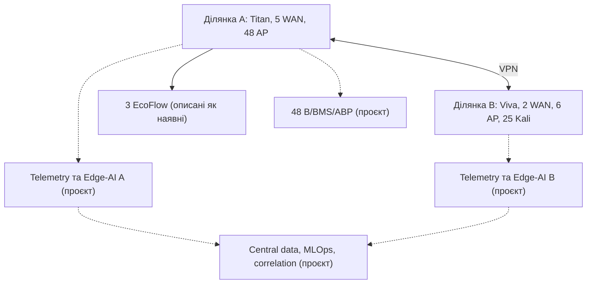
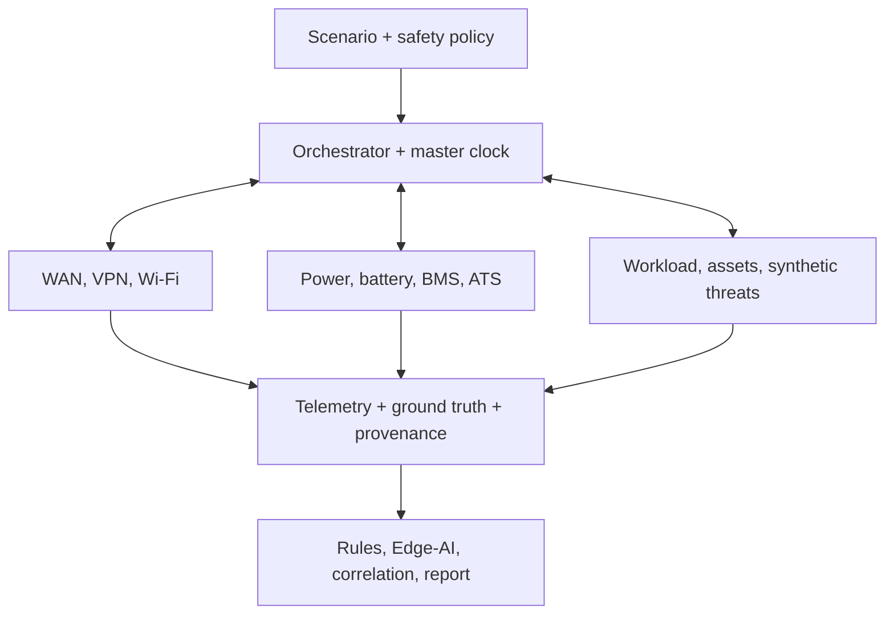
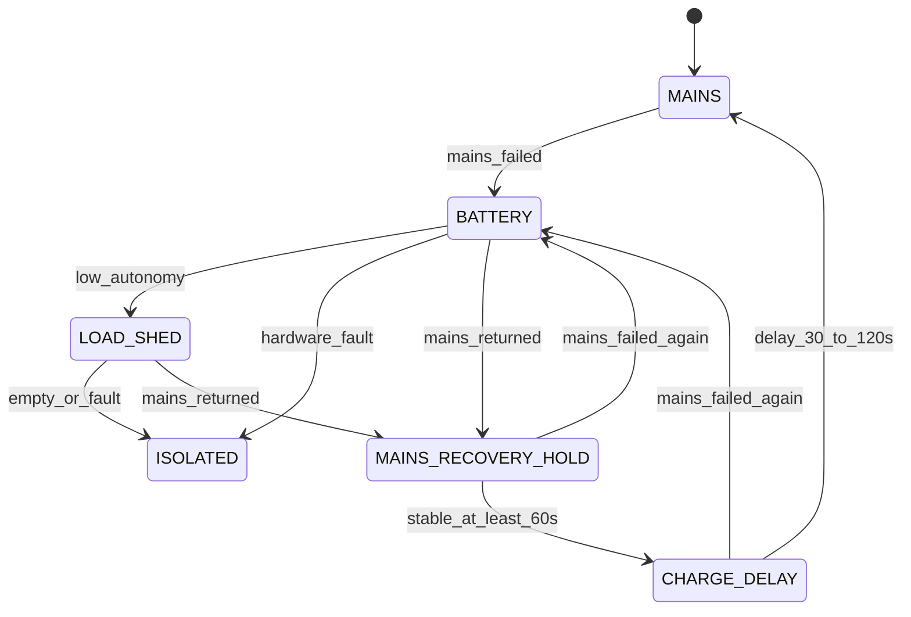
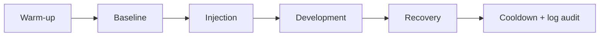

# Програмний цифровий двійник кіберполігону УМСФ

## Розширена технічна специфікація та виконуваний еталонний прототип

**Призначення:** попередня перевірка сценаріїв, схем даних, метрик, статистичного плану, безпеки та відтворюваності до перенесення експерименту на фізичний кіберполігон Університету митної справи та фінансів.

> **Межа доказовості.** До калібрування за реальною телеметрією цей артефакт є програмним прототипом цифрового двійника та імітаційною моделлю кіберполігону. Синтетичні результати характеризують поведінку програмної моделі за заданих припущень. Вони не є вимірюваннями реальної мережі, не підтверджують фактичний час перемикання WAN/VPN/АВР, реальне Wi-Fi-покриття, автономність EcoFlow або 48-В батареї та не доводять польову точність AI-детекторів.

## Анотація

У документі визначено програмну архітектуру гібридного цифрового двійника двох територіально рознесених ділянок кіберполігону УМСФ. Модель охоплює багатоканальний WAN, міжсайтовий VPN, 54 точки доступу, 25 керованих Kali Linux-вузлів, телеметрійний контур, три джерела EcoFlow, проєктну 48-В підсистему 13S×P із BMS та АВР, а також модулі виявлення і міжсайтової кореляції подій.

Документ визначає цільову архітектуру майбутнього гібридного цифрового двійника. Наразі виконуваним компонентом є спрощений чисто програмний поведінковий MVP; `EMU`, `REPLAY`, `HIL`, окремі моделі трьох EcoFlow, packet/RF backend, AI-модулі та повний CLI наведено як проєктні вимоги й ще не верифіковано.

Запропоновано чотири режими виконання — програмне моделювання `SIM`, мережева емуляція `EMU`, відтворення записаної телеметрії `REPLAY` та подальший hardware-in-the-loop `HIL`. Цільова архітектура передбачає використання єдиної конфігурації топології, сценаріїв і джерел параметрів. Документ містить моделі WAN, VPN, Wi-Fi, трафіку, кіберподій, живлення, телеметрійних дефектів та AI-оцінювання; схеми вихідних даних; план Design of Experiments; Monte Carlo і rare-event аналіз; протокол калібрування та незалежної sim-to-real валідації; data-quality і safety gates; runbook фізичного експерименту; структуру повного програмного проєкту; а також протестований zero-dependency Python MVP.

Основний принцип: наближення до реального полігону забезпечується не кількістю вигаданих деталей, а явним походженням кожного параметра, збереженням причинності, моделюванням корельованих відмов і дефектів телеметрії, калібруванням за пілотними вимірюваннями та чесним розмежуванням `synthetic`, `emulated`, `HIL` і `measured` даних.

---

# 1. Як використовувати цей документ

Документ одночасно виконує п'ять функцій:

1. **Технічна специфікація** повного цифрового двійника.
2. **Паспорт припущень** із відокремленням фактів від проєктних і синтетичних параметрів.
3. **Протокол синтетичних експериментів** для перевірки сценаріїв до фізичного запуску.
4. **План sim-to-real калібрування та валідації** на незалежній реальній вибірці.
5. **Виконуваний MVP** для негайної перевірки конвеєра даних, ground truth, seed-політики та артефактів запуску.

Рекомендована послідовність:

1. Заповнити реєстр інвентаризації у розділі 3.
2. Запустити MVP з демонстраційною конфігурацією.
3. Перевірити структуру `telemetry.csv`, `ground_truth.csv`, `summary.json` і `manifest.json`.
4. Замінити демонстраційні числа на виміряні або інтервальні параметри.
5. Виконати серії `SIM`, потім `EMU`, replay і лише після цього `HIL`.
6. Зафіксувати протокол, пороги, seed і первинні метрики до відкриття незалежного реального test set.
7. Перенести лише сценарії, що пройшли всі readiness gates, на фізичний полігон.

---

# 2. Науковий статус і рівні зрілості

## 2.1. Коректна назва на різних етапах

| Рівень | Назва | Що вже підтверджено | Що ще не підтверджено |
|---|---|---|---|
| M0 | Концептуальна модель | Логічний опис двох ділянок і залежностей | Виконуваність та реалістичність |
| M1 | Програмний прототип цифрового двійника | Виконувана топологія, сценарії, synthetic ground truth, інваріанти | Відповідність розподілам реальної телеметрії |
| M2 | Калібрована імітаційна модель | Параметри оцінено на `Real-Cal`, перевірено на `Real-Val` | Незалежна польова точність |
| M3 | HIL-верифікований двійник | Перевірено інтерфейси з окремими фізичними компонентами | Поведінка всієї системи в реальній серії |
| M4 | Незалежно валідований експериментальний twin | Пройдено blind `Real-Test`, sim-to-real gap кількісно оцінено | Тривала синхронізована робота й узагальнення за межі перевіреної області |
| M5 | Shadow-mode twin | Підтверджено тривалу роботу, alert burden і drift | Безпечність автономного реагування |

Термін **operational digital twin** допускається лише після підтвердження тривалої синхронізації та shadow validation на рівні M5. До того у статті рекомендовано використовувати формулювання **software prototype of a cyber-range digital twin** або **simulation-based pre-experimental digital model**.

## 2.2. Рівні доказів

| Код | Джерело | Допустимі твердження |
|---|---|---|
| S0 | Unit/property/integration tests | Реалізована програмна логіка та інваріанти |
| S1 | Software-in-the-Loop | Поведінка моделі за визначених параметрів; sensitivity; очікувані діапазони |
| S2 | Replay реальної телеметрії | Сумісність формату, часу, ETL і детекторів із записаними даними |
| S3 | HIL | Робота інтерфейсів і переходів у перевірених апаратних режимах |
| S4 | Контрольований фізичний експеримент | Польові метрики за конкретної конфігурації |
| S5 | Проспективний shadow mode | Реальне навантаження тривогами, drift і стабільність у часі |

**Поточний статус:** `M1 / S0-smoke`. Виконуваним є спрощений aggregate-SIM MVP із фіксованим кроком 1 с. Validator додатково обмежує зміну SoC величиною не більш як 0,1 процентного пункту за крок; більші кроки або енергетично грубі конфігурації потребують майбутнього adaptive sub-step solver. Confirmatory SIL-серії, replay реальної телеметрії, EMU, HIL, фізична валідація та shadow mode ще не виконані.

## 2.3. Матриця дозволених тверджень

| За синтетичними серіями можна стверджувати | Без фізичного експерименту не можна стверджувати |
|---|---|
| Модель відтворює задекларовану логічну топологію | Фактичну пропускну здатність реальної мережі |
| Сценарний рушій створює задані переходи й ground truth | Реальний час WAN/VPN/АВР-перемикання |
| Після реалізації й окремих тестів конвеєр може обробляти пропуски, дублікати та out-of-order записи; поточний MVP перевіряє лише gap marker із порожніми вимірювальними полями | Реальну повноту й точність усіх сенсорів |
| За заданих припущень режим A перевищив режим B | Узагальнюваність переваги на реальних користувачів і провайдерів |
| Оцінено sensitivity, uncertainty та потрібний масштаб фізичної серії | Реальну accuracy, F1, AUPRC або false-alert rate |
| Безпечно перевірено батарейні fault-сигнали у SIL/HIL | Безпечність чи ресурс фактичної батареї |
| Сформовано прогнозні інтервали для bridge experiment | Причинний польовий ефект без незалежної валідації |

---

# 3. Паспорт фізичного кіберполігону

## 3.1. Документована у вихідному DOCX конфігурація, що потребує фізичної інвентаризації

| Компонент | Ділянка A — головний корпус | Ділянка B — філія | `deployment_status` | `evidence_status` / вид значення |
|---|---|---|---|---|
| Граничний маршрутизатор | Keenetic Titan | Keenetic Viva | `reported_existing` | `documented` |
| WAN | 3 × 1 Гбіт/с + 2 × 100 Мбіт/с | 2 × 1 Гбіт/с | `reported_existing` | `documented`; `nominal` |
| Wi-Fi controller | UniFi CloudKey Gen2 | UniFi CloudKey Gen1 | `reported_existing` | `documented` |
| Точки доступу | 48 AP | 6 AP | `reported_existing` | `documented`; `count` |
| Дротовий uplink AP | 12 × 1 Гбіт/с; 36 невідомо | 6 × 100 Мбіт/с | `reported_existing` | змішаний: `documented` + `unknown` |
| Керовані експериментальні вузли | не уточнено | 25 Kali Linux | `reported_existing` для філії | `documented`; `count` |
| Міжсайтовий зв'язок | Захищений VPN до ділянки B | Захищений VPN до ділянки A | `reported_existing` | `documented`; параметри `unknown` |
| EcoFlow | 3 одиниці | не заявлено | `reported_existing` для ділянки A | `documented`; `count`; моделі `unknown` |
| 48-В контур | проєкт 13S×P/BMS/АВР/зарядний пристрій до 10 А | аналогічний модуль лише можливий | `proposed` | `documented`; фізичні параметри `unknown` |

Сукупний заявлений масштаб: **54 точки доступу, 7 логічних WAN-каналів і 25 Kali Linux-станцій**.

> CloudKey моделюється як площина керування і джерело журналів, а не як транзитний вузол користувацького трафіку. Keenetic Titan/Viva моделюються поведінковими surrogate-профілями, якщо немає офіційного віртуального образу та підтвердженого збігу внутрішньої логіки.

## 3.2. Проєктна 48-В підсистема

Вихідний документ описує проєктну, а не доведену діючу конфігурацію:

- батарея класу 48 В із позначенням `13S×P`, де `P` невідоме;
- зарядний пристрій зі струмом **до 10 А**;
- BMS, CHG/DSG FET або контактор;
- DC-UPS/power-path/ideal-diode та АВР;
- ручний bypass, запобіжник, аварійний роз'єднувач;
- сертифіковані DC/DC або PoE-перетворювачі;
- Ethernet як основний канал телеметрії, Wi-Fi як резервний;
- локальна автоматика, що не залежить від мережевого зв'язку;
- навантаження пріоритетів I, II і III.

Струм 10 А не є місткістю батареї та не означає автоматичної допустимості заряджання струмом 10 А. Напруга класу 48 В не подається безпосередньо на Ethernet-порти. Усі електричні межі повинні походити з datasheet фактичних cells, BMS, FET, кабелів, запобіжника й зарядного пристрою.

Для демонстраційного профілю проєктної 48-В підсистеми прийнято `series_groups_assumed = 13`; це не підтверджена конфігурація фактичної батареї. Фізичні `S`, `P`, хімія та допустимі межі залишаються `unknown` до інвентаризації.

## 3.3. Невідомі параметри, які не можна вигадувати

1. Апаратні ревізії Keenetic Titan/Viva і версії KeeneticOS.
2. Точні моделі CloudKey та версії UniFi Network Application.
3. Моделі AP, стандарти Wi-Fi, діапазони, канали, ширина смуги й тип PoE.
4. Uplink решти 36 AP головного корпусу.
5. Комутатори, фізична комутація, VLAN/VRF, ACL, NAT і маршрути.
6. VPN-протокол, криптографічний профіль, MTU, rekey і reconnect policy.
7. Фізична незалежність провайдерських каналів і common-cause ризики.
8. Моделі, енергія, ККД, час переходу й автономність EcoFlow.
9. Хімія, `P`, паспортна ємність, допустимі струми та BMS 48-В батареї.
10. Реальне споживання, пускові струми та boot time критичних вузлів.
11. Координати AP, план приміщень, матеріали стін і RF-перешкоди.
12. Реальні профілі клієнтів, трафіку, RTT, jitter, loss і auth events.
13. Точність синхронізації часу й характеристики сенсорів.
14. Фактична конфігурація серверів телеметрії, AI, сховища й MLOps.

## 3.4. Два незалежні статуси кожного параметра

`deployment_status` описує наявність компонента:

- `reported_existing` — описаний у вихідному DOCX як наявний, але ще не перевірений фізично;
- `verified_existing` — наявність підтверджена фізичною інвентаризацією;
- `proposed` — запланована надбудова;
- `illustrative` — лише рисунок або демонстраційний шаблон;
- `unknown` — статус не встановлено.

`evidence_status` описує походження числа:

- `measured` — отримано вимірюванням із вказаною невизначеністю;
- `datasheet` — взято з паспорта конкретної моделі/ревізії;
- `documented` — заявлено у вихідному описі;
- `calibrated` — оцінено на `Real-Cal`;
- `inferred` — оцінено непрямо, метод наведено;
- `assumed_range` — апріорний інтервал для sensitivity/Monte Carlo;
- `synthetic` — число створено сценарієм;
- `unknown` — значення відсутнє.

## 3.5. Мінімальний реєстр параметрів

| Поле | Опис |
|---|---|
| `parameter_id` | Стабільний ідентифікатор |
| `entity_id` | Актив або підсистема |
| `name` | Назва параметра |
| `value` | Точкове значення, якщо допустиме |
| `unit` | Одиниця SI/узгоджена одиниця |
| `distribution` | Розподіл для невизначеного параметра |
| `lower_bound`, `upper_bound` | Межі |
| `deployment_status` | Статус компонента |
| `evidence_status` | Походження значення |
| `source_reference` | Документ, datasheet або measurement run |
| `measurement_time_utc` | Час вимірювання |
| `uncertainty` | Похибка або credible interval |
| `calibration_id` | Версія калібрування |
| `responsible_person` | Власник перевірки |

Приклад документованого й невідомого параметрів:

```yaml
site_a:
  wan_1:
    capacity:
      value: 1000
      unit: Mbps
      evidence_status: documented
      source_reference: Kiberpolihon_UMSF_rezerv_48V_Elsevier(8).docx

  ap_group_unknown_uplink:
    count: 36
    uplink_capacity:
      value: null
      unit: Mbps
      evidence_status: unknown
      prior:
        distribution: categorical
        values: [100, 1000]
        probabilities: [0.7, 0.3]
        status: assumed_range
        note: "Тільки для sensitivity analysis; замінити інвентаризацією"
```

---

# 4. Мета, дослідницькі питання та критерії успіху

## 4.1. Основна мета

Створити fit-for-purpose виконувану модель, яка до фізичного експерименту дає змогу:

- перевірити сценарну причинність і безпечні межі впливів;
- оцінити достатність джерел телеметрії;
- перевірити часову синхронізацію і join logic;
- сформувати синтетичний ground truth;
- оцінити очікувані обсяги даних і навантаження колекторів;
- виявити confounding між кібератакою, WAN/VPN/Wi-Fi деградацією і живленням;
- порівняти правила, Edge-AI та Edge-AI з міжсайтовою кореляцією;
- визначити інформативні bridge scenarios для HIL і фізичного полігону;
- підготувати пререгістрований статистичний план і реальний runbook.

## 4.2. Дослідницькі питання

- **RQ1:** Чи відтворює модель задекларовану топологію і причинні переходи без порушення інваріантів?
- **RQ2:** Які фактори WAN, VPN, Wi-Fi та навантаження найбільше впливають на availability, session loss і detection latency?
- **RQ3:** Чи можна розділити ознаки кібератаки, мережевої відмови, втрати телеметрії та енергетичного переходу?
- **RQ4:** Чи дає міжсайтова кореляція практично значуще покращення порівняно з правилами та локальним Edge-AI?
- **RQ5:** Які synthetic-to-real розбіжності залишаються після калібрування і чи вкладаються вони в наперед визначені допуски?
- **RQ6:** Яка кількість незалежних фізичних прогонів потрібна для заданої точності первинної метрики?

## 4.3. Первинні кінцеві точки

Для одного confirmatory експерименту слід вибрати одну мережеву й одну безпекову первинну метрику, наприклад:

- WAN failover: `service_interruption_ms` або `session_survival_rate`;
- detection: `incident_recall_at_fixed_false_alert_rate`;
- power: у `SIM` — `critical_node_restart_count` і `predicted_autonomy_min`; `measured_autonomy_min` дозволене лише для HIL/фізичного випробування;
- sim-to-real: нормована Wasserstein-відстань для заздалегідь визначеного KPI.

Решта показників є вторинними або діагностичними. Це зменшує ризик вибіркового звітування.

---

# 5. Функціональні та нефункціональні вимоги

## 5.1. Функціональні вимоги

1. Відтворення двох ділянок і залежностей між мережею, живленням та телеметрією.
2. Підтримка режимів `SIM`, `EMU`, `REPLAY` і `HIL` з єдиним сценарним контрактом.
3. Детермінований сценарний рушій і окремі RNG-простори компонентів.
4. Моделювання штатного фону, керованих відмов, кіберподій і комбінованих сценаріїв.
5. Окреме збереження ground truth, недоступного feature pipeline.
6. Створення UTC-часу події, часу спостереження і часу надходження.
7. Моделювання missingness, duplicates, clock drift і out-of-order delivery.
8. Версіонування топології, параметрів, сценарію, моделі та схеми даних.
9. Автоматичні quality, safety, leakage і readiness gates.
10. Формування run manifest, checksums, summary і runbook фізичної серії.

## 5.2. Нефункціональні вимоги

- **Відтворюваність:** однакова конфігурація, версія й seed дають однаковий event schedule і ground truth.
- **Трасованість:** кожна таблиця/рисунок пов'язані з run ID, data hash і analysis code hash.
- **Безпека:** режим за замовчуванням не створює зовнішнього трафіку і не містить exploit-коду.
- **Ізоляція:** default deny, відсутність production routes, allowlist лише тестових asset ID.
- **Масштабованість:** швидкий aggregate SIM і точніший пакетний/RF backend для фінальних сценаріїв.
- **Спостережуваність:** health, lag, dropped samples, resource use і stale co-simulation state.
- **Відновлюваність:** checkpoint/reset та чистий snapshot між незалежними прогонами.

## 5.3. Незмінні інваріанти

- `site_a.ap_count == 48`, `site_b.ap_count == 6`;
- `site_a.wan_count == 5`, `site_b.wan_count == 2`;
- `site_b.kali_count == 25`;
- для демонстраційного `DEMO_ONLY_13SxP` профілю `series_groups_assumed == 13`, а фактичні `S`, `P` і хімія залишаються невідомими до інвентаризації;
- у production-контракті канонічні `loss_rate`, `soc_fraction`, `soh_fraction` лежать у `[0,1]`; у скороченому MVP поля із суфіксом `_pct` лежать у `[0,100]`;
- якщо шлях недоступний, `availability == 0`, `loss_rate == 1` (`packet_loss_pct == 100` у MVP), а RTT/jitter/VPN RTT є `null/NA`, не великим числом;
- `RTT >= 0`, `jitter >= 0`, `throughput >= 0`, SoC/SoH у відповідному канонічному діапазоні, енергія не виникає без джерела;
- втрата Ethernet/Wi-Fi не вимикає локальну BMS/АВР;
- AI не скасовує COV/CUV/OCP/OTP/SCD та інші апаратні захисти;
- ground-truth поля не входять до ознак;
- жодна синтетична подія не має зовнішньої або виробничої цілі;
- усі непідтверджені значення мають статус `assumed_range`, `synthetic` або `unknown`.

---

# 6. Архітектура цифрового двійника

## 6.1. Режими виконання

| Режим | Час | Реальні стеки | Основна мета |
|---|---|---|---|
| `SIM` | логічний, швидше/повільніше real time | ні | Monte Carlo, DOE, sensitivity, rare events |
| `EMU` | реальний | Linux namespaces/containers, FRR, `tc/netem` | перевірка сервісів, сенсорів, VPN і AI-контейнерів |
| `REPLAY` | початковий або прискорений | записана телеметрія | перевірка ETL, feature pipeline і детекторів |
| `HIL` | реальний | вибрані реальні BMS/AP/router/gateway | перевірка інтерфейсів і безпечних переходів |

Перехід до `HIL` дозволяється лише після успішного `SIM`, `EMU`, safety test і затвердження окремого протоколу.

## 6.2. Логічна топологія



Суцільні зв'язки позначають описані у вихідному DOCX компоненти; пунктирні — запропоновані надбудови. Навіть суцільні елементи потребують фізичної інвентаризації.

### 6.2.1. Цільові логічні зони з вихідного DOCX

Усі сім зон нижче мають `deployment_status: proposed`; документ не підтверджує, що вони вже розгорнуті.

| Зона | Призначення | Мінімальна політика |
|---|---|---|
| Керування | маршрутизатори, controllers, BMS/АВР gateway | MFA/RBAC, allowlist, окремий VLAN, audit |
| Освітня | навчальні користувачі й сервіси | сегментація від керування та цілей |
| Атакувальна | 25 керованих Kali та генератори | egress deny, rate caps, disposable snapshots |
| Цільова | спеціально підготовлені test assets | лише дозволені сценарні зв'язки |
| Телеметрія/AI | collectors, features, inference | append-only logs, schema і time controls |
| Карантин | ізольовані підозрілі assets | default deny, контрольований forensic access |
| Гостьова Wi-Fi | некеровані клієнти | повна ізоляція від experiment/control planes |

### 6.2.2. Рекомендовані AI-компоненти з вихідного DOCX

| Елемент | Цільова роль | Поточний статус |
|---|---|---|
| Telemetry/features | узгодження network, Wi-Fi, host і power ознак | `proposed`; MVP має скорочені aggregate features |
| Edge-AI | локальне виявлення при втраті VPN | `proposed`; не реалізовано в MVP |
| Central data/MLOps | навчання, registry, provenance, monitoring | `proposed`; не реалізовано в MVP |
| Intersite correlation | причинне зіставлення подій A/B | `proposed`; не реалізовано в MVP |
| XAI/response/drift | пояснення, human approval, drift control | `proposed`; не реалізовано в MVP |

## 6.3. Федеративна програмна архітектура



## 6.4. Федерати й контракти

У повній реалізації кожний модуль має реалізувати `initialize`, `next_time`, `apply_event`, `advance`, `observe`, `checkpoint`, `reset` і `health`.

| Федерат | Відповідальність |
|---|---|
| Network | Multi-WAN, черги, маршрути, NAT, VPN, link state |
| Wi-Fi | AP, клієнти, RSSI/SNR, channel utilization, roaming, retries, uplink bottleneck |
| Power | EcoFlow black-box, 48-В gray-box, BMS, АВР, DC/DC, load shedding |
| Asset | `OFF`, `BOOTING`, `READY`, `DEGRADED`, `SHUTTING_DOWN`, `FAILED` |
| Workload | benign DNS/DHCP/web/file/update/control flows і сезонність |
| Synthetic Threat | feature-level або bounded in-lab події без зовнішніх цілей |
| Telemetry | sampling, noise, quality defects, buffering, schema |
| Detection | правила, статистика, Edge-AI, central correlation |
| Response | рекомендації, human approval, затримка й rollback |
| Ground Truth | фактичні для симуляції onset/end, cause, target, stage, intensity |

## 6.5. Єдиний логічний час

У промисловій реалізації час зберігається цілим числом мікро- або наносекунд. Для однакової часової мітки використовується стабільний порядок:

| Пріоритет | Фаза |
|---:|---|
| 0 | Інтегрування безперервних рівнянь до `T` |
| 1 | Сценарна подія або fault injection |
| 2 | Апаратний захист BMS/АВР |
| 3 | Зміна живлення й життєвого циклу asset |
| 4 | Зміна топології, маршруту, VPN або AP |
| 5 | Пакетні/агреговані потоки |
| 6 | Sampling і доставка телеметрії |
| 7 | Feature pipeline та inference |
| 8 | Відкладена рекомендація/реакція |

Стабільний ключ сортування:

```text
(simulation_time, phase, source_id, source_sequence, event_id)
```

Реакція, сформована після inference у момент `T`, набуває чинності не раніше `T + delta_min`, щоб не змінювати минуле того самого такту.

## 6.6. Причинні залежності

| Причина | Безпосередній стан | Наступні спостережувані ефекти |
|---|---|---|
| Mains loss | АВР/power-path transition | battery current, можливий packet loss, VPN reconnect, telemetry gap |
| WAN degradation | link `DEGRADED` | RTT/jitter/loss, session drops, central detection latency |
| Wi-Fi congestion | airtime saturation | retries, association delay, throughput reduction без атаки |
| Telemetry link loss | `TELEMETRY_DEGRADED` | missing/out-of-order/buffered records; BMS продовжує локальну роботу |
| Low SoC/RUL | warning/load shedding | спочатку III, потім II; критичний I зберігається до safety limit |
| Synthetic attack stage | feature/event transition | detector score, graph edge, alert; не пряме зовнішнє сканування |

---

# 7. Рекомендований технологічний стек

## 7.1. Повна реалізація

| Рівень | Рекомендований засіб | Роль |
|---|---|---|
| Co-simulation | HELICS | Master clock, causal time grants, обмін між федератами |
| Пакетна мережа/RF | ns-3 | WAN, черги, loss, Wi-Fi, roaming, інтерференція |
| Мережева емуляція | Containernet або Containerlab, FRRouting, nftables, `tc/netem` | Реальні протокольні стеки в ізоляції |
| Енергетика | OpenModelica + FMI/FMU, FMPy | EcoFlow/battery/BMS/АВР/load models |
| Battery extension | PyBaMM, опційно | Поглиблена електрохімічна/теплова калібрація |
| Оркестратор | Python 3.12, Pydantic v2, Typer | Config validation, scenario compile, run control |
| Події | Protobuf + HELICS values/messages | Детермінований causal bus |
| Операційна телеметрія | NATS JetStream або Redpanda; MQTT/mTLS для BMS | Потоковий конвеєр, але не master clock |
| Сенсори | Zeek, Suricata, IPFIX/NetFlow, syslog, OpenTelemetry | Ознаки, що відповідатимуть фізичному полігону |
| Дані | Parquet, MinIO, TimescaleDB/ClickHouse | Raw, normalized, time-series, ground truth |
| Спостережуваність | Prometheus, Grafana | Health, lag, resources, quality |
| MLOps/provenance | MLflow, DVC/lakeFS, OCI digests, RO-Crate | Версії моделей, даних і прогонів |

## 7.2. Швидкий MVP

Додатки B-D містять zero-dependency реалізацію на стандартній бібліотеці Python. Вона:

- перевіряє документовані інваріанти 48+6 AP, 5+2 WAN, 25 Kali й окремо — припущення 13S демонстраційного проєктного профілю;
- генерує детерміновані часові ряди для обох ділянок;
- моделює WAN failover, VPN degradation, Wi-Fi/auth/recon/lateral/C2 події;
- моделює mains loss, SoC, умовну pack voltage curve, constant-power relation `P = U_terminal × I`, synthetic electrical feasibility/isolation latch, temperature, cell imbalance, 60-секундний recovery hold, 30-секундну charge delay й ATS marker;
- маркує кожний крок як `[timestamp_utc, interval_end_utc)`, а силовий стан — як `power_state_start`/`power_state_end`, тому часткове вичерпання енергії не змішується з миттєвим станом;
- матеріалізує event defaults до hash/execution/truth, зберігає interval ground truth окремо від feature telemetry та замінює недоступні вимірювання на порожні значення у `telemetry_gap_marker`;
- формує checksummed run manifest із config/engine/runtime hash, 100000-row memory guard, staging publish та забороною непомітного overwrite;
- не відкриває сокетів і не генерує реального атакувального трафіку.

Це поведінковий surrogate для перевірки конвеєра, а не packet-level, RF або electrochemical safety simulator.

MVP використовує file-level маркер `evidence_class: synthetic_demo`; усі непідтверджені числа в його JSON є демонстраційними. Він **не** реалізує окремі моделі трьох EcoFlow, packet/RF backend, реальну буферизацію/duplicates/out-of-order delivery, повний asset-level load shedding, ML/AI або EMU/HIL. Повна реалізація повинна перейти до per-parameter wrapper із `value`, `unit`, `evidence_status`, `source` та `uncertainty`.

---

# 8. Структура повного програмного проєкту

```text
umsf-cyberrange-twin/
├── README.md
├── ARCHITECTURE.md
├── ASSUMPTIONS.md
├── SECURITY.md
├── CITATION.cff
├── LICENSE
├── pyproject.toml
├── uv.lock
├── Dockerfile
├── docker-compose.yml
├── Makefile
├── config/
│   ├── inventory/
│   │   ├── site-a.yaml
│   │   ├── site-b.yaml
│   │   ├── vpn.yaml
│   │   └── power.yaml
│   ├── profiles/
│   │   ├── wan/
│   │   ├── wifi/
│   │   ├── device-surrogates/
│   │   └── telemetry/
│   └── policies/
│       ├── safety.yaml
│       ├── egress.yaml
│       └── retention.yaml
├── schemas/
│   ├── inventory.schema.json
│   ├── scenario.schema.json
│   ├── event.proto
│   ├── telemetry.proto
│   └── ground-truth.proto
├── scenarios/
│   ├── baseline/
│   ├── wan/
│   ├── vpn/
│   ├── wifi/
│   ├── cyber/
│   ├── power/
│   ├── telemetry/
│   └── compound/
├── src/umsf_twin/
│   ├── cli.py
│   ├── orchestrator/
│   ├── scheduler/
│   ├── scenario_compiler/
│   ├── parameter_registry/
│   ├── safety/
│   ├── provenance/
│   ├── seeds/
│   ├── metrics/
│   └── reporting/
├── federates/
│   ├── network_ns3/
│   ├── network_emulation/
│   ├── wifi_ns3/
│   ├── power_fmu/
│   ├── assets/
│   ├── workload/
│   ├── synthetic_threats/
│   ├── telemetry/
│   ├── detection/
│   ├── response/
│   └── ground_truth/
├── adapters/
│   ├── unifi/
│   ├── keenetic/
│   ├── bms/
│   ├── mqtt/
│   └── otel/
├── pipelines/
│   ├── collection/
│   ├── normalization/
│   ├── features/
│   ├── labeling/
│   ├── validation/
│   └── export/
├── tests/
│   ├── unit/
│   ├── property/
│   ├── contract/
│   ├── integration/
│   ├── determinism/
│   ├── safety/
│   ├── calibration/
│   └── performance/
├── notebooks/
│   ├── calibration/
│   ├── sensitivity/
│   └── result-analysis/
└── runs/
```

Raw PCAP, реальні секрети, ідентифікатори користувачів і великі результати не зберігаються безпосередньо в Git.

---

# 9. Математичні й поведінкові моделі

## 9.1. Модель черги та пропускної здатності

Для швидкого SIM використовується флюїдна модель. За крок `Delta t`:

$$
A_t = \frac{R_t\Delta t}{8}, \qquad
S_t = \frac{C_t\Delta t}{8},
$$

$$
Q_{t+1}=\max(0,Q_t+A_t-S_t),
$$

де $R_t$ — запропонована швидкість, $C_t$ — ефективна пропускна здатність, $Q_t$ — backlog. Чергова затримка:

$$
D_q=\frac{8Q_{t+1}}{C_t}.
$$

Повна затримка шляху:

$$
D_{path}=\sum_l(D_{base,l}+D_{q,l}+D_{jitter,l})+D_{VPN}.
$$

Для пакетних втрат використовується Gilbert-Elliott або trace-driven модель. Незалежна стала ймовірність втрати допускається лише в MVP і маркується як спрощення.

## 9.2. Multi-WAN

Кожний WAN має стани `UP`, `DEGRADED`, `DOWN`, `RECOVERING`. Поведінкова модель включає:

- health probes і число послідовних невдалих/успішних перевірок;
- hold-down для захисту від flapping;
- `primary_backup`, session balancing або policy routing;
- оновлення маршруту, NAT-state і зміну зовнішньої адреси;
- імовірність збереження/обриву сесій;
- common-cause variable для каналів зі спільним upstream, трасою чи живленням;
- hysteresis повернення на пріоритетний канал.

Номінальні 3 × 1 Гбіт/с + 2 × 100 Мбіт/с не трактуються як гарантовані 3,2 Гбіт/с для одного потоку.

## 9.3. VPN

Стани: `UP`, `DEGRADED`, `REKEYING`, `DOWN`, `RECONNECTING`.

Параметри після інвентаризації:

- протокол і криптографічний профіль;
- MTU, MSS і фрагментація;
- processing overhead;
- RTT, jitter, independent/burst loss;
- reconnect/rekey time;
- routing asymmetry;
- local buffering телеметрії;
- burst delivery та out-of-order записи після відновлення.

До інвентаризації VPN є конфігурованим surrogate-тунелем, а не vendor-exact implementation.

## 9.4. Wi-Fi

Ефективна пропускна здатність AP:

$$
C_{effective}=\min\left(
C_{radio}f_{RSSI}(1-overhead_{airtime}),
C_{uplink}
\right).
$$

Повна RF-модель потребує координат AP, плану приміщень, матеріалів стін, Tx power, band/channel/width, стандарту Wi-Fi, client capabilities і mobility traces. До отримання цих даних модель Wi-Fi є агрегованою та не робить тверджень про фактичне покриття.

Модель формує:

- client count на AP/ділянку;
- RSSI, SNR, MCS та channel utilization;
- retry rate і packet error rate;
- association, reassociation і roaming;
- auth failures;
- saturation 100-Мбіт/с або 1-Гбіт/с uplink;
- AP/controller visibility;
- втрату AP через network/power dependency.

Для 36 AP із невідомим uplink кожний залежний запис отримує `ASSUMED_PARAMETER` або `UNKNOWN_UPLINK`.

## 9.5. Штатне навантаження

Фонові процеси не генеруються як незалежний білий шум. Кандидатні моделі:

| Процес | Модель | Залежності |
|---|---|---|
| Flows/events per window | Negative Binomial, MMPP або Hawkes | час, site, load phase |
| Inter-arrival | Weibull/lognormal/empirical | service class, burst state |
| Bytes/duration | lognormal/Weibull, GPD для хвоста | protocol/service/client group |
| RTT residual | shifted lognormal/gamma + AR | utilization, active WAN, loss |
| Wi-Fi clients | Negative Binomial із сезонністю | AP, site, time block |
| RSSI | Gaussian mixture + random effects | AP, client group, location class |
| Auth failures | zero-inflated Negative Binomial | baseline/attack, service |
| Power load | state-space/ARX | active assets, traffic, source state |

До калібрування всі розподіли є кандидатними. Вибір виконується за predictive likelihood, AIC/BIC, Q-Q/P-P діаграмами, tail diagnostics і posterior predictive checks.

## 9.6. Синтетичні кіберподії

MVP змінює ознаки й подієвий граф без реальних пакетів. У `EMU` дозволені лише bounded сценарії всередині egress-denied середовища.

| Профіль | Синтетичний ефект | Заборонене тлумачення |
|---|---|---|
| `recon_burst` | зростання connection/port counters | фактичне сканування зовнішньої мережі |
| `wifi_auth_burst` | тестові `AUTH_FAILURE` | підбір реальних облікових даних |
| `rogue_ap_signal` | вигаданий BSSID і association events | реальна rogue AP поза полігоном |
| `lateral_sequence` | логічний шлях asset-to-asset | експлуатація виробничих вузлів |
| `low_rate_c2` | періодичні flow records без payload | реальний malware/C2 |
| `traffic_burst` | обмежене `offered_load` | неконтрольований DDoS |
| `telemetry_loss` | у повній моделі missing/stale/out-of-order; у MVP лише gap marker із порожніми measurement fields | фізичне вимкнення safety layer |
| `model_drift` | зміна розподілу ознак | доказ реального drift |

Стадії багатокрокової події моделюються semi-Markov або dynamic Bayesian network, щоб порядок подій був причинним.

## 9.7. EcoFlow

У цільовій архітектурі після інвентаризації кожна з трьох станцій повинна мати окрему black-box модель з параметрами:

- usable energy curve;
- load-dependent efficiency;
- transition time;
- minimum usable SoC;
- output behavior during transition;
- recharge/recovery time;
- protected asset group.

Не можна називати EcoFlow джерелом із нульовим часом перемикання без вимірювання.

Поточний MVP окремих EcoFlow-моделей не містить і не генерує висновків про їхню автономність чи переходи.

## 9.8. 48-В батарея 13S×P

Позначення `13S×P` у цьому розділі є **проєктним профілем**, а не результатом фізичної ідентифікації батареї. `P` і хімія невідомі. Число `48.1 V = 13 × 3.70 V` та лінійна крива cell voltage у MVP є лише умовними `synthetic_demo_conditional` припущеннями; переносити їх у HIL до отримання datasheet заборонено.

Стан gray-box моделі:

```text
x = [SoC, SoH, Qeff, R0, T, U1..U13, balance_mask, BMS_faults]
```

Енергетичний баланс:

$$
E_{t+\Delta t}=\operatorname{clip}\left(
E_t-\frac{P_{load}\Delta t}{3600\eta_{path}}
+\frac{P_{charge}\eta_{charge}\Delta t}{3600},
0,E_{usable}
\right),
$$

$$
SoC_t=\frac{E_t}{E_{usable}}.
$$

Спрощена напруга:

$$
U_{pack}=\sum_{i=1}^{13}OCV_i(SoC_i,T)-IR_{internal}.
$$

У battery-discharge кроці MVP розв'язує узгоджене рівняння постійної потужності:

$$
P_{bat}=\frac{P_{load}}{\eta}=I(U_{OCV}-IR),
\qquad
I=\frac{2P_{bat}}{U_{OCV}+\sqrt{U_{OCV}^{2}-4RP_{bat}}}.
$$

Якщо дискримінант від'ємний або synthetic current/terminal/cell-voltage envelope порушено, модель не видає неможливі `0 V` із працюючими assets, а формує `protection_trip` і latch-стан `ISOLATED`. Для charge використовується відповідний корінь `P=I(U_OCV+IR)`: запитана потужність обмежується charger power ceiling, доступною ємністю та величиною $I_{lim}(U_{OCV}+I_{lim}R)$, після чого SoC перераховується з фактично прийнятої потужності. Перевищення synthetic cell-voltage ceiling дає `charge_inhibited`; саме струмове обмеження працює як current-limit, а не як повна заборона заряджання. Ці envelopes мають статус `SYNTHETIC_DEMO_ONLY_UNVERIFIED` і не замінюють datasheet або електричний розрахунок.

У виході MVP `pack_ocv_v` та `cell_ocv_min_v/max_v` позначають synthetic open-circuit values, тоді як `pack_voltage_v` і `cell_min_v/max_v` — terminal values під навантаженням або зарядом. За прийнятого рівномірного розподілу внутрішнього опору виконується $U_{terminal}=U_{OCV}-IR$ для signed current, тому pack voltage лежить між $13V_{cell,min}$ і $13V_{cell,max}$. Це числова узгодженість surrogate, а не електрохімічна валідація.

Теплова RC-модель:

$$
T_{t+\Delta t}=T_t+\Delta t\left[
\frac{I^2R}{C_{th}}-
\frac{T_t-T_{ambient}}{R_{th}C_{th}}
\right].
$$

Автономність, узгоджена з вихідним документом:

$$
t_{res}=\frac{E_{usable}(T,SoH,P_{crit})\eta}{P_{crit}}.
$$

Додаткові величини:

$$
Q_{Ah}=\frac{1}{3600}\int I(t)dt,
\qquad
E_{Wh}=\frac{1}{3600}\int U(t)I(t)dt,
$$

$$
\Delta V_{cell}=V_{max}-V_{min},
\qquad
R_{DCIR}\approx\frac{\Delta V}{\Delta I}.
$$

Обмеження струму:

$$
I_{chg}\leq\min(10A,\;P I_{cell},\;I_{BMS},\;I_{FET},\;I_{cable},\;I_{fuse}).
$$

Фізичні COV/CUV/OCP/OTP/SCD межі не калібруються бажаним результатом симуляції — вони надходять із datasheet і затвердженої електричної документації.

У MVP `charger_nameplate_max_a = 10 A` є лише верхньою паспортною межею запропонованого charger, а `synthetic_charge_current_limit_a = 4 A` — демонстраційною програмною межею без safety-статусу. Через невідомі `P`, cell/BMS/FET/cable/fuse limits жоден струм MVP не є дозволом для HIL. Заряд у MVP — спрощена current-/power-limited behavioral approximation без повного CC/CV taper і termination.

## 9.9. Power state machine



`TELEMETRY_DEGRADED` моделюється як ортогональний стан спостереження, а не як силовий стан. Втрата Ethernet/Wi-Fi змінює доставку телеметрії, але не BMS/АВР.

| Стан із DOCX | Повна модель | Поточний MVP |
|---|---|---|
| `CHARGE` | `CHARGE` | агреговано в `MAINS` після `CHARGE_DELAY` |
| `STANDBY` | `STANDBY` | агреговано в `MAINS` |
| `DISCHARGE` | `DISCHARGE` | `BATTERY` |
| `WARNING` | окремий substate/flag | лише окремі flags; повний стан не реалізовано |
| `LOAD SHED` | asset-level `LOAD_SHED` | `LOAD_SHED` як один scalar factor |
| `ISOLATED` | `ISOLATED` | реалізовано для вичерпаної synthetic energy |
| `TELEMETRY DEGRADED` | ортогональний observation state | лише `telemetry_gap_marker` |

Групи навантаження з вихідного DOCX:

- I — маршрутизатор, VPN, основний комутатор і monitoring gateway;
- II — CloudKey, сервер журналювання та вибрані AP;
- III — навчальні станції й допоміжні AP; не резервуються або відключаються першими.

Цільова модель відключає III перед II, зберігаючи I до safety limit. Поточний MVP використовує лише `load_shed_factor = 0.72`, тому це scalar approximation, а не asset-level перевірка послідовності.

Після повернення мережі:

- джерело вважається стабільним після щонайменше 60 с;
- заряджання відновлюється із затримкою 30-120 с;
- навантаження повертаються у контрольованій послідовності;
- у повній моделі всі таймери й похідні переходи фіксуються в ground truth.

MVP реалізує recovery/charge timers у state telemetry, але його `ground_truth.csv` містить лише наперед задані injection intervals; окремий transition-truth log є вимогою наступної версії.

## 9.10. Початкові операційні пороги

Це початкові сценарні уставки з вихідного опису, а не паспортні межі:

| Параметр | Warning | Action | Статус у twin |
|---|---:|---:|---|
| SoC | <=30% | <=20%: load shedding III, потім II | `initial_synthetic_default` |
| Прогноз автономності | <=30 хв | <=15 хв: critical warning/shutdown | `initial_synthetic_default` |
| SoH/ємність | <80% номіналу або вимоги | заміна після capacity/autonomy test | `service_hypothesis` |
| DCIR | >30% від temperature-normalized baseline | повторний тест | `service_hypothesis` |
| Cell imbalance | >50 мВ протягом 10 хв | >100 мВ: critical diagnosis | `experimental_default` |
| Напруга групи | warning біля паспортної межі | COV/CUV і charger CV строго за datasheet | `unknown_until_inventory` |
| Струм заряджання | програмна ціль нижче апаратної | `I_chg <= min(10 A, P×I_cell, I_BMS, I_FET, I_cable, I_fuse)` | `unknown_until_inventory` |
| Температура | warning до паспортної межі | заборона charge/discharge поза межами виробника | `unknown_until_inventory` |
| BMS trips | >=2 за 30 діб або будь-яка тяжка COV/OTP/SCD | негайне або позапланове обстеження | `service_rule` |
| Ethernet loss | 5-10 с | failover на Wi-Fi | `operational_default` |
| Ethernet + Wi-Fi loss | local logging | BMS/АВР працюють автономно | `fail_safe_requirement` |

## 9.11. Sensor і telemetry model

Цифровий двійник розрізняє:

- `event_time` — коли подія сталася у моделі;
- `observed_time` — коли її зафіксував сенсор;
- `ingest_time` — коли запис отримав центральний конвеєр.

Цільова повна реалізація повинна моделювати:

- measurement noise і quantization;
- clock offset, linear drift і random walk;
- missing samples за MCAR, MAR і MNAR;
- duplicates і sequence gaps;
- out-of-order delivery;
- frozen/stale values;
- локальна буферизація під час VPN loss;
- пакетна доставка після відновлення;
- schema mismatch і версії feature pipeline.

Поточний MVP реалізує лише `telemetry_gap_marker`: для заданого інтервалу він залишає ідентифікатори часу/site та quality metadata, але робить вимірювальні поля порожніми й не обчислює detector score. Він не моделює buffering, delayed/out-of-order delivery, duplicates, `observed_time` або `ingest_time`; твердження про них можливі лише після окремої реалізації й тестів.

## 9.12. Detection і response

Порівнюються три основні режими:

1. правила/сигнатури;
2. локальний Edge-AI;
3. Edge-AI + міжсайтова кореляція.

Окремо може використовуватися transparent rule baseline, включений у MVP. Його метрики є smoke-test конвеєра, а не доказом якості AI.

На фізичному полігоні початковий режим — лише `shadow`. Реагування формує рекомендацію, confidence, explanation, rollback plan і audit record. Автоматичне блокування виробничих користувачів вимкнене.

---

# 10. Контракти даних

## 10.1. Універсальний конверт події

```text
event_id
schema_version
experiment_id
run_id
replication_id
scenario_id
scenario_phase
event_time_utc
observed_time_utc
ingest_time_utc
site_id
entity_id
sensor_id
source_sequence
event_type
cause_id
correlation_id
severity
quality_flags
parameter_evidence
model_version
payload
```

У скороченому MVP один рядок описує напіввідкритий інтервал `[timestamp_utc, interval_end_utc)`. Потужність і струм є середніми за цей інтервал; `power_state_start` та `power_state_end` фіксують boundary transition. Це особливо важливо, коли залишкова енергія вичерпується всередині кроку.

## 10.2. Мережева телеметрія

```text
timestamp_start_utc, timestamp_end_utc, site_id, sensor_id,
src_token, dst_token, protocol_class, packets, bytes, duration_ms,
rtt_ms, jitter_ms, loss_rate, availability, retransmissions, wan_id,
wan_links_down_count, vpn_state,
scenario_phase, quality_flags
```

## 10.3. Wi-Fi телеметрія

```text
timestamp_utc, site_id, ap_id, controller_id, uplink_mbps,
connection_type, switch_id, switch_port_id, client_group_id_or_token,
band, channel, client_count, rssi_median_dbm, snr_median_db,
airtime_utilization, retry_rate, auth_failures, roam_in, roam_out,
ap_state, quality_flags
```

Для 36 неінвентаризованих uplink та невідомої комутації застосовується явне значення `UNINVENTORIED`, а не підстановка чи мовчазне вилучення поля.

## 10.4. BMS/АВР телеметрія

```text
timestamp_utc, pack_id, configuration,
cell_group_v_01 ... cell_group_v_13,
pack_voltage_v, signed_current_a, load_power_w,
temperature_c_01 ..., soc, soh, v_min, v_max, delta_v,
dcir_ohm, cycle_count, balance_mask, bms_fault_bitmap, chg_state, dsg_state,
mains_present, power_state_start, power_state_end, source_state, ats_state,
ethernet_state, wifi_state, vpn_state,
predicted_autonomy_min, quality_flags, calibration_id, model_version
```

Знак струму: `signed_current_a > 0` — discharge, `< 0` — charge. Відображення є однозначним: `U1…U13 -> cell_group_v_01…cell_group_v_13`.

Звичайний health logging: 1-10 samples/s. Швидкі переходи АВР у реальному експерименті реєструються окремим DAQ/осцилографом із задокументованою смугою пропускання.

MVP видає скорочену aggregate schema і не реалізує всі 13 окремих напруг, DCIR, cycle count, BMS faults, `ats_state` та повний контракт цього розділу. Для аудиту surrogate він окремо експортує `pack_ocv_v`, `pack_voltage_v`, `cell_ocv_min_v`, `cell_ocv_max_v`, terminal `cell_min_v`, terminal `cell_max_v`, `power_protection_trip` і `charge_inhibited`.

## 10.5. Ground truth

Ground truth зберігається окремо:

```text
run_id, replication_run_id, replicate_id, scenario_id, event_id, cause_id,
event_type, stage, target_asset_id, event_start_s, event_end_s,
event_start_utc, event_end_utc, intensity_json, label_quality
```

`scenario_id`, `event_id`, `attack/tool name`, адреса генератора або службові markers не допускаються до feature table.

У MVP це один інтервальний запис на `event × target × replicate`; time-step оцінювання виконує окремий внутрішній join лише після inference. `ground_truth.csv` ніколи не подається до feature pipeline.

## 10.6. Quality flags

```text
ASSUMED_PARAMETER
UNKNOWN_UPLINK
CLOCK_SKEW
MISSING_SAMPLE
DUPLICATE
OUT_OF_ORDER
BUFFERED
IMPUTED
SENSOR_OFFLINE
VPN_UNAVAILABLE
TELEMETRY_GAP
COSIM_STALE
SCHEMA_MISMATCH
BACKUP_POWER
WAN_FAILOVER
```

## 10.7. Артефакти одного запуску

```text
runs/<run_id>/
├── manifest.json
├── scenario.resolved.yaml
├── inventory.snapshot.yaml
├── parameters.parquet
├── seeds.json
├── topology.graphml
├── topology.json
├── events.parquet
├── telemetry/
│   ├── flows/
│   ├── wifi/
│   ├── vpn/
│   ├── hosts/
│   └── power/
├── ground-truth/
├── detection/
├── metrics/
├── logs/
├── plots/
├── dataset-card.md
├── software-bom.json
├── provenance.json
└── checksums.sha256
```

## 10.8. Run manifest

Обов'язкові поля:

```text
run_id, experiment_id, data_origin, fidelity_level,
twin_version, scenario_id, topology_version, parameter_set_id,
master_seed, component_seeds, start_utc, end_utc,
config_hash, topology_hash, input_hashes, output_hashes,
git_commit, container_digest, dependency_lock_hash, fmu_hash,
schema_version, feature_pipeline_hash, model_version,
calibration_id, host_profile, quality_gate_status, known_deviations
```

У MVP `source_inventory` з JSON переноситься як `user_supplied_source_inventory` разом із `source_inventory_status: unverified_text_from_config`; це не authoritative inventory evidence. `calibration_id` для `synthetic_demo` заборонено. Назви router/controller фіксовані за вихідним DOCX, а VPN protocol/MTU залишаються `UNINVENTORIED`.

---

# 11. Каталог сценаріїв

## 11.1. Фази прогону



Одиниця незалежного повтору — повний прогін, а не пакет, flow або рядок журналу.

## 11.2. Базові сценарії twin: джерельні та розширені

Це рекомендований каталог, а не твердження про вже виконані експерименти.

| ID | Сценарій | Керований вплив | Первинні спостереження | Перенесення на реальний полігон | `origin` |
|---|---|---|---|---|---|
| E00 | Normal baseline | без fault/attack | distributions, ACF, missingness | пасивний збір | джерельна структура baseline; не окремий рядок Table 7 |
| E01 | WAN failover | `DOWN/DEGRADED` одного каналу | failover time, sessions, availability | контрольоване відключення після approval | Source Table 7 |
| E02 | VPN impairment | latency/jitter/loss/reconnect/MTU | VPN state, buffering, detection latency | `tc/netem`/тестовий тунель | Source Table 7; MTU — розширення twin |
| E03 | Wi-Fi anomaly | auth burst/rogue signal/roaming load | RSSI, retries, auth, localization | ізольована тестова SSID/AP | Source Table 7 |
| E04 | Recon + lateral sequence | synthetic counters/event graph | incident recall, chain completeness | лише підготовлені test targets | Source Table 7 |
| E05 | Low-and-slow C2 pattern | periodic flow records без payload | sensitivity, false alerts | контрольований test service | Source Table 7 |
| E06 | Rate-limited load | bounded offered-load increase | queue, loss, CPU, service resilience | закритий segment, hard cap | Source Table 7 |
| E07 | Mains loss/backup | power source transition | ATS time, node restart, SoC, logs | кваліфікована процедура | Source Table 7 |
| E08 | Telemetry degradation | Ethernet/Wi-Fi/VPN gaps | completeness, buffering, local safety | без зміни BMS protection | виділено з power/fail-safe і Source Table 4 |
| E09 | Cell imbalance/fault | simulated/HIL signal | detection, warning, state transitions | cell simulator, не реальна аварія | Source Table 4 / Figure 6 |
| E10 | Drift/OOD | distribution/schema/firmware proxy | AUPRC/ECE/coverage drift | shadow observation | Source Table 7 |
| E11 | Compound cascade | WAN + power + telemetry/attack | causal disambiguation | лише після окремих сценаріїв | `twin_extension` |

## 11.3. Контрфактичні парні прогони

Кожний attack/fault treatment має парний контроль із тим самим:

- topology/configuration;
- фоновим workload seed;
- WAN/Wi-Fi/power RNG;
- часовим профілем;
- початковими станами;
- версіями сенсорів і моделей.

Відрізняється лише `scenario` RNG або ввімкнення впливу. Common random numbers зменшують дисперсію парної різниці.

Для непарного дизайну незалежною одиницею є `run`/`day`/cluster. Для CRN-порівняння незалежною одиницею є seed-defined baseline–treatment pair або блок; bootstrap/permutation виконується шляхом ресемплінгу цілих пар/блоків, а не окремих рядків чи двох плечей пари.

## 11.4. Сценарний контракт

```yaml
event_id: evt-wan-a1-down
type: wan_down
target_asset: site_a.wan.01
start_s: 120
duration_s: 90
parameters:
  link_id: A-WAN-1
precondition:
  - isolation_verified
  - baseline_stable
expected_effect:
  - active_wan_changes
  - temporary_session_loss_possible
rollback:
  - restore_link
  - verify_routes
safety_class: synthetic_or_bounded_lab
abort_if:
  - unexpected_egress
  - production_route_detected
  - watchdog_lost
```

Перед запуском усі поведінкові defaults — включно з event params/targets, WAN priority, AR/noise, recovery timers і power defaults — матеріалізуються у resolved/effective config; UTC та порядок подій канонізуються. Саме цей об'єкт хешується й потрапляє до `intensity_json` ground truth. Неявний і еквівалентний явний default повинні давати той самий run specification hash. Strict-JSON validator відхиляє `NaN/Infinity`, структурні no-op injections, несумісні target/link, saturation cases та continuous-injections нижче заявленої роздільної здатності моделі/CSV. Через стохастичний шум, clamp, compound scenarios або навмисний `telemetry_loss` окрема реалізація все одно може не дати видимого response; ground truth означає виконану інтервенцію, а не гарантовану детектованість кожного рядка.

## 11.5. Комбіновані challenge cases

- WAN degradation під час роботи від батареї;
- mains loss із одночасною втратою Ethernet-шлюзу;
- low-and-slow pattern на тлі пікового легітимного навантаження;
- rogue AP signal під час інтенсивного roaming;
- clock drift або missing labels під час lateral sequence;
- низький SoC + load burst + cell imbalance;
- енергетичний перезапуск, схожий на кібератаку;
- firmware/topology proxy change після навчання моделі.

---

# 12. Design of Experiments і Monte Carlo

## 12.1. Групи факторів

| Група | Приклади факторів |
|---|---|
| Топологія | site, AP-uplink class, active route, affected asset group |
| WAN | capacity, RTT, jitter, loss, burst length, failover duration, common cause |
| VPN | MTU, overhead, loss, reconnect, rekey, asymmetry |
| Wi-Fi | clients, RSSI, utilization, roaming, retries, auth failures |
| Workload | service mix, intensity, burstiness, active Kali count |
| Cyber event | type, stage, duration, sources, intensity, low-rate period |
| Power | SoC, SoH, temperature, load, efficiency, imbalance, ATS time |
| Telemetry | sampling, missingness, skew, drift, duplicates, reordering |
| Analytics | method, threshold, window, abstention, edge/central mode |

## 12.2. Області факторів

- **Operational region:** емпіричні $Q_{0.01}$-$Q_{0.99}$ `Real-Cal`.
- **Stress region:** розширена область, але лише в паспортних і затверджених межах.
- **OOD challenge:** комбінації, зарезервовані для перевірки узагальнення.
- **Prior-predictive region:** широкі апріорні інтервали до реальних вимірювань; результати не називаються calibrated.

## 12.3. Багатоступеневий план

1. **Screening:** fractional factorial, D-optimal або Morris для визначення впливових факторів.
2. **Response surface:** Latin Hypercube/Sobol sequence для впливових безперервних параметрів.
3. **Confirmatory paired comparison:** правила, Edge-AI, Edge-AI + correlation на однакових realizations.
4. **Boundary/rare-event tests:** крайові й комбіновані стани.
5. **Bridge design:** D-optimal підмножина сценаріїв для HIL і фізичного полігону.

## 12.4. Рандомізація та блокування

Блоки: site, AP-uplink class, firmware/config version, workload profile, source state, day/time profile. Порядок усередині блоку рандомізується.

Для батарейних факторів, що повільно змінюються, використовується split-plot design: SoC/SoH/T — whole-plot; мережеві/програмні впливи — subplot.

Між прогонами виконується reset/washout: TCP sessions, ARP/DNS cache, VPN state, queues, test credentials, local buffers і thermal state не переносяться неявно.

## 12.5. Вкладена невизначеність

$$
y_{mn}=g(x,\theta_m,z_{mn}),
$$

де $x$ — керовані фактори, $\theta_m\sim p(\theta|D_{cal})$ — parameter uncertainty, $z_{mn}$ — aleatory realization, $y_{mn}$ — KPI.

Зовнішній цикл семплює невідомі параметри, внутрішній — трафік, втрати, roaming і event noise.

## 12.6. Rare-event sampling

Для importance sampling:

$$
\hat p=\frac{1}{N}\sum_{i=1}^{N}I_iw_i,
\qquad
w_i=\frac{p(x_i)}{q(x_i)},
$$

$$
ESS=\frac{(\sum_iw_i)^2}{\sum_iw_i^2}.
$$

Challenge set із завищеною prevalence придатний для conditional sensitivity, але не для прямої оцінки production PPV. Для цільової prevalence $\pi$:

$$
PPV_{\pi}=\frac{TPR\pi}{TPR\pi+FPR(1-\pi)}.
$$

## 12.7. Критерії зупинки Monte Carlo

Основний confirmatory варіант — **фіксований, наперед розрахований бюджет** незалежних runs/CRN pairs із єдиним фінальним CI; проміжні перегляди не використовуються для зупинки. До freeze визначаються primary KPI, practically relevant absolute/relative margin, variance з pilot, `N`, exclusions і один метод CI.

Якщо потрібен адаптивний бюджет, до запуску задаються sequentially valid confidence sequence або alpha-spending rule, максимальний `N`, checkpoints і stopping boundary. Повторне застосування звичайного 95% CI після кожного batch неприпустиме через optional-stopping bias.

- для KPI далеко від нуля можна задати відносну margin, наприклад 5%;
- для KPI біля нуля задається абсолютна MCSE/CI margin у фізичних одиницях;
- для rare-event probability наперед задається допустима абсолютна межа; при нульових подіях подається exact one-sided bound/rule-of-three, а не оцінка нульового ризику;
- для importance sampling додатково вимагається `ESS >= 200`, перевірка стабільності ваг і tail diagnostics.

План можна змінити лише до freeze. Після відкриття `Real-Test` або перегляду confirmatory outcome зміни позначають аналіз як exploratory.

---

# 13. Калібрування та sim-to-real валідація

## 13.1. Рівні калібрування

1. **Структурне:** топологія, кількість вузлів, WAN/AP classes, VLAN, power dependencies.
2. **Метрологічне:** time sources, BMS U/I/T, reference DMM/shunt, impairment verification.
3. **Динамічне:** RTT, loss, jitter, failover, reconnect, roaming, queues, boot time.
4. **Стохастичне:** distributions, tails, ACF, cross-correlation, state transitions.
5. **Task-based:** zero-shot/adapted transfer AI-моделі.
6. **Probability calibration:** Platt, isotonic або temperature scaling на дозволеній calibration subset.

## 13.2. Розділення реальної телеметрії

Початковий варіант для пілота:

- 60% хронологічних блоків — `Real-Cal`;
- 20% — `Real-Val`;
- останні 20% окремих блоків — заморожений `Real-Test`.

Розбиття виконується за цілими днями/серіями, AP/WAN-шляхами й інцидентами. `Real-Test` відкривається один раз після freeze моделі, threshold, метрик і коду аналізу.

Якщо `Real-Test` вплинув на параметри, threshold, модель або analysis code, він вважається витраченим; після доопрацювання збирається новий незалежний `Real-Test-2`.

## 13.3. Розділення синтетичних даних

- 60% seed/scenario groups — `Synthetic-Train`;
- 20% — `Synthetic-Val`;
- 20% — `Synthetic-Test`;
- окремий OOD test — невидані комбінації factors/sites/uplinks.

Заборонено випадково ділити сусідні перекривні вікна одного прогону між train і test.

## 13.4. Zero-shot та adapted transfer

**Zero-shot:** навчання/threshold лише на synthetic train/val; оцінка на реальному test без адаптації.

**Adapted:** pretraining на synthetic; fine-tuning на `Real-Adapt` із `Real-Cal`; threshold/calibration на `Real-Val`; фінальна оцінка на untouched `Real-Test`.

Результати цих двох протоколів звітуються окремо.

## 13.5. Цільова функція калібрування

$$
J(\theta)=\sum_{j=1}^{K}w_jd_j\left[
T_j(D_{sim}(\theta)),T_j(D_{real,cal})
\right]+\lambda R(\theta).
$$

До $T_j$ включаються:

- median, IQR, p90, p95, p99;
- normalized Wasserstein distance;
- ACF/PACF і cross-correlation;
- frequency/duration of states;
- transition matrix;
- loss-burst length;
- spectral characteristics;
- graph statistics міжсайтових подій.

Калібрування лише за середнім заборонено. Якщо кілька наборів параметрів однаково пояснюють дані, зберігається posterior/ensemble, а не один зручний набір.

## 13.6. Model discrepancy

$$
y_{real}(x)=\rho y_{sim}(x,\theta)+\delta(x)+\varepsilon.
$$

$\delta(x)$ — структурна невідповідність моделі. Її не можна маскувати підкручуванням параметрів на фінальному test set.

## 13.7. Метрики fidelity

Нормована Wasserstein-відстань:

$$
nW_1=\frac{W_1(F_{sim},F_{real})}
{Q_{0.95}^{real}-Q_{0.05}^{real}+\varepsilon}.
$$

Додатково:

- Jensen-Shannon divergence;
- Maximum Mean Discrepancy;
- error of median/tail quantiles;
- ACF/cross-correlation RMSE;
- transition-probability error;
- state-duration error;
- two-sample discriminator AUC;
- prediction-interval coverage;
- topology/state invariant violation rate.

KS p-value не використовується як єдиний критерій: за великих вибірок практично незначні відмінності легко стають статистично значущими.

## 13.8. Початкові sim-to-real gates

Пороги нижче є **проєктними стартовими допусками**. Їх треба затвердити до відкриття `Real-Test` і скоригувати за pilot variance та практичною значущістю.

| Категорія | Початковий gate |
|---|---|
| Інваріанти | 0 фізично/логічно неможливих станів |
| Provenance | 100% прогонів мають config/topology/code/data hashes |
| Primary distributions | `nW1 <= 0.10` |
| Quantiles | median error <=10%; p95 error <=15% |
| Correlations | mean absolute Spearman gap <=0.10; critical pairs <=0.15 |
| Temporal structure | ACF RMSE <=0.10 на заданих lag |
| State transitions | absolute probability error <=0.05 |
| Two-sample classifier | `AUC_sep = max(AUC, 1-AUC)` із grouped cross-validation; estimate <=0.65 і upper 95% CI <=0.70 |
| Predictive coverage | 90% PI має coverage 85-95% |
| Network gap | median у +/-10%, p95 у +/-15% |
| SoC | MAE <=5 percentage points |
| Autonomy forecast | MdAPE <=10%; 90% PI coverage 85-95% |

Еквівалентність оцінюється TOST: весь 90% CI різниці повинен лежати всередині наперед визначених меж. Відсутність статистично значущої різниці сама по собі не доводить еквівалентність.

---

# 14. Статистичний аналіз

## 14.1. Одиниця аналізу

Для непарного дизайну незалежна одиниця — `run`, `day` або інший заздалегідь визначений кластер. Для CRN-дизайну незалежна одиниця — повна seed-defined baseline–treatment pair/блок. Мільйони пакетів одного прогону і два плеча однієї пари не створюють окремих незалежних реплік.

Для $m$ подій у кластері з intraclass correlation $\rho$:

$$
DE=1+(m-1)\rho,
\qquad
n_{effective}=\frac{n}{DE}.
$$

## 14.2. Мережеві й операційні метрики

- availability і interruption duration;
- WAN failover/recovery time;
- RTT, jitter, loss, throughput;
- session survival/drop rate;
- VPN reconnect/rekey time;
- queue occupancy;
- Wi-Fi association/roaming time;
- retry/auth failure rate;
- sensor delivery latency, missing/out-of-order rate;
- CPU, RAM, storage й inference throughput.

Для heavy-tailed latency подаються median, IQR, p95/p99 і bootstrap CI, а не лише mean.

## 14.3. Кібербезпекові й AI-метрики

Поля MVP `time_step_any_injected_event_precision/recall/f1` є лише site-by-time-step smoke diagnostics для **будь-якої** введеної події, включно з network, power, drift і telemetry faults. Вони не є attack- або incident-level метриками й не використовуються як результат статті. Наукове оцінювання потребує one-to-one incident matching у наперед визначеному detection window, окремих звітів для cyber/network/power/telemetry, обчислення показників спочатку для кожного незалежного run/pair і лише потім CI між runs/pairs.

Якщо немає evaluable rows або знаменник метрики дорівнює нулю, MVP повертає JSON `null` і `diagnostic_metrics_defined: false`, а не числовий нуль. Аналогічно quantiles для повністю відсутньої модальності є `null`.

- event- та incident-based precision, recall, F1;
- AUROC і особливо AUPRC;
- AUPRC lift відносно prevalence;
- recall при fixed false-alert rate;
- false alerts/hour і false alerts/1000 events;
- median/p95 time-to-detect;
- attack-chain completeness;
- localization accuracy;
- Brier score і ECE;
- abstention rate та risk-coverage curve;
- performance degradation при drift/OOD.

Початкові confirmatory gates, які мають бути адаптовані до ризику:

| Метрика | Приклад попереднього gate |
|---|---|
| High-severity incident recall | >=0.90; lower 95% CI >=0.85 |
| False alerts | <=0.10/год на natural-prevalence real holdout |
| Event F1 | >=0.85 на real holdout |
| AUPRC | >=10% relative improvement над найкращим baseline або predeclared non-inferiority |
| ECE | <=0.05 |
| Inference p95 | <=20% тривалості feature window |
| Resource p95 | <80% затвердженого CPU/RAM budget |

## 14.4. Енергетичні метрики

- U/I/P, Ah, Wh;
- SoC/SoH/DCIR/Delta V;
- MAE SoC у percentage points;
- MAE або MdAPE автономності;
- prediction-interval coverage;
- ATS transition time;
- critical-node restart count;
- load-shedding sequence correctness;
- BMS/fault recall і false alarms;
- log completeness під час втрати Ethernet/Wi-Fi.

MAPE не використовується біля нуля.

## 14.5. Power analysis

Для парної безперервної метрики:

$$
n\approx\left[
\frac{(z_{1-\alpha/2}+z_{1-\beta})\sigma_d}{\Delta}
\right]^2,
$$

де $\sigma_d$ — SD парної різниці з pilot runs, $\Delta$ — мінімально важливий ефект.

Базово: $\alpha=0.05$, power >=0.80; для safety-critical endpoint — >=0.90. Для сімей гіпотез застосовується Holm correction.

Для sensitivity приблизно 0.90 з 95% напівшириною 0.05 орієнтовно потрібно 139 **незалежних позитивних інцидентів**, а не рядків телеметрії.

Якщо за $H$ годин не було жодної хибної тривоги, приблизна верхня 95% межа FAR дорівнює $3/H$. Тому для твердження `FAR < 0.1/hour` потрібно щонайменше близько 30 незалежних годин без false alert, а за часової залежності — більше.

Десять успішних АВР-переходів є функціональним acceptance check, але не доводять високу надійність: rule-of-three дає верхню 95% межу failure probability близько 30%.

## 14.6. Порівняння методів

- paired bootstrap/permutation на рівні run;
- McNemar для парних incident outcomes;
- survival analysis для censored time-to-detect;
- block bootstrap/batch means для autocorrelation;
- effect size + 95% CI обов'язково поряд із p-value;
- ablation, leave-one-scenario-out, leave-one-site-out і leave-one-load-profile-out.

---

# 15. Data Quality Gates

| Gate | Перевірка | Початковий критерій | Дія при невідповідності |
|---|---|---|---|
| G0 Safety | VLAN/ACL/NAT/egress/kill switch | 100% passed | запуск заборонено |
| G1 Schema | типи, одиниці, ranges, required fields | 100% validation | quarantine |
| G2 Provenance | hashes code/config/image/data/model | 100% runs | не включати в аналіз |
| G3 Time | UTC, monotonicity, offset/drift | network/security p95 <=100 ms; BMS/Wi-Fi <= sample interval; ATS окремий DAQ | resync/exclude |
| G4 Completeness | critical/noncritical fields | critical >=99.9%; noncritical >=99%; scenario markers 100% | quarantine |
| G5 Integrity | duplicates, order, sequence gaps | duplicates <=0.01%; unaccounted critical gaps = 0 | repair/exclude |
| G6S Synthetic labels | scenario onset/end/target/phase | scenario-engine truth + незалежний state-transition audit; 0 unresolved structural conflicts | виправити сценарій/рушій |
| G6R HIL/real labels | onset/end/actor/target/phase | щонайменше два незалежні інструментальні/людські джерела або adjudication; unresolved <=2%; kappa >=0.80 лише коли є два порівнювані annotators | adjudication |
| G7 Physical/logical | energy, SoC, packet accounting, states | 0 impossible states; numerical energy residual <=1% | model defect |
| G8 Leakage | group/hash overlap і marker features | 0 overlaps; 0 label-encoding features | resplit |
| G9 Fidelity | distributions/correlations/states/coverage | approved thresholds passed | recalibrate |
| G10 Statistics | power, CI width, ESS | stop criteria reached | more runs |
| G11 Blind test | model/threshold freeze | no tuning on Real-Test | exploratory only |
| G12 Release | KPI/resources/rollback/audit | all primary gates passed | deployment blocked |

Імпутація не приховує несправність сенсора. Зберігаються raw value, imputed value і missingness flag. Невдалий прогін залишається в аудитному реєстрі, але не входить до confirmatory analysis.

---

# 16. Контроль витоку даних

Нульовий перетин потрібен для:

- одного інциденту та його перекривних вікон;
- replay одного PCAP/trace;
- hash-дублікатів;
- фіксованих IP/MAC/hostname, що кодують клас;
- scenario ID, event ID, attack tool name або службового marker;
- модальностей одного інциденту;
- seed і шаблонів генерації між train/test.

Обов'язковий negative-control test: проста модель не повинна класифікувати клас лише за timestamp, generator address, run naming або технічним marker.

---

# 17. Drift і керування версіями

Відстежуються:

1. input drift;
2. label/prevalence drift;
3. concept drift;
4. sensor/pipeline drift;
5. twin drift — розбіжність між прогнозом twin і фізичним полігоном.

Методи: Wasserstein/PSI, MMD/energy distance, classifier two-sample test, ADWIN/Page-Hinkley, AUPRC/recall/FAR/ECE, PI coverage і change-point detection.

Data-quality incident відокремлюється від behavioral drift. Після drift автоматичне retraining заборонене: потрібні root-cause review, expert labels, нова calibration subset, challenge test, shadow/canary і контрольоване оновлення.

Історичні результати версії `vN` не перезаписуються версією `vN+1`.

---

# 18. Протокол підготовки реального експерименту

## Етап A — інвентаризація

- зафіксувати model/revision/firmware;
- інвентаризувати uplink усіх AP;
- зберегти topology, VLAN, ACL, NAT, VPN, MTU;
- визначити EcoFlow, battery chemistry, 13S×P, BMS і АВР;
- виміряти power draw і boot time;
- створити configuration/topology hashes.

## Етап B — пасивний baseline

Зібрати репрезентативний операційний цикл, що охоплює робочі й неробочі періоди. Початковий орієнтир — 14 днів, але збір продовжується, якщо ключові quantiles, ACF і cross-correlations ще нестабільні.

## Етап C — калібрування й holdout

- створити `Real-Cal`, `Real-Val`, untouched `Real-Test`;
- перевірити часові джерела;
- оцінити distributions/posteriors;
- задокументувати measurement uncertainty;
- заморозити real holdout.

## Етап D — freeze

До confirmatory run зафіксувати:

- twin/version/container image;
- inventory snapshot;
- DOE і primary endpoints;
- acceptance/equivalence margins;
- power calculation;
- seed list;
- exclusion rules;
- analysis script hash.

## Етап E — SIL/Monte Carlo

- screening;
- response surface;
- domain randomization;
- rare-event challenge;
- sensitivity/uncertainty;
- вибір bridge scenarios.

## Етап F — EMU, replay і HIL

- replay real NetFlow/syslog/BMS;
- isolated network emulator для latency/loss/jitter;
- BMS/cell simulator;
- bounded ATS test;
- Ethernet/Wi-Fi loss без зміни safety logic;
- перевірка clock, buffering, reset і rollback.

## Етап G — фізичний bridge experiment

На фізичному полігоні відтворюється невелика D-optimal підмножина сценаріїв. Для кожного реального прогону twin формує posterior predictive distribution з кількох synthetic replicates. Реальне значення порівнюється з інтервалом, а не з одним числом.

## Етап H — blind Real-Test

Модель і thresholds застосовуються один раз. Оцінюються KPI, sim-to-real gap, TOST equivalence, alert burden, calibration, ресурси й uncertainty.

## Етап I — shadow mode

Рекомендації журналюються, але не виконуються автоматично. Контролюються drift, FAR, пояснюваність, stability і rollback.

## 18.1. Картка одного фізичного прогону

```yaml
experiment_id:
run_id:
data_origin: real
scenario_id:
site_scope:
operator:
observer:
start_utc:
baseline_interval:
injection_interval:
recovery_interval:
topology_hash:
configuration_hash:
firmware_versions:
sensor_versions:
time_source:
clock_check_result:
primary_endpoint:
abort_conditions:
rollback_steps:
safety_checklist_hash:
known_deviations:
quality_gate_status:
```

## 18.2. Stop/abort criteria

Прогін негайно припиняється, якщо:

- виявлено route/egress до недозволеної мережі;
- втрачено watchdog або kill switch;
- активний вплив вийшов за allowlist, time, PPS або bandwidth cap;
- постраждав production asset;
- telemetry/ground-truth clock не дозволяє встановити causality;
- фактична електрична величина наблизилася до незатвердженої межі;
- BMS/АВР перейшли в unexpected state;
- оператор втратив можливість rollback;
- виникла ознака нагріву, пошкодження, запаху, витоку або іншої фізичної небезпеки.

## 18.3. Планова матриця приймальних випробувань 48-В підсистеми

Матриця відтворює категорії Source Table 4. Усі рядки мають статус `planned`, а не `passed`; детальні процедури, межі й відповідальні особи затверджуються лише після фізичної ідентифікації компонентів.

| № | Категорія | Мінімальний доказ | Статус |
|---:|---|---|---|
| 1 | Ідентифікація | фото/nameplate, модель/ревізія, wiring і component list | `planned` |
| 2 | Калібрування U/I/T | traceable reference, похибка й calibration record | `planned` |
| 3 | CC/CV заряд | профіль, taper, termination і межі фактичної хімії | `planned` |
| 4 | Ємність та автономність | контрольований discharge, Wh/Ah і uncertainty | `planned` |
| 5 | DCIR і балансування | temperature-normalized DCIR, delta V, persistence | `planned` |
| 6 | АВР/power-path | щонайменше 10 контрольованих переходів, DAQ waveform, restart audit | `planned` |
| 7 | Ethernet failover | 5–10-секундний detector/failover path і delivery audit | `planned` |
| 8 | Повна мережева ізоляція | Ethernet+Wi-Fi loss; локальні BMS/АВР і logging зберігаються | `planned` |
| 9 | Fault injection | тільки simulator або формально затверджений, електрично обмежений HIL | `planned` |
| 10 | Cognitive anomaly replay | записані безпечні ознаки, detector/XAI audit, без live attack | `planned` |
| 11 | Cybercontrol | invalid credentials/unauthorized command, MFA/RBAC/audit, no state change | `planned` |

---

# 19. Безпека, етика та dual-use обмеження

## 19.1. Мережева безпека

- окремі VLAN/VRF або namespaces;
- default deny між experimental і production;
- egress deny та DNS sinkhole;
- allowlist логічних test asset ID;
- test credentials і disposable snapshots;
- hard PPS/bandwidth/duration/concurrency limits;
- watchdog і незалежний kill switch;
- аудит NAT/ACL/DNS до й після прогону;
- одноразові attack containers;
- жодних чинних production secrets.

Цільові safeguards power gateway, які не слід трактувати як уже розгорнуті: окремий VLAN і default deny/allowlist; відсутність прямої Internet-публікації; mTLS/TLS 1.3 або SNMPv3 `authPriv`; індивідуальні сертифікати та ротація; MFA/RBAC/audit/SIEM; WPA3- або WPA2-Enterprise для резервного Wi-Fi; signed updates/secure boot; sequence number, anti-replay і rate limiting; локальний read-only режим та фізичний аварійний роз'єднувач.

## 19.2. Енергетична безпека

- жодного навмисного thermal runaway, short circuit або overvoltage на робочій батареї;
- fault injection лише у SIL, cell/BMS simulator або формально затвердженому, електрично обмеженому HIL із каліброваними вимірювальними засобами;
- кваліфікований електротехнічний персонал для монтажу і фізичних тестів;
- BMS не є єдиним захистом;
- AI/remote operator не обходять hardware protection;
- physical emergency disconnect і manual procedure;
- `safety below intelligence` як незмінний принцип.

## 19.3. Дані й приватність

- data minimization;
- pseudonymization MAC/IP/account identifiers; псевдонімізовані ідентифікатори залишаються потенційно персональними даними й не вважаються анонімними;
- payload content не входить до відкритого датасету;
- secrets вилучаються до збереження;
- raw/normalized/public рівні доступу;
- retention policy і role-based access;
- real baseline/pilot допускається лише після визначення законної підстави, інституційного погодження, notice/consent там, де це потрібно, строку зберігання та матриці доступу;
- якщо досліджується поведінка або час реакції операторів/студентів, потрібен окремий human-participant protocol;
- реальні журнали з ризиком re-identification не публікуються відкрито.

---

# 20. Відтворюваність і FAIR

Мінімальний пакет релізу:

- source code і dependency lock;
- `README`, `ARCHITECTURE`, `ASSUMPTIONS`, `SECURITY`;
- versioned topology/inventory/config schemas;
- scenarios, seed lists і run manifests;
- commit hash і OCI image digest;
- SBOM;
- data dictionary, units, UTC semantics, quality flags;
- raw synthetic, normalized і separate ground truth;
- scripts для кожної таблиці/рисунка;
- unit/property/integration/safety/golden tests;
- checksums;
- dataset card і model cards;
- `CITATION.cff`, CodeMeta/RO-Crate;
- calibration report і changelog;
- ліцензія коду й даних.

Для публікації код, конфігурації, synthetic data й агреговані безпечні дані можуть отримати DOI. Доступ до чутливої real telemetry залишається restricted.

---

# 21. Ризики валідності

| Загроза | Прояв | Пом'якшення | Залишковий ризик |
|---|---|---|---|
| Construct | спрощена RF, proprietary controller behavior | ns-3/EMU + calibration | точний vendor behavior невідомий |
| Internal | attack і load confounding, clock error | paired controls, synchronized truth | невиміряний common cause |
| External | одна університетська топологія | domain randomization, OOD/leave-site-out | інші середовища відрізняються |
| Statistical | мало незалежних runs, pseudoreplication | power analysis, cluster bootstrap | дорогі physical repetitions |
| Ecological | SIM-to-reality gap | bridge/HIL/blind real holdout | людська поведінка й RF мінливі |
| Model-form | неправильний candidate distribution | posterior predictive checks, ensemble | equifinality |
| Leakage | markers/overlapping windows | group split, negative-control tests | приховані proxy identifiers |
| Measurement | sensor bias/missingness | calibration, quality flags, redundancy | невідомі MNAR mechanisms |

---

# 22. Критерії готовності сценарію до фізичного полігону

Сценарій може перейти на фізичний полігон, якщо одночасно:

- [ ] визначено research question і primary endpoint;
- [ ] topology/configuration inventory підтверджено;
- [ ] усі safety-critical параметри battery/BMS/charger/fuse/cable/DC breaker/ATS фізично ідентифіковані та перевірені за datasheet/вимірюванням;
- [ ] performance/nuisance unknown parameters виміряні або включені до sensitivity analysis; sensitivity не замінює підтвердження меж безпеки;
- [ ] однаковий seed відтворює event schedule і ground truth;
- [ ] 0 topology/state/energy invariants порушено;
- [ ] ground truth не потрапляє до features;
- [ ] paired counterfactual run існує;
- [ ] ETL обробляє missing/duplicate/skew/out-of-order;
- [ ] data volume і collector throughput розраховані;
- [ ] SIM/EMU/HIL gates пройдено;
- [ ] safety policy, allowlist, egress deny, kill switch і rollback перевірено;
- [ ] attack/power scenario має owner і observer;
- [ ] preconditions і abort criteria зафіксовано;
- [ ] model/threshold/analysis plan заморожено;
- [ ] synthetic, emulated, HIL і real outputs маркуються окремо;
- [ ] сформовано domain-gap report і фізичний runbook.

---

# 23. План реалізації

## Етап 1 — MVP і data contracts

- zero-dependency engine;
- source inventory invariants;
- JSON config, component/site namespaced RNG і deterministic seed;
- CSV/JSON outputs;
- smoke/unit tests.

## Етап 2 — Production Python core

- Pydantic schemas;
- потоковий writer і масштабні run-budget guards;
- Parquet/Arrow;
- event scheduler;
- parameter provenance;
- property/safety tests.

## Етап 3 — Network/Wi-Fi fidelity

- ns-3 federate;
- Multi-WAN state machine;
- VPN and buffering;
- Wi-Fi propagation/uplink models;
- trace-driven calibration.

## Етап 4 — Energy fidelity

- OpenModelica/FMU;
- EcoFlow black-box profiles;
- 13S×P gray-box model;
- BMS/cell simulator;
- adapter для формально затвердженого, електрично обмеженого HIL.

## Етап 5 — Telemetry/AI/MLOps

- Zeek/Suricata/IPFIX/syslog adapters;
- Edge/central inference;
- graph correlation;
- MLflow/DVC/RO-Crate;
- drift and XAI.

## Етап 6 — Real bridge validation

- baseline collection;
- calibration/holdout;
- D-optimal bridge scenarios;
- blind test;
- shadow mode.

---

# 24. Проєктований CLI-інтерфейс, не реалізований у поточному MVP

Наведені нижче команди є цільовим контрактом майбутнього production CLI. Поточний Appendix-B MVP підтримує лише `python3 cybertwin_mvp.py CONFIG --output ROOT --replicates N`.

```bash
umsf-twin validate-config --config configs/umsf_documented.yaml
umsf-twin inventory-report --config configs/umsf_documented.yaml
umsf-twin plan --config configs/demo_synthetic.yaml
umsf-twin run --config configs/demo_synthetic.yaml --output outputs/
umsf-twin batch --config configs/demo_synthetic.yaml --repetitions 30
umsf-twin replay --run outputs/UMSF-DT-DEMO-001/run-0001
umsf-twin evaluate --run outputs/UMSF-DT-DEMO-001/run-0001
umsf-twin compare --baseline run-baseline --treatment run-treatment
umsf-twin calibrate --pilot-data pilot/ --output configs/calibration.yaml
umsf-twin export-runbook --scenario configs/scenarios/wan_degradation.yaml
umsf-twin doctor
```

---

# 25. Проєктований мінімальний профіль ізоляції

Цей Compose-фрагмент є вимогою до майбутньої контейнеризованої реалізації; його не було зібрано або верифіковано в межах поточного smoke test.

```yaml
services:
  twin:
    build:
      context: .
    command:
      - umsf-twin
      - run
      - --config
      - /app/configs/demo_synthetic.yaml
      - --output
      - /app/outputs
    environment:
      PYTHONHASHSEED: "0"
      OMP_NUM_THREADS: "1"
      OPENBLAS_NUM_THREADS: "1"
    network_mode: "none"
    read_only: true
    tmpfs:
      - /tmp:size=256m
    volumes:
      - ./configs:/app/configs:ro
      - ./outputs:/app/outputs:rw
    security_opt:
      - no-new-privileges:true
    cap_drop:
      - ALL
```

Для co-simulation/MQTT створюється окрема Docker-мережа `internal: true` без default route назовні. Панелі прив'язуються лише до `127.0.0.1`. Production images фіксуються digest-ами.

---

# 26. Формулювання для наукової публікації

> **Редакційне застереження:** використовувати минулий час лише після фактичного виконання та архівування відповідних прогонів. Поточний доказ обмежено software smoke/unit tests.

## Methods

> This document defines a protocol and a software-tested behavioral proof-of-concept for a planned simulation-based pre-experimental evaluation. We developed and software-tested a behavioral proof-of-concept model for pre-experimental planning. The present results are limited to synthetic smoke tests; EMU, HIL, calibration, and real-world validation have not yet been performed.

## Claim boundary

> Unless explicitly stated otherwise, all results in this section originate from synthetic runs. They characterize the behavior of the software model under the declared assumptions and do not constitute measurements of the operational cyber range, its actual WAN/VPN failover, Wi-Fi performance, battery autonomy, or field detection accuracy.

## Statistics

> Confirmatory configurations will be evaluated using pre-specified independent runs or seed-defined pairs, with effect sizes and confidence intervals reported at the run/pair level. Model selection, thresholds, exclusions, and analysis code will be frozen before access to the final real-world holdout set.

## Safety

> The current MVP generated synthetic feature and event records and opened no network connections. Any future active cyber or HIL activity will be conducted only after approval under an isolated, egress-denied and electrically bounded protocol.

## Limitations

> The principal limitation is the simulation-to-reality gap, particularly for radio propagation, proprietary controller behavior, provider routing, and battery electrothermal dynamics. These components require calibration and external validation against an untouched real-world dataset before field-performance or deployment-readiness claims can be made.

## Рекомендовані таблиці статті

1. Physical components, deployment status and fidelity level.
2. Parameter registry: value/distribution, unit, source, uncertainty and hash.
3. Scenario matrix: factors, levels, controls, replicates, abort conditions and truth.
4. Seed/run plan.
5. Calibration and validation results.
6. Synthetic results with effect size and CI.
7. Synthetic-to-real gap and pass/fail gates.
8. Claims-evidence matrix and limitations.

## Рекомендовані рисунки

1. Physical/emulated/proposed topology with distinct notation.
2. Baseline-injection-development-recovery timeline.
3. Telemetry and provenance pipeline.
4. ECDF/QQ comparison of synthetic and `Real-Test` data.
5. Uncertainty envelope and sensitivity indices.
6. PR curve and calibration plot.
7. Sim-to-real gap plot.
8. Provenance graph: input -> run -> dataset -> table/figure.

---

# 27. Швидкий запуск еталонного MVP

1. Скопіювати код із Додатка B у `cybertwin_mvp.py`.
2. Скопіювати конфігурацію з Додатка C у `demo_config.json`.
3. Скопіювати тест із Додатка D у `test_cybertwin.py`.
4. Виконати:

```bash
python3 -m unittest -v test_cybertwin.py
python3 cybertwin_mvp.py demo_config.json --output runs --replicates 3
```

Очікувані файли:

```text
runs/<run_id>/
├── effective_config.json
├── telemetry.csv
├── ground_truth.csv
├── summary.json
└── manifest.json
```

## 27.1. Перевірка еталонної реалізації

Поточну версію коду в цьому документі перевірено локальним smoke-run:

- 10 unit/smoke tests — `OK`;
- 3 реплікації;
- 5400 telemetry rows;
- 36 interval ground-truth rows (`event × target × replicate`);
- 105 telemetry-gap marker rows із порожніми measurement fields;
- відтворюваний byte-identical `telemetry.csv` для однакового seed і середовища.

Діагностичні метрики transparent rule baseline у цьому smoke-run не є науковим результатом і не повинні переноситися до рукопису як польова точність.

---

# Додаток A. Короткий чекліст інвентаризації

| Категорія | Поле | Значення | Джерело | Статус | Перевірив | Дата |
|---|---|---|---|---|---|---|
| Router A | model/revision/KeeneticOS | | | | | |
| Router B | model/revision/KeeneticOS | | | | | |
| WAN A1-A5 | provider/path/capacity/RTT/loss | | | | | |
| WAN B1-B2 | provider/path/capacity/RTT/loss | | | | | |
| VPN | protocol/crypto/MTU/rekey/reconnect | | | | | |
| CloudKey A/B | model/app version | | | | | |
| AP 01-54 | model/location/band/channel/PoE/uplink | | | | | |
| Switches | model/ports/VLAN/ACL/uplink | | | | | |
| Kali 01-25 | image/tool versions/role | | | | | |
| EcoFlow 01-03 | model/energy/transition/load group | | | | | |
| Battery | chemistry/13S×P/Q/limits | | | | | |
| BMS/charger | model/revision/profile/limits | | | | | |
| ATS/power path | topology/transition/logic | | | | | |
| Loads | W/inrush/boot time/priority | | | | | |
| Time | source/offset/drift | | | | | |
| Sensors | schema/rate/error/calibration | | | | | |

---

# Додаток B. Повний zero-dependency Python MVP

Нижче наведено перевірений код. Він не відкриває мережевих з'єднань і генерує лише синтетичні записи.

```python
#!/usr/bin/env python3
"""Zero-dependency reference engine for the UMSF cyber-range digital twin.

This is a behavioral surrogate intended for synthetic experiment planning.
It is not a hardware-accurate model and must not be used for safety control.
"""

from __future__ import annotations

import argparse
from bisect import bisect_right
import csv
import hashlib
import json
import math
import platform
import random
import re
import tempfile
from dataclasses import dataclass
from datetime import datetime, timedelta, timezone
from pathlib import Path
from typing import Any, Iterable


ALLOWED_EVENT_TYPES = {
    "wan_down",
    "wan_degrade",
    "vpn_degrade",
    "wifi_auth_burst",
    "rogue_ap_signal",
    "recon_burst",
    "lateral_sequence",
    "low_rate_c2",
    "traffic_burst",
    "mains_loss",
    "telemetry_loss",
    "cell_imbalance",
    "model_drift",
}

EVENT_PARAM_DEFAULTS: dict[str, dict[str, Any]] = {
    "wan_down": {"link_id": None},
    "wan_degrade": {
        "link_id": None,
        "capacity_factor": 0.5,
        "latency_add_ms": 20.0,
        "loss_add_pct": 1.0,
    },
    "vpn_degrade": {"latency_add_ms": 0.0, "loss_add_pct": 0.0},
    "wifi_auth_burst": {"add_failures_per_step": 25},
    "rogue_ap_signal": {"rogue_count": 1},
    "recon_burst": {"scan_rate_pps": 20.0},
    "lateral_sequence": {"events_per_step": 1},
    "low_rate_c2": {"period_s": 30},
    "traffic_burst": {"add_mbps": 0.0, "compute_add_w": 0.0},
    "mains_loss": {},
    "telemetry_loss": {},
    "cell_imbalance": {"cell_index": 6, "delta_mv": 0.0},
    "model_drift": {"load_factor": 1.25, "rssi_shift_db": -4.0},
}

MAX_DURATION_S = 7 * 24 * 3600
MAX_REPLICATES = 1000
MAX_IN_MEMORY_ROWS = 100_000
MAX_EVENTS = 1000
MAX_EVENT_LOAD_MBPS = 10_000.0
MAX_EVENT_COMPUTE_W = 2_000.0
MAX_EVENT_RATE = 1_000_000.0
MAX_EVENT_LATENCY_MS = 60_000.0
MIN_CAPACITY_FACTOR = 0.01
MAX_SYNTHETIC_QUEUE_DELAY_MS = 60_000.0
MAX_SOC_DELTA_PER_STEP_PCT = 0.1
# Smallest continuous injections that survive the MVP's CSV precision and,
# where state smoothing applies, its first-step attenuation.
MIN_EVENT_LATENCY_MS = 0.00011
MIN_EVENT_LOSS_PCT = 0.000011
MIN_EVENT_CAPACITY_FACTOR_DELTA = 0.0000011
MIN_EVENT_LOAD_MBPS = 0.011
MIN_EVENT_COMPUTE_W = 0.0011
MIN_EVENT_RATE = 0.00011
MIN_EVENT_CELL_DELTA_MV = 0.11
MIN_EVENT_LOAD_FACTOR_DELTA = 0.0001
MIN_EVENT_RSSI_SHIFT_DB = 0.0022
MIN_EXPORTED_FOUR_DECIMAL_DELTA = 0.00011


@dataclass(frozen=True)
class Event:
    event_id: str
    event_type: str
    start_s: int
    end_s: int
    targets: tuple[str, ...]
    params: dict[str, Any]

    def active(self, t_s: int, target: str | None = None) -> bool:
        in_time = self.start_s <= t_s < self.end_s
        in_target = target is None or "all" in self.targets or target in self.targets
        return in_time and in_target


def canonical_hash(value: Any) -> str:
    payload = json.dumps(
        value,
        sort_keys=True,
        separators=(",", ":"),
        allow_nan=False,
    ).encode("utf-8")
    return hashlib.sha256(payload).hexdigest()


def derived_seed(root_seed: int, replicate_id: int, namespace: str) -> int:
    payload = f"{root_seed}:{replicate_id}:{namespace}".encode("utf-8")
    return int.from_bytes(hashlib.blake2b(payload, digest_size=16).digest(), "big")


def file_sha256(path: Path) -> str:
    digest = hashlib.sha256()
    with path.open("rb") as handle:
        for block in iter(lambda: handle.read(1024 * 1024), b""):
            digest.update(block)
    return digest.hexdigest()


def clamp(value: float, low: float, high: float) -> float:
    return max(low, min(high, value))


def sigmoid(value: float) -> float:
    if value >= 0:
        z = math.exp(-value)
        return 1.0 / (1.0 + z)
    z = math.exp(value)
    return z / (1.0 + z)


def percentile(values: list[float], q: float) -> float | None:
    if not values:
        return None
    ordered = sorted(values)
    position = (len(ordered) - 1) * q
    lower = math.floor(position)
    upper = math.ceil(position)
    if lower == upper:
        return ordered[lower]
    weight = position - lower
    return ordered[lower] * (1.0 - weight) + ordered[upper] * weight


def round_optional(value: float | None, digits: int = 6) -> float | None:
    return None if value is None else round(value, digits)


def finite_in_range(value: Any, low: float, high: float, label: str) -> float:
    if isinstance(value, bool) or not isinstance(value, (int, float)):
        raise ValueError(f"{label} must be a JSON number")
    number = float(value)
    if not math.isfinite(number) or not low <= number <= high:
        raise ValueError(f"{label} must be finite and within [{low}, {high}]")
    return number


def validate_strict_json(value: Any, path: str = "$") -> None:
    """Reject values that Python accepts but RFC-style JSON artifacts cannot represent."""
    if value is None or isinstance(value, (str, bool, int)):
        return
    if isinstance(value, float):
        if not math.isfinite(value):
            raise ValueError(f"{path} must not contain NaN or Infinity")
        return
    if isinstance(value, list):
        for index, item in enumerate(value):
            validate_strict_json(item, f"{path}[{index}]")
        return
    if isinstance(value, dict):
        for key, item in value.items():
            if not isinstance(key, str):
                raise ValueError(f"{path} contains a non-string JSON object key")
            validate_strict_json(item, f"{path}.{key}")
        return
    raise ValueError(f"{path} contains a non-JSON value of type {type(value).__name__}")


def reject_subresolution_delta(
    value: Any,
    neutral: float,
    minimum_delta: float,
    label: str,
) -> float:
    """Reject a non-zero injection that cannot survive the exported precision."""
    number = float(value)
    delta = abs(number - neutral)
    if 0.0 < delta < minimum_delta:
        raise ValueError(
            f"{label} differs from its neutral value by less than the modeled "
            f"resolution {minimum_delta}"
        )
    return number


def strict_int(value: Any, label: str, low: int | None = None, high: int | None = None) -> int:
    if isinstance(value, bool) or not isinstance(value, int):
        raise ValueError(f"{label} must be a JSON integer")
    if low is not None and value < low:
        raise ValueError(f"{label} must be >= {low}")
    if high is not None and value > high:
        raise ValueError(f"{label} must be <= {high}")
    return value


def safe_identifier(value: Any, label: str) -> str:
    if not isinstance(value, str):
        raise ValueError(f"{label} must be a string")
    identifier = value
    if not re.fullmatch(r"[A-Za-z0-9][A-Za-z0-9._-]{0,63}", identifier):
        raise ValueError(f"{label} must be a safe 1-64 character identifier")
    return identifier


def poisson_sample(rng: random.Random, mean: float) -> int:
    """Small zero-dependency Poisson sampler for synthetic observable counts."""
    if mean <= 0:
        return 0
    if mean > 30:
        return max(0, int(round(rng.gauss(mean, math.sqrt(mean)))))
    limit = math.exp(-mean)
    product = 1.0
    count = 0
    while product > limit:
        count += 1
        product *= rng.random()
    # exp(-mean) rounds to 1.0 for sufficiently small positive means.  In
    # that case the loop executes zero times; a count-valued observable must
    # still remain non-negative.
    return max(0, count - 1)


def parse_events(raw_events: Iterable[dict[str, Any]], duration_s: int) -> list[Event]:
    events: list[Event] = []
    seen: set[str] = set()
    for raw in raw_events:
        event_id = safe_identifier(raw["event_id"], "event_id")
        if event_id in seen:
            raise ValueError(f"Duplicate event_id: {event_id}")
        seen.add(event_id)
        event_type = str(raw["type"])
        if event_type not in ALLOWED_EVENT_TYPES:
            raise ValueError(f"Unsupported event type: {event_type}")
        start_s = strict_int(raw["start_s"], f"{event_id}.start_s", 0)
        end_s = strict_int(raw["end_s"], f"{event_id}.end_s", 1)
        if not (0 <= start_s < end_s <= duration_s):
            raise ValueError(f"Invalid time window for {event_id}")
        raw_targets = raw.get("targets", ["all"])
        if not isinstance(raw_targets, list) or not raw_targets:
            raise ValueError(f"{event_id}.targets must be a non-empty JSON array")
        targets = tuple(str(item) for item in raw_targets)
        if len(targets) != len(set(targets)):
            raise ValueError(f"{event_id}.targets contains duplicates")
        raw_params = raw.get("params", {})
        if not isinstance(raw_params, dict):
            raise ValueError(f"{event_id}.params must be a JSON object")
        events.append(
            Event(
                event_id=event_id,
                event_type=event_type,
                start_s=start_s,
                end_s=end_s,
                targets=targets,
                params=dict(raw_params),
            )
        )
    return sorted(events, key=lambda event: (event.start_s, event.event_id))


def validate_config(config: dict[str, Any]) -> None:
    validate_strict_json(config)
    if config.get("schema_version") != "1.0.0":
        raise ValueError("The MVP supports only schema_version=1.0.0")
    if config.get("evidence_class") != "synthetic_demo":
        raise ValueError("The MVP accepts only evidence_class=synthetic_demo")
    if config.get("calibration_id") not in {None, ""}:
        raise ValueError("synthetic_demo cannot claim a calibration_id")
    safe_identifier(config.get("experiment_id"), "experiment_id")
    strict_int(config.get("seed"), "seed", 0, 2**63 - 1)
    if not isinstance(config.get("source_inventory", {}), dict):
        raise ValueError("source_inventory must be a JSON object and is treated as unverified text")
    duration_s = strict_int(config["duration_s"], "duration_s", 1, MAX_DURATION_S)
    dt_s = strict_int(config["dt_s"], "dt_s", 1, duration_s)
    if duration_s <= 0 or dt_s <= 0 or duration_s % dt_s:
        raise ValueError("duration_s must be a positive multiple of dt_s")
    if dt_s != 1:
        raise ValueError(
            "The aggregate smoke MVP supports only dt_s=1; larger steps require the future sub-step power solver"
        )
    try:
        parsed_start = datetime.fromisoformat(str(config["start_utc"]).replace("Z", "+00:00"))
    except (KeyError, ValueError) as exc:
        raise ValueError("start_utc must be a valid ISO-8601 timestamp") from exc
    if parsed_start.tzinfo is None:
        raise ValueError("start_utc must include an explicit UTC offset")
    try:
        parsed_start.astimezone(timezone.utc) + timedelta(seconds=duration_s)
    except (OverflowError, ValueError) as exc:
        raise ValueError("start_utc + duration_s is outside the supported datetime range") from exc
    sites = config.get("sites", {})
    if set(sites) != {"site_a", "site_b"}:
        raise ValueError("sites must contain exactly site_a and site_b")
    expected_ap_counts = {"site_a": 48, "site_b": 6}
    expected_routers = {"site_a": "Keenetic Titan", "site_b": "Keenetic Viva"}
    expected_controllers = {
        "site_a": "UniFi CloudKey Gen2",
        "site_b": "UniFi CloudKey Gen1",
    }
    expected_wan_capacities = {
        "site_a": [100, 100, 1000, 1000, 1000],
        "site_b": [1000, 1000],
    }
    expected_uplinks = {
        "site_a": {"1000_mbps": 12, "unknown": 36},
        "site_b": {"100_mbps": 6},
    }
    for site_id, site in sites.items():
        if site.get("router") != expected_routers[site_id]:
            raise ValueError(f"{site_id} router must match the documented inventory")
        if site.get("controller") != expected_controllers[site_id]:
            raise ValueError(f"{site_id} controller must match the documented inventory")
        if strict_int(site["ap_count"], f"{site_id}.ap_count") != expected_ap_counts[site_id]:
            raise ValueError(f"{site_id} AP count must match the source inventory")
        if site.get("known_ap_uplinks") != expected_uplinks[site_id]:
            raise ValueError(f"{site_id} AP uplink inventory must preserve documented unknowns")
        if site_id == "site_b" and strict_int(site.get("kali_workstations"), "site_b.kali_workstations") != 25:
            raise ValueError("site_b must contain the documented 25 Kali workstations")
        links = site.get("wan_links", [])
        capacities = sorted(float(link["capacity_mbps"]) for link in links)
        if capacities != expected_wan_capacities[site_id]:
            raise ValueError(f"{site_id} WAN inventory does not match the source document")
        link_ids = [str(link["id"]) for link in links]
        if len(link_ids) != len(set(link_ids)):
            raise ValueError(f"{site_id} has duplicate WAN link ids")
        for link in links:
            safe_identifier(link["id"], f"{site_id}.wan_link_id")
            finite_in_range(link["capacity_mbps"], 1e-9, MAX_EVENT_LOAD_MBPS, f"{site_id} WAN capacity")
            finite_in_range(link["base_rtt_ms"], 0.0, MAX_EVENT_LATENCY_MS, f"{site_id} WAN RTT")
            finite_in_range(link["base_loss_pct"], 0.0, 100.0, f"{site_id} WAN loss")
            strict_int(link.get("priority", 100), f"{site_id}.{link['id']}.priority", 0, 10_000)
        strict_int(site.get("failover_delay_s"), f"{site_id}.failover_delay_s", 0, 3600)
        baseline = site["baseline"]
        finite_in_range(baseline["offered_load_mbps"], 0.0, MAX_EVENT_LOAD_MBPS, f"{site_id}.offered_load_mbps")
        finite_in_range(baseline.get("load_noise_sd", 0.0), 0.0, MAX_EVENT_LOAD_MBPS, f"{site_id}.load_noise_sd")
        finite_in_range(baseline.get("ar_coefficient", 0.92), 0.0, 0.99, f"{site_id}.ar_coefficient")
        finite_in_range(baseline["normal_rtt_ms"], 0.0, MAX_EVENT_LATENCY_MS, f"{site_id}.normal_rtt_ms")
        finite_in_range(baseline["clients_mean"], 0.0, 1_000_000.0, f"{site_id}.clients_mean")
        finite_in_range(baseline["mean_rssi_dbm"], -150.0, 0.0, f"{site_id}.mean_rssi_dbm")
        finite_in_range(baseline["retry_pct"], 0.0, 100.0, f"{site_id}.retry_pct")
        finite_in_range(baseline["auth_failures_mean"], 0.0, MAX_EVENT_RATE, f"{site_id}.auth_failures_mean")
    battery = config["power"]["site_a"]
    if battery.get("model_class") != "DEMO_ONLY_13SxP_BEHAVIORAL_SURROGATE":
        raise ValueError("Only the explicit demo-only power surrogate is supported")
    if strict_int(battery["series_groups_assumed"], "series_groups_assumed") != 13:
        raise ValueError("The demo project profile assumes 13 serial groups")
    if battery.get("parallel_count") != "UNINVENTORIED":
        raise ValueError("parallel_count must remain UNINVENTORIED in this demo profile")
    if battery.get("chemistry") != "UNINVENTORIED":
        raise ValueError("chemistry must remain UNINVENTORIED until physical inventory")
    if battery.get("voltage_curve_status") != "synthetic_demo_conditional":
        raise ValueError("The conditional synthetic voltage curve must be identified explicitly")
    finite_in_range(battery["usable_energy_wh"], 1e-9, 1_000_000.0, "usable_energy_wh")
    finite_in_range(battery["critical_load_w"], 1e-9, MAX_EVENT_COMPUTE_W, "critical_load_w")
    finite_in_range(battery["path_efficiency"], 0.5, 1.0, "path_efficiency")
    finite_in_range(battery["initial_soc_pct"], 0.0, 100.0, "initial_soc_pct")
    finite_in_range(battery["soh_pct"], 1e-9, 100.0, "soh_pct")
    finite_in_range(battery["critical_soc_pct"], 0.0, 100.0, "critical_soc_pct")
    nominal_pack_v = finite_in_range(battery["nominal_pack_v"], 40.0, 60.0, "nominal_pack_v")
    assumed_cell_nominal_v = finite_in_range(battery["assumed_cell_nominal_v"], 3.0, 4.5, "assumed_cell_nominal_v")
    if abs(nominal_pack_v - 13.0 * assumed_cell_nominal_v) > 0.5:
        raise ValueError("nominal_pack_v must be coherent with the conditional 13S cell assumption")
    charger_nameplate_max_a = finite_in_range(
        battery["charger_nameplate_max_a"], 1e-9, 10.0, "charger_nameplate_max_a"
    )
    finite_in_range(battery["load_shed_factor"], 1e-9, 1.0, "load_shed_factor")
    finite_in_range(battery["charger_power_limit_w"], 1e-9, MAX_EVENT_COMPUTE_W, "charger_power_limit_w")
    finite_in_range(battery["pack_resistance_ohm"], 0.0, 0.5, "pack_resistance_ohm")
    finite_in_range(battery["ambient_c"], -100.0, 200.0, "ambient_c")
    finite_in_range(battery["thermal_gain_c_per_w"], 0.0, 0.5, "thermal_gain_c_per_w")
    finite_in_range(battery["thermal_tau_s"], 1e-9, 10_000_000.0, "thermal_tau_s")
    finite_in_range(battery["ats_transition_ms"], 0.0, MAX_EVENT_LATENCY_MS, "ats_transition_ms")
    synthetic_charge_limit = finite_in_range(
        battery["synthetic_charge_current_limit_a"],
        1e-9,
        charger_nameplate_max_a,
        "synthetic_charge_current_limit_a",
    )
    if synthetic_charge_limit > charger_nameplate_max_a:
        raise ValueError("synthetic_charge_current_limit_a must be within (0, charger_nameplate_max_a]")
    if battery.get("charge_limit_status") != "SYNTHETIC_DEMO_ONLY_UNVERIFIED":
        raise ValueError("The synthetic charge limit must be marked unverified")
    finite_in_range(
        battery["synthetic_discharge_current_limit_a"],
        1e-9,
        100.0,
        "synthetic_discharge_current_limit_a",
    )
    synthetic_min_terminal_v = finite_in_range(
        battery["synthetic_min_terminal_v"], 20.0, nominal_pack_v, "synthetic_min_terminal_v"
    )
    synthetic_min_cell_v = finite_in_range(
        battery["synthetic_min_cell_v"], 1.0, assumed_cell_nominal_v, "synthetic_min_cell_v"
    )
    synthetic_max_cell_v = finite_in_range(
        battery["synthetic_max_cell_v"], assumed_cell_nominal_v, 5.0, "synthetic_max_cell_v"
    )
    if synthetic_min_terminal_v / 13.0 < synthetic_min_cell_v - 0.5:
        raise ValueError("Synthetic pack and cell voltage limits are incoherent")
    if synthetic_min_cell_v >= synthetic_max_cell_v:
        raise ValueError("synthetic_min_cell_v must be below synthetic_max_cell_v")
    if battery.get("synthetic_electrical_limits_status") != "SYNTHETIC_DEMO_ONLY_UNVERIFIED":
        raise ValueError("Synthetic electrical limits must be marked unverified")
    stable_s = strict_int(battery.get("mains_stable_before_return_s", 60), "mains_stable_before_return_s")
    if stable_s < 60:
        raise ValueError("mains_stable_before_return_s must be at least 60 seconds")
    recharge_s = strict_int(battery.get("recharge_delay_s", 30), "recharge_delay_s")
    if not 30 <= recharge_s <= 120:
        raise ValueError("recharge_delay_s must be within the project range [30, 120]")
    if stable_s % dt_s or recharge_s % dt_s:
        raise ValueError("Power recovery timers must be exact multiples of dt_s in the MVP")
    finite_in_range(config["vpn"]["base_overhead_ms"], 0.0, MAX_EVENT_LATENCY_MS, "vpn.base_overhead_ms")
    if config["vpn"].get("protocol") != "UNINVENTORIED" or config["vpn"].get("mtu") != "UNINVENTORIED":
        raise ValueError("VPN protocol and MTU must remain UNINVENTORIED in synthetic_demo")
    threshold = finite_in_range(config["detector"]["threshold"], 0.0, 1.0, "detector threshold")
    if config["detector"].get("type") != "transparent_rule_baseline":
        raise ValueError("The MVP implements only detector.type=transparent_rule_baseline")

    raw_events = config.get("events", [])
    if not isinstance(raw_events, list) or len(raw_events) > MAX_EVENTS:
        raise ValueError(f"events must be a JSON array with at most {MAX_EVENTS} entries")
    events = parse_events(raw_events, duration_s)
    allowed_targets = {"all", "site_a", "site_b"}
    link_ids = {
        site_id: {str(link["id"]) for link in site["wan_links"]}
        for site_id, site in sites.items()
    }
    for event in events:
        if event.start_s % dt_s or event.end_s % dt_s:
            raise ValueError(f"{event.event_id}: event boundaries must align to dt_s")
        if not event.targets or any(target not in allowed_targets for target in event.targets):
            raise ValueError(f"Invalid targets for {event.event_id}")
        if "all" in event.targets and len(event.targets) > 1:
            raise ValueError(f"{event.event_id}: all cannot be combined with another target")
        if event.event_type in {"mains_loss", "cell_imbalance"} and event.targets != ("site_a",):
            raise ValueError(f"{event.event_id}: {event.event_type} is modeled only for site_a")
        if event.event_type in {"wan_down", "wan_degrade"}:
            target_sites = ("site_a", "site_b") if "all" in event.targets else event.targets
            requested_link = event.params.get("link_id")
            if requested_link is not None:
                safe_identifier(requested_link, f"{event.event_id}.link_id")
            if requested_link is not None and any(requested_link not in link_ids[site] for site in target_sites):
                raise ValueError(f"{event.event_id}: link_id does not belong to every target site")
            if event.event_type == "wan_degrade" and requested_link is not None:
                primary_links = {
                    site_id: str(
                        min(
                            sites[site_id]["wan_links"],
                            key=lambda link: int(link.get("priority", 100)),
                        )["id"]
                    )
                    for site_id in target_sites
                }
                if any(requested_link != primary for primary in primary_links.values()):
                    raise ValueError(
                        f"{event.event_id}: the aggregate MVP can degrade only the primary/active WAN; "
                        "standby-link health is not modeled"
                    )
        if event.event_type == "wan_degrade":
            finite_in_range(event.params.get("capacity_factor", 0.5), MIN_CAPACITY_FACTOR, 1.0, f"{event.event_id}.capacity_factor")
            finite_in_range(event.params.get("latency_add_ms", 0.0), 0.0, MAX_EVENT_LATENCY_MS, f"{event.event_id}.latency_add_ms")
            finite_in_range(event.params.get("loss_add_pct", 0.0), 0.0, 100.0, f"{event.event_id}.loss_add_pct")
        if event.event_type == "cell_imbalance":
            if not 0 <= strict_int(event.params.get("cell_index", 6), f"{event.event_id}.cell_index") < 13:
                raise ValueError(f"{event.event_id}: cell_index must be within [0, 12]")
            finite_in_range(event.params.get("delta_mv", 0.0), 0.0, 1000.0, f"{event.event_id}.delta_mv")

        schemas: dict[str, dict[str, tuple[float, float]]] = {
            "vpn_degrade": {"latency_add_ms": (0.0, MAX_EVENT_LATENCY_MS), "loss_add_pct": (0.0, 100.0)},
            "wifi_auth_burst": {"add_failures_per_step": (0.0, MAX_EVENT_RATE)},
            "rogue_ap_signal": {"rogue_count": (0.0, 1000.0)},
            "recon_burst": {"scan_rate_pps": (0.0, MAX_EVENT_RATE)},
            "lateral_sequence": {"events_per_step": (0.0, MAX_EVENT_RATE)},
            "low_rate_c2": {"period_s": (1.0, float(duration_s))},
            "traffic_burst": {"add_mbps": (0.0, MAX_EVENT_LOAD_MBPS), "compute_add_w": (0.0, MAX_EVENT_COMPUTE_W)},
            "model_drift": {"load_factor": (1e-9, 10.0), "rssi_shift_db": (-50.0, 50.0)},
        }
        allowed_keys = {
            "wan_down": {"link_id"},
            "wan_degrade": {"link_id", "capacity_factor", "latency_add_ms", "loss_add_pct"},
            "vpn_degrade": {"latency_add_ms", "loss_add_pct"},
            "wifi_auth_burst": {"add_failures_per_step"},
            "rogue_ap_signal": {"rogue_count"},
            "recon_burst": {"scan_rate_pps"},
            "lateral_sequence": {"events_per_step"},
            "low_rate_c2": {"period_s"},
            "traffic_burst": {"add_mbps", "compute_add_w"},
            "mains_loss": set(),
            "telemetry_loss": set(),
            "cell_imbalance": {"cell_index", "delta_mv"},
            "model_drift": {"load_factor", "rssi_shift_db"},
        }[event.event_type]
        unexpected = set(event.params) - allowed_keys
        if unexpected:
            raise ValueError(f"{event.event_id}: unsupported params {sorted(unexpected)}")
        for key, (low, high) in schemas.get(event.event_type, {}).items():
            if key in event.params:
                finite_in_range(event.params[key], low, high, f"{event.event_id}.{key}")
        for key in ("add_failures_per_step", "rogue_count", "events_per_step", "period_s"):
            if key in event.params:
                strict_int(event.params[key], f"{event.event_id}.{key}", 0)

        # Ground-truth intervals must not describe floating-point injections
        # that are erased by the model dynamics or by CSV rounding.
        if event.event_type == "wan_degrade":
            reject_subresolution_delta(
                event.params.get("capacity_factor", 0.5),
                1.0,
                MIN_EVENT_CAPACITY_FACTOR_DELTA,
                f"{event.event_id}.capacity_factor",
            )
            reject_subresolution_delta(
                event.params.get("latency_add_ms", 20.0),
                0.0,
                MIN_EVENT_LATENCY_MS,
                f"{event.event_id}.latency_add_ms",
            )
            reject_subresolution_delta(
                event.params.get("loss_add_pct", 1.0),
                0.0,
                MIN_EVENT_LOSS_PCT,
                f"{event.event_id}.loss_add_pct",
            )
        elif event.event_type == "vpn_degrade":
            reject_subresolution_delta(
                event.params.get("latency_add_ms", 0.0),
                0.0,
                MIN_EVENT_LATENCY_MS,
                f"{event.event_id}.latency_add_ms",
            )
            reject_subresolution_delta(
                event.params.get("loss_add_pct", 0.0),
                0.0,
                MIN_EVENT_LOSS_PCT,
                f"{event.event_id}.loss_add_pct",
            )
        elif event.event_type == "recon_burst":
            reject_subresolution_delta(
                event.params.get("scan_rate_pps", 20.0),
                0.0,
                MIN_EVENT_RATE,
                f"{event.event_id}.scan_rate_pps",
            )
        elif event.event_type == "traffic_burst":
            reject_subresolution_delta(
                event.params.get("add_mbps", 0.0),
                0.0,
                MIN_EVENT_LOAD_MBPS,
                f"{event.event_id}.add_mbps",
            )
            reject_subresolution_delta(
                event.params.get("compute_add_w", 0.0),
                0.0,
                MIN_EVENT_COMPUTE_W,
                f"{event.event_id}.compute_add_w",
            )
        elif event.event_type == "cell_imbalance":
            reject_subresolution_delta(
                event.params.get("delta_mv", 0.0),
                0.0,
                MIN_EVENT_CELL_DELTA_MV,
                f"{event.event_id}.delta_mv",
            )
        elif event.event_type == "model_drift":
            reject_subresolution_delta(
                event.params.get("load_factor", 1.25),
                1.0,
                MIN_EVENT_LOAD_FACTOR_DELTA,
                f"{event.event_id}.load_factor",
            )
            reject_subresolution_delta(
                event.params.get("rssi_shift_db", -4.0),
                0.0,
                MIN_EVENT_RSSI_SHIFT_DB,
                f"{event.event_id}.rssi_shift_db",
            )

        no_effect = False
        if event.event_type == "wan_degrade":
            no_effect = (
                float(event.params.get("capacity_factor", 0.5)) == 1.0
                and float(event.params.get("latency_add_ms", 20.0)) == 0.0
                and float(event.params.get("loss_add_pct", 1.0)) == 0.0
            )
        elif event.event_type == "vpn_degrade":
            no_effect = (
                float(event.params.get("latency_add_ms", 0.0)) == 0.0
                and float(event.params.get("loss_add_pct", 0.0)) == 0.0
            )
            if (
                float(event.params.get("latency_add_ms", 0.0)) == 0.0
                and float(event.params.get("loss_add_pct", 0.0)) > 0.0
            ):
                target_sites = ("site_a", "site_b") if "all" in event.targets else event.targets
                for site_id in target_sites:
                    primary = min(
                        sites[site_id]["wan_links"],
                        key=lambda link: int(link.get("priority", 100)),
                    )
                    baseline_loss_pct = float(primary["base_loss_pct"])
                    treated_loss_pct = clamp(
                        baseline_loss_pct + float(event.params.get("loss_add_pct", 0.0)),
                        0.0,
                        100.0,
                    )
                    if round(baseline_loss_pct, 5) == round(treated_loss_pct, 5):
                        raise ValueError(
                            f"{event.event_id}: loss-only VPN degradation is not export-visible for {site_id}"
                        )
        elif event.event_type == "wifi_auth_burst":
            no_effect = float(event.params.get("add_failures_per_step", 25)) == 0.0
        elif event.event_type == "rogue_ap_signal":
            no_effect = float(event.params.get("rogue_count", 1)) == 0.0
        elif event.event_type == "recon_burst":
            no_effect = float(event.params.get("scan_rate_pps", 20.0)) == 0.0
        elif event.event_type == "lateral_sequence":
            no_effect = float(event.params.get("events_per_step", 1)) == 0.0
        elif event.event_type == "traffic_burst":
            no_effect = (
                float(event.params.get("add_mbps", 0.0)) == 0.0
                and float(event.params.get("compute_add_w", 0.0)) == 0.0
            )
            target_sites = {"site_a", "site_b"} if "all" in event.targets else set(event.targets)
            if float(event.params.get("compute_add_w", 0.0)) > 0.0 and "site_b" in target_sites:
                raise ValueError(
                    f"{event.event_id}: compute_add_w is modeled only for site_a; split the event by target"
                )
        elif event.event_type == "cell_imbalance":
            no_effect = float(event.params.get("delta_mv", 0.0)) == 0.0
        elif event.event_type == "model_drift":
            no_effect = (
                float(event.params.get("load_factor", 1.25)) == 1.0
                and float(event.params.get("rssi_shift_db", -4.0)) == 0.0
            )
            target_sites = ("site_a", "site_b") if "all" in event.targets else event.targets
            load_factor = float(event.params.get("load_factor", 1.25))
            rssi_shift_db = float(event.params.get("rssi_shift_db", -4.0))
            for site_id in target_sites:
                baseline = sites[site_id]["baseline"]
                nominal_load_delta = abs(
                    (load_factor - 1.0)
                    * float(baseline["offered_load_mbps"])
                    * (1.0 - float(baseline.get("ar_coefficient", 0.92)))
                )
                baseline_rssi = float(baseline["mean_rssi_dbm"])
                nominal_rssi_delta = abs(
                    clamp(baseline_rssi + 0.05 * rssi_shift_db, -92.0, -30.0)
                    - clamp(baseline_rssi, -92.0, -30.0)
                )
                if (
                    nominal_load_delta < MIN_EXPORTED_FOUR_DECIMAL_DELTA
                    and nominal_rssi_delta < MIN_EXPORTED_FOUR_DECIMAL_DELTA
                ):
                    raise ValueError(
                        f"{event.event_id}: model_drift has no nominally export-visible effect for {site_id}"
                    )
        if no_effect:
            raise ValueError(f"{event.event_id}: injected event would have no modeled effect")

        if event.event_type == "wan_degrade" and (
            float(event.params.get("capacity_factor", 0.5)) == 1.0
            and float(event.params.get("latency_add_ms", 20.0)) == 0.0
            and float(event.params.get("loss_add_pct", 1.0)) > 0.0
        ):
            target_sites = ("site_a", "site_b") if "all" in event.targets else event.targets
            for site_id in target_sites:
                primary = min(
                    sites[site_id]["wan_links"],
                    key=lambda link: int(link.get("priority", 100)),
                )
                baseline_loss_pct = float(primary["base_loss_pct"])
                treated_loss_pct = clamp(
                    baseline_loss_pct + float(event.params.get("loss_add_pct", 1.0)),
                    0.0,
                    100.0,
                )
                if round(baseline_loss_pct, 5) == round(treated_loss_pct, 5):
                    raise ValueError(
                        f"{event.event_id}: loss-only WAN degradation is not export-visible for {site_id}"
                    )

    max_compute_add_w = max(
        (
            float(event.params.get("compute_add_w", 0.0))
            for event in events
            if event.event_type == "traffic_burst"
            and ("all" in event.targets or "site_a" in event.targets)
        ),
        default=0.0,
    )
    effective_usable_wh = (
        float(battery["usable_energy_wh"]) * float(battery["soh_pct"]) / 100.0
    )
    worst_discharge_delta_pct = (
        (float(battery["critical_load_w"]) + max_compute_add_w)
        / float(battery["path_efficiency"])
        * dt_s
        / 3600.0
        / effective_usable_wh
        * 100.0
    )
    worst_charge_delta_pct = (
        float(battery["charger_power_limit_w"])
        * float(battery["path_efficiency"])
        * dt_s
        / 3600.0
        / effective_usable_wh
        * 100.0
    )
    if max(worst_discharge_delta_pct, worst_charge_delta_pct) > MAX_SOC_DELTA_PER_STEP_PCT:
        raise ValueError(
            "Power configuration can change SoC by more than 0.1 percentage point per step; "
            "increase usable_energy_wh or use a future adaptive sub-step solver"
        )

    def expanded_targets(event: Event) -> set[str]:
        return {"site_a", "site_b"} if "all" in event.targets else set(event.targets)

    for index, left in enumerate(events):
        for right in events[index + 1 :]:
            if right.start_s >= left.end_s:
                break
            if left.event_type == right.event_type and expanded_targets(left) & expanded_targets(right):
                raise ValueError(
                    f"Overlapping same-type events are ambiguous: {left.event_id}, {right.event_id}"
                )


def load_config(path: Path) -> dict[str, Any]:
    with path.open("r", encoding="utf-8") as handle:
        config = json.load(handle)
    return resolve_config(config)


def resolve_config(config: dict[str, Any]) -> dict[str, Any]:
    """Materialize every modeled default before hashing, truth export, and execution."""
    validate_strict_json(config)
    resolved = json.loads(json.dumps(config, allow_nan=False))
    if resolved.get("calibration_id") in {None, ""}:
        resolved["calibration_id"] = None
    resolved.setdefault("source_inventory", {})
    resolved.setdefault("events", [])
    for site in resolved.get("sites", {}).values():
        site.setdefault("failover_delay_s", 5)
        for link in site.get("wan_links", []):
            link.setdefault("priority", 100)
        baseline = site.get("baseline", {})
        baseline.setdefault("ar_coefficient", 0.92)
        if "offered_load_mbps" in baseline:
            baseline.setdefault(
                "load_noise_sd",
                round(max(float(baseline["offered_load_mbps"]) * 0.04, 0.2), 12),
            )
    power = resolved.get("power", {}).get("site_a", {})
    power.setdefault("load_shed_factor", 0.72)
    power.setdefault("charger_power_limit_w", 500.0)
    power.setdefault("mains_stable_before_return_s", 60)
    power.setdefault("recharge_delay_s", 30)
    for event in resolved["events"]:
        event.setdefault("targets", ["all"])
        defaults = EVENT_PARAM_DEFAULTS[str(event["type"])]
        params = event.setdefault("params", {})
        for key, value in defaults.items():
            params.setdefault(key, value)

    def normalize_numbers(value: Any) -> Any:
        if isinstance(value, dict):
            return {key: normalize_numbers(item) for key, item in value.items()}
        if isinstance(value, list):
            return [normalize_numbers(item) for item in value]
        if isinstance(value, float) and math.isfinite(value) and value.is_integer():
            return int(value)
        return value

    resolved = normalize_numbers(resolved)
    validate_config(resolved)
    canonical_start = datetime.fromisoformat(
        str(resolved["start_utc"]).replace("Z", "+00:00")
    ).astimezone(timezone.utc)
    resolved["start_utc"] = canonical_start.isoformat().replace("+00:00", "Z")
    resolved["events"] = sorted(
        resolved["events"],
        key=lambda event: (int(event["start_s"]), str(event["event_id"])),
    )
    return resolved


class TwinSimulation:
    def __init__(self, config: dict[str, Any], seed: int, replicate_id: int):
        self.config = resolve_config(config)
        config = self.config
        self.seed = seed
        self.replicate_id = replicate_id
        namespaces = ["power"] + [
            f"{component}:{site_id}"
            for site_id in ("site_a", "site_b")
            for component in (
                "background_load",
                "network",
                "wifi",
                "observable_background",
                "treatment",
                "detector",
            )
        ]
        self.rngs = {
            namespace: random.Random(derived_seed(seed, replicate_id, namespace))
            for namespace in namespaces
        }
        self.events = parse_events(config["events"], int(config["duration_s"]))
        self.start_utc = datetime.fromisoformat(config["start_utc"].replace("Z", "+00:00"))
        if self.start_utc.tzinfo is None:
            self.start_utc = self.start_utc.replace(tzinfo=timezone.utc)
        self.start_utc = self.start_utc.astimezone(timezone.utc)
        self.load_state = {
            site_id: float(site["baseline"]["offered_load_mbps"])
            for site_id, site in config["sites"].items()
        }
        self.rssi_state = {
            site_id: float(site["baseline"]["mean_rssi_dbm"])
            for site_id, site in config["sites"].items()
        }
        self.previous_wan: dict[str, str | None] = {
            site_id: str(min(site["wan_links"], key=lambda link: int(link["priority"]))["id"])
            for site_id, site in config["sites"].items()
        }
        self.failover_until: dict[str, int] = {"site_a": -1, "site_b": -1}
        power = config["power"]["site_a"]
        self.soc_pct = float(power["initial_soc_pct"])
        self.soh_pct = float(power["soh_pct"])
        self.battery_temp_c = float(power["ambient_c"])
        self.power_source_on_mains = True
        self.previous_power_source_on_mains = True
        self.mains_return_since_s: int | None = None
        self.charge_enable_at_s = 0
        self.cell_imbalance_over_50_s = 0
        self.power_isolated_latched = False

    def active_events(self, t_s: int, target: str | None = None) -> list[Event]:
        return [event for event in self.events if event.active(t_s, target)]

    def event_of_type(self, events: list[Event], event_type: str) -> Event | None:
        return next((event for event in events if event.event_type == event_type), None)

    def choose_wan(self, site_id: str, events: list[Event], t_s: int) -> dict[str, Any] | None:
        site = self.config["sites"][site_id]
        candidates: list[dict[str, Any]] = []
        for link in site["wan_links"]:
            is_down = any(
                event.event_type == "wan_down"
                and (event.params["link_id"] in {None, link["id"]})
                for event in events
            )
            if not is_down:
                candidates.append(link)
        selected = min(candidates, key=lambda link: int(link["priority"])) if candidates else None
        selected_id = str(selected["id"]) if selected else None
        if selected_id != self.previous_wan[site_id]:
            self.failover_until[site_id] = t_s + int(site["failover_delay_s"])
        self.previous_wan[site_id] = selected_id
        return selected

    def update_power(self, t_s: int, dt_s: int) -> dict[str, Any]:
        power = self.config["power"]["site_a"]
        events = self.active_events(t_s, "site_a")
        rng = self.rngs["power"]
        mains_present = self.event_of_type(events, "mains_loss") is None
        stable_required_s = int(power["mains_stable_before_return_s"])
        recharge_delay_s = int(power["recharge_delay_s"])

        if not mains_present:
            self.power_source_on_mains = False
            self.mains_return_since_s = None
        elif not self.power_source_on_mains:
            if self.mains_return_since_s is None:
                self.mains_return_since_s = t_s
            if t_s - self.mains_return_since_s >= stable_required_s:
                self.power_source_on_mains = True
                self.charge_enable_at_s = t_s + recharge_delay_s
                self.power_isolated_latched = False

        transition = self.power_source_on_mains != self.previous_power_source_on_mains
        self.previous_power_source_on_mains = self.power_source_on_mains

        base_load_w = float(power["critical_load_w"])
        compute_add_w = sum(
            float(event.params["compute_add_w"])
            for event in events
            if event.event_type == "traffic_burst"
        )
        requested_load_w = base_load_w + compute_add_w
        usable_wh = float(power["usable_energy_wh"]) * self.soh_pct / 100.0
        efficiency = float(power["path_efficiency"])
        soc_start_pct = self.soc_pct
        charge_w = 0.0
        discharge_load_w = 0.0
        load_w = requested_load_w
        protection_trip = 0
        charge_inhibited = 0

        if self.power_source_on_mains:
            in_charge_delay = t_s < self.charge_enable_at_s
            charging_enabled = not in_charge_delay and self.soc_pct < 100.0
            state_start = "CHARGE_DELAY" if in_charge_delay else "MAINS"
            if charging_enabled:
                charge_current_limit_a = min(
                    float(power["charger_nameplate_max_a"]),
                    float(power["synthetic_charge_current_limit_a"]),
                )
                remaining_storage_wh = (100.0 - self.soc_pct) / 100.0 * usable_wh
                acceptance_limited_w = (
                    remaining_storage_wh / efficiency * 3600.0 / dt_s
                )
                charge_w = min(
                    float(power["charger_power_limit_w"]),
                    acceptance_limited_w,
                )
            state_end = state_start
        else:
            if self.power_isolated_latched or self.soc_pct <= 0.0:
                state_start = "ISOLATED"
                load_w = 0.0
            elif self.soc_pct <= float(power["critical_soc_pct"]):
                state_start = "LOAD_SHED"
                requested_load_w *= float(power["load_shed_factor"])
            else:
                state_start = "MAINS_RECOVERY_HOLD" if mains_present else "BATTERY"
            available_storage_wh = self.soc_pct / 100.0 * usable_wh
            energy_limited_load_w = available_storage_wh * efficiency * 3600.0 / dt_s
            discharge_load_w = (
                0.0
                if state_start == "ISOLATED"
                else min(requested_load_w, energy_limited_load_w)
            )
            load_w = discharge_load_w
            state_end = state_start

        candidate_storage_delta_wh = (
            charge_w * efficiency - discharge_load_w / efficiency
        ) * dt_s / 3600.0
        candidate_soc_end_pct = clamp(
            soc_start_pct + candidate_storage_delta_wh / usable_wh * 100.0,
            0.0,
            100.0,
        )
        mean_soc_pct = (soc_start_pct + candidate_soc_end_pct) / 2.0

        ambient_c = float(power["ambient_c"])
        internal_r = float(power["pack_resistance_ohm"])
        # Conditional demo curve only: chemistry and actual OCV curve are not inventoried.
        assumed_cell_nominal_v = float(power["assumed_cell_nominal_v"])
        mean_cell_v = assumed_cell_nominal_v - 0.7 + 1.2 * mean_soc_pct / 100.0
        imbalance_event = self.event_of_type(events, "cell_imbalance")
        forced_delta_v = float(imbalance_event.params["delta_mv"]) / 1000.0 if imbalance_event else 0.0
        series_groups = int(power["series_groups_assumed"])
        cell_values = [mean_cell_v + rng.gauss(0.0, 0.004) for _ in range(series_groups)]
        if imbalance_event:
            cell_index = int(imbalance_event.params["cell_index"]) % series_groups
            cell_values[cell_index] -= forced_delta_v
        cell_ocv_min_v = min(cell_values)
        cell_ocv_max_v = max(cell_values)
        pack_ocv_v = sum(cell_values)
        pack_voltage_v = pack_ocv_v
        current_a = 0.0

        if charge_w > 0.0:
            # Apply the current ceiling at the actual synthetic OCV.  Using
            # nominal pack voltage here would demand >I_limit at low SoC and
            # incorrectly create a recharge dead zone.
            max_cell_v = float(power["synthetic_max_cell_v"])
            if internal_r > 0.0:
                cell_voltage_current_limit_a = max(
                    0.0,
                    (max_cell_v - cell_ocv_max_v) * series_groups / internal_r,
                )
            else:
                cell_voltage_current_limit_a = (
                    math.inf if cell_ocv_max_v <= max_cell_v else 0.0
                )
            effective_charge_current_limit_a = min(
                charge_current_limit_a,
                cell_voltage_current_limit_a,
            )
            current_limited_charge_w = effective_charge_current_limit_a * (
                pack_ocv_v + effective_charge_current_limit_a * internal_r
            )
            charge_w = min(charge_w, current_limited_charge_w)
            if charge_w <= 0.0:
                charge_inhibited = 1
            elif internal_r > 0.0:
                charge_current_a = 2.0 * charge_w / (
                    pack_ocv_v + math.sqrt(pack_ocv_v * pack_ocv_v + 4.0 * internal_r * charge_w)
                )
            else:
                charge_current_a = charge_w / pack_ocv_v
            if charge_w > 0.0:
                candidate_terminal_v = pack_ocv_v + charge_current_a * internal_r
                loaded_cell_max_v = cell_ocv_max_v + charge_current_a * internal_r / series_groups
                if loaded_cell_max_v > max_cell_v + 1e-12:
                    raise RuntimeError("Internal error: charge derating exceeded the synthetic cell ceiling")
                current_a = -charge_current_a
                pack_voltage_v = candidate_terminal_v
                accepted_storage_delta_wh = charge_w * efficiency * dt_s / 3600.0
                self.soc_pct = clamp(
                    soc_start_pct + accepted_storage_delta_wh / usable_wh * 100.0,
                    0.0,
                    100.0,
                )

        elif discharge_load_w > 0.0:
            battery_power_w = discharge_load_w / efficiency
            discriminant = pack_ocv_v * pack_ocv_v - 4.0 * internal_r * battery_power_w
            if discriminant >= 0.0:
                if internal_r > 0.0:
                    discharge_current_a = 2.0 * battery_power_w / (
                        pack_ocv_v + math.sqrt(discriminant)
                    )
                else:
                    discharge_current_a = battery_power_w / pack_ocv_v
                candidate_terminal_v = pack_ocv_v - discharge_current_a * internal_r
                loaded_cell_min_v = cell_ocv_min_v - discharge_current_a * internal_r / series_groups
                electrically_feasible = (
                    discharge_current_a <= float(power["synthetic_discharge_current_limit_a"])
                    and candidate_terminal_v >= float(power["synthetic_min_terminal_v"])
                    and loaded_cell_min_v >= float(power["synthetic_min_cell_v"])
                )
            else:
                electrically_feasible = False
            if electrically_feasible:
                current_a = discharge_current_a
                pack_voltage_v = candidate_terminal_v
                self.soc_pct = candidate_soc_end_pct
                depleted_during_interval = (
                    discharge_load_w < requested_load_w - 1e-12
                    or self.soc_pct <= 1e-12
                )
                if depleted_during_interval:
                    self.soc_pct = 0.0
                    state_end = "ISOLATED"
                    self.power_isolated_latched = True
                elif (
                    self.soc_pct <= float(power["critical_soc_pct"])
                    and state_start in {"BATTERY", "MAINS_RECOVERY_HOLD"}
                ):
                    state_end = "LOAD_SHED"
            else:
                protection_trip = 1
                discharge_load_w = 0.0
                load_w = 0.0
                state_end = "ISOLATED"
                self.power_isolated_latched = True
        elif not self.power_source_on_mains:
            state_end = "ISOLATED" if state_start == "ISOLATED" else state_start

        self.soc_pct = clamp(self.soc_pct, 0.0, 100.0)
        terminal_cell_offset_v = -current_a * internal_r / series_groups
        cell_min_v = cell_ocv_min_v + terminal_cell_offset_v
        cell_max_v = cell_ocv_max_v + terminal_cell_offset_v
        target_temp = ambient_c + (current_a * current_a * internal_r) * float(power["thermal_gain_c_per_w"])
        tau_s = max(float(power["thermal_tau_s"]), dt_s)
        self.battery_temp_c += (target_temp - self.battery_temp_c) * dt_s / tau_s

        cell_delta_mv = (cell_max_v - cell_min_v) * 1000.0
        self.cell_imbalance_over_50_s = (
            self.cell_imbalance_over_50_s + dt_s if cell_delta_mv > 50.0 else 0
        )

        return {
            "interval_start_s": t_s,
            "interval_end_s": t_s + dt_s,
            "mains_up": int(mains_present),
            "power_state_start": state_start,
            "power_state_end": state_end,
            "source_state": state_end,
            "soc_pct": round(self.soc_pct, 6),
            "soh_pct": round(self.soh_pct, 3),
            "pack_ocv_v": round(pack_ocv_v, 4),
            "pack_voltage_v": round(pack_voltage_v, 4),
            "current_a": round(current_a, 4),
            "load_w": round(load_w, 3),
            "battery_temp_c": round(self.battery_temp_c, 4),
            "cell_ocv_min_v": round(cell_ocv_min_v, 5),
            "cell_ocv_max_v": round(cell_ocv_max_v, 5),
            "cell_min_v": round(cell_min_v, 5),
            "cell_max_v": round(cell_max_v, 5),
            "cell_delta_mv": round(cell_delta_mv, 3),
            "cell_imbalance_warning": int(self.cell_imbalance_over_50_s >= 600),
            "cell_imbalance_critical": int(cell_delta_mv > 100.0),
            "protection_trip": protection_trip,
            "charge_inhibited": charge_inhibited,
            "ats_transition_ms": float(power["ats_transition_ms"]) if transition else 0.0,
        }

    def simulate_site(self, site_id: str, t_s: int, dt_s: int, power_row: dict[str, Any]) -> dict[str, Any]:
        site = self.config["sites"][site_id]
        baseline = site["baseline"]
        events = self.active_events(t_s, site_id)
        load_rng = self.rngs[f"background_load:{site_id}"]
        network_rng = self.rngs[f"network:{site_id}"]
        wifi_rng = self.rngs[f"wifi:{site_id}"]
        observable_rng = self.rngs[f"observable_background:{site_id}"]
        treatment_rng = self.rngs[f"treatment:{site_id}"]
        detector_rng = self.rngs[f"detector:{site_id}"]
        selected_wan = self.choose_wan(site_id, events, t_s)
        in_failover = t_s < self.failover_until[site_id]
        wan_links_down_count = sum(
            any(
                event.event_type == "wan_down"
                and event.params["link_id"] in {None, link["id"]}
                for event in events
            )
            for link in site["wan_links"]
        )
        asset_power_up_start = not (
            site_id == "site_a" and power_row["power_state_start"] == "ISOLATED"
        )
        asset_power_up_end = not (
            site_id == "site_a" and power_row["power_state_end"] == "ISOLATED"
        )

        load_target = float(baseline["offered_load_mbps"])
        drift_event = self.event_of_type(events, "model_drift")
        if drift_event:
            load_target *= float(drift_event.params["load_factor"])
        load_target += sum(
            float(event.params["add_mbps"])
            for event in events
            if event.event_type == "traffic_burst"
        )
        ar = float(baseline["ar_coefficient"])
        noise_sd = float(baseline["load_noise_sd"])
        self.load_state[site_id] = max(
            0.0,
            ar * self.load_state[site_id]
            + (1.0 - ar) * load_target
            + load_rng.gauss(0.0, noise_sd),
        )
        offered_load_mbps = self.load_state[site_id]

        if selected_wan is None:
            capacity_mbps = 0.0
            base_rtt_ms = 0.0
            base_loss_pct = 100.0
            active_wan = "NONE"
        else:
            capacity_mbps = float(selected_wan["capacity_mbps"])
            base_rtt_ms = float(selected_wan["base_rtt_ms"])
            base_loss_pct = float(selected_wan["base_loss_pct"])
            active_wan = str(selected_wan["id"])

        degrade = self.event_of_type(events, "wan_degrade")
        if degrade and selected_wan is not None and degrade.params["link_id"] in {None, active_wan}:
            capacity_mbps *= float(degrade.params["capacity_factor"])
            base_rtt_ms += float(degrade.params["latency_add_ms"])
            base_loss_pct += float(degrade.params["loss_add_pct"])

        path_available = selected_wan is not None and not in_failover and asset_power_up_end
        utilization = offered_load_mbps / capacity_mbps if capacity_mbps > 0 else 0.0
        # Consume time-indexed background draws even while unavailable so paired CRN
        # streams realign after a treatment outage.
        rtt_noise_ms = abs(network_rng.gauss(0.0, 1.2))
        jitter_shape_draw = network_rng.gammavariate(2.0, 1.0)
        if path_available:
            queue_delay_ms = (
                0.3
                if utilization < 0.7
                else min(
                    0.3 + 40.0 * ((utilization - 0.7) / 0.3) ** 2,
                    MAX_SYNTHETIC_QUEUE_DELAY_MS,
                )
            )
            packet_loss_pct = clamp(base_loss_pct, 0.0, 100.0)
            throughput_mbps = min(offered_load_mbps, capacity_mbps * 0.94) * max(
                0.0, 1.0 - packet_loss_pct / 100.0
            )
            rtt_ms: float | None = base_rtt_ms + queue_delay_ms + rtt_noise_ms
            jitter_ms: float | None = max(
                0.05,
                jitter_shape_draw * max(rtt_ms * 0.025, 0.05),
            )
        else:
            throughput_mbps = 0.0
            packet_loss_pct = 100.0
            rtt_ms = None
            jitter_ms = None

        vpn_event = self.event_of_type(events, "vpn_degrade")
        if path_available:
            vpn_loss_pct = clamp(
                packet_loss_pct
                + (float(vpn_event.params["loss_add_pct"]) if vpn_event else 0.0),
                0.0,
                100.0,
            )
            vpn_rtt_ms: float | None = rtt_ms + float(self.config["vpn"]["base_overhead_ms"])
            if vpn_event:
                vpn_rtt_ms += float(vpn_event.params["latency_add_ms"])
            vpn_up = int(vpn_loss_pct < 95.0)
        else:
            vpn_loss_pct = 100.0
            vpn_rtt_ms = None
            vpn_up = 0

        clients_mean = float(baseline["clients_mean"])
        clients_total = max(
            0,
            int(round(wifi_rng.gauss(clients_mean, max(math.sqrt(clients_mean), 1.0)))),
        )
        if not asset_power_up_end:
            clients_total = 0
        rssi_target = float(baseline["mean_rssi_dbm"])
        if drift_event:
            rssi_target += float(drift_event.params["rssi_shift_db"])
        self.rssi_state[site_id] = (
            0.95 * self.rssi_state[site_id]
            + 0.05 * rssi_target
            + wifi_rng.gauss(0.0, 0.7)
        )
        mean_rssi_dbm = clamp(self.rssi_state[site_id], -92.0, -30.0)
        retry_pct = clamp(
            float(baseline["retry_pct"])
            + max(-65.0 - mean_rssi_dbm, 0.0) * 0.35
            + min(utilization, 2.0) * 2.0
            + wifi_rng.gauss(0.0, 0.5),
            0.0,
            100.0,
        )

        auth_failures = poisson_sample(wifi_rng, max(float(baseline["auth_failures_mean"]), 0.0))
        wifi_event = self.event_of_type(events, "wifi_auth_burst")
        if wifi_event:
            auth_failures += poisson_sample(
                treatment_rng,
                float(wifi_event.params["add_failures_per_step"]),
            )
        rogue_event = self.event_of_type(events, "rogue_ap_signal")
        rogue_ap_count = poisson_sample(observable_rng, 0.003)
        if rogue_event:
            rogue_ap_count += poisson_sample(
                treatment_rng, float(rogue_event.params["rogue_count"])
            )

        recon_event = self.event_of_type(events, "recon_burst")
        scan_rate_pps = max(0.0, network_rng.gauss(0.2, 0.12))
        if recon_event:
            scan_rate_pps += max(
                0.0,
                treatment_rng.gauss(
                    float(recon_event.params["scan_rate_pps"]),
                    max(float(recon_event.params["scan_rate_pps"]) * 0.2, 0.1),
                ),
            )

        # These are noisy observables, not labels or deterministic scenario markers.
        lateral_event = self.event_of_type(events, "lateral_sequence")
        internal_remote_service_attempts = poisson_sample(observable_rng, 0.05)
        if lateral_event:
            internal_remote_service_attempts += poisson_sample(
                treatment_rng,
                0.65 * float(lateral_event.params["events_per_step"]),
            )

        c2_event = self.event_of_type(events, "low_rate_c2")
        flow_periodicity_score = observable_rng.betavariate(1.4, 8.0)
        if c2_event:
            period_s = max(int(c2_event.params["period_s"]), 1)
            phase = ((t_s - c2_event.start_s) % period_s) / period_s
            distance = min(phase, 1.0 - phase)
            pulse_strength = math.exp(-0.5 * (distance / 0.15) ** 2)
            flow_periodicity_score = clamp(
                0.20 + 0.55 * pulse_strength + treatment_rng.gauss(0.0, 0.15),
                0.0,
                1.0,
            )

        telemetry_available = int(
            self.event_of_type(events, "telemetry_loss") is None and asset_power_up_start
        )
        quality_flags: list[str] = []
        if not telemetry_available:
            quality_flags.append("TELEMETRY_GAP")
        if in_failover:
            quality_flags.append("WAN_FAILOVER")
        if not path_available and not in_failover:
            quality_flags.append("WAN_UNAVAILABLE")
        if site_id == "site_a" and power_row["source_state"] != "MAINS":
            quality_flags.append("BACKUP_POWER")
        if not asset_power_up_end:
            quality_flags.append("POWER_ISOLATED")

        score_linear = -4.0
        score_linear += min(packet_loss_pct, 10.0) * 0.30
        score_linear += min(wan_links_down_count, 2) * 1.5
        if rtt_ms is not None:
            score_linear += max(rtt_ms - float(baseline["normal_rtt_ms"]), 0.0) * 0.04
        score_linear += min(auth_failures, 50) * 0.14
        score_linear += min(scan_rate_pps, 50.0) * 0.16
        score_linear += min(internal_remote_service_attempts, 10) * 0.85
        score_linear += max(flow_periodicity_score - 0.45, 0.0) * 5.0
        score_linear += min(rogue_ap_count, 3) * 2.5
        primary_wan = str(min(site["wan_links"], key=lambda link: int(link["priority"]))["id"])
        score_linear += int(active_wan not in {primary_wan, "NONE"}) * 2.5
        score_linear += max(vpn_loss_pct - packet_loss_pct, 0.0) * 0.9
        score_linear += max(
            offered_load_mbps - float(baseline["offered_load_mbps"]), 0.0
        ) * 0.015
        score_linear += max(
            abs(mean_rssi_dbm - float(baseline["mean_rssi_dbm"])) - 3.0, 0.0
        ) * 0.25
        if site_id == "site_a":
            score_linear += power_row["cell_imbalance_warning"] * 2.0
            score_linear += power_row["cell_imbalance_critical"] * 3.0
            score_linear += int(power_row["ats_transition_ms"] > 0) * 2.5
            score_linear += int(power_row["source_state"] != "MAINS") * 2.0
        anomaly_score = sigmoid(score_linear + detector_rng.gauss(0.0, 0.18))
        threshold = float(self.config["detector"]["threshold"])

        timestamp = self.start_utc + timedelta(seconds=t_s)
        timestamp_end = self.start_utc + timedelta(seconds=t_s + dt_s)
        row: dict[str, Any] = {
            "run_id": "",
            "replication_run_id": "",
            "replicate_id": self.replicate_id,
            "timestamp_s": t_s,
            "timestamp_utc": timestamp.astimezone(timezone.utc).isoformat().replace("+00:00", "Z"),
            "interval_end_s": t_s + dt_s,
            "interval_end_utc": timestamp_end.astimezone(timezone.utc).isoformat().replace("+00:00", "Z"),
            "site_id": site_id,
            "record_kind": "telemetry_sample" if telemetry_available else "telemetry_gap_marker",
            "telemetry_available": telemetry_available,
            "quality_alert": int(not telemetry_available),
            "quality_flags": "|".join(quality_flags) if quality_flags else "OK",
            "asset_power_up_start": int(asset_power_up_start),
            "asset_power_up_end": int(asset_power_up_end),
            "availability": int(path_available),
            "active_wan": active_wan,
            "wan_links_down_count": wan_links_down_count,
            "wan_capacity_mbps": round(capacity_mbps, 4),
            "offered_load_mbps": round(offered_load_mbps, 4),
            "throughput_mbps": round(throughput_mbps, 4),
            "rtt_ms": "" if rtt_ms is None else round(rtt_ms, 4),
            "jitter_ms": "" if jitter_ms is None else round(jitter_ms, 4),
            "packet_loss_pct": round(packet_loss_pct, 5),
            "vpn_up": vpn_up,
            "vpn_rtt_ms": "" if vpn_rtt_ms is None else round(vpn_rtt_ms, 4),
            "vpn_loss_pct": round(vpn_loss_pct, 5),
            "ap_count": int(site["ap_count"]),
            "clients_total": clients_total,
            "mean_rssi_dbm": round(mean_rssi_dbm, 4),
            "retry_pct": round(retry_pct, 4),
            "auth_failures": auth_failures,
            "rogue_ap_count": rogue_ap_count,
            "scan_rate_pps": round(scan_rate_pps, 4),
            "internal_remote_service_attempts": internal_remote_service_attempts,
            "flow_periodicity_score": round(flow_periodicity_score, 6),
            "mains_up": power_row["mains_up"] if site_id == "site_a" else 1,
            "source_state": power_row["source_state"] if site_id == "site_a" else "UNMODELED",
            "power_state_start": power_row["power_state_start"] if site_id == "site_a" else "UNMODELED",
            "power_state_end": power_row["power_state_end"] if site_id == "site_a" else "UNMODELED",
            "soc_pct": power_row["soc_pct"] if site_id == "site_a" else "",
            "soh_pct": power_row["soh_pct"] if site_id == "site_a" else "",
            "pack_ocv_v": power_row["pack_ocv_v"] if site_id == "site_a" else "",
            "pack_voltage_v": power_row["pack_voltage_v"] if site_id == "site_a" else "",
            "current_a": power_row["current_a"] if site_id == "site_a" else "",
            "load_w": power_row["load_w"] if site_id == "site_a" else "",
            "battery_temp_c": power_row["battery_temp_c"] if site_id == "site_a" else "",
            "cell_ocv_min_v": power_row["cell_ocv_min_v"] if site_id == "site_a" else "",
            "cell_ocv_max_v": power_row["cell_ocv_max_v"] if site_id == "site_a" else "",
            "cell_min_v": power_row["cell_min_v"] if site_id == "site_a" else "",
            "cell_max_v": power_row["cell_max_v"] if site_id == "site_a" else "",
            "cell_delta_mv": power_row["cell_delta_mv"] if site_id == "site_a" else "",
            "cell_imbalance_warning": power_row["cell_imbalance_warning"] if site_id == "site_a" else "",
            "cell_imbalance_critical": power_row["cell_imbalance_critical"] if site_id == "site_a" else "",
            "power_protection_trip": power_row["protection_trip"] if site_id == "site_a" else "",
            "charge_inhibited": power_row["charge_inhibited"] if site_id == "site_a" else "",
            "ats_transition_ms": power_row["ats_transition_ms"] if site_id == "site_a" else 0.0,
            "anomaly_score": round(anomaly_score, 6),
            "predicted_anomaly": int(anomaly_score >= threshold),
        }
        if not telemetry_available:
            identity_and_quality = {
                "run_id",
                "replication_run_id",
                "replicate_id",
                "timestamp_s",
                "timestamp_utc",
                "interval_end_s",
                "interval_end_utc",
                "site_id",
                "record_kind",
                "telemetry_available",
                "quality_alert",
                "quality_flags",
            }
            for field in set(row) - identity_and_quality:
                row[field] = ""
        return row

    def ground_truth_intervals(self) -> list[dict[str, Any]]:
        rows: list[dict[str, Any]] = []
        for event in self.events:
            targets = ("site_a", "site_b") if "all" in event.targets else event.targets
            for target in targets:
                start = self.start_utc + timedelta(seconds=event.start_s)
                end = self.start_utc + timedelta(seconds=event.end_s)
                rows.append(
                    {
                        "run_id": "",
                        "replication_run_id": "",
                        "replicate_id": self.replicate_id,
                        "scenario_id": self.config["experiment_id"],
                        "event_id": event.event_id,
                        "cause_id": "",
                        "event_type": event.event_type,
                        "stage": "injection",
                        "target_asset_id": target,
                        "event_start_s": event.start_s,
                        "event_end_s": event.end_s,
                        "event_start_utc": start.astimezone(timezone.utc).isoformat().replace("+00:00", "Z"),
                        "event_end_utc": end.astimezone(timezone.utc).isoformat().replace("+00:00", "Z"),
                        "intensity_json": json.dumps(
                            event.params,
                            sort_keys=True,
                            separators=(",", ":"),
                            allow_nan=False,
                        ),
                        "label_quality": "scenario_engine",
                    }
                )
        return rows

    def run(self) -> tuple[list[dict[str, Any]], list[dict[str, Any]]]:
        dt_s = int(self.config["dt_s"])
        duration_s = int(self.config["duration_s"])
        telemetry: list[dict[str, Any]] = []
        for t_s in range(0, duration_s, dt_s):
            power_row = self.update_power(t_s, dt_s)
            for site_id in ("site_a", "site_b"):
                telemetry.append(self.simulate_site(site_id, t_s, dt_s, power_row))
        return telemetry, self.ground_truth_intervals()


def calculate_summary(rows: list[dict[str, Any]], truth: list[dict[str, Any]]) -> dict[str, Any]:
    truth_intervals: dict[tuple[int, str], list[tuple[int, int]]] = {}
    for item in truth:
        key = (int(item["replicate_id"]), str(item["target_asset_id"]))
        truth_intervals.setdefault(key, []).append(
            (int(item["event_start_s"]), int(item["event_end_s"]))
        )
    merged_lookup: dict[tuple[int, str], tuple[list[int], list[int]]] = {}
    for key, intervals in truth_intervals.items():
        merged: list[list[int]] = []
        for start, end in sorted(intervals):
            if merged and start <= merged[-1][1]:
                merged[-1][1] = max(merged[-1][1], end)
            else:
                merged.append([start, end])
        merged_lookup[key] = (
            [interval[0] for interval in merged],
            [interval[1] for interval in merged],
        )
    tp = fp = fn = tn = 0
    for row in rows:
        if int(row["telemetry_available"]) == 0:
            continue
        key = (int(row["replicate_id"]), str(row["site_id"]))
        t_s = int(row["timestamp_s"])
        starts, ends = merged_lookup.get(key, ([], []))
        interval_index = bisect_right(starts, t_s) - 1
        ground_truth_any = interval_index >= 0 and t_s < ends[interval_index]
        predicted = int(row["predicted_anomaly"]) == 1
        if ground_truth_any and predicted:
            tp += 1
        elif not ground_truth_any and predicted:
            fp += 1
        elif ground_truth_any and not predicted:
            fn += 1
        else:
            tn += 1
    precision = tp / (tp + fp) if tp + fp else None
    recall = tp / (tp + fn) if tp + fn else None
    f1 = (
        2.0 * precision * recall / (precision + recall)
        if precision is not None and recall is not None and precision + recall > 0
        else None
    )
    rtts = [float(row["rtt_ms"]) for row in rows if row["rtt_ms"] not in {"", None}]
    losses = [float(row["packet_loss_pct"]) for row in rows if row["packet_loss_pct"] not in {"", None}]
    scores = [float(row["anomaly_score"]) for row in rows if row["anomaly_score"] not in {"", None}]
    return {
        "telemetry_rows": len(rows),
        "ground_truth_rows": len(truth),
        "diagnostic_scope": "time-step/site classification of any injected event; unavailable telemetry rows excluded; not an incident-level attack metric",
        "diagnostic_evaluable_rows": tp + fp + fn + tn,
        "diagnostic_metrics_defined": precision is not None and recall is not None,
        "time_step_any_injected_event_confusion_matrix": {"tp": tp, "fp": fp, "fn": fn, "tn": tn},
        "time_step_any_injected_event_precision": round_optional(precision),
        "time_step_any_injected_event_recall": round_optional(recall),
        "time_step_any_injected_event_f1": round_optional(f1),
        "rtt_ms_p50": round_optional(percentile(rtts, 0.50)),
        "rtt_ms_p95": round_optional(percentile(rtts, 0.95)),
        "packet_loss_pct_p95": round_optional(percentile(losses, 0.95)),
        "anomaly_score_p95": round_optional(percentile(scores, 0.95)),
        "telemetry_gap_marker_rows": sum(int(row["telemetry_available"] == 0) for row in rows),
    }


def write_csv(path: Path, rows: list[dict[str, Any]], fieldnames: list[str] | None = None) -> None:
    if not rows and fieldnames is None:
        path.write_text("", encoding="utf-8")
        return
    names = fieldnames or list(rows[0].keys())
    with path.open("w", encoding="utf-8", newline="") as handle:
        writer = csv.DictWriter(handle, fieldnames=names)
        writer.writeheader()
        writer.writerows(rows)


def run_experiment(config_path: Path, output_dir: Path, replicates: int) -> dict[str, Any]:
    config = resolve_config(load_config(config_path))
    if isinstance(replicates, bool) or not isinstance(replicates, int):
        raise ValueError("replicates must be an integer")
    if not 1 <= replicates <= MAX_REPLICATES:
        raise ValueError(f"replicates must be within [1, {MAX_REPLICATES}]")
    estimated_rows = int(config["duration_s"]) // int(config["dt_s"]) * 2 * replicates
    events = parse_events(config["events"], int(config["duration_s"]))
    truth_intervals_per_replicate = sum(
        2 if "all" in event.targets or len(event.targets) == 2 else 1 for event in events
    )
    estimated_truth_rows = truth_intervals_per_replicate * replicates
    if estimated_rows + estimated_truth_rows > MAX_IN_MEMORY_ROWS:
        raise ValueError(
            f"Estimated telemetry + truth rows ({estimated_rows + estimated_truth_rows}) "
            f"exceed the in-memory MVP cap ({MAX_IN_MEMORY_ROWS}); use a future streaming backend"
        )
    config_hash = canonical_hash(config)
    base_seed = int(config["seed"])
    replicate_seeds = [base_seed + replicate_id - 1 for replicate_id in range(1, replicates + 1)]
    engine_path = Path(__file__).resolve()
    engine_hash = file_sha256(engine_path)
    runtime = {
        "python_version": platform.python_version(),
        "python_implementation": platform.python_implementation(),
        "system": platform.system(),
        "machine": platform.machine(),
    }
    run_spec = {
        "config_sha256": config_hash,
        "engine_sha256": engine_hash,
        "replicates": replicates,
        "replicate_seeds": replicate_seeds,
        "runtime": runtime,
    }
    run_spec_hash = canonical_hash(run_spec)
    run_id = f"{config['experiment_id']}-{run_spec_hash[:12]}"
    output_dir.mkdir(parents=True, exist_ok=True)
    run_dir = output_dir / run_id
    if run_dir.exists():
        raise FileExistsError(f"Refusing to overwrite existing run directory: {run_dir}")

    all_rows: list[dict[str, Any]] = []
    all_truth: list[dict[str, Any]] = []
    for replicate_id in range(1, replicates + 1):
        seed = replicate_seeds[replicate_id - 1]
        replication_run_id = f"{run_id}-r{replicate_id:04d}"
        simulation = TwinSimulation(config, seed, replicate_id)
        rows, truth = simulation.run()
        for row in rows:
            row["run_id"] = run_id
            row["replication_run_id"] = replication_run_id
        for item in truth:
            item["run_id"] = run_id
            item["replication_run_id"] = replication_run_id
        all_rows.extend(rows)
        all_truth.extend(truth)

    truth_fields = [
        "run_id",
        "replication_run_id",
        "replicate_id",
        "scenario_id",
        "event_id",
        "cause_id",
        "event_type",
        "stage",
        "target_asset_id",
        "event_start_s",
        "event_end_s",
        "event_start_utc",
        "event_end_utc",
        "intensity_json",
        "label_quality",
    ]
    summary = calculate_summary(all_rows, all_truth)
    summary.update({"run_id": run_id, "evidence_class": config["evidence_class"]})
    manifest = {
        "schema_version": "1.0.0",
        "engine": "cybertwin_mvp.py",
        "engine_sha256": engine_hash,
        "run_id": run_id,
        "run_spec_sha256": run_spec_hash,
        "experiment_id": config["experiment_id"],
        "evidence_class": config["evidence_class"],
        "calibration_id": config["calibration_id"],
        "config_sha256": config_hash,
        "replicates": replicates,
        "replicate_seeds": replicate_seeds,
        "runtime": runtime,
        "cli_arguments": {
            "config": str(config_path.resolve()),
            "output_root": str(output_dir.resolve()),
            "replicates": replicates,
        },
        "estimated_telemetry_rows": estimated_rows,
        "estimated_ground_truth_rows": estimated_truth_rows,
        "user_supplied_source_inventory": config["source_inventory"],
        "source_inventory_status": "unverified_text_from_config",
        "limitations": [
            "Behavioral synthetic surrogate; not a packet-level or electrochemical safety model.",
            "Synthetic results do not establish real cyber-range performance.",
            "Unknown hardware parameters remain configurable assumptions until calibrated.",
            "The charge current is a synthetic demo limit, not an electrically verified safe limit.",
            "Power integration is fixed at one-second steps and bounded to 0.1 SoC percentage point per step.",
            "Pack and cell OCV/terminal values come from a conditional synthetic curve, not measured chemistry data.",
            "Telemetry-loss rows are gap markers; buffering and out-of-order delivery are not modeled.",
        ],
        "files": {},
    }
    with tempfile.TemporaryDirectory(prefix=f"{run_id}.staging-", dir=output_dir) as staging_name:
        staging_dir = Path(staging_name)
        (staging_dir / "effective_config.json").write_text(
            json.dumps(
                config,
                ensure_ascii=False,
                sort_keys=True,
                indent=2,
                allow_nan=False,
            )
            + "\n",
            encoding="utf-8",
        )
        write_csv(staging_dir / "telemetry.csv", all_rows)
        write_csv(staging_dir / "ground_truth.csv", all_truth, truth_fields)
        (staging_dir / "summary.json").write_text(
            json.dumps(summary, ensure_ascii=False, indent=2, allow_nan=False) + "\n",
            encoding="utf-8",
        )
        manifest["files"] = {
            "effective_config.json": file_sha256(staging_dir / "effective_config.json"),
            "telemetry.csv": file_sha256(staging_dir / "telemetry.csv"),
            "ground_truth.csv": file_sha256(staging_dir / "ground_truth.csv"),
            "summary.json": file_sha256(staging_dir / "summary.json"),
        }
        (staging_dir / "manifest.json").write_text(
            json.dumps(manifest, ensure_ascii=False, indent=2, allow_nan=False) + "\n",
            encoding="utf-8",
        )
        try:
            staging_dir.rename(run_dir)
        except FileExistsError as exc:
            raise FileExistsError(f"Refusing to overwrite existing run directory: {run_dir}") from exc
    return {"manifest": manifest, "summary": summary, "output_dir": str(run_dir)}


def build_parser() -> argparse.ArgumentParser:
    parser = argparse.ArgumentParser(description="Run the UMSF cyber-range synthetic digital twin")
    parser.add_argument("config", type=Path, help="Path to a validated JSON scenario")
    parser.add_argument("--output", type=Path, default=Path("runs"), help="Output root; a run-id subdirectory is created")
    parser.add_argument("--replicates", type=int, default=1, help="Independent deterministic replicates")
    return parser


def main() -> int:
    args = build_parser().parse_args()
    result = run_experiment(args.config, args.output, args.replicates)
    print(json.dumps(result["summary"], ensure_ascii=False, indent=2, allow_nan=False))
    return 0


if __name__ == "__main__":
    raise SystemExit(main())
```

---

# Додаток C. Демонстраційна конфігурація

Усі непідтверджені числа в цій конфігурації є `synthetic_demo`. Вони забезпечують запуск, але не описують фактичні характеристики обладнання УМСФ.

```json
{
  "schema_version": "1.0.0",
  "experiment_id": "umsf-dt-demo-001",
  "evidence_class": "synthetic_demo",
  "seed": 20260903,
  "start_utc": "2026-09-03T09:00:00Z",
  "duration_s": 900,
  "dt_s": 1,
  "source_inventory": {
    "site_a": "Keenetic Titan; 3x1000 + 2x100 Mbps WAN; CloudKey Gen2; 48 AP; 12 known 1-Gbps uplinks",
    "site_b": "Keenetic Viva; 2x1000 Mbps WAN; CloudKey Gen1; 6 AP with 100-Mbps uplinks; 25 Kali Linux workstations",
    "inter_site": "protected VPN; exact protocol, MTU and measured baseline pending inventory",
    "power": "3 EcoFlow units plus project 48-V 13SxP/BMS/10-A charger/ATS subsystem; capacity pending measurement"
  },
  "sites": {
    "site_a": {
      "router": "Keenetic Titan",
      "controller": "UniFi CloudKey Gen2",
      "ap_count": 48,
      "known_ap_uplinks": {"1000_mbps": 12, "unknown": 36},
      "failover_delay_s": 5,
      "wan_links": [
        {"id": "A-WAN-1", "capacity_mbps": 1000, "base_rtt_ms": 12, "base_loss_pct": 0.08, "priority": 1},
        {"id": "A-WAN-2", "capacity_mbps": 1000, "base_rtt_ms": 15, "base_loss_pct": 0.10, "priority": 2},
        {"id": "A-WAN-3", "capacity_mbps": 1000, "base_rtt_ms": 18, "base_loss_pct": 0.12, "priority": 3},
        {"id": "A-WAN-4", "capacity_mbps": 100, "base_rtt_ms": 22, "base_loss_pct": 0.18, "priority": 4},
        {"id": "A-WAN-5", "capacity_mbps": 100, "base_rtt_ms": 25, "base_loss_pct": 0.20, "priority": 5}
      ],
      "baseline": {
        "offered_load_mbps": 140,
        "load_noise_sd": 6,
        "ar_coefficient": 0.94,
        "normal_rtt_ms": 14,
        "clients_mean": 180,
        "mean_rssi_dbm": -61,
        "retry_pct": 4.5,
        "auth_failures_mean": 0.8
      }
    },
    "site_b": {
      "router": "Keenetic Viva",
      "controller": "UniFi CloudKey Gen1",
      "ap_count": 6,
      "known_ap_uplinks": {"100_mbps": 6},
      "kali_workstations": 25,
      "failover_delay_s": 4,
      "wan_links": [
        {"id": "B-WAN-1", "capacity_mbps": 1000, "base_rtt_ms": 17, "base_loss_pct": 0.10, "priority": 1},
        {"id": "B-WAN-2", "capacity_mbps": 1000, "base_rtt_ms": 20, "base_loss_pct": 0.13, "priority": 2}
      ],
      "baseline": {
        "offered_load_mbps": 55,
        "load_noise_sd": 3,
        "ar_coefficient": 0.93,
        "normal_rtt_ms": 19,
        "clients_mean": 38,
        "mean_rssi_dbm": -64,
        "retry_pct": 6.0,
        "auth_failures_mean": 0.5
      }
    }
  },
  "vpn": {
    "base_overhead_ms": 4,
    "protocol": "UNINVENTORIED",
    "mtu": "UNINVENTORIED"
  },
  "power": {
    "site_a": {
      "model_class": "DEMO_ONLY_13SxP_BEHAVIORAL_SURROGATE",
      "series_groups_assumed": 13,
      "parallel_count": "UNINVENTORIED",
      "chemistry": "UNINVENTORIED",
      "assumed_cell_nominal_v": 3.70,
      "voltage_curve_status": "synthetic_demo_conditional",
      "usable_energy_wh": 2400,
      "nominal_pack_v": 48.1,
      "initial_soc_pct": 82,
      "soh_pct": 92,
      "critical_soc_pct": 20,
      "critical_load_w": 220,
      "load_shed_factor": 0.72,
      "path_efficiency": 0.91,
      "charger_nameplate_max_a": 10,
      "synthetic_charge_current_limit_a": 4,
      "synthetic_discharge_current_limit_a": 15,
      "synthetic_min_terminal_v": 37,
      "synthetic_min_cell_v": 2.5,
      "synthetic_max_cell_v": 4.25,
      "synthetic_electrical_limits_status": "SYNTHETIC_DEMO_ONLY_UNVERIFIED",
      "charge_limit_status": "SYNTHETIC_DEMO_ONLY_UNVERIFIED",
      "charger_power_limit_w": 450,
      "pack_resistance_ohm": 0.09,
      "ambient_c": 23,
      "thermal_gain_c_per_w": 0.45,
      "thermal_tau_s": 1200,
      "ats_transition_ms": 8,
      "mains_stable_before_return_s": 60,
      "recharge_delay_s": 30
    }
  },
  "detector": {"type": "transparent_rule_baseline", "threshold": 0.35},
  "events": [
    {
      "event_id": "evt-wan-a1-down",
      "type": "wan_down",
      "start_s": 120,
      "end_s": 210,
      "targets": ["site_a"],
      "params": {"link_id": "A-WAN-1"}
    },
    {
      "event_id": "evt-vpn-degrade",
      "type": "vpn_degrade",
      "start_s": 240,
      "end_s": 330,
      "targets": ["site_a", "site_b"],
      "params": {"latency_add_ms": 55, "loss_add_pct": 2.5}
    },
    {
      "event_id": "evt-recon",
      "type": "recon_burst",
      "start_s": 360,
      "end_s": 420,
      "targets": ["site_b"],
      "params": {"scan_rate_pps": 24}
    },
    {
      "event_id": "evt-lateral",
      "type": "lateral_sequence",
      "start_s": 405,
      "end_s": 470,
      "targets": ["site_b"],
      "params": {"events_per_step": 1}
    },
    {
      "event_id": "evt-auth-burst",
      "type": "wifi_auth_burst",
      "start_s": 460,
      "end_s": 520,
      "targets": ["site_a"],
      "params": {"add_failures_per_step": 22}
    },
    {
      "event_id": "evt-c2",
      "type": "low_rate_c2",
      "start_s": 500,
      "end_s": 680,
      "targets": ["site_b"],
      "params": {"period_s": 30}
    },
    {
      "event_id": "evt-mains-loss",
      "type": "mains_loss",
      "start_s": 570,
      "end_s": 780,
      "targets": ["site_a"],
      "params": {}
    },
    {
      "event_id": "evt-cell-imbalance",
      "type": "cell_imbalance",
      "start_s": 620,
      "end_s": 760,
      "targets": ["site_a"],
      "params": {"cell_index": 6, "delta_mv": 85}
    },
    {
      "event_id": "evt-telemetry-gap",
      "type": "telemetry_loss",
      "start_s": 700,
      "end_s": 735,
      "targets": ["site_a"],
      "params": {}
    },
    {
      "event_id": "evt-drift",
      "type": "model_drift",
      "start_s": 780,
      "end_s": 900,
      "targets": ["site_a", "site_b"],
      "params": {"load_factor": 1.35, "rssi_shift_db": -5}
    }
  ]
}
```

---

# Додаток D. Smoke/unit tests

```python
#!/usr/bin/env python3
import copy
import csv
import json
import random
import tempfile
import unittest
from pathlib import Path
from unittest.mock import patch

from cybertwin_mvp import (
    MAX_REPLICATES,
    TwinSimulation,
    calculate_summary,
    canonical_hash,
    load_config,
    poisson_sample,
    resolve_config,
    run_experiment,
    validate_config,
)


HERE = Path(__file__).resolve().parent
CONFIG = HERE / "demo_config.json"


def read_csv(path: Path) -> list[dict[str, str]]:
    with path.open(encoding="utf-8") as handle:
        return list(csv.DictReader(handle))


class TwinSmokeTests(unittest.TestCase):
    def test_config_matches_documented_inventory_and_demo_assumptions(self):
        config = load_config(CONFIG)
        self.assertEqual(config["sites"]["site_a"]["ap_count"], 48)
        self.assertEqual(config["sites"]["site_b"]["ap_count"], 6)
        self.assertEqual(len(config["sites"]["site_a"]["wan_links"]), 5)
        self.assertEqual(len(config["sites"]["site_b"]["wan_links"]), 2)
        self.assertEqual(config["sites"]["site_b"]["kali_workstations"], 25)
        self.assertEqual(config["power"]["site_a"]["series_groups_assumed"], 13)
        self.assertEqual(config["power"]["site_a"]["parallel_count"], "UNINVENTORIED")
        self.assertEqual(config["power"]["site_a"]["chemistry"], "UNINVENTORIED")

    def test_run_is_deterministic_and_preserves_core_invariants(self):
        with tempfile.TemporaryDirectory() as first, tempfile.TemporaryDirectory() as second:
            first_result = run_experiment(CONFIG, Path(first), replicates=2)
            second_result = run_experiment(CONFIG, Path(second), replicates=2)
            first_dir = Path(first_result["output_dir"])
            second_dir = Path(second_result["output_dir"])
            self.assertEqual(
                (first_dir / "telemetry.csv").read_bytes(),
                (second_dir / "telemetry.csv").read_bytes(),
            )

            rows = read_csv(first_dir / "telemetry.csv")
            truth = read_csv(first_dir / "ground_truth.csv")
            self.assertEqual(len(rows), 900 * 2 * 2)
            self.assertEqual(len(truth), 12 * 2)
            forbidden = {
                "ground_truth_any",
                "ground_truth_event_ids",
                "ground_truth_types",
                "lateral_events",
                "c2_beacon",
                "scenario_id",
                "event_id",
                "event_type",
                "cause_id",
                "target_asset_id",
                "label_quality",
            }
            self.assertFalse(forbidden & set(rows[0]))

            site_a_rep1 = [
                row for row in rows
                if row["site_id"] == "site_a" and row["replicate_id"] == "1"
            ]
            before = next(row for row in site_a_rep1 if row["timestamp_s"] == "569")
            during = next(row for row in site_a_rep1 if row["timestamp_s"] == "779")
            self.assertGreater(float(before["soc_pct"]), float(during["soc_pct"]))
            self.assertEqual(
                next(row for row in site_a_rep1 if row["timestamp_s"] == "780")["source_state"],
                "MAINS_RECOVERY_HOLD",
            )
            self.assertEqual(
                next(row for row in site_a_rep1 if row["timestamp_s"] == "840")["source_state"],
                "CHARGE_DELAY",
            )
            charging = next(row for row in site_a_rep1 if row["timestamp_s"] == "870")
            self.assertEqual(charging["source_state"], "MAINS")
            self.assertGreaterEqual(float(charging["current_a"]), -4.0)

            failover = next(row for row in site_a_rep1 if row["timestamp_s"] == "120")
            self.assertEqual(failover["availability"], "0")
            self.assertEqual(failover["rtt_ms"], "")
            self.assertEqual(failover["jitter_ms"], "")
            self.assertEqual(failover["vpn_rtt_ms"], "")
            self.assertEqual(failover["packet_loss_pct"], "100.0")

            gap = next(row for row in site_a_rep1 if row["timestamp_s"] == "700")
            self.assertEqual(gap["record_kind"], "telemetry_gap_marker")
            self.assertEqual(gap["quality_alert"], "1")
            for field in ("rtt_ms", "throughput_mbps", "soc_pct", "anomaly_score", "predicted_anomaly"):
                self.assertEqual(gap[field], "")

            summary = json.loads((first_dir / "summary.json").read_text(encoding="utf-8"))
            manifest = json.loads((first_dir / "manifest.json").read_text(encoding="utf-8"))
            self.assertEqual(summary["telemetry_rows"], 3600)
            self.assertGreater(
                summary["time_step_any_injected_event_confusion_matrix"]["tp"], 0
            )
            self.assertEqual(summary["telemetry_gap_marker_rows"], 70)
            self.assertEqual(manifest["evidence_class"], "synthetic_demo")
            self.assertEqual(manifest["source_inventory_status"], "unverified_text_from_config")
            self.assertEqual(manifest["replicate_seeds"], [20260903, 20260904])
            self.assertTrue(manifest["engine_sha256"])
            self.assertTrue((first_dir / "effective_config.json").is_file())
            self.assertTrue(all(item["run_id"] for item in truth))
            self.assertTrue(all(item["label_quality"] == "scenario_engine" for item in truth))

    def test_all_wan_down_uses_missing_latency_not_huge_queue_value(self):
        config = load_config(CONFIG)
        config["duration_s"] = 10
        config["events"] = [
            {
                "event_id": "all-wan-a-down",
                "type": "wan_down",
                "start_s": 0,
                "end_s": 10,
                "targets": ["site_a"],
                "params": {},
            }
        ]
        with tempfile.TemporaryDirectory() as root, tempfile.NamedTemporaryFile(
            mode="w", suffix=".json", encoding="utf-8", delete=False
        ) as handle:
            json.dump(config, handle)
            handle.flush()
            temp_config = Path(handle.name)
            result = run_experiment(temp_config, Path(root), replicates=1)
            row = next(
                item for item in read_csv(Path(result["output_dir"]) / "telemetry.csv")
                if item["site_id"] == "site_a" and item["timestamp_s"] == "0"
            )
            self.assertEqual(row["active_wan"], "NONE")
            self.assertEqual(row["wan_links_down_count"], "5")
            self.assertEqual(row["availability"], "0")
            self.assertEqual(row["rtt_ms"], "")
            self.assertEqual(row["vpn_rtt_ms"], "")
            self.assertEqual(row["packet_loss_pct"], "100.0")
        temp_config.unlink(missing_ok=True)

    def test_empty_battery_isolates_dependent_network_assets(self):
        config = load_config(CONFIG)
        config["duration_s"] = 10
        config["power"]["site_a"]["initial_soc_pct"] = 0
        config["events"] = [
            {
                "event_id": "mains-off",
                "type": "mains_loss",
                "start_s": 0,
                "end_s": 10,
                "targets": ["site_a"],
                "params": {},
            }
        ]
        validate_config(config)
        simulation = TwinSimulation(config, seed=config["seed"], replicate_id=1)
        power_row = simulation.update_power(t_s=0, dt_s=1)
        self.assertEqual(power_row["source_state"], "ISOLATED")
        self.assertEqual(power_row["load_w"], 0.0)
        self.assertEqual(power_row["current_a"], 0.0)
        row = simulation.simulate_site("site_a", t_s=0, dt_s=1, power_row=power_row)
        self.assertEqual(row["record_kind"], "telemetry_gap_marker")
        self.assertIn("POWER_ISOLATED", row["quality_flags"])
        for field in (
            "asset_power_up_start",
            "asset_power_up_end",
            "availability",
            "vpn_up",
            "active_wan",
            "rtt_ms",
        ):
            self.assertEqual(row[field], "")

    def test_power_balance_charge_boundary_and_imbalance_persistence(self):
        config = load_config(CONFIG)
        config["duration_s"] = 700
        config["power"]["site_a"]["initial_soc_pct"] = 10
        config["events"] = [
            {
                "event_id": "mains-off",
                "type": "mains_loss",
                "start_s": 0,
                "end_s": 700,
                "targets": ["site_a"],
                "params": {},
            },
            {
                "event_id": "persistent-imbalance",
                "type": "cell_imbalance",
                "start_s": 0,
                "end_s": 700,
                "targets": ["site_a"],
                "params": {"cell_index": 6, "delta_mv": 85},
            },
        ]
        validate_config(config)
        simulation = TwinSimulation(config, seed=config["seed"], replicate_id=1)
        first = simulation.update_power(t_s=0, dt_s=1)
        expected_current = first["load_w"] / (
            first["pack_voltage_v"] * config["power"]["site_a"]["path_efficiency"]
        )
        self.assertAlmostEqual(first["current_a"], expected_current, places=3)
        series_groups = config["power"]["site_a"]["series_groups_assumed"]
        self.assertGreaterEqual(
            first["pack_voltage_v"] + 1e-3,
            series_groups * first["cell_min_v"],
        )
        self.assertLessEqual(
            first["pack_voltage_v"] - 1e-3,
            series_groups * first["cell_max_v"],
        )
        self.assertGreaterEqual(
            first["pack_ocv_v"] + 1e-3,
            series_groups * first["cell_ocv_min_v"],
        )
        self.assertLessEqual(
            first["pack_ocv_v"] - 1e-3,
            series_groups * first["cell_ocv_max_v"],
        )
        self.assertEqual(first["cell_imbalance_warning"], 0)
        latest = first
        for t_s in range(1, 600):
            latest = simulation.update_power(t_s=t_s, dt_s=1)
        self.assertEqual(latest["cell_imbalance_warning"], 1)

        full = load_config(CONFIG)
        full["power"]["site_a"]["initial_soc_pct"] = 100
        full["events"] = []
        simulation = TwinSimulation(full, seed=full["seed"], replicate_id=1)
        full_row = simulation.update_power(t_s=0, dt_s=1)
        self.assertEqual(full_row["soc_pct"], 100.0)
        self.assertEqual(full_row["current_a"], 0.0)

        near_full = load_config(CONFIG)
        near_full["power"]["site_a"]["initial_soc_pct"] = 99.999
        near_full["events"] = []
        simulation = TwinSimulation(near_full, seed=near_full["seed"], replicate_id=1)
        charge_row = simulation.update_power(t_s=0, dt_s=1)
        usable_wh = (
            near_full["power"]["site_a"]["usable_energy_wh"]
            * near_full["power"]["site_a"]["soh_pct"]
            / 100.0
        )
        stored_delta_wh = (charge_row["soc_pct"] - 99.999) / 100.0 * usable_wh
        implied_stored_wh = (
            -charge_row["current_a"]
            * charge_row["pack_voltage_v"]
            * near_full["power"]["site_a"]["path_efficiency"]
            / 3600.0
        )
        self.assertAlmostEqual(stored_delta_wh, implied_stored_wh, places=4)

        for initial_soc_pct in (0, 1, 10, 20, 50):
            low_soc = load_config(CONFIG)
            low_soc["power"]["site_a"]["initial_soc_pct"] = initial_soc_pct
            low_soc["events"] = []
            simulation = TwinSimulation(low_soc, seed=low_soc["seed"], replicate_id=1)
            charged = simulation.update_power(t_s=0, dt_s=1)
            self.assertEqual(charged["charge_inhibited"], 0)
            self.assertLess(charged["current_a"], 0.0)
            self.assertLessEqual(
                -charged["current_a"],
                low_soc["power"]["site_a"]["synthetic_charge_current_limit_a"] + 1e-4,
            )
            self.assertGreater(charged["soc_pct"], initial_soc_pct)
            stored_wh = (
                (charged["soc_pct"] - initial_soc_pct)
                / 100.0
                * low_soc["power"]["site_a"]["usable_energy_wh"]
                * low_soc["power"]["site_a"]["soh_pct"]
                / 100.0
            )
            implied_wh = (
                -charged["current_a"]
                * charged["pack_voltage_v"]
                * low_soc["power"]["site_a"]["path_efficiency"]
                / 3600.0
            )
            self.assertAlmostEqual(stored_wh, implied_wh, places=4)

        taper_reference = load_config(CONFIG)
        taper_reference["power"]["site_a"]["initial_soc_pct"] = 90
        taper_reference["events"] = []
        reference_row = TwinSimulation(
            taper_reference, seed=taper_reference["seed"], replicate_id=1
        ).update_power(t_s=0, dt_s=1)
        tapered_config = copy.deepcopy(taper_reference)
        resistance = tapered_config["power"]["site_a"]["pack_resistance_ohm"]
        series_groups = tapered_config["power"]["site_a"]["series_groups_assumed"]
        tapered_config["power"]["site_a"]["synthetic_max_cell_v"] = (
            reference_row["cell_ocv_max_v"] + 2.0 * resistance / series_groups
        )
        tapered_row = TwinSimulation(
            tapered_config, seed=tapered_config["seed"], replicate_id=1
        ).update_power(t_s=0, dt_s=1)
        self.assertEqual(tapered_row["charge_inhibited"], 0)
        self.assertGreater(tapered_row["soc_pct"], 90)
        self.assertGreater(-tapered_row["current_a"], 0.0)
        self.assertLess(-tapered_row["current_a"], -reference_row["current_a"])
        self.assertLessEqual(
            tapered_row["cell_max_v"],
            tapered_config["power"]["site_a"]["synthetic_max_cell_v"] + 1e-5,
        )

        nearly_empty = load_config(CONFIG)
        nearly_empty["power"]["site_a"]["initial_soc_pct"] = 0.001
        nearly_empty["duration_s"] = 10
        nearly_empty["events"] = [
            {
                "event_id": "mains-off",
                "type": "mains_loss",
                "start_s": 0,
                "end_s": 10,
                "targets": ["site_a"],
                "params": {},
            }
        ]
        validate_config(nearly_empty)
        simulation = TwinSimulation(nearly_empty, seed=nearly_empty["seed"], replicate_id=1)
        discharge_row = simulation.update_power(t_s=0, dt_s=1)
        self.assertEqual(discharge_row["power_state_start"], "LOAD_SHED")
        self.assertEqual(discharge_row["power_state_end"], "ISOLATED")
        self.assertGreater(discharge_row["load_w"], 0.0)
        delivered_wh = discharge_row["load_w"] / 3600.0
        available_external_wh = (
            nearly_empty["power"]["site_a"]["initial_soc_pct"]
            / 100.0
            * usable_wh
            * nearly_empty["power"]["site_a"]["path_efficiency"]
        )
        self.assertAlmostEqual(delivered_wh, available_external_wh, places=4)

        infeasible = load_config(CONFIG)
        infeasible["duration_s"] = 10
        infeasible["power"]["site_a"]["initial_soc_pct"] = 21
        infeasible["power"]["site_a"]["critical_load_w"] = 2000
        infeasible["power"]["site_a"]["pack_resistance_ohm"] = 0.5
        infeasible["events"] = [
            {
                "event_id": "mains-off",
                "type": "mains_loss",
                "start_s": 0,
                "end_s": 10,
                "targets": ["site_a"],
                "params": {},
            },
            {
                "event_id": "compute-overload",
                "type": "traffic_burst",
                "start_s": 0,
                "end_s": 10,
                "targets": ["site_a"],
                "params": {"compute_add_w": 2000},
            },
        ]
        validate_config(infeasible)
        simulation = TwinSimulation(infeasible, seed=infeasible["seed"], replicate_id=1)
        tripped = simulation.update_power(t_s=0, dt_s=1)
        self.assertEqual(tripped["power_state_start"], "BATTERY")
        self.assertEqual(tripped["power_state_end"], "ISOLATED")
        self.assertEqual(tripped["protection_trip"], 1)
        self.assertEqual(tripped["load_w"], 0.0)
        self.assertEqual(tripped["current_a"], 0.0)

        crossing = load_config(CONFIG)
        crossing["duration_s"] = 10
        crossing["power"]["site_a"]["initial_soc_pct"] = 20.001
        crossing["events"] = [
            {
                "event_id": "mains-off",
                "type": "mains_loss",
                "start_s": 0,
                "end_s": 10,
                "targets": ["site_a"],
                "params": {},
            }
        ]
        simulation = TwinSimulation(crossing, seed=crossing["seed"], replicate_id=1)
        crossed = simulation.update_power(t_s=0, dt_s=1)
        self.assertEqual(crossed["power_state_start"], "BATTERY")
        self.assertEqual(crossed["power_state_end"], "LOAD_SHED")

    def test_namespaced_crn_streams_do_not_shift_unaffected_site_or_post_outage_time(self):
        baseline = load_config(CONFIG)
        baseline["duration_s"] = 20
        baseline["events"] = []
        treatment = copy.deepcopy(baseline)
        treatment["events"] = [
            {
                "event_id": "site-a-auth",
                "type": "wifi_auth_burst",
                "start_s": 0,
                "end_s": 10,
                "targets": ["site_a"],
                "params": {"add_failures_per_step": 10},
            }
        ]
        validate_config(baseline)
        validate_config(treatment)
        baseline_rows, _ = TwinSimulation(baseline, baseline["seed"], 1).run()
        treatment_rows, _ = TwinSimulation(treatment, treatment["seed"], 1).run()
        self.assertEqual(
            [row for row in baseline_rows if row["site_id"] == "site_b"],
            [row for row in treatment_rows if row["site_id"] == "site_b"],
        )

        outage = copy.deepcopy(baseline)
        outage["events"] = [
            {
                "event_id": "all-a-wan-off",
                "type": "wan_down",
                "start_s": 0,
                "end_s": 5,
                "targets": ["site_a"],
                "params": {},
            }
        ]
        validate_config(outage)
        outage_rows, _ = TwinSimulation(outage, outage["seed"], 1).run()
        baseline_t10 = next(
            row for row in baseline_rows
            if row["site_id"] == "site_a" and row["timestamp_s"] == 10
        )
        outage_t10 = next(
            row for row in outage_rows
            if row["site_id"] == "site_a" and row["timestamp_s"] == 10
        )
        self.assertEqual(baseline_t10["rtt_ms"], outage_t10["rtt_ms"])
        self.assertEqual(baseline_t10["jitter_ms"], outage_t10["jitter_ms"])

        resolution_control = load_config(CONFIG)
        resolution_control["duration_s"] = 1
        resolution_control["sites"]["site_a"]["baseline"]["ar_coefficient"] = 0.99
        resolution_control["events"] = []
        control_rows, _ = TwinSimulation(
            resolution_control, resolution_control["seed"], 1
        ).run()
        traffic_minimum = copy.deepcopy(resolution_control)
        traffic_minimum["events"] = [
            {
                "event_id": "minimum-visible-traffic",
                "type": "traffic_burst",
                "start_s": 0,
                "end_s": 1,
                "targets": ["site_a"],
                "params": {"add_mbps": 0.011, "compute_add_w": 0},
            }
        ]
        traffic_rows, _ = TwinSimulation(
            traffic_minimum, traffic_minimum["seed"], 1
        ).run()
        control_a = next(row for row in control_rows if row["site_id"] == "site_a")
        traffic_a = next(row for row in traffic_rows if row["site_id"] == "site_a")
        self.assertNotEqual(control_a["offered_load_mbps"], traffic_a["offered_load_mbps"])

        cell_minimum = copy.deepcopy(resolution_control)
        cell_minimum["events"] = [
            {
                "event_id": "minimum-visible-cell",
                "type": "cell_imbalance",
                "start_s": 0,
                "end_s": 1,
                "targets": ["site_a"],
                "params": {"cell_index": 6, "delta_mv": 0.11},
            }
        ]
        cell_rows, _ = TwinSimulation(cell_minimum, cell_minimum["seed"], 1).run()
        cell_a = next(row for row in cell_rows if row["site_id"] == "site_a")
        self.assertNotEqual(control_a["pack_ocv_v"], cell_a["pack_ocv_v"])

    def test_resolved_defaults_and_undefined_gap_metrics(self):
        self.assertEqual(poisson_sample(random.Random(7), 1e-300), 0)

        implicit = load_config(CONFIG)
        implicit["duration_s"] = 10
        implicit["events"] = [
            {
                "event_id": "auth-default",
                "type": "wifi_auth_burst",
                "start_s": 0,
                "end_s": 10,
                "targets": ["site_a"],
                "params": {},
            }
        ]
        explicit = copy.deepcopy(implicit)
        explicit["events"][0]["params"] = {"add_failures_per_step": 25}
        self.assertEqual(resolve_config(implicit), resolve_config(explicit))
        resolved = resolve_config(implicit)
        truth = TwinSimulation(implicit, implicit["seed"], 1).ground_truth_intervals()
        self.assertEqual(json.loads(truth[0]["intensity_json"])["add_failures_per_step"], 25)

        explicit_defaults = load_config(CONFIG)
        explicit_defaults["duration_s"] = 1
        explicit_defaults["calibration_id"] = None
        explicit_defaults["sites"]["site_a"]["failover_delay_s"] = 5
        explicit_defaults["sites"]["site_a"]["wan_links"][0]["priority"] = 100
        explicit_defaults["sites"]["site_a"]["baseline"]["ar_coefficient"] = 0.92
        explicit_defaults["sites"]["site_a"]["baseline"]["load_noise_sd"] = 5.6
        explicit_defaults["power"]["site_a"]["load_shed_factor"] = 0.72
        explicit_defaults["power"]["site_a"]["charger_power_limit_w"] = 500
        explicit_defaults["power"]["site_a"]["mains_stable_before_return_s"] = 60
        explicit_defaults["power"]["site_a"]["recharge_delay_s"] = 30
        explicit_defaults["events"] = [
            {
                "event_id": "canonical-defaults",
                "type": "telemetry_loss",
                "start_s": 0,
                "end_s": 1,
                "targets": ["all"],
                "params": {},
            }
        ]
        omitted_defaults = copy.deepcopy(explicit_defaults)
        omitted_defaults.pop("calibration_id")
        omitted_defaults["sites"]["site_a"].pop("failover_delay_s")
        omitted_defaults["sites"]["site_a"]["wan_links"][0].pop("priority")
        omitted_defaults["sites"]["site_a"]["baseline"].pop("ar_coefficient")
        omitted_defaults["sites"]["site_a"]["baseline"].pop("load_noise_sd")
        omitted_defaults["power"]["site_a"].pop("load_shed_factor")
        omitted_defaults["power"]["site_a"].pop("charger_power_limit_w")
        omitted_defaults["power"]["site_a"].pop("mains_stable_before_return_s")
        omitted_defaults["power"]["site_a"].pop("recharge_delay_s")
        omitted_defaults["events"][0].pop("targets")
        omitted_defaults["events"][0].pop("params")
        explicit_resolved = resolve_config(explicit_defaults)
        omitted_resolved = resolve_config(omitted_defaults)
        self.assertEqual(explicit_resolved, omitted_resolved)
        self.assertEqual(canonical_hash(explicit_resolved), canonical_hash(omitted_resolved))
        explicit_rows, explicit_truth = TwinSimulation(
            explicit_defaults, explicit_defaults["seed"], 1
        ).run()
        omitted_rows, omitted_truth = TwinSimulation(
            omitted_defaults, omitted_defaults["seed"], 1
        ).run()
        self.assertEqual(explicit_rows, omitted_rows)
        self.assertEqual(explicit_truth, omitted_truth)

        all_gap = load_config(CONFIG)
        all_gap["duration_s"] = 10
        all_gap["events"] = [
            {
                "event_id": "all-telemetry-gap",
                "type": "telemetry_loss",
                "start_s": 0,
                "end_s": 10,
                "targets": ["all"],
                "params": {},
            }
        ]
        all_gap = resolve_config(all_gap)
        rows, truth = TwinSimulation(all_gap, all_gap["seed"], 1).run()
        summary = calculate_summary(rows, truth)
        self.assertEqual(summary["diagnostic_evaluable_rows"], 0)
        self.assertFalse(summary["diagnostic_metrics_defined"])
        for field in (
            "time_step_any_injected_event_precision",
            "time_step_any_injected_event_recall",
            "time_step_any_injected_event_f1",
            "rtt_ms_p50",
            "rtt_ms_p95",
            "packet_loss_pct_p95",
            "anomaly_score_p95",
        ):
            self.assertIsNone(summary[field])

        offset = load_config(CONFIG)
        offset["start_utc"] = "9999-12-31T23:59:59+14:00"
        offset["duration_s"] = 1
        offset["events"] = []
        validate_config(offset)
        offset_rows, _ = TwinSimulation(offset, offset["seed"], 1).run()
        self.assertEqual(offset_rows[0]["timestamp_utc"], "9999-12-31T09:59:59Z")
        self.assertEqual(offset_rows[0]["interval_end_utc"], "9999-12-31T10:00:00Z")

    def test_validator_rejects_unsafe_or_ambiguous_mutations(self):
        base = load_config(CONFIG)

        mutations = []
        calibrated = copy.deepcopy(base)
        calibrated["evidence_class"] = "calibrated_twin"
        mutations.append(calibrated)
        false_calibration = copy.deepcopy(base)
        false_calibration["calibration_id"] = "REAL-VERIFIED"
        mutations.append(false_calibration)
        escaped_id = copy.deepcopy(base)
        escaped_id["experiment_id"] = "../escaped"
        mutations.append(escaped_id)
        wrong_schema = copy.deepcopy(base)
        wrong_schema["schema_version"] = "99"
        mutations.append(wrong_schema)
        wrong_uplinks = copy.deepcopy(base)
        wrong_uplinks["sites"]["site_a"]["known_ap_uplinks"] = {"1000_mbps": 48}
        mutations.append(wrong_uplinks)
        invented_parallel = copy.deepcopy(base)
        invented_parallel["power"]["site_a"]["parallel_count"] = 42
        mutations.append(invented_parallel)
        zero_efficiency = copy.deepcopy(base)
        zero_efficiency["power"]["site_a"]["path_efficiency"] = 0
        mutations.append(zero_efficiency)
        implausible_efficiency = copy.deepcopy(base)
        implausible_efficiency["power"]["site_a"]["path_efficiency"] = 0.4
        mutations.append(implausible_efficiency)
        excessive_charger = copy.deepcopy(base)
        excessive_charger["power"]["site_a"]["charger_nameplate_max_a"] = 11
        mutations.append(excessive_charger)
        negative_shed = copy.deepcopy(base)
        negative_shed["power"]["site_a"]["load_shed_factor"] = -1
        mutations.append(negative_shed)
        zero_shed = copy.deepcopy(base)
        zero_shed["power"]["site_a"]["load_shed_factor"] = 0
        mutations.append(zero_shed)
        negative_charger_power = copy.deepcopy(base)
        negative_charger_power["power"]["site_a"]["charger_power_limit_w"] = -100
        mutations.append(negative_charger_power)
        excessive_resistance = copy.deepcopy(base)
        excessive_resistance["power"]["site_a"]["pack_resistance_ohm"] = 1
        mutations.append(excessive_resistance)
        negative_clients = copy.deepcopy(base)
        negative_clients["sites"]["site_a"]["baseline"]["clients_mean"] = -1
        mutations.append(negative_clients)
        invented_router = copy.deepcopy(base)
        invented_router["sites"]["site_a"]["router"] = "Invented Router"
        mutations.append(invented_router)
        invented_controller = copy.deepcopy(base)
        invented_controller["sites"]["site_b"]["controller"] = "Invented Controller"
        mutations.append(invented_controller)
        invented_vpn = copy.deepcopy(base)
        invented_vpn["vpn"]["protocol"] = "WIREGUARD_ASSUMED"
        mutations.append(invented_vpn)
        wrong_detector = copy.deepcopy(base)
        wrong_detector["detector"]["type"] = "calibrated_neural_detector"
        mutations.append(wrong_detector)
        incoherent_voltage = copy.deepcopy(base)
        incoherent_voltage["power"]["site_a"]["nominal_pack_v"] = 1e-9
        mutations.append(incoherent_voltage)
        overflowing_time = copy.deepcopy(base)
        overflowing_time["start_utc"] = "9999-12-31T23:59:59Z"
        overflowing_time["duration_s"] = 2
        overflowing_time["events"] = []
        mutations.append(overflowing_time)
        overflowing_offset_time = copy.deepcopy(base)
        overflowing_offset_time["start_utc"] = "9999-12-31T23:59:59+14:00"
        overflowing_offset_time["duration_s"] = 60_000
        overflowing_offset_time["dt_s"] = 1
        overflowing_offset_time["events"] = []
        mutations.append(overflowing_offset_time)
        bad_link = copy.deepcopy(base)
        bad_link["events"][0]["params"]["link_id"] = "NOT-A-LINK"
        mutations.append(bad_link)
        negative_load = copy.deepcopy(base)
        negative_load["events"].append(
            {
                "event_id": "bad-load",
                "type": "traffic_burst",
                "start_s": 0,
                "end_s": 10,
                "targets": ["site_a"],
                "params": {"add_mbps": -1, "compute_add_w": -500},
            }
        )
        mutations.append(negative_load)
        misaligned = copy.deepcopy(base)
        misaligned["dt_s"] = 5
        misaligned["events"][0]["start_s"] = 121
        mutations.append(misaligned)
        float_duration = copy.deepcopy(base)
        float_duration["duration_s"] = 900.5
        mutations.append(float_duration)
        float_series = copy.deepcopy(base)
        float_series["power"]["site_a"]["series_groups_assumed"] = 13.9
        mutations.append(float_series)
        timer_quantization = copy.deepcopy(base)
        timer_quantization["duration_s"] = 900
        timer_quantization["dt_s"] = 60
        timer_quantization["events"] = []
        mutations.append(timer_quantization)
        tiny_capacity = copy.deepcopy(base)
        tiny_capacity["events"].append(
            {
                "event_id": "tiny-capacity",
                "type": "wan_degrade",
                "start_s": 0,
                "end_s": 10,
                "targets": ["site_a"],
                "params": {"capacity_factor": 1e-9},
            }
        )
        mutations.append(tiny_capacity)
        wrong_power_target = copy.deepcopy(base)
        wrong_power_target["events"].append(
            {
                "event_id": "power-on-unmodeled-site",
                "type": "mains_loss",
                "start_s": 0,
                "end_s": 10,
                "targets": ["site_b"],
                "params": {},
            }
        )
        mutations.append(wrong_power_target)
        incompatible_compute = copy.deepcopy(base)
        incompatible_compute["events"].append(
            {
                "event_id": "site-b-compute-only",
                "type": "traffic_burst",
                "start_s": 0,
                "end_s": 10,
                "targets": ["site_b"],
                "params": {"compute_add_w": 100},
            }
        )
        mutations.append(incompatible_compute)
        for event_type, params in (
            ("vpn_degrade", {}),
            ("traffic_burst", {}),
            ("cell_imbalance", {"cell_index": 6, "delta_mv": 0}),
            ("model_drift", {"load_factor": 1, "rssi_shift_db": 0}),
            ("wan_degrade", {"capacity_factor": 1, "latency_add_ms": 0, "loss_add_pct": 0}),
            ("lateral_sequence", {"events_per_step": 0}),
        ):
            no_op = copy.deepcopy(base)
            no_op["events"].append(
                {
                    "event_id": f"no-op-{event_type}",
                    "type": event_type,
                    "start_s": 0,
                    "end_s": 10,
                    "targets": ["site_a"],
                    "params": params,
                }
            )
            mutations.append(no_op)
        for event_type, params in (
            ("wan_degrade", {"capacity_factor": 1.0 - 1e-12, "latency_add_ms": 0, "loss_add_pct": 0}),
            ("vpn_degrade", {"latency_add_ms": 1e-300, "loss_add_pct": 0}),
            ("recon_burst", {"scan_rate_pps": 1e-300}),
            ("traffic_burst", {"add_mbps": 1e-300, "compute_add_w": 0}),
            ("cell_imbalance", {"cell_index": 6, "delta_mv": 1e-300}),
            ("model_drift", {"load_factor": 1, "rssi_shift_db": 1e-300}),
        ):
            below_resolution = copy.deepcopy(base)
            below_resolution["events"].append(
                {
                    "event_id": f"subresolution-{event_type}",
                    "type": event_type,
                    "start_s": 0,
                    "end_s": 10,
                    "targets": ["site_a"],
                    "params": params,
                }
            )
            mutations.append(below_resolution)
        bad_vpn = copy.deepcopy(base)
        bad_vpn["vpn"]["base_overhead_ms"] = -1
        mutations.append(bad_vpn)
        missing_id = copy.deepcopy(base)
        missing_id.pop("experiment_id")
        mutations.append(missing_id)
        numeric_id = copy.deepcopy(base)
        numeric_id["experiment_id"] = 123
        mutations.append(numeric_id)
        overlap = copy.deepcopy(base)
        overlap["events"].append(
            {
                "event_id": "overlap-vpn",
                "type": "vpn_degrade",
                "start_s": 250,
                "end_s": 300,
                "targets": ["site_a"],
                "params": {},
            }
        )
        mutations.append(overlap)
        nan_inventory = copy.deepcopy(base)
        nan_inventory["source_inventory"]["invalid"] = float("nan")
        mutations.append(nan_inventory)
        coarse_step = copy.deepcopy(base)
        coarse_step["duration_s"] = 10
        coarse_step["dt_s"] = 2
        coarse_step["events"] = []
        mutations.append(coarse_step)
        excessive_soc_step = copy.deepcopy(base)
        excessive_soc_step["power"]["site_a"]["usable_energy_wh"] = 1
        excessive_soc_step["events"] = []
        mutations.append(excessive_soc_step)
        standby_degrade = copy.deepcopy(base)
        standby_degrade["events"].append(
            {
                "event_id": "standby-degrade-unobservable",
                "type": "wan_degrade",
                "start_s": 0,
                "end_s": 10,
                "targets": ["site_a"],
                "params": {
                    "link_id": "A-WAN-2",
                    "capacity_factor": 0.5,
                    "latency_add_ms": 20,
                    "loss_add_pct": 1,
                },
            }
        )
        mutations.append(standby_degrade)
        zero_load_drift = copy.deepcopy(base)
        zero_load_drift["sites"]["site_a"]["baseline"]["offered_load_mbps"] = 0
        zero_load_drift["sites"]["site_a"]["baseline"]["load_noise_sd"] = 0
        zero_load_drift["events"] = [
            {
                "event_id": "zero-load-factor-only-drift",
                "type": "model_drift",
                "start_s": 0,
                "end_s": 1,
                "targets": ["site_a"],
                "params": {"load_factor": 2, "rssi_shift_db": 0},
            }
        ]
        mutations.append(zero_load_drift)
        saturated_rssi_drift = copy.deepcopy(base)
        saturated_rssi_drift["sites"]["site_a"]["baseline"]["mean_rssi_dbm"] = -150
        saturated_rssi_drift["events"] = [
            {
                "event_id": "saturated-rssi-only-drift",
                "type": "model_drift",
                "start_s": 0,
                "end_s": 1,
                "targets": ["site_a"],
                "params": {"load_factor": 1, "rssi_shift_db": -1},
            }
        ]
        mutations.append(saturated_rssi_drift)
        for saturated_type, saturated_params in (
            ("vpn_degrade", {"latency_add_ms": 0, "loss_add_pct": 0.000011}),
            (
                "wan_degrade",
                {
                    "link_id": "A-WAN-1",
                    "capacity_factor": 1,
                    "latency_add_ms": 0,
                    "loss_add_pct": 0.000011,
                },
            ),
        ):
            saturated_loss = copy.deepcopy(base)
            saturated_loss["sites"]["site_a"]["wan_links"][0]["base_loss_pct"] = 99.999999
            saturated_loss["events"] = [
                {
                    "event_id": f"saturated-loss-{saturated_type}",
                    "type": saturated_type,
                    "start_s": 0,
                    "end_s": 1,
                    "targets": ["site_a"],
                    "params": saturated_params,
                }
            ]
            mutations.append(saturated_loss)

        for index, mutated in enumerate(mutations):
            with self.subTest(mutation=index):
                with self.assertRaises(ValueError):
                    validate_config(mutated)

    def test_run_identity_caps_and_no_overwrite(self):
        with tempfile.TemporaryDirectory() as root:
            first = run_experiment(CONFIG, Path(root), replicates=1)
            self.assertTrue(Path(first["output_dir"]).is_dir())
            with self.assertRaises(FileExistsError):
                run_experiment(CONFIG, Path(root), replicates=1)
        with tempfile.TemporaryDirectory() as root_a, tempfile.TemporaryDirectory() as root_b:
            one = run_experiment(CONFIG, Path(root_a), replicates=1)
            three = run_experiment(CONFIG, Path(root_b), replicates=3)
            self.assertNotEqual(one["summary"]["run_id"], three["summary"]["run_id"])
        with tempfile.TemporaryDirectory() as root:
            with self.assertRaises(ValueError):
                run_experiment(CONFIG, Path(root), replicates=0)
            with self.assertRaises(ValueError):
                run_experiment(CONFIG, Path(root), replicates=MAX_REPLICATES + 1)
        oversized = load_config(CONFIG)
        oversized["duration_s"] = 7 * 24 * 3600
        oversized["events"] = []
        with tempfile.TemporaryDirectory() as root, tempfile.NamedTemporaryFile(
            mode="w", suffix=".json", encoding="utf-8", delete=False
        ) as handle:
            json.dump(oversized, handle)
            handle.flush()
            oversized_path = Path(handle.name)
            with self.assertRaises(ValueError):
                run_experiment(oversized_path, Path(root), replicates=1)
        oversized_path.unlink(missing_ok=True)

    def test_failed_write_does_not_publish_partial_run(self):
        with tempfile.TemporaryDirectory() as root:
            with patch("cybertwin_mvp.write_csv", side_effect=OSError("injected write failure")):
                with self.assertRaises(OSError):
                    run_experiment(CONFIG, Path(root), replicates=1)
            self.assertEqual(list(Path(root).iterdir()), [])
            result = run_experiment(CONFIG, Path(root), replicates=1)
            self.assertTrue(Path(result["output_dir"]).is_dir())


if __name__ == "__main__":
    unittest.main()
```

---

# Додаток E. Шаблон dataset card

```yaml
dataset_name:
version:
doi:
data_origin: synthetic | replay | hil | real
twin_version:
topology_version:
calibration_id:
date_range_utc:
sites:
scenarios:
independent_runs:
rows_by_modality:
sampling_rates:
schemas:
ground_truth_method:
label_review:
quality_gates:
known_missingness:
pseudonymization:
payload_included: false
real_identifiers_included: false
intended_uses:
prohibited_uses:
known_biases:
sim_to_real_limitations:
license:
contact:
checksums:
```

---

# Додаток F. Шаблон звіту одного синтетичного експерименту

## F.1. Ідентифікація

| Поле | Значення |
|---|---|
| Experiment ID | |
| Run IDs | |
| Evidence class | `synthetic` |
| Twin version | |
| Scenario version | |
| Topology hash | |
| Parameter-set/calibration ID | |
| Seeds | |
| Container/commit | |

## F.2. Research question і гіпотеза

- Research question:
- Primary endpoint:
- Null hypothesis:
- Alternative hypothesis:
- Practical significance margin:
- Multiplicity family:

## F.3. Сценарій

- Baseline interval:
- Injection interval:
- Development interval:
- Recovery/cooldown:
- Target assets:
- Preconditions:
- Expected observables:
- Abort/rollback:

## F.4. Параметри й невизначеність

Навести таблицю `parameter -> distribution/value -> evidence status -> source -> uncertainty`.

## F.5. Data quality

Навести G0-G12 із результатом `PASS/FAIL/QUARANTINE`, причиною та дією.

## F.6. Результати

Результати агрегуються на рівні незалежного прогону. Подати effect size, 95% CI, median/IQR і p95 там, де це доречно. Synthetic і real результати не об'єднувати в одну оцінку.

## F.7. Sensitivity та uncertainty

- influential factors;
- first/total Sobol або Shapley effects;
- aleatory interval;
- parameter/model-form interval;
- worst credible case;
- invariant violations.

## F.8. Рішення

- [ ] сценарій придатний до наступного SIM;
- [ ] сценарій придатний до EMU;
- [ ] сценарій придатний до формально затвердженого, електрично обмеженого HIL;
- [ ] сценарій придатний до physical bridge;
- [ ] потрібне повторне калібрування;
- [ ] сценарій відхилено.

## F.9. Межа твердження

> Усі результати цього звіту є синтетичними й характеризують програмну модель за вказаних припущень. Вони не є вимірюваннями фізичного кіберполігону.

---

# Додаток G. Мінімальні автоматичні тести повної системи

## Структура

- 48+6 AP і 5+2 WAN присутні;
- 25 Kali asset ID присутні;
- CloudKey не є data-plane transit node;
- 36 unknown uplinks не перетворені на facts;
- 13S×P не має вигаданого `P`.

## Мережа

- негативна capacity/RTT/jitter/loss відхиляється;
- queue і throughput не стають від'ємними;
- Multi-WAN hysteresis працює;
- VPN buffering зберігає порядок або позначає reordering;
- power-off asset не передає трафік.

## Енергетика

- SoC/SoH у межах;
- energy balance residual у допуску;
- load shedding: III перед II;
- telemetry loss не зупиняє BMS;
- hardware protection має вищий priority за AI;
- реальний hazardous fault command неможливий.

## Дані

- ground truth ізольований від features;
- UTC, sequence і schemas перевіряються;
- missing/duplicate/out-of-order flags коректні;
- same seed дає same schedule;
- hashes відповідають файлам.

## Безпека

- socket/network access у чистому SIM блокується;
- public IP/FQDN/default route відхиляються;
- shell/subprocess відсутні у synthetic threat generator;
- bandwidth/PPS/duration caps обов'язкові;
- production secrets/payload/real identifiers не потрапляють у public export.

---

# Підсумок

Запропонований артефакт дає практичну основу для побудови цифрового двійника кіберполігону УМСФ, але зберігає науково необхідну межу між документованою топологією, проєктними компонентами, синтетичними припущеннями та виміряними параметрами. Фактично виконаний результат — демонстраційний aggregate-SIM MVP, що пройшов 10 smoke/unit tests: конфігурація й негативна валідація, causal scenario schedule, namespaced deterministic RNG, канонічний run hash, окремий interval ground truth, gap markers, енергетичні інваріанти та відтворювані manifest/checksums. EMU, REPLAY реальних даних, HIL, калібрування, AI, усі data-quality/safety gates і фізичний runbook залишаються вимогами майбутньої реалізації, а не вже отриманим доказом реальної ефективності.
