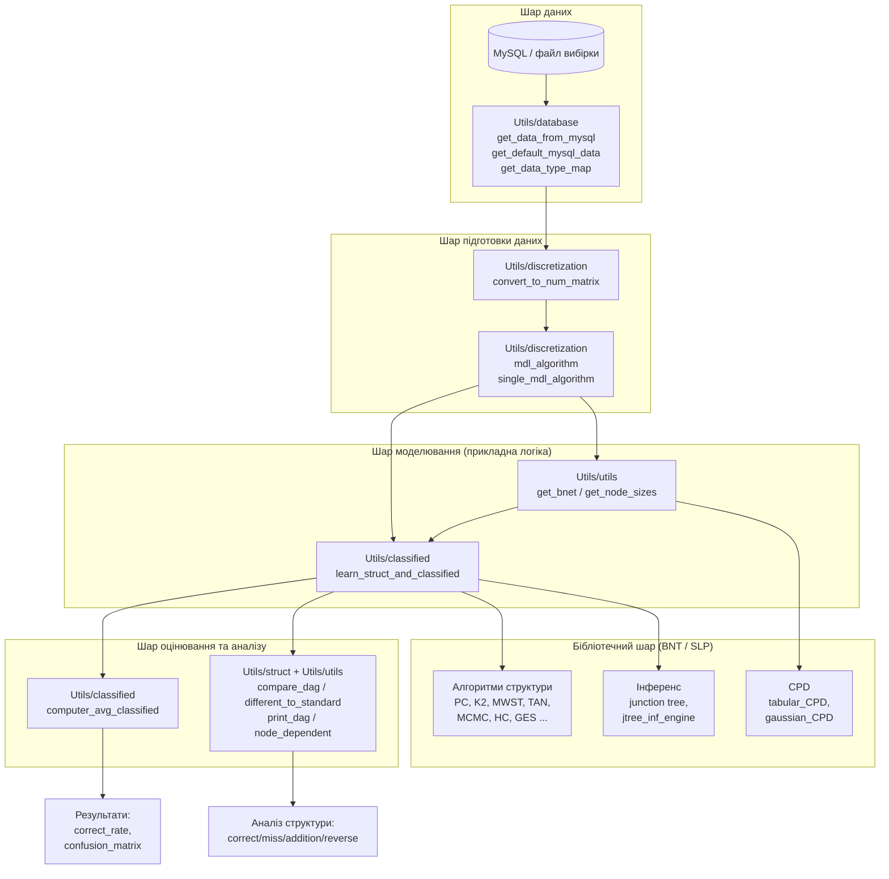
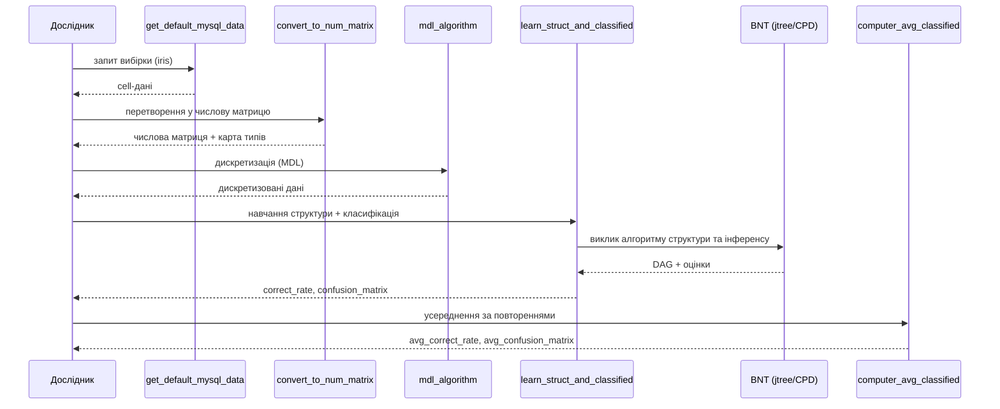

# Архітектура програмного проєкту

Документ описує архітектуру програмного забезпечення, розробленого на базі
бібліотеки Bayes Net Toolbox (BNT) для розв'язання задачі навчання структури
баєсівської мережі та класифікації. Матеріал придатний для розділу
«Програмна реалізація» дисертації.

---

## 1. Загальна архітектура

Програмний комплекс побудовано за **шаровим (layered)** принципом. Власний код
(шар прикладної логіки) не дублює функціональність бібліотеки, а надбудовується
над нею, викликаючи низькорівневі процедури BNT/SLP.



## 2. Опис шарів і модулів

### 2.1. Шар даних — `Utils/database/`

Відповідає за отримання навчальної вибірки із зовнішніх джерел.

| Функція | Призначення |
|---------|-------------|
| `get_data_from_mysql` | Підключення до MySQL через JDBC, вивантаження результату SQL‑запиту у cell‑масив |
| `get_default_mysql_data` | Отримання типового набору (напр., `iris`) з наперед заданими параметрами з'єднання |
| `get_data_type_map` | Побудова відображення «індекс ознаки → тип даних» |
| `iris.sql` | Скрипт створення тестової таблиці набору Iris |

### 2.2. Шар підготовки даних — `Utils/discretization/`

Перетворення сирих даних до вигляду, придатного для дискретних баєсівських мереж.

| Функція | Призначення |
|---------|-------------|
| `convert_to_num_matrix` | Перетворення cell‑масиву (рядкові/змішані значення) у числову матрицю; повертає карту ознак, що потребують перекодування |
| `mdl_algorithm` | Реалізація методу дискретизації Fayyad & Irani (MDL); підтримує видалення нерелевантних ознак |
| `single_mdl_algorithm` | Дискретизація однієї ознаки за критерієм MDL |

### 2.3. Шар моделювання — `Utils/classified/`, `Utils/utils/`

Ядро прикладної логіки: побудова мережі та навчання її структури.

| Функція | Призначення |
|---------|-------------|
| `learn_struct_and_classified` | Центральна функція: за вхідними даними та обраним алгоритмом навчає структуру DAG і виконує класифікацію із перехресною перевіркою; підтримує 15 алгоритмів структури та 3 методи перевірки |
| `get_bnet` | Створення об'єкта мережі (BNET) із заданою структурою; ініціалізація CPD (`tabular` — дискретні, `gaussian` — неперервні) |
| `get_node_sizes` | Обчислення розмірностей (кількості станів) вузлів за даними |

### 2.4. Бібліотечний шар — `BNT/`, `SLP/`, `graph/`

Стороння функціональність (не є власним внеском): алгоритми навчання структури,
машини інференсу (junction tree), типи розподілів (CPD), операції над графами.
Викликається з прикладного шару.

### 2.5. Шар оцінювання — `Utils/classified/`, `Utils/struct/`

| Функція | Призначення |
|---------|-------------|
| `computer_avg_classified` | Усереднення точності та матриці плутанини за багатьма повтореннями експерименту |
| `compare_dag` / `different_to_standard` | Порівняння побудованої структури з еталонною: кількість правильних, пропущених, зайвих та реверсованих ребер |
| `print_dag` | Друк відношень «батько → нащадок» у структурі |
| `node_dependent` | Друк залежностей вузлів у графовій моделі |

## 3. Потік керування (діаграма послідовності)



## 4. Приклад мінімального запуску без бази даних

Якщо MySQL недоступна, вибірку можна задати матрицею безпосередньо у MATLAB
(рядок — ознака, стовпець — спостереження):

```matlab
% дискретизовані дані: 4 ознаки, N спостережень; останній рядок — клас
data = [ ... ];              % матриця розміру [ознаки x спостереження]
class_index = size(data,1);  % індекс класифікаційного вузла

node_sizes = get_node_sizes(data);
dag  = mk_naive_struct(length(node_sizes), class_index); % наївна структура
bnet = get_bnet(data, dag, 'tabular');

[dag, score, cm, rate] = learn_struct_and_classified( ...
        data, class_index, 'K2', 'CV-5', 'score', 'bic');

print_dag(dag, 1:size(dag,1));
```

## 5. Технологічні рішення та обґрунтування

- **Мова/середовище — MATLAB.** Обрано через наявність готової бібліотеки BNT
  з реалізаціями алгоритмів інференсу та розвинутими засобами матричних обчислень.
- **Модульність.** Кожна відповідальність (дані / підготовка / моделювання /
  оцінювання) винесена в окремий каталог, що спрощує супровід і повторне
  використання.
- **Розділення власного та стороннього коду.** Увесь авторський внесок
  зосереджено в каталозі `Utils/`, що робить прозорою межу оригінальності
  для експертної оцінки.
