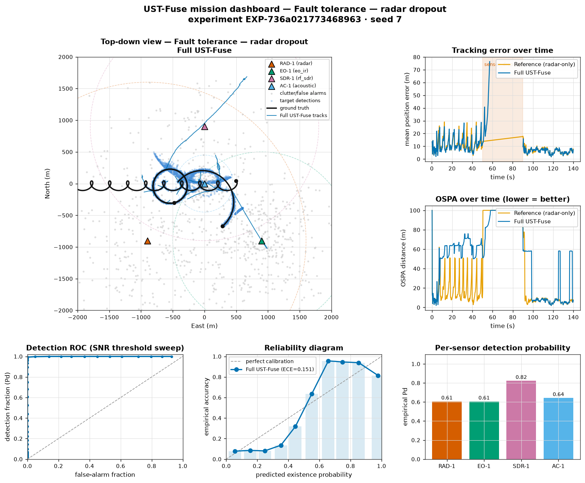
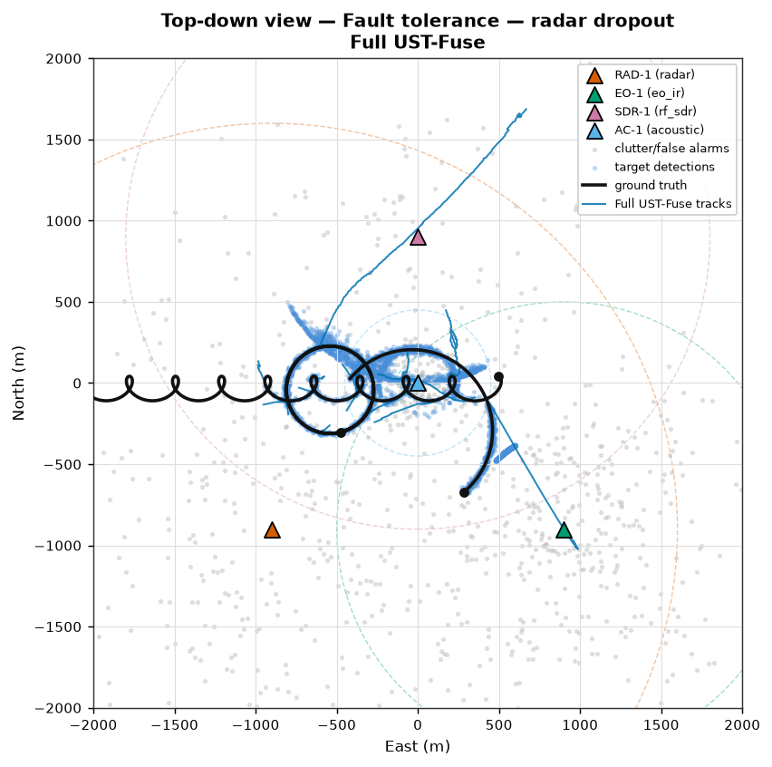
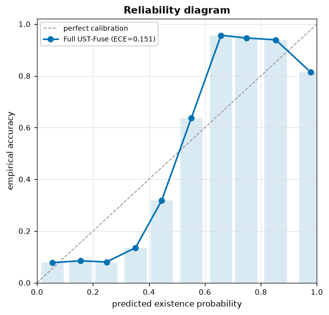
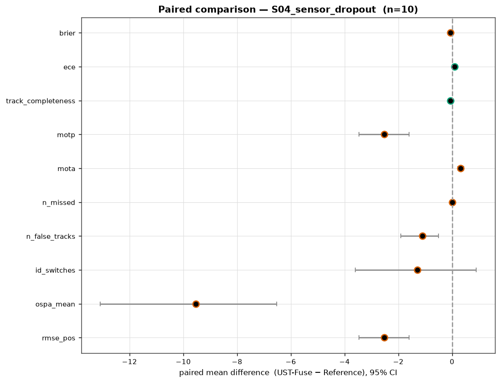

# UST-Fuse Cyber Range — Digital Twin

**Бюджетний гібридний навчально-науковий кіберполігон UST-Fuse: цифровий двійник,
багато сценаріїв, максимум візуалізацій і звіти як на польових іспитах.**

A budget, *virtual-first* **digital twin** of the UST-Fuse hybrid multi-sensor
UAV detection / tracking range. It is the software realisation of the
scientific-technical proposal *"Створення бюджетного гібридного
навчально-наукового полігону UST-Fuse із максимальним використанням симуляції,
цифрових двійників та великих мовних моделей"* — turning a costly physical range
into reproducible virtual experiments, exactly as the proposal recommends
(70–85 % virtual, 15–30 % field validation).

> Одна фізична установка — багато цифрових копій. One physical reference — many
> digital copies (replay + domain randomisation).

Designed to run start-to-finish in **Google Colab** and to be archived as a
**Zenodo** software record (see `CITATION.cff` and `.zenodo.json`).

## Gallery

| Mission dashboard | Top-down view |
| --- | --- |
|  |  |

| Reliability diagram (ЛР-7) | Paired comparison (95 % CI, effect size) |
| --- | --- |
|  |  |

---

## What it does

```
ground truth ─► sensors (radar/EO-IR/RF-SDR/acoustic) ─► clock ─► network ─► faults
                                                                        │
                                                        immutable RAW detection set
                                                                        │
                        ┌───────────────────────────────┴───────────────────────────────┐
                 Reference fusion (radar-only, naïve)                 Full UST-Fuse (multi-sensor, clock-corrected, JPDA-lite)
                        └───────────────┬───────────────────────────────┬───────────────┘
                                Kalman multi-target tracker
                                        │
             metrics engine ── detection · tracking (RMSE/OSPA/MOTA/ID) · calibration (ECE/Brier) · paired stats (CI, effect size, power)
                                        │
             visualisation suite (16 figures) + field-trial reports (Markdown/HTML) + provenance manifest
```

Both fusion pipelines consume the **same immutable RAW data**, so the
Reference-vs-UST-Fuse comparison is a valid *paired* experiment — the core
scientific requirement of the proposal (єдиний час, незмінювані RAW-дані,
однакові вхідні потоки, парний аналіз).

## The ten lab works (ЛР-1 … ЛР-10)

| Lab | Focus | Where in the code |
| --- | --- | --- |
| ЛР-1 | Time calibration, clock drift/sync | `clock.py`, `S02_time_calibration` |
| ЛР-2 | Sensor models (noise, Pd, false alarms) | `sensors/`, `metrics/detection.py` |
| ЛР-3 | Data fusion: Reference vs Full UST-Fuse | `fusion/`, `S01_baseline_clear` |
| ЛР-4 | Multi-target tracking, crossings, ID switches | `tracking/`, `S03_multitarget_crossing`, `S09_swarm_dense` |
| ЛР-5 | Fault tolerance (dropout, packet loss, degradation, spoof) | `faults.py`, `S04`, `S05`, `S08`, `S10` |
| ЛР-6 | Domain shift / domain randomisation | `domain.py`, `S06`, `S07` |
| ЛР-7 | Uncertainty calibration (ECE, Brier, reliability, selective risk) | `metrics/calibration.py`, `S12` |
| ЛР-8 | MLOps & reproducibility (IDs, seeds, checksums) | `provenance.py`, `rng.py` |
| ЛР-9 | Twin vs real-mission comparison | `campaign.py` (paired analysis) |
| ЛР-10 | Publication prep (RAW → figures provenance) | `report.py` |

## Install

```bash
pip install -e .            # from this directory
# or, without installing:
pip install -r requirements.txt
export PYTHONPATH=src
```

## Quick start (Python)

```python
import ust_fuse as uf

# run one mission, both fusion modes, all metrics
res = uf.run("S04_sensor_dropout", seed=7)
print(res.summary_table())          # RMSE, OSPA, MOTA, ID switches, ECE, ...

# render the full figure pack + field-trial report
from ust_fuse.viz import figure_pack
from ust_fuse.report import write_report
figs = figure_pack(res, "out/s04")
write_report(res, "out/s04", figures=figs)   # -> out/s04/report.html
```

Multi-mission paired campaign (the pilot campaign of section 10):

```python
from ust_fuse.campaign import Campaign
camp = Campaign("S04_sensor_dropout", n_missions=20).run()
print(camp.paired_table())          # mean diff, 95% CI, Cohen's d, power, winner
```

## Quick start (CLI)

```bash
python -m ust_fuse.cli list                                 # 12 scenarios
python -m ust_fuse.cli run S03_multitarget_crossing --out runs/s03
python -m ust_fuse.cli campaign S01_baseline_clear -n 20 --out runs/camp01
python -m ust_fuse.cli suite --out runs/suite               # all scenarios + index
```

## Colab

Open `UST_Fuse_Cyber_Range_Colab.ipynb` in Google Colab and *Run all*. It
installs nothing exotic (numpy / scipy / matplotlib / pandas / pyyaml), builds
the twin, runs scenarios, renders every figure inline and writes a downloadable
HTML field-trial report.

## Repository layout

```
ust_fuse_cyber_range/
├── src/ust_fuse/            # the package
│   ├── config.py            # range / sensor / scenario / experiment configs
│   ├── rng.py               # reproducible RNG streams
│   ├── geometry.py          # ENU geometry & covariance propagation
│   ├── trajectories.py      # UAV trajectory generators
│   ├── sensors/             # radar, EO-IR, RF-SDR, acoustic models
│   ├── clock.py             # time sync / drift estimation (ЛР-1)
│   ├── network.py           # latency, jitter, packet loss
│   ├── faults.py            # fault injection & red-team (ЛР-5)
│   ├── domain.py            # weather / domain randomisation (ЛР-6)
│   ├── twin.py              # world orchestrator → RAW mission
│   ├── fusion/              # Reference vs Full UST-Fuse
│   ├── tracking/            # Kalman CV + GNN/JPDA-lite tracker
│   ├── metrics/             # detection, tracking, calibration, stats
│   ├── experiment.py        # one reproducible run
│   ├── campaign.py          # multi-mission paired analysis
│   ├── scenarios.py         # 12-scenario library (ЛР-1…ЛР-10 + red-team)
│   ├── provenance.py        # manifest, checksums, package versions (ЛР-8)
│   ├── viz/                 # 16-figure visualisation suite + dashboard
│   ├── report.py            # bilingual field-trial reports (MD/HTML)
│   └── cli.py               # command-line interface
├── configs/scenarios/       # scenario library exported as YAML
├── scripts/                 # batch run / report generation
├── tests/                   # unit + smoke tests
├── docs/                    # ARCHITECTURE / METHODOLOGY / SCENARIOS
├── examples/                # quickstart script
├── UST_Fuse_Cyber_Range_Colab.ipynb
├── CITATION.cff  .zenodo.json  LICENSE  pyproject.toml  requirements.txt
```

## Reproducibility

Every run is derived from a single master `seed` and a stable config hash; the
`Manifest` records the experiment id, seed, config hash, package versions and
environment. Same seed + same config → identical RAW data and identical figures
(100 % reproducible from the manifest, KPI section 13).

## Safety & scope

Consistent with the proposal (section 12): **no active RF jamming** is modelled;
the SDR is passive-only. Synthetic data are labelled as synthetic and are never
mixed with field data without an explicit provenance indicator. LLM-generated
artefacts would require human-in-the-loop approval — this repository provides the
measurement, metric and reporting substrate that such an LLM layer plugs into.

## Honest results, not a silver bullet

The paired comparison reports **trade-offs**, as a real field trial must: Full
UST-Fuse improves **robustness** (track completeness under radar dropout) and
**uncertainty calibration** (ECE) and adds a **classification** capability the
radar-only baseline simply cannot provide, while the radar-only baseline can be
cleaner on pure localisation in easy, clutter-light conditions. Reporting these
trade-offs with effect sizes and confidence intervals is the scientific point.

## License

MIT — see `LICENSE`. If you use this software, please cite it (`CITATION.cff`).
